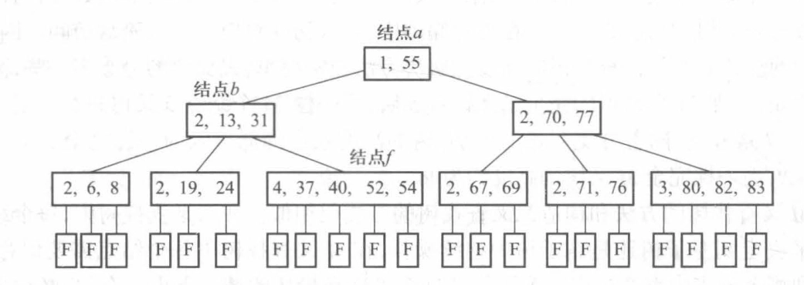
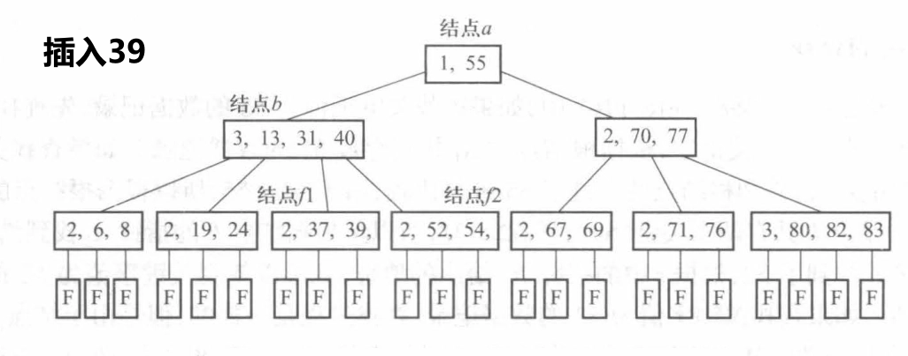
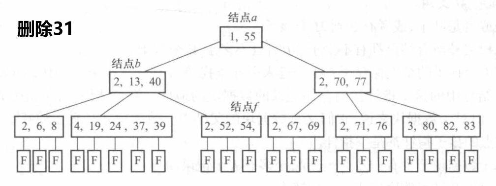
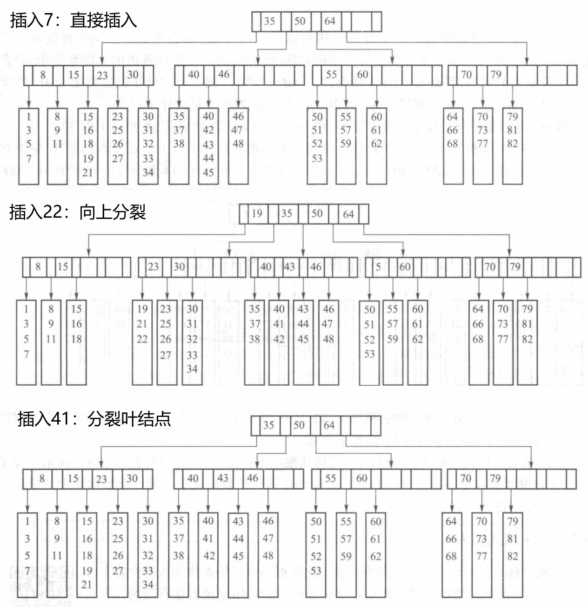

# 外部查找与排序

- [Back to Course Home](index.md)

## 主存储器与外存储器

- **主存储器**：也被称为内存，是存储正在运行的程序代码及处理数据。

- **外存储器**：用于存储长期保存的信息。常用的外存储器有磁盘、磁带、光盘、U 盘等，访问速度慢，故需考虑减少访问次数。

	- 外存储器中的信息以文件为单位。每个文件在内存有一个缓冲区存放正在处理的文件中的数据

	- 外存储器以数据块为单位与内存交换信息。当程序需要处理外存储器中的某个数据，则将包含该数据的数据块读入缓冲区进行处理

## B 树
### B 树的定义
一棵 $m$ 阶 B 树或者为空，或者满足以下条件。

1. 根结点要么是叶子，要么至少有两个儿子，至多有 $m$ 个儿子。

2. 除根结点和叶子结点之外，每个结点的儿子个数 $s$ 满足 $\lceil m/2 \rceil \leq s \leq m$。

3. 有 $s$ 个儿子的非叶结点具有 $n = s - 1$ 个关键字，故 $s = n + 1$。这些结点的数据信息为  

	$$
	(n,A_0,(K_1,R_1),A_1,(K_2,R_2),A_2,\cdots,(K_n,R_n),A_n)
	$$

	其中： 

	- $n$: 关键字的个数 

	- $K_1,K_2,\cdots,K_n$: 结点的关键字，且 $K_1 \lt K_2 \cdots \lt K_n$

	- $A_0$: B 树中小于 $K_1$ 的结点的地址  

	- $R_j$: 关键字值等于 $K_j(1 \leq j \leq n)$ 的数据记录在硬盘中的地址

	- $A_j$: B 树中大于 $K_j$ 且小于 $K_{j + 1}(1 \leq j \leq n - 1)$ 的结点的地址

	- $A_n$: B 树中大于 $K_n$ 的结点的地址

4. 所有的叶子结点都出现在同一层上，即它们的深度相同，并且不带信息(可以认为是外部结点或查找失败的结点，这些结点并不存在，指向这些结点的指针为空)。

### B 树的查找
B 树的查找过程与二叉查找树类似，但由于 B 树的每个结点可以有多个关键字，因此查找过程需要在结点内部进行线性查找。

1. 从根结点开始，比较要查找的关键字与根结点的关键字。

2. 如果找到相等的关键字，则查找成功。

3. 如果要查找的关键字在根结点关键字之间，则继续在根结点的某个子树中查找。

4. 重复以上步骤，直到找到关键字或到达叶子结点。

### B 树的插入
首先在 $m$ 阶 B 树上进行查找操作，确定新插入的关键字 key 在最底层的非叶结点的插入位置，将 key 和其他信息按序插入最底层上的某个结点。

- 若被插入结点的关键字个数小于 $m-1$ ，则插入操作结束

- 若该结点原有的关键字个数已经等于 $m-1$ ，必须分裂成两个结点

### B 树的删除
类似二叉查找树的删除操作，从根结点开始查找与给定关键字值 key 相等的关键字 $K_i$。关键字 $K_i$ 可能出现在第一层到最底层之间的任何一个结点上，计有以下几种情况:

1. 如果关键字 $K_i$ 在最底层，可直接删除，转 (3) 。

2. 否则，先找到“替身”。用它的右子树中的最左面的结点的关键字值，即处于最底层上的最小关键字值取代。然后，删除最底层上的该关键字。

3. 从最底层开始进行删除相应关键字的操作，计有以下几种情况：

	- 若删除关键字之后，结点的关键字的个数仍处于 $[\lceil m/2 \rceil - 1, m - 1]$ 之间，仍满足 B 树的结点的定义，删除结束。

	- 若结点的关键字的个数原为 $[\lceil m/2 \rceil - 1]$，若再删除一个关键字，将不符合 B 树定义。如果该结点的左或右兄弟结点的关键字的个数大于 $[\lceil m/2 \rceil - 1]$，则借一个关键字过来。必须注意的是，并不是直接将左或右兄弟结点的关键字取过来，因为这样将无法保证结点的关键字有序。如果是借左兄弟结点的最大关键字，则必须将该关键字上移到父结点的相应位置，而将父结点中大于该关键字且最接近该关键字的那个关键字（连同左兄弟结点的最右方的指针 $A_n$）下移到被删关键字所在结点的最左面，删除操作结束。若借右兄弟结点的最小关键字，操作类似。

	- 若该结点的左或右兄弟结点的关键字的个数都为 $[\lceil m/2 \rceil - 1]$，那么将无结点可借。这时只能执行合并结点的操作。将该结点同左兄弟（无左兄弟时，与右兄弟）合并。由于两个结点合并后，父结点中相应的关键字将不再保留，因为它原来的左右儿子已经不存在，因此，把父结点中该关键字也并入合并后的结点。这样，父结点的关键字个数便减少了一个。如果父结点的关键字个数不满足定义，则必须继续调整。在最坏情况下，调整可能会一直波及到根结点，导致 B 树的高度减少 1，即减少一层。

### B 树占用空间的情况
将一个磁盘块作为一个 B 树的结点。假设一个块的容量 $max$ 字节，如果每个键要占用 $key$ 个字节。在一棵 $M$ 阶 B 树中，可以有 $M-1$ 个键，总的数据量是：

$$
(M-1) * key + M 个分支的地址 + M-1 个关键字对应记录的存储地址
$$

## B+ 树
### B+ 树的定义

- B 树不适合顺序访问

- B+ 树既能提供随机查找，也能提供顺序访问的存储结构。

	- B+ 树的所有关键字都在叶子结点中，并且叶子结点之间通过指针相连

- 一棵 $M$ 阶的 B+ 树被定义为具有以下性质的 $M$ 叉树：

	1. 根或者是叶子，或者有 $2$ 到 $M$ 个孩子。

	2. 除根之外所有结点都有不少于 $\lceil M/2 \rceil$ 且不多于 $M$ 个孩子。

	3. 有 $K$ 个孩子的结点保存了 $K-1$ 个键来引导查找，键 $1$ 代表了子树 $i+1$ 中键的最小值。

	4. 叶结点中的孩子指针指向存储记录的数据块的地址。换句话说，对于索引 B+ 树，它们是叶结点。但对于数据块来说，它们又是数据块的父结点。数据块才是真正的叶结点。而在 B 树中，叶结点的孩子指针都是空指针。

	5. 每个数据块至少有 $\lceil L/2 \rceil$ 个记录，至多有 $L$ 个记录。

	6. 所有的叶结点按序连成一个单链表。

-  B+ 树存储两个指针

	- 指向树根的指针，提供了索引查找

	- 指向关键字最小的叶结点，提供顺序访问

### B+ 树的查找
与二叉查找树类似，在 B+ 树上查找某一条记录也是从根结点开始，根据结点中的键值决定查找哪一棵子树。一层一层往下找，直到找到该记录应该存放的数据块。在数据块中查找被查找的记录，找到了则表示查找成功，没有找到则表示该记录不存在。

### B+ 树的插入
从根结点开始查找插入的位置，把它插入相应的数据块中：

- 若存放被插入记录的数据块还没有放满：直接插入

- 若已满：分裂叶结点

	- 若父结点也已满，则继续向上分裂，直至父亲直到不需要再分裂或者到达了根结点。若到达根结点，则重新建立一个根，让这两个分裂出来的根做它的两个子结点

### B+ 树的删除
删除操作首先查找到要删除的项，然后删除它。

- 如果此时它所在的叶子的元素数量正好满足要求的最小值，删除该项就会使它低于最小值

	- 如果邻居不是最少的情况，就借一个过来领养；

		- 如果邻居也处于最少的情况，就把两个结点合并成一个满的结点。

		- 在这种情况下父亲就失去了一个儿子。如果它引起父亲的儿子数少于了最小值，则需要一直向上进行过滤到根。

		- 如果根只剩下了一个儿子，就把根删除，让它的儿子作为新的树根，这也是唯一能使 B 树变矮的情况。

## 外排序
在外存上进行排序的最常用的方法是利用归并排序，因为归并排序只需要访问被归并序列中的第一个元素，这非常适合于顺序文件。

### 预处理阶段

- 预处理阶段：根据内存的大小将一个有 n 个记录的文件分批读入内存，用各种内排序算法排序，形成一个个有序片段。

- **置换选择**

	- 在外排序中，已排序片段越多，归并的次数也越多。如果能够让每个初始的已排序片段包含更多的记录，就能减少已排序片段数，就能减少排序时间。

	- 置换选择可以在只能容纳 $p$ 个记录的内存中生成平均长度为 $2p$ 的初始的已排序片段。

	- 基于每个小片段采用选择排序。每次选出的最小记录直接被写到输出文件上，它所用的内存空间就可以给别的元素使用，此时可以从输入文件读入一个新记录。如果它比刚才写出去的元素大，则把它加入到优先级队列；否则，它不可能进入当前的已排序片段，该元素就被放于优先级队列的空余位置，用于下个片段的排序。

- 文件上的数据为 $1,4,10,2,0,5,7,6,9,12$ ，内存中能够容纳 3 个记录，这 3 个记录存放在数组 a 中。构造初始的已排序片段的过程如下图。由于采用了置换选择法，使得对 11 个记录只生成了两个初始的已排序片段，这样只需要一次归并就能排好序。

### 归并阶段

- 归并阶段：将预处理得到的已排序片段逐步归并成一个有序文件。

- **多阶段归并**

	- $k$ **路归并**：如果生成的已排序片段数为 $m$ ，则 $k$ 路归并需要归并 $\lceil \log_k m \rceil$ 次。

		- $k$ 越大，归并次数越少。

		- $k$ 路归并需要 $2k$ 个缓冲区

	- 使用多阶段归并，可以在只有 $k+1$ 个缓冲区的情况下完成 $k$ 路归并。

