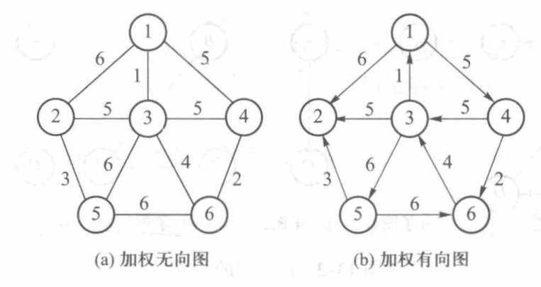
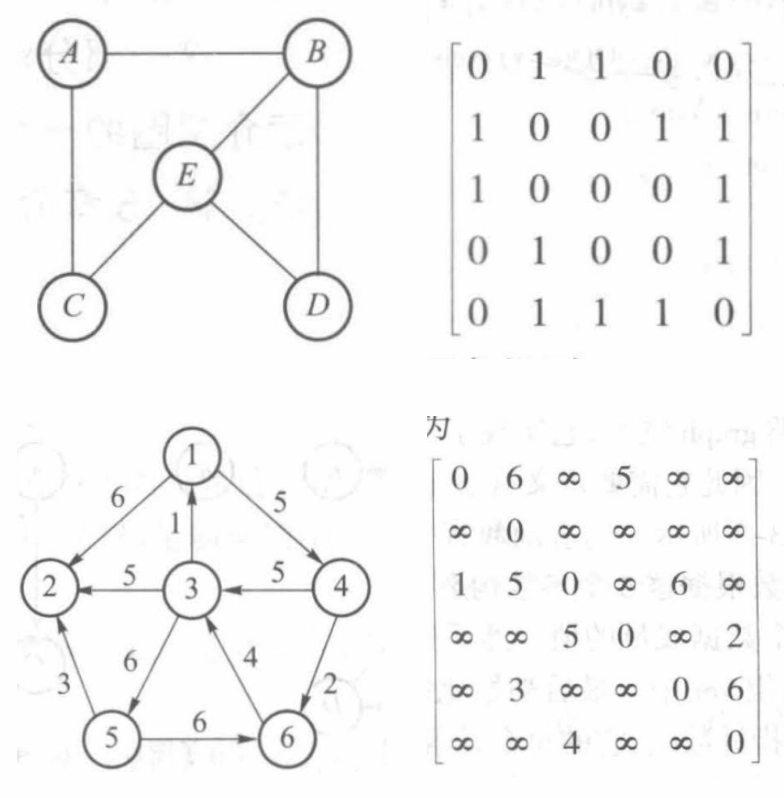
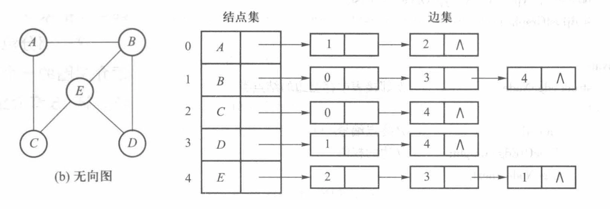
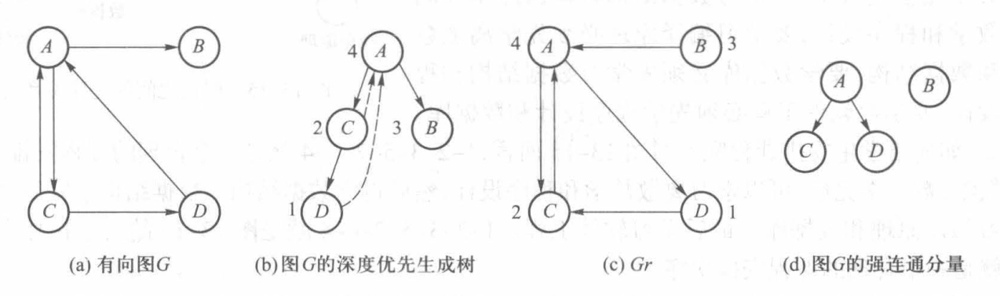

# 图
## 图的定义

- **图**：由顶点集 $V$ 和边集 $E$ 组成的有序对 $G = (V, E)$
	- **顶点**：图中的基本元素，通常用 $V = \{v_1, v_2, \cdots, v_n\}$ 表示
	- **边**：连接两个顶点的线段，通常用 $E = \{e_1, e_2, \cdots, e_m\}$ 表示




- **有向图**：边有方向的图，边从一个顶点指向另一个顶点，用有序对表示边，如 $e = <v_i, v_j>$，表示从顶点 $v_i$ 到顶点 $v_j$ 的边
- **无向图**：边没有方向的图，边连接两个顶点，用无序对表示边，如 $e = (v_i, v_j)$，表示顶点 $v_i$ 和顶点 $v_j$ 之间的边
- **加权图**：边带有权值的图，通常用 $w(e)$ 表示边 $e$ 的权值
	- 加权有向图：$e = <v_i, v_j, w>$，表示从顶点 $v_i$ 到顶点 $v_j$ 的边，权值为 $w$
	- 加权无向图：$e = (v_i, v_j, w)$，表示顶点 $v_i$ 和顶点 $v_j$ 之间的边，权值为 $w$

### 图的基本术语

1. **邻接**：如果边 $e = (v_i, v_j)$ 存在，则称顶点 $v_i$ 和顶点 $v_j$ 是邻接的。
2. **度**
	- 无向图：与该结点关联的边数
	- 有向图：分为入度和出度
		- **入度**：有向图中进入某一结点的边数，称为该结点的入度
		- **出度**：有向图中离开某一结点的边数，称为该结点的出度
3. **子图**：如果图 $G = (V, E)$ 的一个子集 $V' \subseteq V$ 和 $E' \subseteq E$ 使得 $G' = (V', E')$ 也是一个图，则称 $G'$ 是 $G$ 的子图
4. 路径和路径长度
	- **路径**：从一个顶点到另一个顶点的边的序列
		- 若两个顶点之间存在路径，则称这两个顶点是**连通**的
		- **简单路径**：路径上除了起始结点和终止结点外，其余的结点都不相同
	- **路径长度**：
		- 非加权路径长度：路径中边的数量
		- 加权路径长度：路径中所有边的权值之和
5. 连通图和连通分量
	- **连通图**：无向图中任意两个顶点之间都有路径相连，则称该图是连通的
	- **连通分量**：无向图中一个连通子图，且该子图不是任何其他连通子图的子集
6. 强连通图和强连通分量
	- **强连通图**：有向图中任意两个顶点之间都有路径相连，则称该图是强连通的
	- **强连通分量**：有向图中一个强连通子图，且该子图不是任何其他强连通子图的子集
	- 若一个有向图不是强连通的，但把它看作无向图时是连通的，则称该有向图是**弱连通的**
7. **完全图**
	- 无向图：每一对顶点都有一条边相连，共有 $\frac{n(n-1)}{2}$ 条边
	- 有向图：每一对顶点 $v_i, v_j$ 都有两条边 $<v_i, v_j>$ 和 $<v_j, v_i>$ 相连，共有 $n(n-1)$ 条边
8. **生成树**：无向连通图的极小连通子图，有 $n$ 个顶点和 $n-1$ 条边

### 图的基本运算
```cpp
#ifndef GRAPH_H
#define GRAPH_H

#include <bits/stdc++.h>
using namespace std;

template <class TypeOfVer, class TypeOfEdge>
class Graph {
	public:
		virtual void insert(TypeOfVer x, TypeOfVer y, TypeOfEdge w) = 0;
		virtual void remove(TypeOfVer x, TypeOfVer y) = 0;
		virtual bool exist(TypeOfVer x, TypeOfVer y) const = 0;
		int numOfVer() const { return Vers; }
		int numOfEdge() const { return Edges; }

	protected:
		int Vers, Edges;
};

#endif
```

## 图的存储
### （加权）邻接矩阵表示法

$$
A [i][j] = \begin{cases} 1\ \text{or}\ w & \text{if } <i,j>\ \in E \text{ or } (i,j) \in E \\ 0\ \text{or}\ \infty & \text{otherwise} \end{cases}
$$



```cpp
#include "13-1-graph.h"
#include <bits/stdc++.h>	
using namespace std;

template <class TypeOfVer, class TypeOfEdge>
class adjMatrixGraph: public Graph<TypeOfVer, TypeOfEdge> {
	public:
		adjMatrixGraph(int vSize, const TypeOfVer d[], const TypeOfEdge noEdgeFlag);
		~adjMatrixGraph();
		void insert(TypeOfVer x, TypeOfVer y, TypeOfEdge w);
		void remove(TypeOfVer x, TypeOfVer y);
		bool exist(TypeOfVer x, TypeOfVer y) const;
		void printGraph() const;

	private:
		TypeOfEdge **edge;
		TypeOfVer *ver;
		int find(TypeOfVer v) const
		{
			for (int i = 0; i < Vers; i++)
				if (ver[i] == v)
					return i;
			return -1;
		}
		TypeOfEdge noEdge;
};

template <class TypeOfVer, class TypeOfEdge>
adjMatrixGraph<TypeOfVer, TypeOfEdge>::adjMatrixGraph(int vSize, const TypeOfVer d[], const TypeOfEdge noEdgeFlag)
{
	Vers = vSize;
	Edges = 0;
	noEdge = noEdgeFlag;
	int i, j;
	ver = new TypeOfVer[vSize];
	for (i = 0; i < vSize; i++)
		ver[i] = d[i];
	edge = new TypeOfEdge *[vSize];
	for (i = 0; i < vSize; i++)
	{
		edge[i] = new TypeOfEdge[vSize];
		for (j = 0; j < vSize; j++) edge[i][j] = noEdge;
		edge[i][i] = 0;
	}
}

template <class TypeOfVer, class TypeOfEdge>
adjMatrixGraph<TypeOfVer, TypeOfEdge>::~adjMatrixGraph()
{
	delete[] ver;
	for (int i = 0; i < Vers; i++) delete[] edge[i];
	delete[] edge;
}

template <class TypeOfVer, class TypeOfEdge>
void adjMatrixGraph<TypeOfVer, TypeOfEdge>::insert(TypeOfVer x, TypeOfVer y, TypeOfEdge w)
{
	int u = find(x), v = find(y);
	if (u == -1 || v == -1) return;
	if (edge[u][v] == noEdge)
	{
		edge[u][v] = w;
		Edges++;
	}
}

template <class TypeOfVer, class TypeOfEdge>
void adjMatrixGraph<TypeOfVer, TypeOfEdge>::remove(TypeOfVer x, TypeOfVer y)
{
	int u = find(x), v = find(y);
	if (u == -1 || v == -1) return;
	if (edge[u][v] != noEdge)
	{
		edge[u][v] = noEdge;
		Edges--;
	}
}

template <class TypeOfVer, class TypeOfEdge>
bool adjMatrixGraph<TypeOfVer, TypeOfEdge>::exist(TypeOfVer x, TypeOfVer y) const
{
	int u = find(x), v = find(y);
	if (u == -1 || v == -1) return false;
	return edge[u][v] != noEdge;
}

template <class TypeOfVer, class TypeOfEdge>
void adjMatrixGraph<TypeOfVer, TypeOfEdge>::printGraph() const
{
	for (int i = 0; i < Vers; i++)
	{
		cout << ver[i] << ": ";
		for (int j = 0; j < Vers; j++)
			if (edge[i][j] != noEdge)
				cout << ver[j] << " " << edge[i][j] << " ";
		cout << endl;
	}
}
```

### 邻接表表示法

- **邻接表是图的标准存储方式**。
- 邻接表将每一个结点的邻接结点组成一个链表，链表的每个结点表示一条边。
- 分为两部分：保存顶点和保存边
	- 顶点集用一个数组表示，数组的每个元素由两部分组成：
		- 顶点值
		- 指向该顶点对应的链表的首地址
	- 边集用一组单链表表示。
		- 非加权图，单链表的结点由两部分组成：
			- 这条边终止结点的编号
			- 后继指针
		- 加权图，单链表的结点由三部分组成：
			- 这条边终止结点的编号
			- 边的权值
			- 后继指针
- 空间复杂度：$O(|V| + |E|)$，其中 $|V|$ 是顶点数，$|E|$ 是边数



```cpp
#include "13-1-graph.h"
#include <bits/stdc++.h>
using namespace std;

template <class TypeOfVer, class TypeOfEdge>
class adjListGraph: public Graph<TypeOfVer, TypeOfEdge> {
	public:
		adjListGraph(int vSize, const TypeOfVer d[]);
		~adjListGraph();
		void insert(TypeOfVer x, TypeOfVer y, TypeOfEdge w);
		void remove(TypeOfVer x, TypeOfVer y);
		bool exist(TypeOfVer x, TypeOfVer y) const;
		void printGraph() const;
		void dfs() const;
		void bfs() const;
		void topSort() const;
		void EulerCircuit(TypeOfVer start) const;

	private:
		struct edgeNode 
		{
			int end;
			TypeOfEdge weight;
			edgeNode *next;
			edgeNode(int e, TypeOfEdge w, edgeNode *n = NULL): end(e), weight(w), next(n) {}
		};

		struct verNode 
		{
			TypeOfVer ver;
			edgeNode *head;
			verNode(edgeNode *h = NULL): head(h) {}
		};

		verNode *verList;
		TypeOfEdge noEdge;
		int find(TypeOfVer v) const
		{
			for (int i = 0; i < Vers; i++)
			{
				if (verList[i].ver == v) return i;
			}
			return -1;
		}
		void dfs(int start, bool visited[]) const;

		struct EulerNode
		{
			int NodeNum;
			EulerNode *next;
			EulerNode(int ver): NodeNum(ver), next(NULL) {}
		};
		void EulerCircuit(int start, EulerNode *&beg, EulerNode *&end) const;
		adjListGraph<TypeOfVer, TypeOfEdge>::verNode *clone() const {};
};

template <class TypeOfVer, class TypeOfEdge>
adjListGraph<TypeOfVer, TypeOfEdge>::adjListGraph(int vSize, const TypeOfVer d[])
{
	Vers = vSize;
	Edges = 0;
	verList = new verNode[vSize];
	for (int i = 0; i < vSize; i++)
	{
		verList[i].ver = d[i];
	}
}

template <class TypeOfVer, class TypeOfEdge>
adjListGraph<TypeOfVer, TypeOfEdge>::~adjListGraph()
{
	edgeNode *p;
	for (int i = 0; i < Vers; i++)
	{
		while ((p = verList[i].head) != NULL)
		{
			verList[i].head = p->next;
			delete p;
		}
	}
	delete[] verList;
}

template <class TypeOfVer, class TypeOfEdge>
void adjListGraph<TypeOfVer, TypeOfEdge>::insert(TypeOfVer x, TypeOfVer y, TypeOfEdge w)
{
	int u = find(x), v = find(y);
	if (u == -1 || v == -1) return;
	verList[u].head = new edgeNode(v, w, verList[u].head);
	Edges++;
}

template <class TypeOfVer, class TypeOfEdge>
void adjListGraph<TypeOfVer, TypeOfEdge>::remove(TypeOfVer x, TypeOfVer y)
{
	int u = find(x), v = find(y);
	if (u == -1 || v == -1) return;
	edgeNode *p = verList[u].head, *q;
	if (p == NULL) return;
	if (p->end == v)
	{
		verList[u].head = p->next;
		delete p;
		Edges--;
		return;
	}
	while (p->next != NULL && p->next->end != v) p = p->next;
	if (p->next != NULL)
	{
		q = p->next;
		p->next = q->next;
		delete q;
		Edges--;
	}
}

template <class TypeOfVer, class TypeOfEdge>
bool adjListGraph<TypeOfVer, TypeOfEdge>::exist(TypeOfVer x, TypeOfVer y) const
{
	int u = find(x), v = find(y);
	if (u == -1 || v == -1) return false;
	edgeNode *p = verList[u].head;
	while (p != NULL && p->end != v) p = p->next;
	if (p == NULL) return false;
	else return true;
}

//打印图
template <class TypeOfVer, class TypeOfEdge>
void adjListGraph<TypeOfVer, TypeOfEdge>::printGraph() const 
{
	edgeNode *p;
	for (int i = 0; i < Vers; i++)
	{
		cout << verList[i].ver << ": ";
		p = verList[i].head;
		while (p != NULL)
		{
			cout << verList[p->end].ver << " " << p->weight << "; ";
			p = p->next;
		}
		cout << endl;
	}
}
```

## 图的遍历
### 深度优先遍历（DFS）

- 图的深度优先遍历类似于树的前序遍历：
	1. 选中第一个被访问的顶点
	2. 对顶点作已访问过的标志
	3. 依次从顶点的未被访问过的第一个、第二个、第三个……邻接顶点出发进行深度优先搜索
	4. 如果还有顶点未被访问，则选中一个起始顶点，转向 (2)
	5. 所有的顶点都被访问到，则结束

- 深度优先生成树：每个深度优先搜索的过程都对应着一棵树。
- 深度优先生成森林：如果图不是连通图或强连通图，在进行深度优先搜索时，有时并不一定能够保证从某一个结点出发能访问到所有的顶点在这种情况下，必须再选中一个未访问过的顶点，继续进行深度优先搜索。直至所有的顶点都被访问到为止。这时，将得到的是一组树而不是一棵树，这一组树被称为深度优先生成森林。


- 时间复杂度：
	- 邻接矩阵表示：$O(|V|^2)$
	- 邻接表表示：$O(|V| + |E|)$

```cpp
//递归DFS
template <class TypeOfVer, class TypeOfEdge>
void adjListGraph<TypeOfVer, TypeOfEdge>::dfs() const
{
	bool *visited = new bool[Vers];
	for (int i = 0; i < Vers; i++) visited[i] = false;
	cout << "dfs: ";
	for (int i = 0; i < Vers; i++)
	{
		if (!visited[i]) dfs(i, visited);
		cout << endl;
	}
}

template <class TypeOfVer, class TypeOfEdge>	
void adjListGraph<TypeOfVer, TypeOfEdge>::dfs(int start, bool visited[]) const
{
	cout << verList[start].ver << " ";
	visited[start] = true;
	edgeNode *p = verList[start].head;
	while (p != NULL)
	{
		if (!visited[p->end]) dfs(p->end, visited);
		p = p->next;
	}
}

//非递归DFS
template <class TypeOfVer, class TypeOfEdge>
void adjListGraph<TypeOfVer, TypeOfEdge>::dfs() const
{
	bool *visited = new bool[Vers];
	for (int i = 0; i < Vers; i++) visited[i] = false;
	stack<int> s;
	edgeNode *p;
	int currentNode = 0;
	cout << "dfs: ";
	for (int i = 0; i < Vers; i++)
	{
		if (visited[i]) continue;
		s.push(i);
		while (!s.empty())
		{
			currentNode = s.top();
			s.pop();
			if (visited[currentNode]) continue;
			cout << verList[currentNode].ver << " ";
			visited[currentNode] = true;
			p = verList[currentNode].head;
			while (p != NULL)
			{
				if (!visited[p->end])
				{
					s.push(p->end);
					visited[p->end] = true;
				}
				p = p->next;
			}
		}
		cout << endl;
	}
}
```

### 广度优先遍历（BFS）

- 图的广度优先搜索类似于树的层次遍历：
	1. 选中第一个被访问的顶点
	2. 对顶点作已访问过的标志
	3. 依次访问已访问顶点的未被访问过的第一个、第二个、第三个……邻接顶点，并进行标记，转向 (3)
	4. 如果还有顶点未被访问，则选中一个起始顶点，转向 (2)
	5. 所有的顶点都被访问到，则结束
- 广度优先生成树/森林：与 DFS 同理
- BFS 没有递归实现！


- 时间复杂度：
	- 邻接矩阵表示：$O(|V|^2)$
	- 邻接表表示：$O(|V| + |E|)$

```cpp
//非递归BFS
template <class TypeOfVer, class TypeOfEdge>
void adjListGraph<TypeOfVer, TypeOfEdge>::bfs() const   
{
	bool *visited = new bool[Vers];
	for (int i = 0; i < Vers; i++) visited[i] = false;
	queue<int> q;
	edgeNode *p;
	int currentNode = 0;
	cout << "bfs: ";
	for (int i = 0; i < Vers; i++)
	{
		if (visited[i]) continue;
		q.push(i);
		while (!q.empty())
		{
			currentNode = q.front();
			q.pop();
			if (visited[currentNode]) continue;
			cout << verList[currentNode].ver << " ";
			visited[currentNode] = true;
			p = verList[currentNode].head;
			while (p != NULL)
			{
				if (!visited[p->end])
				{
					q.push(p->end);
					visited[p->end] = true;
				}
				p = p->next;
			}
		}
		cout << endl;
	}
}
```

## 图的遍历的应用
### 无向图的连通性

- 深度优先搜索和广度优先搜索都可以用来测试无向图的连通性。
	- 如果无向图是连通的，则从无向图中的任意结点出发进行深度优先搜索或广度优先搜索都可以访问到每一个结点。访问的次序是一棵深度／广度优先生成树。
	- 如果图是非连通的，深度／广度优先搜索可以找到一片深度／广度优先生成森林。

### 欧拉回路

- 欧拉路径：如果能够在一个图中找到一条路径，使得该路径对图的每一条边正好经过一次，这条路径被称为欧拉路径。
- 欧拉回路：如果起点和终点是相同的，这条路径被称为欧拉回路。

```cpp
//欧拉回路
template <class TypeOfVer, class TypeOfEdge>
void adjListGraph<TypeOfVer, TypeOfEdge>::EulerCircuit(TypeOfVer start) const
{
	EulerNode *beg, *end, *p, *q, *tb, *te;//beg, end分别指向欧拉回路的头和尾
	//tb, te分别指向beg和end的尾部
	int numOfDegree;
	edgeNode *r;
	verNode *u;
	beg = end = tb = te = NULL;

	if (Edges == 0)
	{
		cout << "None" << endl;
		return;
	}
	for (int i = 0; i < Vers; i++)
	{
		numOfDegree = 0;
		for (r = verList[i].head; r != NULL; r = r->next) numOfDegree++;
		if (numOfDegree % 2 != 0)
		{
			cout << "None" << endl;
			return;
		}
	}//出度为基数，不存在欧拉回路

	//寻找起点
	int startNum = find(start);
	tmp = clone();//复制一个图

	//寻找从startNum开始的欧拉回路，路径的起点和终点分别为beg和end
	EulerCircuit(startNum, beg, end);
	while (1)
	{
		p = beg;
		while (p->next != NUll)//检查p的后继节点是否有边未被访问
		{
			if (verList[p->next->NodeNum].head != NULL) break;
			p = p->next;
			if (p->next == NULL) break;//p的后继节点都被访问过
			q = p->next;
			EulerCircuit(q->NodeNum, tb, te);
			te->next = q->next;
			p->next = tb;
			delete q;
		}
	}

	//恢复原图
	delete []verList;
	verList = tmp;

	//输出欧拉回路
	cout << "EulerCircuit: ";
	while (beg!=NULL)
	{
		cout << verList[beg->NodeNum].ver << " ";
		p = beg;
		beg = beg->next;
		delete p;
	}
	cout << endl;
}

//寻找从start开始的欧拉回路，路径的起点和终点分别为beg和end
template <class TypeOfVer, class TypeOfEdge>
void adjListGraph<TypeOfVer, TypeOfEdge>::EulerCircuit(int start, EulerNode *&beg, EulerNode *&end) const
{
	int nextNode;

	beg = end = new EulerNode(start);
	while (verList[start].head != NULL)
	{
		nextNode = verList[start].head->end;
		remove(start, nextNode);
		remove(nextNode, start);
		start = nextNode;
		end->next = new EulerNode(start);
		end = end->next;
	}
}

template <class TypeOfVer, class TypeOfEdge>
adjListGraph<TypeOfVer, TypeOfEdge>::verNode *adjListGraph<TypeOfVer, TypeOfEdge>::clone() const
{
	verNode *tmp = new verNode[Vers];
	edgeNode *p;
	for (int i = 0; i < Vers; i++)
	{
		tmp[i].ver = verList[i].ver;
		p = verList[i].head;
		while (p != NULL)
		{
			tmp[i].head = new edgeNode(p->end, p->weight, tmp[i].head);
			p = p->next;
		}
	}
	return tmp;
}
```

### 有向图的连通性

- 对于有向图，通过两次深度优先搜索可以测试该有向图是否为强连通。如果不是强连通，则可以找出所有强连通分量。
- 找出有向图 $G$ 的强连通分量:
	- 从任意结点开始执行深度优先搜索
		- 如果 $G$ 不是强连通的，则该深度优先搜索会得到一个深度优先生成森林/一棵深度优先生成树。
		- 对森林中的每棵树按它们的生成次序依次进行后序遍历，并按遍历的顺序给每个结点编号。
	- 将图 $G$ 的每条边逆向，形成 $G_r$。从编号最大的结点开始深度优先搜索 $G_r$，得到的深度优先遍历森林的每棵树就是 $G$ 的强连通分量。



```cpp
//有向图的强连通分量
template <class TypeOfVer, class TypeOfEdge>
void adjListGraph<TypeOfVer, TypeOfEdge>::dfs() const
{
	bool *visited = new bool[Vers];
	for (int i = 0; i < Vers; i++) visited[i] = false;
	stack<int> s;
	edgeNode *p;
	int currentNode = 0;
	vector<int> order; //存储访问顺序

	cout << "dfs: ";
	for (int i = 0; i < Vers; i++)
	{
		if (visited[i]) continue;
		s.push(i);
		while (!s.empty())
		{
			currentNode = s.top();
			s.pop();
			if (visited[currentNode]) continue;
			cout << verList[currentNode].ver << " ";
			visited[currentNode] = true;
			order.push_back(currentNode); //记录访问顺序
			p = verList[currentNode].head;
			while (p != NULL)
			{
				if (!visited[p->end])
				{
					s.push(p->end);
					visited[p->end] = true;
				}
				p = p->next;
			}
		}
		cout << endl;
	}

	// 对图进行转置
	adjListGraph<TypeOfVer, TypeOfEdge> transposedGraph(Vers, verList);
	for (int i = 0; i < Vers; i++)
	{
		p = verList[i].head;
		while (p != NULL)
		{
			transposedGraph.insert(verList[p->end].ver, verList[i].ver, p->weight);
			p = p->next;
		}
	}

	// 对转置图进行深度优先搜索
	cout << "Strongly Connected Components: " << endl;
	fill(visited, visited + Vers, false);
	for (int i = order.size() - 1; i >= 0; i--)
	{
		if (!visited[order[i]])
		{
			transposedGraph.dfs(order[i], visited);
			cout << endl;
		}
	}
}
```

### 拓扑排序

-  AOV 网：如果用图中的顶点表示活动，边表示活动间的先后关系，这样的有向图称为顶点活动网 (Activity On Vertex Network)，简称 AOV 网。
	-  将 AOV 网中的活动表示为有向边，活动间的先后关系表示为有向边的方向。
- **拓扑排序**：将 AOV 网中的活动按活动发生的先后次序排成拓扑序列。
	- 排序：如果有一条从 $u$ 到 $v$ 的路径，那么结点 $v$ 在拓扑排序中必须出现在结点 $u$ 之后。
	- 存在拓扑序列的图一定是一个有向无环图。
	- 步骤：
		1. 计算每个顶点的入度
		2. 将所有入度为 0 的顶点入队
		3. 当队列不为空时，出队一个顶点，将其加入拓扑序列，并将该顶点的所有出边的终点的入度减 1
		4. 如果某个出边的终点的入度变为 0，则将该顶点入队
		5. 重复步骤 3 和 4，直到队列为空

```cpp
//拓扑排序
template <class TypeOfVer, class TypeOfEdge>
void adjListGraph<TypeOfVer, TypeOfEdge>::topSort() const
{
	queue<int> q;
	edgeNode *p;
	int current;
	int *inDegree = new int[Vers];

	for (int i = 0; i < Vers; i++) //计算每个顶点的入度
	{
		inDegree[i] = 0;
		for (p = verList[i].head; p != NULL; p = p->next) 
		{
			inDegree[p->end]++;
		}
	}

	for (int i = 0; i < Vers; i++) //将入度为0的顶点入队
	{
		if (inDegree[i] == 0) q.push(i);
	}

	cout << "topSort: ";
	while (!q.empty())
	{
		current = q.front();
		q.pop();
		cout << verList[current].ver << " ";
		for (p = verList[current].head; p != NULL; p = p->next)
		{
			inDegree[p->end]--;
			if (inDegree[p->end] == 0) q.push(p->end);
		}
	}
	cout << endl;
}
```

### 关键路径

- AOE 网：顶点表示事件，有向边的权值表示某个活动的待续时间，有向边的方向表示事件发生的先后次序，这样的有向图称为顶点事件网 (Activity On Edge Network)，简称 AOE 网。
	- 源点/起点：入度为 0 的顶点。
	- 汇点/收点：出度为 0 的顶点。
- **关键路径**：AOE 网中从起点到收点的最长路径。
	- **关键活动**：关键路径上的活动称为关键活动。
	- 关键活动的延误会导致整个项目的延误。
	- 找出关键路径先要找出拓扑序列，从头到尾遍历拓扑序列可以找出最早发生时间，然后再从尾到头遍历拓扑序列可以找到最迟发生时间，最后再从头到尾遍历拓扑序列，找出最早发生时间和最迟发生时间的顶点，组成了关键路径。
	- 步骤：
		1. 设结点 $x$ 的最早发生时间记为 $\text{ee}(x)$，边 $<u,v>$ 的长度记为 $L_{\text{uv}}$。
			- 首先设所有结点的最早发生时间是 $0$。
			- 对每个被遍历的结点 $u$ 检查它的后继 $v$。如果 $\text{ee}(u) + L_{\text{uv}} > \text{ee}(v)$，则更新 $\text{ee}(v)$ 为 $\text{ee}(u) + L_{\text{uv}}$。
			- 最后得到汇点的最早发生时间，即关键路径的长度。
		2. 设结点 $x$ 的最迟发生时间记为 $\text{le}(x)$。
			- 首先设所有结点的最迟发生时间是关键路径的长度。
			- 对每个被遍历的结点 $u$ 检查它的后继 $v$。如果 $\text{le}(v) - L_{\text{uv}} < \text{le}(u)$，则更新 $\text{le}(u)$ 为 $\text{le}(v) - L_{\text{uv}}$。


```cpp
template<class TypeOfVer, class TypeOfEdge>
void adjListGraph<TypeOfVer, TypeOfEdge>::criticalPath() const {
	TypeOfEdge *ee = new TypeOfEdge[Vers], *le = new TypeOfEdge[Vers];
	int *top = new int[Vers], *inDegree = new int[Vers];  // top 保存拓扑序列
	linkQueue<int> q;
	int i;
	edgeNode *p;

	// 找出拓扑序列，放入数组 top
	for (i = 0; i < Vers; ++i) {  // 计算每个结点的入度
		inDegree[i] = 0;
		for (p = verList[i].head; p != NULL; p = p->next)
			++inDegree[p->end];
	}

	for (i = 0; i < Vers; ++i)  // 将入度为 0 的结点入队
		if (inDegree[i] == 0) q.enQueue(i);

	i = 0;
	while (!q.isEmpty()) {
		top[i] = q.deQueue();
		for (p = verList[top[i]].head; p != NULL; p = p->next) {
			if (--inDegree[p->end] == 0)
				q.enQueue(p->end);
			++i;
		}
	}

	// 找最早发生时间
	for (i = 0; i < Vers; ++i) ee[i] = 0;
	for (i = 0; i < Vers; ++i) {  // 找出最早发生时间存于数组 ee
		for (p = verList[top[i]].head; p != NULL; p = p->next) {
			if (ee[p->end] < ee[top[i]] + p->weight)
				ee[p->end] = ee[top[i]] + p->weight;
		}
	}

	// 找最晚发生时间
	for (i = 0; i < Vers; ++i) le[i] = ee[Vers - 1];
	for (i = Vers - 1; i >= 0; --i) {  // 找出最晚发生时间存于数组 le
		for (p = verList[top[i]].head; p != NULL; p = p->next) {
			if (le[p->end] - p->weight < le[top[i]])
				le[top[i]] = le[p->end] - p->weight;
		}
	}

	// 找出关键路径
	for (i = 0; i < Vers; ++i) {
		if (le[top[i]] == ee[top[i]]) {
			cout << "(" << verList[top[i]].ver << ", " << ee[top[i]] << ")";
		}
	}
}
```