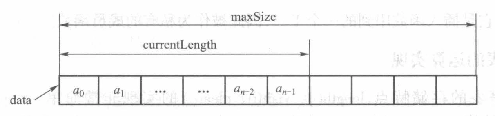
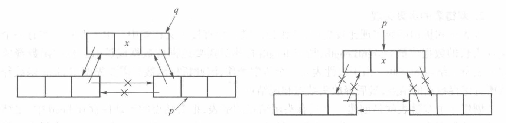
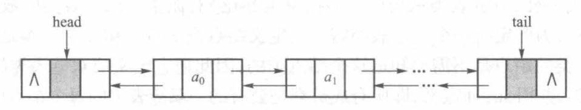
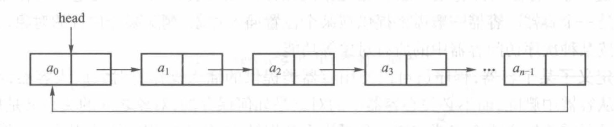
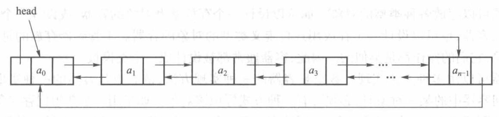

# 线性表

- [Back to Course Home](index.md)

## 线性表的定义

- 线性结构是 $n(n \geq 0)$ 个数据元素 $(a_1, a_2, \ldots, a_n)$ 的有限序列，满足以下性质：
	- 起始结点：$a_1$
	- 结束结点：$a_n$
	- 线性关系：对于任意的 $i(1 \leq i < n)$，都有 $a_i$ 和 $a_{i+1}$ 之间的线性关系:
		- 直接前驱：$a_{i-1}$
		- 直接后继：$a_{i+1}$
- 线性表的抽象类

```cpp
#ifndef LIST_H-2-1
#define LIST_H-2-1
#include <iostream>
#include <bits/stdc++.h>
using namespace std;

template <class elemType>
class list 
{
public:
	virtual ~list() {}
	virtual void clear() = 0;
	virtual int length() const = 0;	
	virtual void insert(int i, cosnt elemType &x) = 0;
	virtual void remove(int i) = 0;
	virtual int search(const elemType &x) const = 0;
	virtual elemType visit(int i) const = 0;
	virtual void traverse() const = 0;
	virtual bool isEmpty() const = 0;
};
#endif
```

## 线性表的顺序实现


- 时间复杂度
	- create、clear、update、visit：$O(1)$
	- insert、delete、search、traverse：$O(N)$

```cpp
#include "2-1-list.h"

template <class elemType>
class seqList: public list<elemType>
{
	private:
		elemType *data;
		int currentLength;
		int maxSize;
		void doubleSpace();
	public:
		seqList(int initSize = 10);
		~seqList() {delete [] data;}
		void clear() {currentLength = 0;}
		int length() const {return currentLength;}
		void insert(int i, const elemType &x);
		void remove(int i);
		int search(const elemType &x) const;
		elemType visit(int i) const {return data[i];};
		void traverse() const;
		/*
		bool isEmpty() const {return currentLength == 0;}
		bool isFull() const {return currentLength == maxSize;}
		*/
};

template <class elemType>
seqList<elemType>::seqList(int initSize)
{
	data = new elemType[initSize];
	maxSize = initSize;
	currentLength = 0;
}

template <class elemType>
void seqList<elemType>::traverse() const
{
	cout << endl;
	for (int i = 0; i < currentLength; ++i)
	{
		cout << data[i] << ' ';
	}
}

template <class elemType>
int seqList<elemType>::search(const elemType &x) const
{
	for (int i = 0; i < currentLength; ++i)
	{
		if (data[i] == x) return i;
	}
	return -1;
}

template <class elemType>
void seqList<elemType>::doubleSpace()
{
	elemType *tmp = data;
	maxSize *= 2;
	data = new elemType[maxSize];
	for (int i = 0; i < currentLength; ++i)
	{
		data[i] = tmp[i];
	}
	delete [] tmp;
}

template <class elemType>
void seqList<elemType>::insert(int i, const elemType &x)
{
	if (currentLength == maxSize) doubleSpace();
	for (int j = currentLength; j > i; --j)
	{
		data[j] = data[j - 1];
	}
	data[i] = x;
	++currentLength;
}

template <class elemType>
void seqList<elemType>::remove(int i)
{
	for (int j = i; j < currentLength - 1; ++j)
	{
		data[j] = data[j + 1];
	}
	--currentLength;
}
```

## 线性表的链接实现
### 单链表



-  时间复杂度
	- visit: $O(N)$
	- insert: $O(1)$

```cpp
#include "2-1-list.h"

template <class elemType>
class sLinkList: public list<elemType>
{
	private:
		struct node
		{
			elemType data;
			node *next;
			node(const elemType &x, node *n = NULL)
			{
				data = x;
				next = n;
			}
			node():next(NULL) {}
			~node() {}
		};
		node *head;
		int currentLength;
		node *move(int i) const;

	public:
		sLinkList() {};
		~sLinkList() {clear(); delete head;}
		void clear();
		int length() const {return currentLength;}
		void insert(int i, const elemType &x);
		void remove(int i);
		int search(const elemType &x) const;
		elemType visit(int i) const;
		void traverse() const;
		/*bool isEmpty() const;*/
};

template <class elemType>
typename sLinkList<elemType>::node *sLinkList<elemType>::move(int i) const
{
	node *p = head;
	while (i-- >= 0) p = p->next;
	return p;
}

template <class elemType>
sLinkList<elemType>::sLinkList()
{
	head = new node;
	currentLength = 0;
}

template <class elemType>
void sLinkList<elemType>::clear()
{
	node *p = head->next, *q;
	head->next = NULL;
	while (p != NULL)
	{
		q = p->next;
		delete p;
		p = q;
	}
	currentLength = 0;
}

template <class elemType>
void sLinkList<elemType>::insert(int i, const elemType &x)
{
	node *pos;
	pos = move(i-1);
	pos->next = new node(x, pos->next);
	++currentLength;
}

template <class elemType>
void sLinkList<elemType>::remove(int i)
{
	node *pos, *delp;
	pos = move(i-1);
	delp = pos->next;
	pos->next = delp->next;
	delete delp;
	--currentLength;
}

template <class elemType>
int sLinkList<elemType>::search(const elemType &x) const
{
	node *p = head->next;
	int i = 0;
	while (p != NULL && p->data != x)
	{
		p = p->next;
		++i;
	}
	if (p == NULL) return -1;
	else return i;
}

template <class elemType>
elemType sLinkList<elemType>::visit(int i) const
{
	return move(i)->data;
}

template <class elemType>
void sLinkList<elemType>::traverse() const
{
	node *p = head->next;
	cout << endl;
	while (p != NULL)
	{
		cout << p->data << ' ';
		p = p->next;
	}
}
```

### 双链表


```cpp
#include "2-1-list.h"

template <class elemType>
class dLinkList: public list<elemType>
{
	private:
		struct node
		{
			elemType data;
			node *prev, *next;
			node(const elemType &x, node *p = NULL, node *n = NULL)
			{
				data = x;
				prev = p;
				next = n;
			}
			node():prev(NULL), next(NULL) {}
			~node() {}
		};
		node *head, *tail;
		int currentLength;
		node *move(int i) const;

	public:
		dLinkList() {};
		~dLinkList() {clear(); delete head; delete tail;}
		void clear();
		int length() const {return currentLength;}
		void insert(int i, const elemType &x);
		void remove(int i);
		int search(const elemType &x) const;
		elemType visit(int i) const;
		void traverse() const;
		/*bool isEmpty() const;*/
};

template <class elemType>
dLinkList<elemType>::dLinkList()
{
	head = new node;
	tail = new node;
	head->next = tail;
	tail->prev = head;
	currentLength = 0;
}

template <class elemType>
typename dLinkList<elemType>::node *dLinkList<elemType>::move(int i) const
{
	node *p = head;
	while (i-- >= 0) p = p->next;
	return p;
}

template <class elemType>
void dLinkList<elemType>::insert(int i, const elemType &x)
{
	node *pos, *newNode;
	pos = move(i - 1);
	newNode = new node(x, pos, pos->next);
	pos->next->prev = newNode;
	pos->next = newNode;
	++currentLength;
}

template <class elemType>
void dLinkList<elemType>::remove(int i)
{
	node *pos;
	pos = move(i);
	pos->prev->next = pos->next;
	pos->next->prev = pos->prev;
	delete pos;
	--currentLength;
}

template <class elemType>
void dLinkList<elemType>::clear()
{
	node *p = head->next, *q;
	head->next = tail;
	tail->prev = head;
	while (p != tail)
	{
		q = p->next;
		delete p;
		p = q;
	}
	currentLength = 0;
}

template <class elemType>
int dLinkList<elemType>::search(const elemType &x) const
{
	node *p = head->next;
	int i = 0;
	while (p != tail && p->data != x)
	{
		p = p->next;
		++i;
	}
	if (p == tail) return -1;
	else return i;
}

template <class elemType>
elemType dLinkList<elemType>::visit(int i) const
{
	return move(i)->data;
}

template <class elemType>
void dLinkList<elemType>::traverse() const
{
	node *p = head->next;
	while (p != tail)
	{
		cout << p->data << ' ';
		p = p->next;
	}
	cout << endl;
}
```

### 循环链表
#### 循环单链表


#### 循环双链表


## 线性表的应用

- 大整数处理
- 多项式求和
- 约瑟夫环
- 动态内存管理

