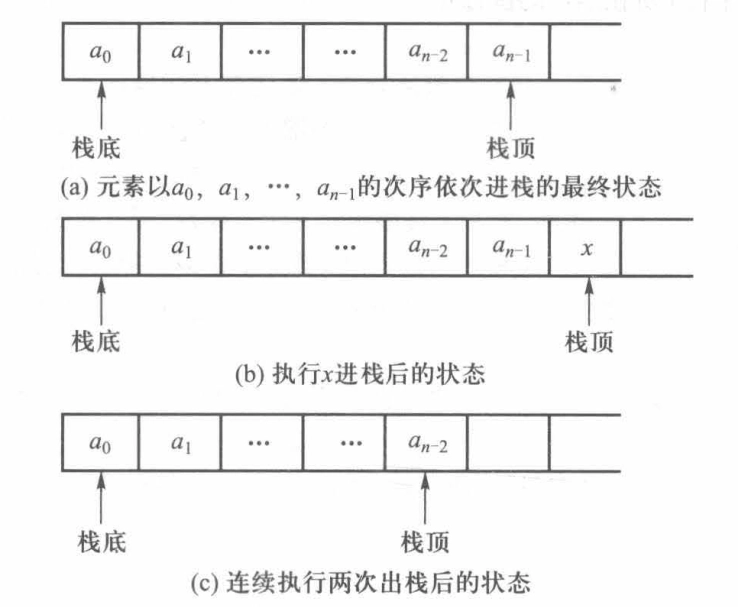

# 栈

- [Back to Course Home](index.md)

## 栈的定义


- 特点：**先进后出** 结构，最先到达栈的结点将最晚被删除

- 相关概念：

	- 栈底(bottom)：结构的首部（先进栈结点的位置）

	- 栈顶(top)：结构的尾部（后进栈结点的位置）

	- 出栈(pop)：结点从栈顶删除

	- 进栈(push)：结点在栈顶位置插入

	- 空栈：栈中结点个数为零

- 栈的抽象类

```cpp
#ifndef STACK_H
#define STACK_H
#include <iostream>
#include <bits/stdc++.h>
using namespace std;

template <class elemType>
class stack
{
	public:
		virtual bool isEmpty() const = 0;
		virtual void push(const elemType &x) = 0;
		virtual elemType pop() = 0;
		virtual elemType top() const = 0;
		virtual ~stack() {}
};

#endif
```

## 栈的顺序实现


- 时间复杂度: $O(1)$

```cpp
#include "3-1-stack.h"

template <class elemType>
class seqStack : public stack<elemType>
{
private:
	elemType *elem;
	int top_p;
	int maxSize;
	void doubleSpace();

public:
	seqStack(int initSize = 10);
	~seqStack() { delete[] elem; }
	bool isEmpty() const { return top_p == -1; }
	void push(const elemType &x);
	elemType pop();
	elemType top() const;
};

template <class elemType>
seqStack<elemType>::seqStack(int initSize)
{
	elem = new elemType[initSize];
	maxSize = initSize;
	top_p = -1;
}

template <class elemType>
void seqStack<elemType>::doubleSpace()
{
	elemType *tmp = elem;
	elem = new elemType[2 * maxSize];
	for (int i = 0; i < maxSize; ++i)
	{
		elem[i] = tmp[i];
	}
	maxSize *= 2;
	delete[] tmp;
}

template <class elemType>
void seqStack<elemType>::push(const elemType &x)
{
	if (top_p == maxSize - 1)
	{
		doubleSpace();
	}
	elem[++top_p] = x;
}

template <class elemType>
elemType seqStack<elemType>::pop()
{
	return elem[top_p--];
}

template <class elemType>
elemType seqStack<elemType>::top() const
{
	return elem[top_p];
}
```

## 栈的链接实现


```cpp
#include "3-1-stack.h"

template <class elemType>
class linkStack : public stack<elemType>
{
private:
	struct node
	{
		elemType data;
		node *next;
		node(const elemType &x, node *N = NULL)
		{
			data = x;
			next = N;
		}
		node() : next(NULL) {}
		~node() {}
	};
	node *top_p;

public:
	linkStack() { top_p = NULL; }
	~linkStack();
	bool isEmpty() const { return top_p == NULL; }
	void push(const elemType &x);
	elemType pop();
	elemType top() const;
};

template <class elemType>
linkStack<elemType>::~linkStack()
{
	node *tmp;
	while (top_p != NULL)
	{
		tmp = top_p;
		top_p = top_p->next;
		delete tmp;
	}
}

template <class elemType>
void linkStack<elemType>::push(const elemType &x)
{
	top_p = new node(x, top_p);
}

template <class elemType>
elemType linkStack<elemType>::pop()
{
	node *tmp = top_p;
	elemType value = top_p->data;
	top_p = top_p->next;
	delete tmp;
	return value;
}

template <class elemType>
elemType linkStack<elemType>::top() const
{
	return top_p->data;
}
```

## 栈的应用

- 递归消除

- 括号配对

- 表达式的计算（后缀表达式）

	- 对于一个表达式 $a + b$

		- **前缀式**：$+ab$

		- **中缀式**：$a+b$

		- **后缀式**：$ab+$