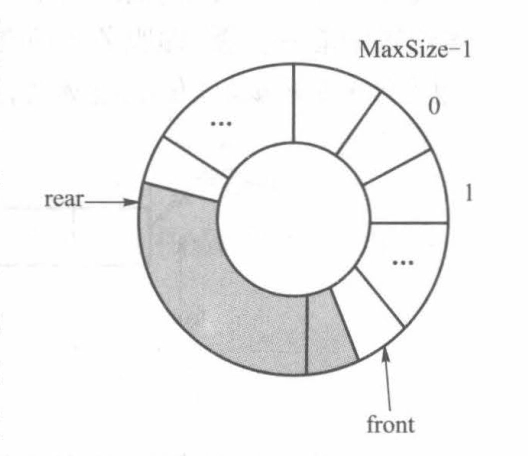

# 队列
## 队列的定义


- 特点：**先进先出**结构，最先到达队列的结点将最早被删除
- 相关概念：
	- 队列头(front)：结构的首部（先进队列结点的位置）
	- 队列尾(rear)：结构的尾部（后进队列结点的位置）
	- 出队列(dequeue)：结点从队列头删除
	- 入队列(enqueue)：结点在队列尾位置插入
	- 空队列：队列中结点个数为零
- 队列的抽象类

```cpp
#ifndef QUEUE_H
#define QUEUE_H
#include <iostream>
#include <bits/stdc++.h>
using namespace std;

template <class elemType>
class queue
{
public:
	virtual ~queue() {}
	virtual bool isEmpty() const = 0;
	virtual void enQueue(const elemType &x) = 0;
	virtual elemType deQueue() = 0;
	virtual elemType getHead() const = 0;
};

#endif
```

## 队列的顺序实现

- **队列头位置固定的顺序实现**
	

- **队列头位置不固定的顺序实现**
	

- **循环队列**
	

### 循环队列的顺序实现
```cpp
#include "4-1-queue.h"

template <class elemType>
class seqQueue: public queue<elemType>
{
	private:
		elemType *elem;
		int maxSize;
		int front, rear;
		void doubleSpace();
	public:
		seqQueue(int size = 10);
		~seqQueue() {delete [] elem;}
		bool isEmpty() const {return front == rear;}
		void enQueue(const elemType &x);
		elemType deQueue();
		elemType getHead() const {return elem[(front+1)%maxSize];}
};

template <class elemType>
seqQueue<elemType>::seqQueue(int size)
{
	elem = new elemType[size];
	maxSize = size;
	front = rear = 0;
}

template <class elemType>
void seqQueue<elemType>::doubleSpace()
{
	elemType *tmp = elem;
	elem = new elemType[2*maxSize];
	for (int i = 1; i < maxSize; ++i)
	{
		elem[i] = tmp[(front+i)%maxSize];
	}
	front = 0;
	rear = maxSize;
	maxSize *= 2;
	delete [] tmp;
}

template <class elemType>
void seqQueue<elemType>::enQueue(const elemType &x)
{
	if ((rear+1)%maxSize == front) doubleSpace();
	rear = (rear+1)%maxSize;
	elem[rear] = x;
}

template <class elemType>
elemType seqQueue<elemType>::deQueue()
{
	front = (front+1)%maxSize;
	return elem[front];
}
```

## 队列的链接实现


```cpp
#include "4-1-queue.h"

template <class elemType>
class linkQueue: public queue<elemType>
{
	private:
		struct node
		{
			elemType data;
			node *next;
			node(const elemType &x, node *N = NULL)
			{
				data = x;
				next = N;
			}
			node():next(NULL) {}
			~node() {}
		};
		node *front, *rear;
	public:
		linkQueue() {front = rear = NULL;}
		~linkQueue();
		bool isEmpty() const {return front == NULL;}
		void enQueue(const elemType &x);
		elemType deQueue();
		elemType getHead() const {return front->data;}
};

template <class elemType>
linkQueue<elemType>::~linkQueue()
{
	node *tmp;
	while (front != NULL)
	{
		tmp = front;
		front = front->next;
		delete tmp;
	}
}

template <class elemType>
void linkQueue<elemType>::enQueue(const elemType &x)
{
	if (rear == NULL)
	{
		front = rear = new node(x);
	}
	else
	{
		rear->next = new node(x);
		rear = rear->next;
	}
}

template <class elemType>
elemType linkQueue<elemType>::deQueue()
{
	node *tmp = front;
	elemType value = front->data;
	front = front->next;
	if (front == NULL) rear = NULL;
	delete tmp;
	return value;
}
```

## 队列的应用

- 火车车厢重排问题
- 排队系统的模拟

