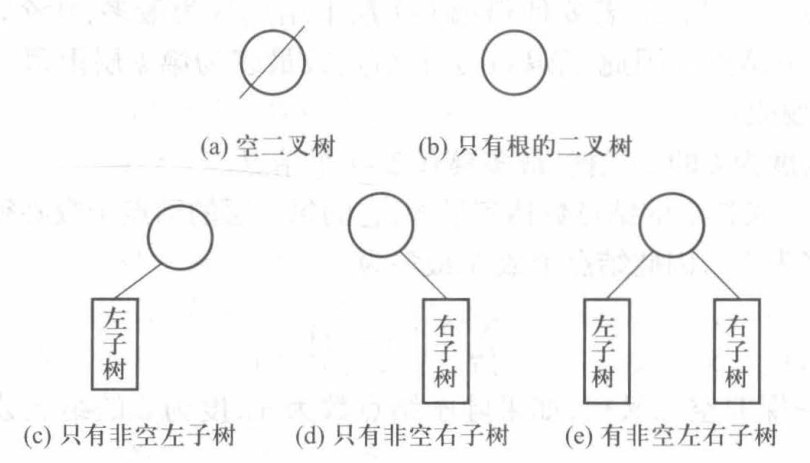
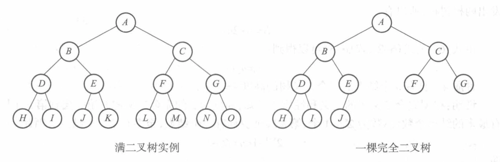
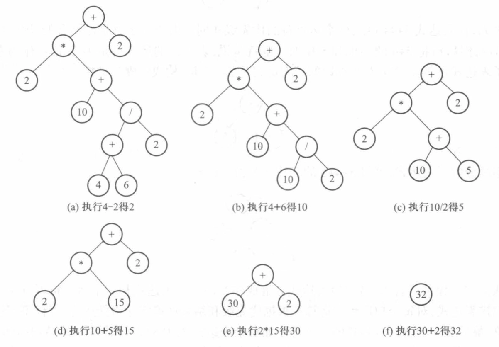
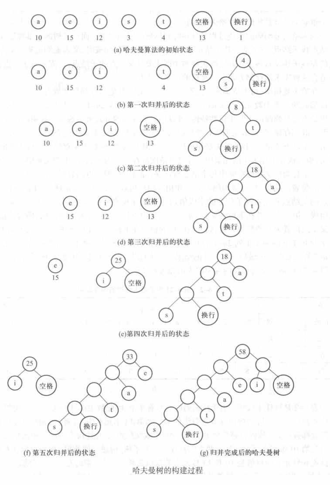

# 树

- [Back to Course Home](index.md)

## 树的定义

- 相关概念
	- **结点**
		- 根结点：起始结点，没有父结点
		- 叶结点：没有子结点（度为 0）
		- 子结点：结点的下一层结点
		- 父结点：结点的上一层结点
		- 兄弟结点：同一父结点的结点
		- 祖先结点：从根到该结点路径上的所有结点
		- 子孙结点：某个结点的所有下层结点
	- **度**：直接子结点的数量
		- 树的度：由度最大的结点决定
	- **层次/深度**：结点在树的层数
		- 根结点在第 1 层
		- **高度**：树的结点中的最大层次
	- **有序树与无序树**
		- 有序树：子树从左到右有顺序，即区分左右子树
		- 无序树：不区分左右子树
	- **森林**：若干互不相交的树的集合
- 树的抽象类

```cpp
#ifndef TREE_H
#define TREE_H
#include <bits/stdc++.h>
using namespace std;

template <class elemType>
class tree
{
public:
	virtual ~tree() {}
	virtual void clear() = 0;
	virtual bool isEmpty() const = 0;
	virtual elemType Root(elemType flag) const = 0;
	virtual elemType parent(elemType x, elemType flag) const = 0;
	virtual elemType child(elemType x, int i, elemType flag) const = 0;
	virtual void remove(elemType x, int i) = 0;
	virtual void traverse() const = 0;
};

#endif
```

## 二叉树
### 二叉树的定义


- 有序树，必须严格区分左右子树
- 任意结点的子结点数不超 2
- **满二叉树/完美树**：任意一层的结点个数都达到最大值
	- 高度为 $k$ 并具有 $2k-1$ 个结点的二叉树
- **完全二叉树**：满二叉树最底层从右向左依次移除若干结点
	- 满二叉树一定是完全二叉树
	- 完全二叉树不一定是满二叉树



### 二叉树的常用性质

1. 非空二叉树的第 $i$ 层上最多有 $2i-1$ 个结点（$i≥1$）
2. 高度为 $k$ 的二叉树，最多具有 $2^k-1$ 个结点（对满二叉树进行 $2$ 的等比数列求和）
3. 如果叶子结点数为 $n_0$，度数为 $2$ 的结点数为 $n_2$，则有：$n_0=n_2+1$
4. 具有 $n$ 个结点的完全二叉树的高度 $k = \lfloor \log_2 n \rfloor + 1$
5. 对一棵有 $n$ 个结点的完全二叉树按层自上而下编号，每一层自左至右依次编号，若树的根结点编号为 $1$，则对一个编号为 $i$ 的结点
	1. 若 $i=1$，则该结点是根结点，否则父结点编号为 $\lfloor i/2 \rfloor$
	2. 若 $2i > n$，则该结点是叶结点，否则左儿子编号为 $2i$
	3. 若 $2i+1 > n$，则该结点是叶结点，否则右儿子编号为 $2i+1$

### 二叉树的基本运算

- 遍历
	- 前序遍历/先根遍历
		- 顺序：根-左-右
	- 中序遍历/中根遍历
		- 顺序：左-根-右
	- 后序遍历/后根遍历
		- 顺序：左-右-根
	- 层次遍历
		- 顺序：从根到叶，从左到右
- 由二叉树的前序遍历和中序遍历/后序遍历和中序遍历可以唯一确定一棵二叉树
	- 前序遍历和中序遍历
		- 前序遍历的第一个结点为根结点
		- 在中序遍历中找到根结点，将中序遍历分为左子树和右子树
		- 对左子树和右子树递归进行前序遍历和中序遍历
	- 后序遍历和中序遍历
		- 后序遍历的最后一个结点为根结点
		- 在中序遍历中找到根结点，将中序遍历分为左子树和右子树
		- 对左子树和右子树递归进行后序遍历和中序遍历
- 二叉树的抽象类

```cpp
#ifndef BTREE_H
#define BTREE_H
#include <bits/stdc++.h>
using namespace std;

template <class elemType>
class bTree
{
public:
	virtual ~bTree() {}
	virtual void clear() = 0;
	virtual bool isEmpty() const = 0;
	virtual elemType Root(elemType flag) const = 0;
	virtual elemType parent(elemType x, elemType flag) const = 0;
	virtual elemType lchild(elemType x, elemType flag) const = 0;
	virtual elemType rchild(elemType x, elemType flag) const = 0;
	virtual void delLeft(elemType x) = 0;
	virtual void delRight(elemType x) = 0;
	virtual void preOrder() const = 0;
	virtual void midOrder() const = 0;
	virtual void postOrder() const = 0;
	virtual void levelOrder() const = 0;
};

#endif
```

### 二叉树的顺序实现


- 使用数组存储
	- 根结点下标为 $1$
	- 若某个结点下标为 $i$
		- 左子树下标为 $2i$
		- 右子树下标为 $2i+1$

### 二叉树的链接实现


```cpp
#include "6-2-bTree.h"

template <class T>
class binaryTree : public bTree<T>
{
	friend void printTree(const binaryTree<T> &t, T flag);
	private:
		struct Node
		{
			T data;
			Node *left, *right;
			Node():left(NULL), right(NULL) {}
			Node(T item, Node *L = NULL, Node *R = NULL):data(item), left(L), right(R) {}
			~Node() {}
		};
		Node *root;

	public:
		binaryTree():root(NULL) {}
		binaryTree(const T &value) {root = new Node(value);}
		~binaryTree() {clear();}

		void clear();
		bool isEmpty() const {return root == NULL;}
		T Root(T flag) const;
		T lchild(T x, T flag) const;
		T rchild(T x, T flag) const;
		void delLeft(T x);
		void delRight(T x);
		void preOrder() const;
		void midOrder() const;
		void postOrder() const;
		void levelOrder() const;
		void createTree(T flag);
		T parent(T x, T flag) const {return flag;}
		int height() const {return height(root);}
		int size() const {return size(root);}

	private:
		Node* find(T x, Node *t) const;
		void clear(Node *&t);
		void preOrder(Node *t) const;
		void midOrder(Node *t) const;
		void postOrder(Node *t) const;
		int height(Node *t) const;
		int size(Node *t) const;
};

template <class T>
void binaryTree<T>::clear()
{
	if (root != NULL)
		clear(root);
	root = NULL;
}

template <class T>
void binaryTree<T>::clear(Node *&t)
{
	if (t == NULL) return;
	clear(t->left);
	clear(t->right);
	delete t;
	t = NULL;
}

template <class T>
T binaryTree<T>::Root(T flag) const
{
	if (root == NULL) return flag;
	else return root->data;
}

template <class T>
binaryTree<T>::Node* binaryTree<T>::find(T x, binaryTree<T>::Node *t) const
{
	Node *tmp;
	if (t == NULL) return NULL;
	if (t->data == x) return t;
	if ((tmp = find(x, t->left)) != NULL) return tmp;
	else return find(x, t->right);
}

template <class T>
T binaryTree<T>::lchild(T x, T flag) const
{
	Node *tmp = find(x, root);
	if (tmp == NULL || tmp->left == NULL) return flag;
	return tmp->left->data;
}

template <class T>
T binaryTree<T>::rchild(T x, T flag) const
{
	Node *tmp = find(x, root);
	if (tmp == NULL || tmp->right == NULL) return flag;
	return tmp->right->data;
}

template <class T>
void binaryTree<T>::delLeft(T x)
{
	Node *tmp = find(x, root);
	if (tmp == NULL || tmp->left == NULL) return;
	clear(tmp->left);
}

template <class T>
void binaryTree<T>::delRight(T x)
{
	Node *tmp = find(x, root);
	if (tmp == NULL || tmp->right == NULL) return;
	clear(tmp->right);
}

template <class T>
void binaryTree<T>::createTree(T flag)
{
	queue<Node*> q;
	Node *tmp;
	T x, ldata, rdata;
	cout << "\n Input root node: ";
	cin >> x;
	root = new Node(x);
	q.push(root);
	while (!q.empty())
	{
		tmp = q.front();
		q.pop();
		cout << "Input " << tmp->data << "'s two children(" << flag << " as NULL): ";
		cin >> ldata >> rdata;
		if (ldata != flag) q.push(tmp->left = new Node(ldata));
		if (rdata != flag) q.push(tmp->right = new Node(rdata));
	}

	cout << "Create completed!" << endl;
}

template <class T>
void printTree(const binaryTree<T> &t, T flag)
{
	queue <T> q;
	q.push(t.Root(flag));	
	cout << endl;
	while (!q.empty())
	{
		T tmp = q.front();
		q.pop();
		if (tmp == flag) continue;
		cout << tmp << ' ' <<t.lchild(tmp, flag) << ' ' << t.rchild(tmp, flag) << endl;
		if (t.lchild(tmp, flag) != flag) q.push(t.lchild(tmp, flag));
		if (t.rchild(tmp, flag) != flag) q.push(t.rchild(tmp, flag));
	}
}

template <class T>
int binaryTree<T>::height(Node *t) const
{
	if (t == NULL) return 0;
	int lt = height(t->left), rt = height(t->right);
	return 1 + ((lt > rt) ? lt : rt);
}

template <class T>
int binaryTree<T>::size(Node *t) const
{
	if (t == NULL) return 0;
	return 1 + size(t->left) + size(t->right);
}

template <class T>
void binaryTree<T>::preOrder() const
{
	if (root != NULL) preOrder(root);
}
// 递归实现
template <class T>
void binaryTree<T>::preOrder(Node *t) const
{
	if (t == NULL) return;
	cout << t->data << ' ';
	preOrder(t->left);
	preOrder(t->right);
}
// 非递归实现
template <class T>
void BinaryTree<T>::preOrder () const
{
	Stack<Node*> s;
	Node *current;
	s.push(root);
	while (!s.isEmpty())
	{
		current = s.pop();
		cout << current->data << ' ';
		if (current->right != NULL) s.push(current->right);
		if (current->left != NULL) s.push(current->left);
	}
}

template <class T>
void binaryTree<T>::midOrder() const
{
	if (root != NULL) midOrder(root);
}
// 递归实现
template <class T>
void binaryTree<T>::midOrder(Node *t) const
{
	if (t == NULL) return;
	midOrder(t->left);
	cout << t->data << ' ';
	midOrder(t->right);
}
// 非递归实现
template <class T>
void BinaryTree<T>::midOrder () const
{
	struct StNode
	{
		Node *node;
		int TimesPop;
		StNode(Node *N = NULL):node(N), TimesPop(0) {}
	};
	Stack<StNode> s;
	StNode current(root);
	s.push(current);
	while (!s.isEmpty())
	{
		current = s.pop();
		if (++current.TimesPop == 2)
		{
			cout << current.node->data << ' ';
			if (current.node->right != NULL)
				s.push(StNode(current.node->right));
		}
		else
		{
			s.push(current);
			if (current.node->left != NULL)
				s.push(StNode(current.node->left));
		}
	}
}

template <class T>
void binaryTree<T>::postOrder() const
{
	if (root != NULL) postOrder(root);
}
// 递归实现
template <class T>
void binaryTree<T>::postOrder(Node *t) const
{
	if (t == NULL) return;
	postOrder(t->left);
	postOrder(t->right);
	cout << t->data << ' ';
}
// 非递归实现
template <class T>
void BinaryTree<T>::postOrder () const
{
	struct StNode
	{
		Node *node;
		int TimesPop;
		StNode(Node *N = NULL):node(N), TimesPop(0) {}
	};
	Stack<StNode> s;
	StNode current(root);
	s.push(current);
	while (!s.isEmpty())
	{
		current = s.pop();
		if (++current.TimesPop == 3)
		{
			cout << current.node->data << ' ';
			continue;
		}
		s.push(current);
		if (current.TimesPop == 1)
		{
			if (current.node->left != NULL)
				s.push(StNode(current.node->left));
		}
		else
		{
			if (current.node->right != NULL)
				s.push(StNode(current.node->right));
		}
	}
}

template <class T>
void binaryTree<T>::levelOrder() const
{
	queue<Node*> q;
	Node *tmp;
	if (root != NULL) q.push(root);
	while (!q.empty())
	{
		tmp = q.front();
		q.pop();
		cout << tmp->data << ' ';
		if (tmp->left != NULL) q.push(tmp->left);
		if (tmp->right != NULL) q.push(tmp->right);
	}
}
```

### 二叉树的应用

- 计算表达式



## 哈夫曼树和哈夫曼编码
### 前缀编码

- 无二义性
- 每个字符的编码与其它字符编码的前缀不同

### 哈夫曼编码

- 目的：根据数据的出现频率进行不同长度的编码，从而节省空间。
- 哈夫曼树：哈夫曼树是一棵最小代价的二叉树，在这棵树上，所有的字符都包含在叶结点上。要使得整棵树的代价最小，显然权值大的叶子应当尽量靠近树根，权值小的叶子可以适当离树根远一些。
- 构建方法：从当前集合中选取并去除权值最小、次最小的两个结点，以这两个结点作为内部结点 $b_i$ 的左右儿子，$b_i$ 的权值为其左右儿子权值之和并加入其中。这样，在集合 A 中，结点个数便减少了一个。这样，在经过了 $n-1$ 次循环之后，集合 A 中只剩下了一个结点，这个结点就是根结点。




### 哈夫曼树类的实现

- 二叉树的广义标准存储
	- 每个结点包含以下字段
		- 数据
			- 数据
			- 权值
		- **父结点指针**
		- 左、右子结点指针

```cpp
#include <bits/stdc++.h>
using namespace std;

template <class T>
class hfTree
{
	private:
		struct Node
		{
			T data;
			int weight;
			int parent, left, right;
		};
		Node *elem;
		int length;

	public:
		struct hfCode
		{
			T data;
			string code;
		};
		hfTree(const T *v, const int *w, int size);
		void getCode(hfCode result[]);
		~hfTree() {delete [] elem; }
};

template <class T>
hfTree<T>::hfTree(const T *v, const int *w, int size)
{
	const int MAX_INT = 32767;
	int min1, min2;
	int x, y;

	length = 2 * size;
	elem = new Node[length];

	for (int i = size; i < length; i++)
	{
		elem[i].weight = w[i - size];
		elem[i].data = v[i - size];
		elem[i].parent = elem[i].left = elem[i].right = 0;
	}

	for (int i = size - 1; i > 0; i--)
	{
		min1 = min2 = MAX_INT;
		x = y = 0;

		for (int j = i + 1; j < length; j++)
		{
			if (elem[j].parent == 0)
			{
				if (elem[j].weight < min1)
				{
					min2 = min1;
					min1 = elem[j].weight;
					y = x;
					x = j;
				}
				else if (elem[j].weight < min2)
				{
					min2 = elem[j].weight;
					y = j;
				}
			}
		}

		elem[i].weight = min1 + min2;
		elem[i].left = x;
		elem[i].right = y;
		elem[i].parent = 0;
		elem[x].parent = elem[y].parent = i;
	}
}

template <class T>
void hfTree<T>::getCode(hfCode result[])
{
	int size = length / 2;
	int p, s;
	string str = "";
	for (int i = size; i < length; i++)
	{
		result[i - size].data = elem[i].data;
		result[i - size].code = "";
		p = elem[i].parent;
		s = i;
		while (p)
		{
			if (elem[p].left == s) str += '0';
			else str += '1';
			s = p;
			p = elem[p].parent;
		}
		for (int j = str.size() - 1; j >= 0; j--)  result[i - size].code += str[j];
		str = "";
	}
}

int main()
{
	char ch[] = {"aeistdn"};
	int w[] = {10, 15, 12, 3, 4, 13, 1};
	hfTree<char> tree(ch, w, 7);
	hfTree<char>::hfCode result[7];
	tree.getCode(result);
	for (int i = 0; i < 7; i++)
	{
		cout << result[i].data << ' ' << result[i].code << endl;
	}
	return 0;
}
```

## 树和森林
### 树的存储实现


- **孩子链表示法**
	

- **孩子兄弟链表示法**
	- 把树表示成一棵二叉树
		- 左指针：第一个子结点
		- 右指针：兄弟结点
	- 前序遍历与二叉树相同
	- 后序遍历与二叉树的中序遍历相同

	

- **双亲表示法**
	

### 树的遍历

- 前序遍历
- 后序遍历
- 层次遍历

### 树、森林与二叉树的转换

- **森林**：树的集合
	- 存储方式：把森林存储为一棵二叉树
- **把森林转换为二叉树的步骤**：
	1. 把森林 $F={T_1, T_2, \ldots, T_k}$ 中的树 $T_i$ 用孩子兄弟链法表示为一棵二叉树 $B_i$
	2. 把二叉树 $B_i$ 作为二叉树 $B_{i-1}$ 的根结点的右子树

