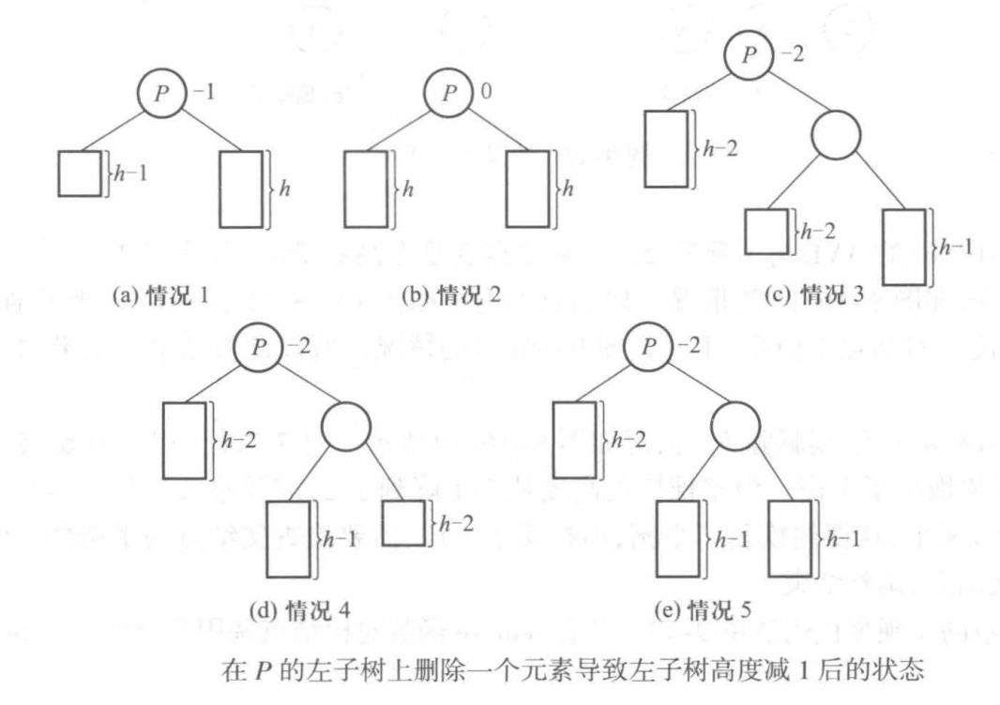

# 动态查找表

- [Back to Course Home](index.md)

## 动态查找表的定义

- 支持增、删、查、改等操作
- 存储结构：
	- 查找树
	- 散列表
- 动态查找表的抽象类

```cpp
#ifndef DYNAMICSEARCHTABLE_H
#define DYNAMICSEARCHTABLE_H
#include <bits/stdc++.h>
#include "8-1-set.h"
using namespace std;

template <class KEY, class OTHER>
class dynamicSearchTable {
public:
	virtual SET<KEY, OTHER>* find(const KEY& x) const = 0;
	virtual void insert(const SET<KEY, OTHER>& x) = 0;
	virtual void remove(const KEY& x) = 0;
	virtual ~dynamicSearchTable() {};
};

#endif
```

## 二叉查找树
### 二叉查找树的定义

- **定义**：二叉查找树又称二叉排序树，非空情况下满足下列条件
	- 若左子树非空，则左子树上的所有非空结点的关键字值均小于根结点的关键字值
	- 若右子树非空，则右子树上的所有非空结点的关键字值均大于根结点的关键字值
	- 左右子树也是二叉查找树
- **性质**：
	- 中序遍历一棵二叉查找树的道德访问序列 **按键值递增**


### 二叉查找树的实现

- 通常采用二叉树的标准存储法
	- 每个结点包含以下字段
		- 数据：键值-数据对
		- 左、右子结点指针
- **运算实现**：
	- 查找：
		1. 若根结点不存在，则不存在
		2. 若根结点关键字值等于查找值，则找到
		3. 若根结点关键字值大于查找值，则递归查找左子树
		4. 若根结点关键字值小于查找值，则递归查找右子树
	- 插入：
		1. 若根结点不存在，则插入为根结点
		2. 若根结点关键字值大于插入值，则在左子树上递归插入
		3. 若根结点关键字值小于插入值，则在右子树上递归插入
	- 删除：
		1. 若根结点关键字值大于待删值，则在左子树上递归删除
		2. 若根结点关键字值小于待删值，则在右子树上递归删除
		3. 若根结点关键字值等于待删值，则：
			1. 根结点无子结点：直接删
			2. 根结点有一个子结点：作为新的根结点
			3. 根结点有两个子结点：找到左子树的最大结点或右子树最小结点替代
- 时间复杂度：$O(\log N)$

```cpp
#include "9-1-dynamicSearchTable.h"
using namespace std;

template <class KEY, class OTHER>
class binarySearchTree : public dynamicSearchTable<KEY, OTHER> 
{
public:
	binarySearchTree();
	~binarySearchTree();
	SET<KEY, OTHER>* find(const KEY& x) const;
	void insert(const SET<KEY, OTHER>& x);
	void remove(const KEY& x);
private:
	struct BinaryNode {
		SET<KEY, OTHER> data;
		BinaryNode* left;
		BinaryNode* right;
		BinaryNode(const SET<KEY, OTHER>& thedata, BinaryNode* l=NULL, BinaryNode* r=NULL)
			: data(thedata), left(l), right(r) {}
	};
	BinaryNode* root;
	void insert(const SET<KEY, OTHER>& x, BinaryNode*& t);
	void remove(const KEY& x, BinaryNode*& t);
	SET<KEY, OTHER>* find(const KEY& x, BinaryNode* t) const;
	void makeEmpty(BinaryNode*& t);
};

template <class KEY, class OTHER>
binarySearchTree<KEY, OTHER>::binarySearchTree() 
{
	root = NULL;
}

template <class KEY, class OTHER>
binarySearchTree<KEY, OTHER>::~binarySearchTree() 
{
	makeEmpty(root);
}

template <class KEY, class OTHER>
SET<KEY, OTHER>* binarySearchTree<KEY, OTHER>::find(const KEY& x) const 
{
	return find(x, root);
}

template <class KEY, class OTHER>
SET<KEY, OTHER>* binarySearchTree<KEY, OTHER>::find(const KEY& x, BinaryNode* t) const
{
	if (t == NULL || t->data.key == x) {
		return t;
	}
	if (x < t->data.key) {
		return find(x, t->left);
	} else {
		return find(x, t->right);
	}
}

template <class KEY, class OTHER>
void binarySearchTree<KEY, OTHER>::insert(const SET<KEY, OTHER>& x) 
{
	insert(x, root);
}

template <class KEY, class OTHER>
void binarySearchTree<KEY, OTHER>::insert(const SET<KEY, OTHER>& x, BinaryNode*& t) 
{
	if (t == NULL) {
		t = new BinaryNode(x);
	} else if (x.key < t->data.key) {
		insert(x, t->left);
	} else if (x.key > t->data.key) {
		insert(x, t->right);
	}
}

template <class KEY, class OTHER>
void binarySearchTree<KEY, OTHER>::remove(const KEY& x) 
{
	remove(x, root);
}

template <class KEY, class OTHER>
void binarySearchTree<KEY, OTHER>::remove(const KEY& x, BinaryNode*& t) 
{
	if (t == NULL) {
		return;
	}
	if (x < t->data.key) {
		remove(x, t->left);
	} 
	else if (x > t->data.key) {
		remove(x, t->right);
	}
	else if (t->left != NULL && t->right != NULL) {// Two children
		BinaryNode* tmp = t->right;
		while (tmp->left != NULL) {
			tmp = tmp->left;
		}// Find the smallest node in the right subtree
		t->data = tmp->data;
		remove(t->data.key, t->right);// Remove the smallest node in the right subtree
	}
	else {// One or zero children
		BinaryNode* oldNode = t;
		t = (t->left != NULL) ? t->left : t->right;
		delete oldNode;
	}
}

template <class KEY, class OTHER>
void binarySearchTree<KEY, OTHER>::makeEmpty(BinaryNode*& t) 
{
	if (t != NULL) {
		makeEmpty(t->left);
		makeEmpty(t->right);
		delete t;
	}
	t = NULL;
}

int main()
{
	SET<int, char*> a[] = { {10,"aaa"},{8,"bbb"},{21,"ccc"},{87,"ddd"},{56,"eee"},{4,"fff"},{11,"ggg"},{3,"hhh"},{22,"iii"},{7,"jjj"} };
	binarySearchTree<int, char*> tree;
	SET<int, char*>* p; 
	SET<int, char*> x;
	for (int i = 0; i < 10; i++) {
		tree.insert(a[i]);
	}

	p = tree.find(21);
	if (p) {
		cout << "Find 21: " << p->other << endl;
	} else {
		cout << "21 not found" << endl;
	}
	tree.remove(21);
	p = tree.find(21);
	if (p) {
		cout << "Find 21: " << p->other << endl;
	} else {
		cout << "21 not found" << endl;
	}
	return 0;
}
```

## AVL 树
### AVL 树（二叉平衡树）的定义

- 二叉平衡树是满足某个平衡条件的二叉查找树，其保证树的高度是 $O(\log N)$，从而操作都是 $O(\log N)$
- 最理想是每个节点的左右子树都有同样的高度，不过条件可以放宽一些，因此有了二叉平衡查找树
- **平衡因子（平衡度）**：结点的平衡度是结点的左子树的高度减去右子树的高度
	- 要求每个结点的平衡因子都为 $+1, -1, 0$，即每个结点的左右子树的高度最多差 $1$
	- 一棵由 $N$ 个结点组成的 AVL 树的高度 $H \leq 1.44\log (N+1) - 0.328$

### AVL 树的实现

- 采用二叉链表存储
	- 每个结点包含以下字段
		- 数据
			- 键值-数据对
			- 节点高度
		- 左、右子结点指针
- **运算实现**
	- 查找：与二叉查找树相同
	- **插入**：插入结点后检查到根结点路径上的平衡性，如果没破坏平衡性，可以直接插入，然后自下而上修改结点平衡度（若有结点平衡度没变，上面的就都不用修改）；如果破坏了平衡性，则需要调整树的结构（单旋转 or 双旋转），再修改平衡度
		- 插入方法：LL 和 RR、LR 和 RL 是对称的
		- LL/RR：插入在危机结点的左子结点的左子树/右子结点的右子树，进行单旋转

		

		- LR/RL：插入在危机结点的左子结点的右子树/右子结点的左子树，进行双旋转
			- LR：先对危机结点的左子树执行 RR，再对危机结点自身执行 LL
			- RL：先对危机结点的右子树执行 LL，再对危机结点自身执行 RR

		

	- **删除**：删除结点后检查到根结点路径上的平衡性，共分五种情况：

		

```cpp
#include "9-1-dynamicSearchTable.h"
#include <bits/stdc++.h>
using namespace std;

template <class KEY, class OTHER>
class AvlTree : public dynamicSearchTable<KEY, OTHER> 
{
public:
	AvlTree();
	~AvlTree();
	SET<KEY, OTHER>* find(const KEY& x) const;
	void insert(const SET<KEY, OTHER>& x);
	void remove(const KEY& x);

private:
	struct AvlNode {
		SET<KEY, OTHER> data;
		AvlNode* left;
		AvlNode* right;
		int height;
		AvlNode(const SET<KEY, OTHER>& thedata, AvlNode* l=NULL, AvlNode* r=NULL, int h=0)
			: data(thedata), left(l), right(r), height(h) {}
	};
	AvlNode* root;

	void insert(const SET<KEY, OTHER>& x, AvlNode*& t);
	bool remove(const KEY& x, AvlNode*& t);
	void makeEmpty(AvlNode*& t);
	void LL(AvlNode*& t);
	void LR(AvlNode*& t);
	void RL(AvlNode*& t);
	void RR(AvlNode*& t);
	int height(AvlNode* t) const { return t == NULL ? -1 : t->height; }
	int max(int a, int b) { return a > b ? a : b; }
	bool adjust(AvlNode*& t, int subTree);
};

template <class KEY, class OTHER>
AvlTree<KEY, OTHER>::AvlTree() 
{
	root = NULL;
}

template <class KEY, class OTHER>
AvlTree<KEY, OTHER>::~AvlTree() 
{
	makeEmpty(root);
}

template <class KEY, class OTHER>
SET<KEY, OTHER>* AvlTree<KEY, OTHER>::find(const KEY& x) const 
{
	AvlNode* t = root;
	while (t != NULL && t->data.key != x) {
		if (x < t->data.key) {
			t = t->left;
		} else {
			t = t->right;
		}
	}
	return t == NULL ? NULL : (SET<KEY, OTHER>*)t;
}

template <class KEY, class OTHER>
void AvlTree<KEY, OTHER>::insert(const SET<KEY, OTHER>& x) 
{
	insert(x, root);
}

template <class KEY, class OTHER>
void AvlTree<KEY, OTHER>::insert(const SET<KEY, OTHER>& x, AvlNode*& t) 
{
	if (t == NULL) {
		t = new AvlNode(x, NULL, NULL);
	} else if (x.key < t->data.key) {
		insert(x, t->left);
		if (!adjust(t, 1)) {
			if (height(t->left) - height(t->right) == 2) {
				if (x.key < t->left->data.key) {
					LL(t);
				} else {
					LR(t);
				}
			}
		}
	} else if (x.key > t->data.key) {
		insert(x, t->right);
		if (!adjust(t, 0)) {
			if (height(t->right) - height(t->left) == 2) {
				if (x.key > t->right->data.key) {
					RR(t);
				} else {
					RL(t);
				}
			}
		}
	}
	t->height = max(height(t->left), height(t->right)) + 1;
}

template <class KEY, class OTHER>
void AvlTree<KEY, OTHER>::remove(const KEY& x) 
{
	remove(x, root);
}

template <class KEY, class OTHER>
bool AvlTree<KEY, OTHER>::remove(const KEY& x, AvlNode*& t) 
{
	if (t == NULL) 
	{
		return true;
	}
	if (x == t->data.key)
	{
		if (t->left == NULL || t->right == NULL) 
		{
			AvlNode* oldNode = t;
			t = (t->left != NULL) ? t->left : t->right;
			delete oldNode;
			return false;
		} 
		else 
		{
			AvlNode* tmp = t->right;
			while (tmp->left != NULL) 
			{
				tmp = tmp->left;
			}
			t->data = tmp->data;
			if (remove(tmp->data.key, t->right)) 
			{
				return true;
			}
			else return adjust(t, 1);
		}
	}
	if (x < t->data.key) 
	{
		if (remove(x, t->left)) 
		{
			return true;
		}
		else return adjust(t, 0);
	}
	else 
	{
		if (remove(x, t->right)) 
		{
			return true;
		}
		else return adjust(t, 1);
	}
}

template <class KEY, class OTHER>
bool AvlTree<KEY, OTHER>::adjust(AvlNode*& t, int subTree) 
{
	if (subTree) 
	{
		if (height(t->left) - height(t->right) == 1) 
		{
		   return true;
		}
		if (height(t->right) == height(t->left)) 
		{
			--t->height;
			return false;
		}
		if (height(t->left->right) > height(t->left->left)) 
		{
			LR(t);
			return false;
		}
		LL(t);
		if (height(t->right) == height(t->left)) 
		{
			return false;
		}
		else return true;
	}
	else 
	{
		if (height(t->right) - height(t->left) == 1) 
		{
			return true;
		}
		if (height(t->right) == height(t->left)) 
		{
			--t->height;
			return false;
		}
		if (height(t->right->left) > height(t->right->right)) 
		{
			RL(t);
			return false;
		}
		RR(t);
		if (height(t->right) == height(t->left)) 
		{
			return false;
		}
		else return true;
	}	   
}

template <class KEY, class OTHER>
void AvlTree<KEY, OTHER>::makeEmpty(AvlNode*& t) 
{
	if (t == NULL) {
		return;
	}
	makeEmpty(t->left);
	makeEmpty(t->right);
	delete t;
	t = NULL;
}

template <class KEY, class OTHER>
void AvlTree<KEY, OTHER>::LL(AvlNode*& t) 
{
	AvlNode* l = t->left;
	t->left = l->right;
	l->right = t;
	t->height = max(height(t->left), height(t->right)) + 1;
	l->height = max(height(l->left), t->height) + 1;
	t = l;
}

template <class KEY, class OTHER>
void AvlTree<KEY, OTHER>::LR(AvlNode*& t) 
{
	RR(t->left);
	LL(t);
}

template <class KEY, class OTHER>
void AvlTree<KEY, OTHER>::RL(AvlNode*& t) 
{
	LL(t->right);
	RR(t);
}

template <class KEY, class OTHER>
void AvlTree<KEY, OTHER>::RR(AvlNode*& t) 
{
	AvlNode* r = t->right;
	t->right = r->left;
	r->left = t;
	t->height = max(height(t->left), height(t->right)) + 1;
	r->height = max(height(r->right), t->height) + 1;
	t = r;
}
```

## 散列表
### 散列表的定义

- 散列表的思想是用一个比集合规模略大的数组来存储这个集合，将数据元素关键字映射到这个数组的下标
	- 这个映射成为 **散列函数**
	- 散列函数的定义域范围大于值域，可能发生冲突/碰撞

### 散列函数

- **直接定址法**：去关键字值或其线性函数值作为散列地址
- **除留余数法**：如果 $M$ 是散列表的大小，关键字为 $x$，则散列地址为 $H(x) = x \mod M$，常选 $M$ 为素数，使其分布更均匀
- **数字分析法**：对关键字集合中的所有关键字，分析每一位上数字分布，取关键字的某一部分（数字分布均匀的位）进行映射
- **平方取中法**：如果关键字中各位的分布都比较均匀，但关键字的值域比数组规模大，则可以将关键字平方后，取其结果的中间各位作为散列函数值
- **折叠法**：关键字相当长，以至于和散列表的单元总数相比大得多时，可选取一个长度后，将关键字按此长度分组相加

### 闭散列表
将溢出数据元素存放到没有使用过的单元中

- **线性探测法**：
	- 插入：当散列发生冲突时，探测下一个单元，直到发现一个空单元，即 $H, H+1, H+2, H+3, \cdots$
	- 查找：算出来位置之后，找不到的话就向后查找，直到找到或者遇到空单元
	- 删除：采用迟删除，标记该单元活动/被删除
	- 缺点：可能产生 **初始聚集**

```cpp
#include "9-1-dynamicSearchTable.h"
#include <bits/stdc++.h>
using namespace std;

template <class KEY, class OTHER>
class closeHashTable : public dynamicSearchTable<KEY, OTHER> 
{
	private:
		struct node {
			SET<KEY, OTHER> data;
			int state; // 0: empty, 1: active, 2: deleted
			node() { state = 0; }
		};
		node* array;
		int size;
		int (*key)(const KEY& x);
		static int defaultKey(const int& k) { return k; }
	public:
		closeHashTable(int length = 101, int (*f)(const KEY& x) = defaultKey);
		~closeHashTable() { delete [] array; }
		SET<KEY, OTHER>* find(const KEY& x) const;
		void insert(const SET<KEY, OTHER>& x);
		void remove(const KEY& x);
};

template <class KEY, class OTHER>
closeHashTable<KEY, OTHER>::closeHashTable(int length, int (*f)(const KEY& x)) 
{
	size = length;
	array = new node[size];
	key = f;
}

template <class KEY, class OTHER>
void closeHashTable<KEY, OTHER>::insert(const SET<KEY, OTHER>& x)
{
	int initPos = key(x.key) % size;
	int pos = initPos;
	do {
		if (array[pos].state != 1)
		{
			array[pos].state = 1;
			array[pos].data = x;
			return;
		} 
		pos = (pos + 1) % size;
	} while (pos != initPos);
}

template <class KEY, class OTHER>
void closeHashTable<KEY, OTHER>::remove(const KEY& x)
{
	int initPos = key(x) % size;
	int pos = initPos;
	do {
		if (array[pos].state == 0) return;
		if (array[pos].state == 1 && array[pos].data.key == x) 
		{
			array[pos].state = 2;
			return;
		}
		pos = (pos + 1) % size;
	} while (pos != initPos);
}

template <class KEY, class OTHER>
SET<KEY, OTHER>* closeHashTable<KEY, OTHER>::find(const KEY& x) const
{
	int initPos = key(x) % size;
	int pos = initPos;
	do {
		if (array[pos].state == 0) return NULL;
		if (array[pos].state == 1 && array[pos].data.key == x) return (SET<KEY, OTHER>*)&array[pos];
		pos = (pos + 1) % size;
	} while (pos != initPos);
	return NULL;
}
```

- **二次探测法**：
	- 当散列发生冲突时，检查远离初始探测点的某一单元，即 $H, H+1^2, H+2^2, H+3^2, \cdots$
	- 定理：使用二次探测法且表的大小是一个素数，则如果表至少有一半空单元，新的元素总能被插入，且插入过程中没有一个单元被探测两次
	- 动态扩展：当负载因子超过 $0.5$ 时，需要把数组扩大一倍，并且进行 **重新散列**（新的数组隐含新的散列函数）
- **再散列法**：
	- 两个散列函数 $H_1, H_2$，分别用于计算探测序列的起始地址和下一个探测的步长，即 $H_1(x), H_1(x)+H_2(x), H_1(x)+2H_2(x), H_1(x)+3H_2(x), \cdots$

### 开散列表/拉链表


将具有相同散列地址的碰撞结点存储在一个单链表中，散列表中的 $k$ 号单元保存的是指向散列地址同为 $k$ 的链表的第一个结点的地址。

```cpp
#include "9-1-dynamicSearchTable.h"
#include <bits/stdc++.h>
using namespace std;

template <class KEY, class OTHER>
class openHashTable : public dynamicSearchTable<KEY, OTHER>
{
	private:
		struct node
		{
			SET<KEY, OTHER> data;
			node *next;

			node(const SET<KEY, OTHER> &d, node *n = NULL)
			{
				data = d;
				next = n;
			}
			node()
			{
				next = NULL;
			}
		};

		node **array;//指针数组
		int size;
		int (*key)(const KEY &x);//函数指针
		static int defaultKey(const int &x)
		{
			return x;
		}
	public:
		openHashTable(int length = 101, int (*f)(const KEY &x) = defaultKey);
		~openHashTable();
		SET<KEY, OTHER> *find(const KEY &x) const;
		void insert(const SET<KEY, OTHER> &x);
		void remove(const KEY &x);
};

template <class KEY, class OTHER>
openHashTable<KEY, OTHER>::openHashTable(int length, int (*f)(const KEY &x))
{
	size = length;
	array = new node*[size];
	key = f;
	for (int i = 0; i < size; i++) array[i] = NULL;
}

template <class KEY, class OTHER>
openHashTable<KEY, OTHER>::~openHashTable()
{
	node *p, *q;
	for (int i = 0; i < size; i++)
	{
		p = array[i];
		while (p != NULL)
		{
			q = p->next;
			delete p;
			p = q;
		}
	}
	delete []array;
}

template <class KEY, class OTHER>
SET<KEY, OTHER> *openHashTable<KEY, OTHER>::find(const KEY &x) const
{
	int pos;
	node *p;
	pos = key(x) % size;
	p = array[pos];
	while (p != NULL && p->data.key != x) p = p->next;
	if (p == NULL) return NULL;
	else return (SET<KEY, OTHER> *)p;
}

template <class KEY, class OTHER>
void openHashTable<KEY, OTHER>::insert(const SET<KEY, OTHER> &x)
{
	int pos;
	node *p;
	pos = key(x.key) % size;
	p = array[pos];
	array[pos] = new node(x, array[pos]);
}

template <class KEY, class OTHER>
void openHashTable<KEY, OTHER>::remove(const KEY &x)
{
	int pos;
	node *p, *q;
	pos = key(x) % size;
	if (array[pos] == NULL) return;
	p = array[pos];
	if (array[pos]->data.key == x)
	{
		array[pos] = p->next;
		delete p;
		return;
	}
	while (p->next != NULL && p->next->data.key != x) p = p->next;
	if (p->next != NULL)
	{
		q = p->next;
		p->next = q->next;
		delete q;
	}
}
```

