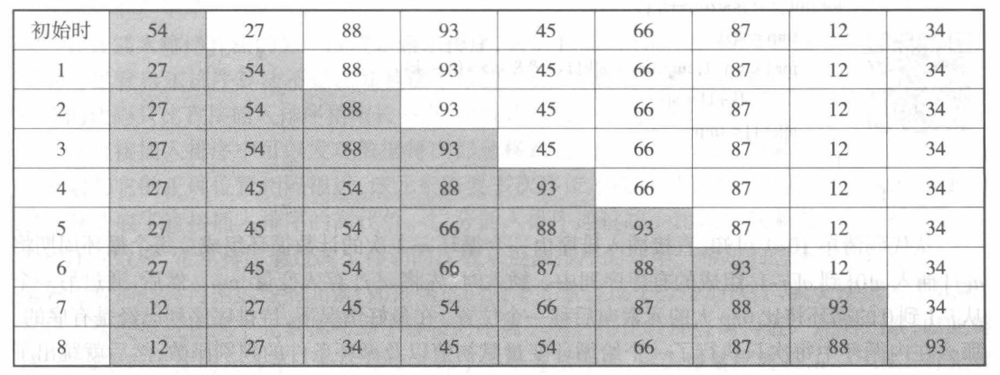
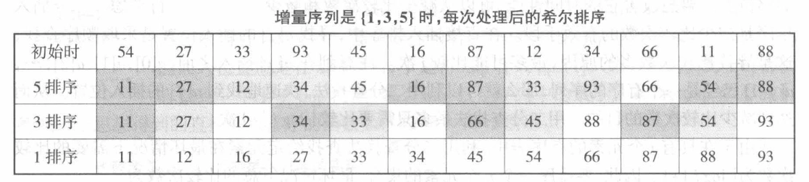
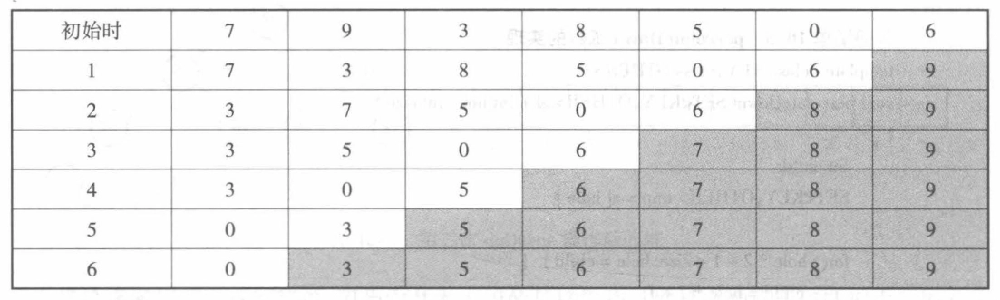
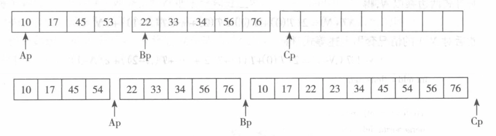

# 排序

- [Back to Course Home](index.md)

## 排序的基本概念

- **排序**：把集合中的数据元素按照它们的 **关键字** 的非递减或非递增序排成一个序列
- **稳定排序与非稳定排序**：多个关键字值相同的数据元素经过排序后，这些数据元素的相对次序保持不变，则稳定，反之则不稳定
- **内排序与外排序**：
	- 内排序是指被排序的数据元素全部存放在计算机的内存之中，并且在内存中调整数据元素的相对位置。
	- 外排序是指在排序的过程中，数据元素主要存放在外存储器中，借助于内存储器逐步调整数据元素之间的相对位置。

## 插入排序
首先将由第一个数据元素组成的序列看成是有序的，然后将剩余的 $n-1$ 个元素依次 **插入** 到前面的已排好序的子序列中去，使得每次插入后的子序列也是有序的。



### 直接插入排序

- 时间复杂度：
	- 最好情况：$O(N)$
	- 最坏情况、平均情况：$O(N^2)$
- 空间复杂度：$O(1)$
- 稳定

```cpp
//直接插入排序
template <class KEY, class OTHER>
void simpleInsertSort(SET<KEY, OTHER> *data, int size) {
	int k;
	SET<KEY, OTHER> tmp;

	for (int i = 1; i < size; i++) {
		tmp = data[i];
		for (k = i - 1; k >= 0 && tmp < data[k]; k--) {
			data[k + 1] = data[k];
		}
		data[k + 1] = tmp;
	}
}
```

### 二分排序

- 二分插入排序是直接插入排序的改进版，利用二分查找来确定插入位置
- 时间复杂度（平均）：
	- 比较次数：$O(N \log N)$
	- 移动次数：$O(N^2)$
	- 总体时间复杂度：$O(N^2)$
- 空间复杂度：$O(1)$
- 稳定

```cpp
//二分插入排序
template <class KEY, class OTHER>
void binaryInsertSort(SET<KEY, OTHER> *data, int size) {
	SET<KEY, OTHER> tmp;
	int left, right, mid;

	for (int i = 1; i < size; i++) {
		tmp = data[i];
		left = 0;
		right = i - 1;
		//二分查找插入位置
		while (left <= right) {
			mid = (left + right) / 2;
			if (data[mid].key < tmp.key) {
				left = mid + 1;
			} else {
				right = mid - 1;
			}
		}
		//将元素向后移动
		for (int k = i - 1; k >= left; k--) {
			data[k + 1] = data[k];
		}
		data[left] = tmp;
	}
}
```

### 希尔排序

- 希尔排序是直接插入排序的改进版，先将待排序序列分成若干个子序列分别进行直接插入排序，然后再对全体记录进行一次直接插入排序
- 时间复杂度：取决于步长序列的选取，一般情况下为 $O(N^{1.3})$ 到 $O(N^{2})$ 之间
- 不稳定



```cpp
//希尔排序
template <class KEY, class OTHER>
void shellSort(SET<KEY, OTHER> *data, int size) {
	SET<KEY, OTHER> tmp;

	for (int step = size / 2; step > 0; step /= 2) {//步长
		for (int i = step; i < size; i++) {
			tmp = data[i];
			for (int k = i - step; k >= 0 && tmp.key < data[k].key; k -= step) {
				data[k + step] = data[k];
			}
			data[k + step] = tmp;
		}
	}
}
```

## 选择排序
从 $n$ 个元素开始，每次从剩下的元素序列中 **选择** 关键字最小/最大的元素，依此类推，直至序列中最后只剩下一个元素为止。这样，把每次得到的元素排成一个序列，就得到了按非递减序排列的排序序列。 

### 直接选择排序

- 时间复杂度：$O(N^2)$
- 空间复杂度：$O(1)$
- 不稳定


```cpp
//直接选择排序
template <class KEY, class OTHER>
void simpleSelectSort(SET<KEY, OTHER> *data, int size) {
	int min;
	SET<KEY, OTHER> tmp;

	for (int i = 0; i < size - 1; i++) {
		min = i;
		for (int j = i + 1; j < size; j++) {
			if (data[j] < data[min]) {
				min = j;
			}
		}
		if (min != i) {
			tmp = data[i];
			data[i] = data[min];
			data[min] = tmp;
		}
	}
}
```

### 堆排序

- 时间复杂度：$O(N \log N)$
- 空间复杂度：$O(1)$
- 不稳定


```cpp
//堆排序
template <class KEY, class OTHER>
void heapSort(SET<KEY, OTHER> *data, int size) {
	void perccolateDown(SET<KEY, OTHER> *data, int hole, int size);
	SET<KEY, OTHER> tmp;
	//建立最大堆
	for (int i = size / 2 - 1; i >= 0; i--) {
		perccolateDown(data, i, size);
	}
	//删除最大堆顶
	for (int i = size - 1; i > 0; i--) {
		tmp = data[0];
		data[0] = data[i];
		data[i] = tmp;
		perccolateDown(data, 0, i);
	}
}

template <class KEY, class OTHER>
void perccolateDown(SET<KEY, OTHER> *data, int hole, int size) {
	int child;
	SET<KEY, OTHER> tmp = data[hole];

	for (; hole * 2 + 1 < size; hole = child) {
		child = hole * 2 + 1;
		if (child != size - 1 && data[child].key < data[child + 1].key) {
			child++;
		}
		if (data[child].key > tmp.key) {
			data[hole] = data[child];
		} else {
			break;
		}
	}
	data[hole] = tmp;
}
```

## 交换排序
根据序列中两个数据元素的比较结果来确定是否要 **交换** 这两个数据元素在序列中的位置。通过交换，将关键字值较大的数据元素向序列的尾部移动，关键字值较小的数据元素向序列的头部移动。 

### 冒泡排序

- 时间复杂度：
	- 最好情况：$O(N)$
	- 最坏、平均情况：$O(N^2)$
- 空间复杂度：$O(1)$
- 稳定



```cpp
//冒泡排序
template <class KEY, class OTHER>
void bubbleSort(SET<KEY, OTHER> *data, int size) {
	SET<KEY, OTHER> tmp;
	bool flag = true;//标记是否有交换

	for (int i = 0; i < size - 1 && flag; i++) {
		flag = false;
		for (int j = size - 1; j > i; j--) {
			if (data[j].key < data[j - 1].key) {
				tmp = data[j];
				data[j] = data[j - 1];
				data[j - 1] = tmp;
				flag = true;
			}
		}
	}
}
```

### 快速排序

- 快速排序是交换排序的一种，采用分治法的思想，将待排序序列分成两个子序列，使得左子序列的所有元素都小于或等于右子序列的所有元素，然后对这两个子序列递归进行快速排序
- 时间复杂度：
	- 最好情况：$O(N \log N)$
	- 最坏情况：$O(N^2)$
	- 平均情况：$O(N \log N)$
- 不稳定


```cpp
//快速排序的划分函数
template <class KEY, class OTHER>
int divide(SET<KEY, OTHER> *data, int low, int high) {
	SET<KEY, OTHER> k = data[low];
	do {
		while (low < high && data[high] >= k) --high;
		if (low < high) {
			data[low] = data[high];
			++low;
		}
		while (low < high && data[low] <= k) ++low;
		if (low < high) {
			data[high] = data[low];
			--high;
		}
	} while (low != high);
	data[low] = k;
	return low;
}

//快速排序
template <class KEY, class OTHER>
void quickSort(SET<KEY, OTHER> *data, int low, int high) {
	int mid;
	if (low >= high) return;//递归结束
	mid = divide(data, low, high);//一分为二
	quickSort(data, low, mid - 1);//对低子表递归排序
	quickSort(data, mid + 1, high);//对高子表递归排序
}

//快速排序的封装函数
template <class KEY, class OTHER>
void quickSort(SET<KEY, OTHER> *data, int size) {
	quickSort(data, 0, size - 1);
}

//快速排序非递归实现
template <class KEY, class OTHER>
void quickSort2(SET<KEY, OTHER> *data, int size) {
	stack<int> s;
	int low = 0, high = size - 1;
	int mid;
	if (low < high) {
		mid = divide(data, low, high);
		if (low < mid - 1) {
			s.push(low);
			s.push(mid - 1);
		}
		if (mid + 1 < high) {
			s.push(mid + 1);
			s.push(high);
		}
		while (!s.empty()) {
			high = s.top();
			s.pop();
			low = s.top();
			s.pop();
			mid = divide(data, low, high);
			if (low < mid - 1) {
				s.push(low);
				s.push(mid - 1);
			}
			if (mid + 1 < high) {
				s.push(mid + 1);
				s.push(high);
			}
		}
	}
}
```

## 归并排序
归并排序的思想来源于合并两个已排序的有序表时，只需要从两个表的表头开始比较，将较小的元素放入结果表中，直到一个表为空，然后将另一个表中剩余的元素全部放入结果表中。

- 时间复杂度：$O(N \log N)$
- 空间复杂度：$O(N)$
- 稳定



```cpp
//归并排序的合并函数
template <class KEY, class OTHER>
void merge(SET<KEY, OTHER> *data, int left, int mid, int right)
{
	SET<KEY, OTHER> *tmp = new SET<KEY, OTHER>[right - left + 1];
	int pos = 0;
	int i = left, j = mid;
	while (i < mid && j <= right)
	{
		if (data[i] < data[j])
		{
			tmp[pos++] = data[i++];
		}
		else
		{
			tmp[pos++] = data[j++];
		}
	}
	while (i < mid)
	{
		tmp[pos++] = data[i++];
	}
	while (j <= right)
	{
		tmp[pos++] = data[j++];
	}
	for (int i = 0; i < pos; i++)
	{
		data[left + i] = tmp[i];
	}
	delete[] tmp;
}

//归并排序
template <class KEY, class OTHER>
void mergeSort(SET<KEY, OTHER> *data, int left, int right)
{
	if (left == right)
	{
		return;
	}
	int mid = (left + right) / 2;
	mergeSort(data, left, mid);
	mergeSort(data, mid + 1, right);
	merge(data, left, mid + 1, right);
}

//归并排序的封装函数
template <class KEY, class OTHER>
void mergeSort(SET<KEY, OTHER> *data, int size)
{
	mergeSort(data, 0, size - 1);
}
```

## 基数排序
又称为口袋排序法，通过分配的方法对整数进行排序。基数排序的基本思想是将整数按位切割成不同的数字，然后按每个位数分别比较。

- 时间复杂度：$O(len \cdot (N + k))$，其中 $len$ 是关键字的位数，$k$ 是基数（即每一位的取值范围/进制数）
- 空间复杂度：$O(1)$


```cpp
//基数排序的辅助结点
template <class KEY, class OTHER>
struct node
{
	SET<KEY, OTHER> data;
	node<KEY, OTHER> *next;
	node() {next = NULL;}
	node(const SET<KEY, OTHER> &x, node<KEY, OTHER> *N = NULL)
	{
		data = x;
		next = N;
	}
};

//基数排序
template <class KEY, class OTHER>
void bukketSort(SET<KEY, OTHER> *&data)
{
	node<KEY, OTHER> *bukket[10], *last[10], *tail;
	int i, j, k;
	int base = 1, max = 0, len = 0;

	for (tail = data; tail != NULL; tail = tail->next)
	{
		if (tail->data.key > max)
		{
			max = tail->data.key;
		}
	}//找到最大值

	if (max == 0)
	{
		len = 0;
	}
	else
	{
		while (max > 0)
		{
			max /= 10;
			len++;
		}
	}//找到最大值的位数

	for (i = 1, base = 1; i <= len; i++, base *= 10)
	{
		for (j = 0; j < 10; j++)
		{
			bukket[j] = last[j] = NULL;
		}

		while (data != NULL)
		{
			k = (data->data.key / base) % 10;
			if (bukket[k] == NULL)
			{
				bukket[k] = last[k] = data;
			}
			else
			{
				last[k]->next = data;
				last[k] = data;
			}
			data = data->next;
		}

		data = NULL;
		for (j = 0; j < 10; j++)
		{
			if (bukket[j] != NULL)
			{
				if (data == NULL)
				{
					data = bukket[j];
					tail = last[j];
				}
				else
				{
					tail->next = bukket[j];
					tail = last[j];
				}
			}
		}
		tail->next = NULL;
	}
}
```