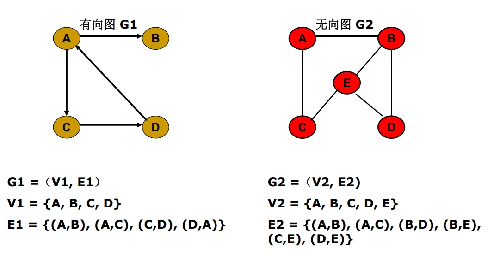
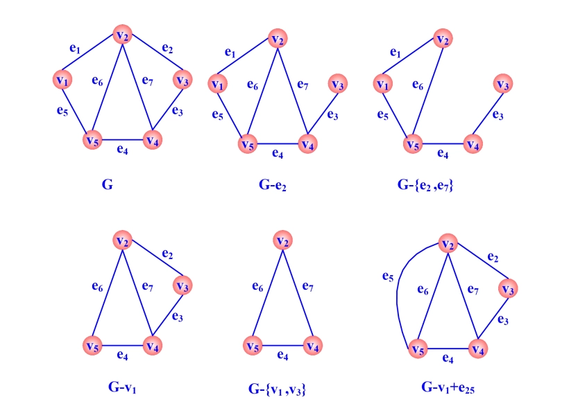
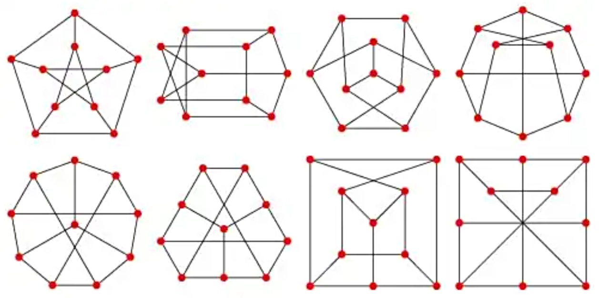
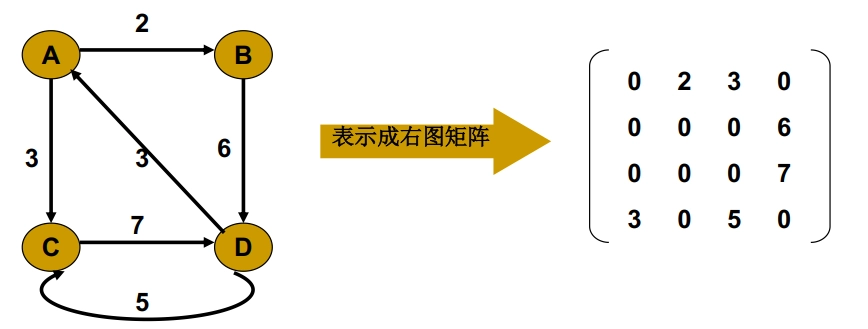

# 第一章 基本概念
## 图的概念

- **图的定义**：

	- 二元组 $(V(G),E(G))$ 称为图。

		- 其中 $V(G)$ 是非空集合，称为 **结点集**

		- $E(G)$ 是 $V(G)$ 诸结点之间 **边的集合**

		- 常用 $G=(V,E)$ 表示图。

	- **边**：用 $e_{k}=\left(v_{i},v_{j}\right)$ 表示。这时我们说 $v_{i}$ 与 $v_{j}$ 是相邻结点；$e_{k}$ 分别与 $v_{i}$，$v_{j}$ 相关联。

- **有限图与无限图**：

	- 有限图： $V$ 和 $E$ 都是有限集。

- **有向图与无向图**：

	- 有向图：$E$ 中的每条边都是有方向的，称为 **有向边**（或弧）。

		- 如果 $e_{k}$ 是有向边，称 $v_{i}$ 是 $e_{k}$ 的始点，$v_{j}$ 是 $e_{k}$ 的终点 ；并称 $v_{i}$ 是 $v_{j}$ 的 **直接前趋**，$v_{j}$ 是 $v_{i}$ 的 **直接后继**。

	- 无向图：$E$ 中的每条边没有方向，称为 **无向边**。

		- 如果 $e_{k}$ 是无向边，则称 $v_{i}$，$v_{j}$ 是 $e_{k}$ 的两个 **端点**。

	- 混合图：$E$ 中既有方向的边，也有没有方向的边。

## 度

- $G=(V,E)$ 的某结点 $v$ 所关联的边数称为该结点的度，用 $d(v)$ 表示。如果 $v$ 带有自环，则自环对 $d(v)$ 的贡献为 $2$。

- 有向图中由于各边都是有向边，因此每个结点 $v$ 还有其 **正度** $\left(d^{+}(v)\right)$ 和 **负度** $\left(d^{-}(v)\right)$。

	- $d^{+}(v)$ 的值是以 $v$ 为始点的边的数目

	- $d^{-}(v)$ 是以 $v$ 为终点的边的数目

	- 显然有 $d^{+}(v)+d^{-}(v)=d(v)$

## 图的类别

- **简单图**：不含重边（任意两结点间最多只有一条边）和自环的无向图或有向图称为简单图

- **空图**：没有任何边的简单图叫空图，用 $N_{n}$ 表示

- **平凡图**：只含一个结点的空图称为平凡图

- **多重图**：只与一个结点相关联的边称为 **自环**，在同一对结点之间可以存在多条边，称之为 **重边**。含有重边的图叫多重图。

- **完全图**：任何两结点间都有边的简单图称为完全图，用 $K_{n}$ 表示。

	- $K_{n}$ 中每个结点的度都是 $n-1$。

	- $K_{n}$ 的边数是 $\frac{1}{2} n(n-1)$

- **完全有向图**：一个简单有向图，其中每一对不同的顶点都只有一对边相连，称为完全有向图

- **k-正则图**：每个结点的度都相同的图，若其度均为 $k$，则称为 $k$-正则图。完全图是 $(n-1)$-正则图

- **赋权图**：如果图 $G=(V,E)$ 的每条边 $e_{k}=\left(v_{i},v_{j}\right)$ 都赋以一个实数 $w_{k}$ 作为该边的权，则称 $G$ 是赋权图。

	- 特别地，如果这些权都是正实数，就称 $G$ 是 **正权图**。

- **子图**：给定 $G=(V,E)$，如果存在另一个图 $G^{\prime}=\left(V^{\prime},E^{\prime}\right)$，满足 $V^{\prime} \subseteq V$，$E^{\prime} \subseteq E$，则称 $G^{\prime}$ 是 $G$ 的一个 **子图**。

	- **支撑子图/生成子图**：如果 $V^{\prime}=V$，就称 $G^{\prime}$ 是 $G$ 的支撑子图 或生成子图 （只能删除边，结点不变）

	- **导出子图**：如果 $V^{\prime} \subseteq V$，且 $E^{\prime}$ 包含了 $G$ 在结点子集 $V^{\prime}$ 之间的所有边，则称 $G^{\prime}$ 是 $G$ 的导出子图。（删除结点及其关联的边）

	- **平凡子图**：如果 $V^{\prime}=V$，$E^{\prime}=E$ 或者 $E^{\prime}=\varnothing$，则称为平凡子图。

## 图的性质

- **握手定理** ：设 $G=(V,E)$ 有 $n$ 个结点，$m$ 条边，则

	$$
	\sum_{v \in V(G)} d(v)=2 m
	$$

- $G$ 中度为奇数的结点必为偶数个

- 有向图 $G$ 中正度之和等于负度之和。

- 非空简单无向图中一定存在度相同的结点。

## 图的运算

- 给定两个图 $G_{1}=\left(V_{1},E_{1}\right)$，$G_{2}=\left(V_{2},E_{2}\right)$。

	- $G_{1}$ 和 $G_{2}$ 的 **并**：$G_{1} \cup G_{2}=(V,E)$

		- 其中 $V=V_{1} \cup V_{2}$，$E=E_{1} \cup E_{2}$

	- $G_{1}$ 和 $G_{2}$ 的 **交**：$G_{1} \cap G_{2}=(V,E)$

		- 其中 $V=V_{1} \cap V_{2}$，$E=E_{1} \cap E_{2}$

	- $G_{1}$ 和 $G_{2}$ 的 **对称差**：$G_{1} \oplus G_{2}= (V,E)$

		- 其中 $V=V_{1} \cup V_{2}$，$E=E_{1} \oplus E_{2}$

- 在 $G$ 中删去一个子图 $H$，指删掉 $H$ 中的各条边，记作 $G-H$

	- 特别地，对于简单图 $G$，称 $K_{n}-G$ 为 $G$ 的 **补图**，记作 $\bar{G}$。

- 从 $G$ 中删去某个结点 $v$ 及其关联的边所得的图记作 $G-v$

	- $G-v$ 是 $G$ 的导出子图

- 从 $G$ 中删去某特定的边 $e = (u, v)$ 所得的图记作 $G-e$

	- $G-e$ 是 $G$ 的支撑子图

- 在 $G$ 中增加某条边 $e_{i j}$，可记作 $G+e_{i j}$

## 图的邻点集

- **邻点集**：如果 $G$ 是无向图，则 $\Gamma(v)={u \mid (v,u) \in E}$ 称为 $v$ 的邻点集

	- 设 $v$ 是有向图 $G$ 的一个结点，则

		- $$
		    \Gamma^{+}(v)=\{u \mid(v,u) \in E\}
		    $$

		    称为 $v$ 的 **直接后继集** 或 **外邻集**

		- $$
		    \Gamma^{-}(v)=\{u \mid(u,v) \in E\}
		    $$

		    称为 $v$ 的 **直接前趋集** 或 **内邻集**

## 图的同构

- **同构图**：两个图 $G_{1}=\left(V_{1},E_{1}\right)$，$G_{2}=\left(V_{2},E_{2}\right)$，如果 $V_{1}$ 和 $V_{2}$ 存在双射函数 $\mathrm{f}$，且 $(u,v) \in E_{1}$，当且仅当 $(f(u),f(v)) \in E_{2}$ 时，并且这两条边的重数相同，称 $G_{1}$ 和 $G_{2}$ **同构**，记作： $\boldsymbol{G}_{\mathbf{1}} \cong \boldsymbol{G}_{\mathbf{2}}$

- $G_{1} \cong G_{2}$ 的 **必要条件** ：

	- $\left|V\left(G_{1}\right)\right|=\left|V\left(G_{2}\right)\right|$，$\left|E\left(G_{1}\right)\right|=\left|E\left(G_{2}\right)\right|$

	- $G_{1}$ 和 $G_{2}$ 结点度的非增序列相同

	- 存在同构的导出子图

## 图的代数表示
### 邻接矩阵

- 邻接矩阵表示了结点之间的邻接关系。

- 有向图的邻接矩阵 $\boldsymbol{A}$ 是一个 $n$ 阶方阵，其元素为 

	$$
	a_{i j}=\left\{\begin{aligned} 1,&\quad \left(v_{i},v_{j}\right) \in E \\ 0,&\quad otherwise \end{aligned}\right.
	$$

- 邻接矩阵 $\boldsymbol{A}$ 第 $i$ 行非零元的数目恰是 $v_i$ 的正度，第 $j$ 列非零元的数目是 $v_j$ 的负度。

- 邻接矩阵 **可以表示自环，但无法表示重边**。

- 无向图的邻接矩阵，是一个对称矩阵

### 权矩阵

- 赋权图常用权矩阵 $\boldsymbol{A}$ 进行表示。其元素

	$$
	a_{i j}= \left\{\begin{aligned} w_{i j},&\quad \left(v_{i},v_{j}\right) \in E \\ 0,&\quad otherwise \end{aligned}\right.
	$$

- 权矩阵实际即为带权值的邻接矩阵

- 权矩阵 **可以表示自环，但无法表示重边**。

- 无向图的权矩阵，是一个对称矩阵

### 关联矩阵

- 关联矩阵表示结点与边之间的关联关系。

- 有向图 $\boldsymbol{G}$ 的关联矩阵 $\boldsymbol{B}$ 是 $n \times m$ 的矩阵，当给定结点和边的编号之后，其元素

	$$
	b_{i j}=\left\{\begin{aligned} 1,&\quad e_{j}=\left(v_{i},v_{k}\right) \in E \\ -1,&\quad e_{j}=\left(v_{k},v_{i}\right) \in E \\ 0, &\quad otherwise \end{aligned}\right.
	$$

- 每列两个非零元：-1，1

- 第 $i$ 行非零元的数目恰是结点 $v_{i}$ 的度，其中 $1$ 元的数目是 $d^{+}\left(v_{i}\right)$，$-1$ 元的数目是 $d^{-}\left(v_{i}\right)$。

- 类似地，无向图也有其关联矩阵 $\boldsymbol{B}$，但其中不含 $-1$ 元素。

	$$
	b_{i j}=\left\{\begin{aligned} 1,&\quad e_{j}=\left(v_{i},v_{k}\right) \in E \\ 0, &\quad otherwise \end{aligned}\right.
	$$

- 关联矩阵 **可以表示重边，但无法表示自环**。

- 如果可以用邻接矩阵/关联矩阵表示某个图 $G$，则表示是 **唯一** 的。

### 邻接表

- 邻接表是图的另一种表示方法。它是一个结点集 $V$ 的数组，每个结点 $v_{i}$ 都有一个链表，链表中存储与 $v_{i}$ 相邻的结点。

	- 对于有向图，链表中存储的是 $v_{i}$ 的直接后继集（外邻集）；

	- 对于无向图，链表中存储的是 $v_{i}$ 的邻点集。

- 表结点的结构：

	- 邻接点的编号

	- 边权值（如果是赋权图）

	- 指向下一个邻接点的指针

- 特点：

	- 便于增加和删除边

	- **可以表示重边和自环**

	- **可以唯一表示任意一个图**

	- 所需存储空间较小

