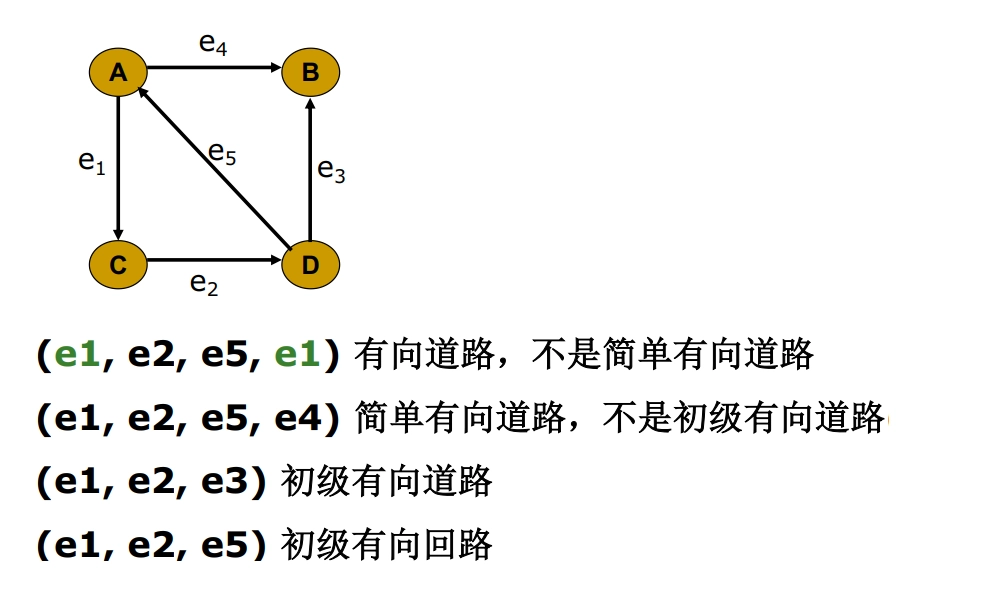
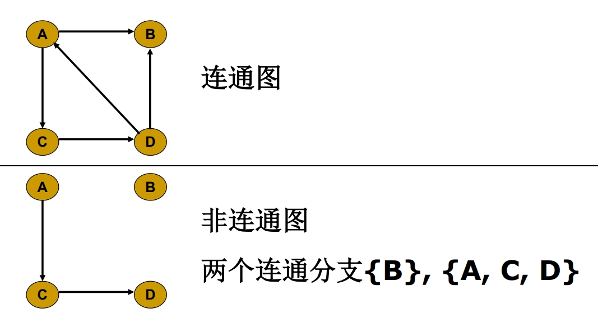
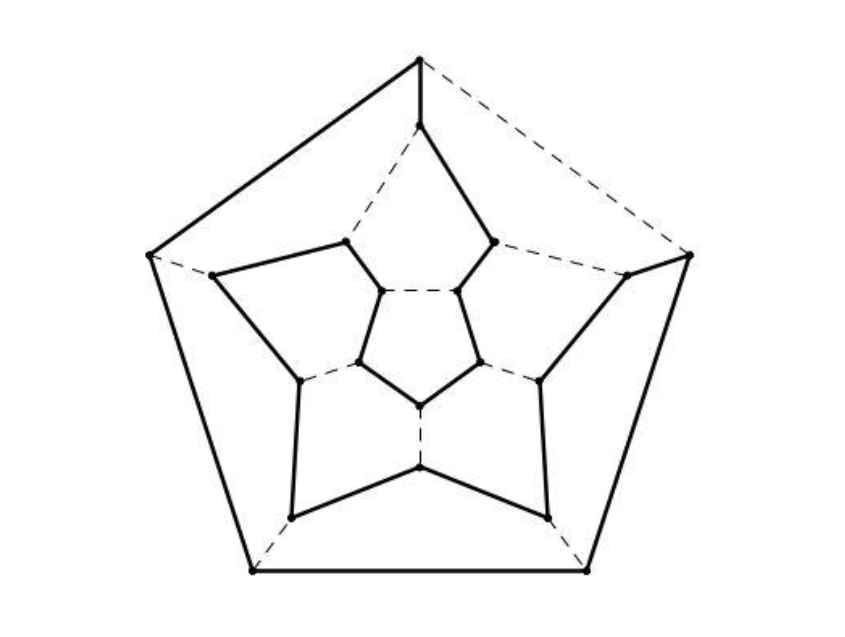

# 第二章 道路与回路
## 道路与回路

- **有向图**
	- **道路与回路的定义**：
		- **有向道路**：有向图 $G=(V,E)$ 中，若边序列 $P=\left(e_{i 1},e_{i 2},\cdots,e_{i q}\right)$，其中 $e_{i k}=\left(v_{l},v_{j}\right)$ 满足 $v_{l}$ 是 $e_{i k-1}$ 的终点，$v_{j}$ 是 $e_{i k+1}$ 的始点，就称 $P$ 是 $G$ 的一条有向道路。
		- **有向回路**：如果 $e_{i q}$ 的终点也是 $e_{i 1}$ 的始点，则称 $P$ 是 $G$ 的一条有向回路。
	- 简单/初级有向道路/回路：
		- **简单有向道路和简单有向回路**：如果 $P$ 中的边没有重复出现，则分别称为简单有向道路和简单有向回路。
		- **初级有向道路和初级有向回路**：如果在 $P$ 中结点也不重复出现，又分别称它们是初级有向道路和初级有向回路，简称为路和回路。
		- 显然，初级有向道路（回路）一定是简单有向道路（回路）。
	- **长度**：边的数目 $q$ 称为道路（回路）的长度。

- **无向图**
	- **道路与回路的定义**：
		- **无向道路**：无向图 $G=(V,E)$ 中，若点边交替序列 $P=\left(v_{i 1},e_{i 1},v_{i 2},e_{i 2},\cdots,e_{i q-1},v_{i q}\right)$ 满足 $v_{i k},v_{i k+1}$ 是 $e_{i k}$ 的两个端点，则称 $P$ 是 $G$ 中的一条 **链**，或 **道路**。
		- **无向回路**：如果 $v_{i q}=v_{i 1}$，则称 $P$ 是 $G$ 中的一个 **圈**，或 **回路**。
	- 简单/初级无向道路/回路：
		- **简单道路和简单回路**：如果 $P$ 中没有重复出现的边，称之为简单道路或简单回路
		- **初级道路和初级回路**：若其中结点也不重复，又称之为初级道路或初级回路
	- **长度**：边的数目 $q$ 称为道路（回路）的长度。
- **两点距离**：若 $G$ 的任意两结点 $u,v$ 之间连通，则称 $u,v$ 之间的最短道路为 **短程线**，该短程线的长度称为 $u,v$ 之间的 **距离**，记作 $d(u,v)$。若 $u,v$ 之间不连通，则 $d(u,v)=\infty$

## 图的连通性

- **连通图与非连通图**：
	- 无向图：设 $G$ 是无向图，若 $G$ 的任意两结点之间都存在道路，就称 $G$ 是连通图，否则称为非连通图
	- 有向图：如果 $G$ 是有向图，不考虑其边的方向，即视为无向图，若它是连通的，则称 $G$ 是连通图

- **极大连通子图/连通支**：若连通子图 $H$ 不是 $G$ 的任何连通子图的真子图，则称 $H$ 是 $G$ 的极大连通子图或称连通支
	- 显然 $G$ 的每个连通支都是它的导出子图
	- 任何非连通图都是 $2$ 个以上连通支的并集
	- 设 $G$ 是简单无向图，当 $m>\frac{1}{2}(n−1)(n−2)$ 时 $G$ 是连通图。
	- $G=(V, E)$ 是连通图，则 $m\ge n-1$
- **强连通**：在有向图 $G$ 中，如果两个顶点 $u$，$v$ 间有一条从 $u$ 到 $v$ 的有向路径，同时还有一条从 $v$ 到 $u$ 的有向路径，则称两个顶点强连通。
	- **强连通图**：如果有向图 $G$ 的每两个顶点都强连通，称 $G$ 是一个强连通图。
	- **强连通分量**：有向非强连通图的极大强连通子图，称为强连通分量。

## 弦

- **定义**：设 $C$ 是简单图 $G$ 中含结点数大于 $3$ 的一个初级回路，如果结点 $v_{i}$ 和 $v_{j}$ 在 $\mathrm{C}$ 中不相邻，而边 $\left(v_{i},v_{j}\right) \in \mathrm{E}(\mathrm{G})$，则称 $\left(v_{i},v_{j}\right)$ 是 $\mathrm{C}$ 的一条 **弦**。
- **性质**：
	- 若对于每一个 $v_{k} \in \mathrm{V}(\mathrm{G})$，都有 $\mathrm{d}\left(v_{k}\right) \geq 3$，则 $\mathrm{G}$ 中必含带弦的回路。
	- 在简单图中，若 $n\ge 4$ 且 $m\ge 2n-3$，则 $G$ 中含有带弦的回路。

## 极长初级道路

- **定义**：在简单图 $\mathrm{G}=(\mathrm{V},\mathrm{E})$ 中，$\mathrm{E} \neq \emptyset$，设 $P=\left(v_{0},v_{1},\cdots,v_{l}\right)$ 为 $\mathrm{G}$ 中一条初级道路，若路径的始点和终点两个端点 $v_{0}$ 和 $v_{l}$ 不与初级道路本身结点集以外的任何结点相邻，这样的初级道路称为 **极长初级道路**。
- **性质**：
	- 有向图中，初级道路始点的直接前驱集（内邻集），终点的直接后继集（外邻集），都在初级道路本身上。
	- **扩大初级道路法**：任何一条初级道路，如果不是极长初级道路，则至少有一个端点与初级道路本身以外的结点相邻，则将该结点及其相关联的边扩到新的初级道路中来，得到更新的初级道路。继续上述过程，直到变成极长初级道路为止。
		- 由一条道路扩大的极长道路不一定唯一
		- 极长初级道路不一定是图中的最长初级道路

## 二分图

- **定义**：$\mathrm{G}=(\mathrm{V},\mathrm{E})$ 是无向图，如果 $\mathrm{V}(\mathrm{G})$ 可以划分为子集 $X$ 和 $Y$，使得所有 $e=(u,v) \in E(G)$，$u$ 和 $v$ 分属于 $\mathrm{X}$ 和 $\mathrm{Y}$，则称 $\mathrm{G}$ 为二分图。
- **性质**：
	- 二分图的子集 $X$，$Y$ 可能不唯一。
	- 如果二分图 $G$ 中存在回路，则它们是由偶数条边组成的。
	- 含 $K_{3}$ 子图的图一定不是二分图
	- $K_{n}$ 不是二分图（$n \geq 3$）
	- 如果二分图 $G$ 中存在回路，则它们都是由偶数条边组成的。
- **完全二分图/完全偶图**：$\mathrm{G}=(\mathrm{V},\mathrm{E})$ 是二分图，$\mathrm{V}(\mathrm{G})$ 划分为子集 $X$ 和 $Y$，$X$ 中任一结点与 $Y$ 中每一个结点有且只有唯一一条边相连，则称 $G$ 为完全二分图（完全偶图），记作 $\boldsymbol{K}_{m,n}$，$m=|X|$，$n=|Y|$。

## 补图

- **定义**： 设 $G=(V,E)$ 是一个简单图，则 $G$ 的补图 $\bar{G}$ 是一个简单图，其结点集 $V(\bar{G})=V(G)=V$，边集为 $E(\bar{G})= \left\{\left(v_{i},v_{j}\right) \mid v_{i},v_{j} \in V, \left(v_{i},v_{j}\right) \notin E\right\}$。

## 割点和割边

- **割点**：$G$ 图中，一结点 $u$，$G$ 减去 $u$ 后，图的连通分支数上升，则称 $u$ 为图 $G$ 的割点。  
- **割边**：$G$ 图中，一边 $e$，$G$ 减去 $e$ 后，图的连通分支数上升，则称 $e$ 为图 $G$ 的割边/桥。

## 欧拉道路与回路
### 定义与性质

- **定义**：
	- **欧拉回路/道路**：无向连通图 $G=(V,E)$ 中的一条经过所有边的简单回路（道路）称为 $G$ 的欧拉回路（道路）。
	- **欧拉图**：具有欧拉回路的图称为欧拉图。
- **性质**：
	- 无向连通图 $G$ 存在欧拉回路的充要条件是 $G$ 中各结点的度都是偶数。
	- 若无向连通图 $G$ 中只有 $2$ 个度为奇的结点，则 $G$ 存在欧拉道路。
	- 若有向连通图 $G$ 中各结点的正、负度相等，则 $G$ 存在有向欧拉回路。
	- $K_{n, m}$ 中含有欧拉道路当且仅当 $n, m$ 均为偶数。
	- 设连通图 $G=(V,E)$ 有 $k$ 个度为奇数的结点，则 $E(G)$ 可以划分为 $k/2$ 条简单道路。

### 判定（仅针对无向图）

- 如果图 $G$ 每个结点的度都是偶数，则 $G$ 存在欧拉回路。
- 如果图 $G$ 有且仅有两个结点的度为奇数，则 $G$ 存在欧拉道路，且这两个结点是欧拉道路的起点和终点。
- 其他情况下，$G$ 不存在欧拉道路或回路，但是奇数点数为 $k$ 的图 $G$ 中，存在 $k/2$ 条简单道路。

## 哈密顿道路与回路
### 定义与性质

- **定义**：
	- **哈密顿回路/道路**：无向图的一条过全部结点的初级回路（道路）称为 $G$ 的哈密顿回路（道路），简记为 $H$ 回路（道路）。
	- **哈密顿图**：具有哈密顿回路的图也称为哈密顿图。
- **性质**：
	- 哈密顿通路是经过所有结点中长度最短的通路
	- 哈密顿回路是经过所有结点中长度最短的回路

### 判定

- 哈密顿回路是初级回路，是特殊的简单回路，所以如果 $G$ 中含有重边或自环，删去它们后得到的简单图 $G'$，那么 $G$ 和 $G'$ 关于 $H$ 回路（道路）的存在性是等价的。因此，**判定 $H$ 回路存在性问题一般是针对简单图的**。

### 充分性定理

- **引理**：设 $P=(v_1, v_2, \cdots, v_l)$ 是图 $G$ 中一条极长的初级道路(即 $v_1$ 和 $v_l$ 的邻点都在 $P$ 上)而且 $d(v_1)+d(v_l)≥l$，则 $G$ 中一定存在经过结点 $v_1, v_2, \cdots, v_l$ 的初级回路。
	1. **充分性定理 1**：如果简单图 $G$ 的任意两结点 $v_{i},v_{j}$ 之间恒有 $d\left(v_{i}\right)+d\left(v_{j}\right) \geqslant n-1$，则 $G$ 中存在哈密顿道路。
	2. **充分性定理 1 推论**：若简单图 $G$ 的任意两结点 $v_{i}$ 和 $v_{j}$ 之间恒有 $d\left(v_{i}\right)+d\left(v_{j}\right) \geqslant n$，则 $G$ 中存在哈密顿回路。
	3. **充分性定理 1 推论**：若简单图 $G$ 每个结点的度都大于等于 $\frac{n}{2}$，则 $G$ 有 $H$ 回路。
- **引理**：若 $v_{i}$ 和 $v_{j}$ 是简单图 $G$ 的不相邻结点，且满足 $d(v_{i})+d(v_{j})≥n$，则令 $G' =G+(v_{i}, v_{j})$。对 $G'$ 重复上述过程，直至不再有这样的结点对为止。最终得到的图为 $G$ 的闭合图，记作 $C(G)$。则简单图 $G$ 的闭合图 $C(G)$ 是唯一的
	1. **充分性定理 2**：设 $G$ 是简单图，$v_{i},v_{j}$ 是不相邻结点，且满足 $d\left(v_{i}\right)+d\left(v_{j}\right) \geqslant n_{\circ}$ 则 $G$ 存在 $H$ 回路的充要条件是 $G+\left(v_{i},v_{j}\right)$ 有 $H$ 回路。
	2. **充要条件**：简单图 $G$ 存在哈密顿回路的充要条件是其闭合图存在哈密顿回路。
	3. **充要条件推论**：设 $G(n \geqslant 3)$ 是简单图 $K_{n}$，若 $C(G)$ 是完全图，则 $G$ 有 $H$ 回路。

### 必要性定理

- **必要性定理 1**：如无向图 $G=(V,E)$ 是 $H$ 图，$V_{1}$ 是 $V$ 的任意非空子集，则 $p\left(G-V_{1}\right) \leq\left|V_{1}\right|$，其中 $p\left(G-V_{1}\right)$ 是从 $\mathrm{G}$ 中删除 $V_{1}$ 后的连通支的数目。
- **必要性定理 2**：如无向图 $G=(V,E)$ 存在 $\mathrm{H}$ 道路，$V_{1}$ 是 $V$ 的任意非空子集，则 $p\left(G-V_{1}\right) \leq\left|V_{1}\right|+1$。
- **必要性定理推论**：
	- 有割点的图一定不是 $H$ 图
	- 如无向图 $G=(V,E)$ 是二分图，
		- 两边结点数不相同，则 $G$ 不存在 $H$ 回路
		- 两边结点数不相同也不相差 $1$，则 $G$ 不存在 $H$ 道路
	- $K_{n, m}$ 中含有哈密顿道路当且仅当 $|n-m| \leq 1$
	- $K_{n, m}$ 中含有哈密顿回路当且仅当 $n=m$

