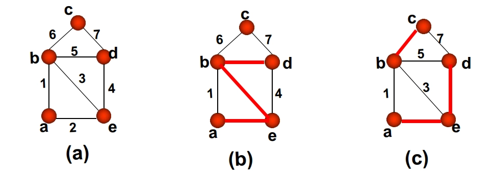
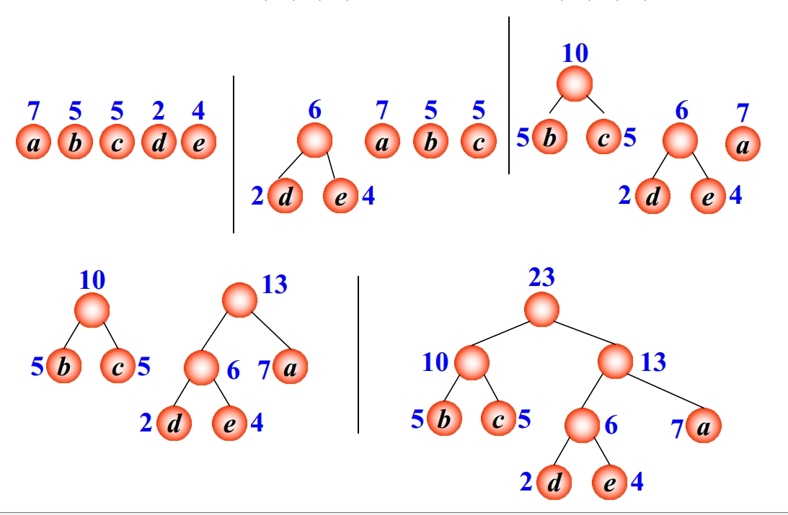
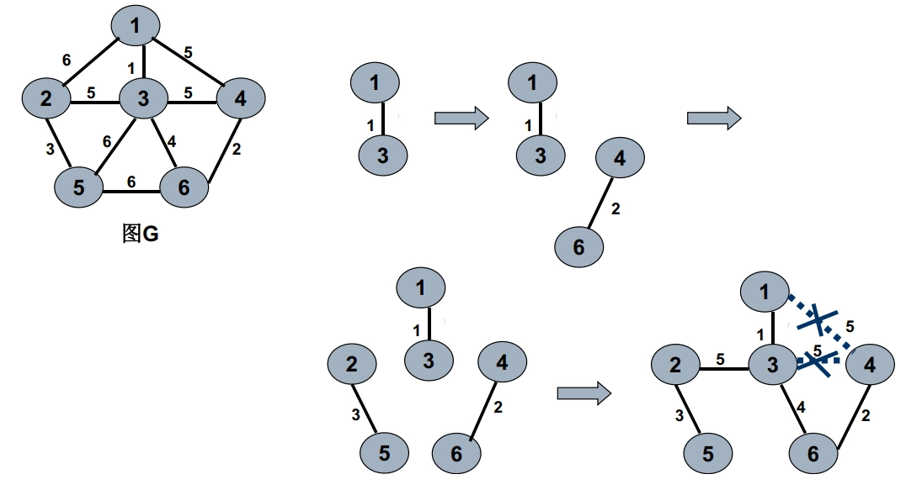
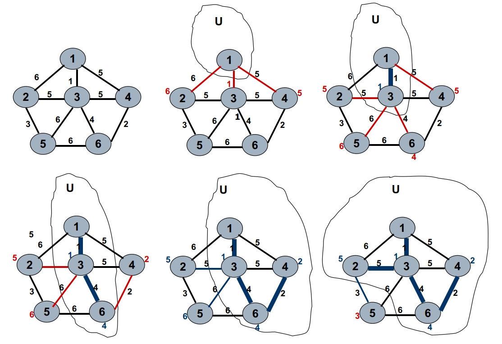

# 第三章 树
## 树的有关定义

- **树与林**：
	- **林**：给定一个图 $G=(V,E)$，如果它不含任何回路，我们就叫它是林。
	- **树**：如果 $G$ 又是连通的，即这个林只有一个连通支，就称它是树。
		- 一个不含任何回路的连通图称为 **树**，用 $T$ 表示。
		- $T$ 中的边称为 **树枝**，度为 $1$ 的结点称为 **树叶**。
- **割边**：树的每条边都不会属于任何回路。这样的边叫割边。
	- 设 $e$ 是 $G$ 的一条边，若 $G^{\prime}=G-e$ 比 $G$ 的连通支数增加，则称 $e$ 是 $G$ 的一条 **割边**。
	- $e=(u,v)$ 是 **割边**，当且仅当 $e$ 不属于 $G$ 的任何回路。
- **性质**：设 $T$ 是结点数为 $n \geqslant 2$ 的树，则下列性质等价：
	- $T$ 连通且无回路。
	- $T$ 连通且每条边都是割边。
	- $T$ 连通且有 $n-1$ 条边。
		- 树是极小的连通图，减少一条边就不连通
	- $T$ 有 $n-1$ 条边且无回路。
	- $T$ 的任意两结点间有唯一道路。
	- $T$ 无回路，但在任两结点间加上一条边后恰有一个回路。
		- 树是极大的不含回路的连通图。
- 树 $T$ 中一定存在树叶结点。

## 生成树

- **支撑树/生成树**：如果 $T$ 是图 $G$ 的支撑子图，而且又是一棵树，则称 $T$ 是 $G$ 的一棵支撑树，或称生成树，又简称为 $G$ 的树。
- 任何无向连通图 $G$ 都含有生成树。
	- 一个连通图的生成树可能不唯一。

- **余树**：给定图 $G$ 的一棵树 $T$，我们称 $G-T$，即 $G$ 删去 $T$ 中各边后的子图为 $T$ 的余树。
	- 余树不一定连通，也不一定无回路，因而余树不一定是树，更不一定是生成树。

## 二叉树

- **定义**：除叶子结点外，其余结点的正度最多为 $2$ 的外向树称为 **二叉树**。
- **性质**：
	- 二叉树的结点集是有限集合，它或者为空，或者由根结点及两棵互不相交的左右子树的结点集构成，该左右子树也均为二叉树
	- 左子树为根结点左侧分叉的子树，右子树为根结点右侧分叉的子树，其 **严格区分**，即使只有一棵子树也要说明是左子树还是右子树；左右子树交换位置，得到一棵新的二叉树
	- 二叉树的第 $i$ 层至多有 $2^{(i−1)}$ 个结点
	- 深度为 $k$ 的二叉树至多有 $2^k−1$ 个结点（根结点的深度为 $1$）
- **满二叉树**：一棵高度（即结点层数）为 $k$，并具有 $2^k−1$ 个结点的二叉树，称为满二叉树.
	- 一棵二叉树中任意一层的结点个数都达到了最大值
- **完全二叉树**：若设二叉树的深度为 $h$，除第 $h$ 层外，其它各层 $1~h-1$ 的结点数都达到最大个数，第 $h$ 层所有的结点都连续集中在最左边，这就是完全二叉树。
	- 在满二叉树的最底层自右至左依次去掉若干个结点得到的二叉树
	- 满二叉树一定是完全二叉树，但完全二叉树不一定是满二叉树
	- 所有的叶结点都出现在最低的两层上。
	- 对任一结点，如果其右子树的高度为 $k$，则其左子树的高度为 $k$ 或 $k+1$。

## 哈夫曼树

- **赋权二叉树**：如果二叉树 $T$ 的每个叶子结点 $v_i$ 都赋予一个正实数 $w_i$，则称 $T$ 为赋权二叉树
- **带权路径总长度**：从根到树叶 $v_i$ 的路径 $P(v_0, v_i)$ 所包含的边数计为该路径的长度 $l$，这样二叉树 $T$ 带权的路径总长度为：

	$$
	WPL = \sum_{i} l_i w_i, \quad v_i \text{ 是树叶}
	$$

- **最优二叉树/哈夫曼树**：给定叶子结点数目以及每个叶子结点对应的权值，可以构造许多不同的赋权二叉树。在这些二叉树中，带权路径总长最小的二叉树，称为最优二叉树，又称哈夫曼树。

### Huffman 算法

1. 对 $n (n \geq 2)$ 个权值进行排序，满足 $w_{i1} \leq w_{i2} \leq \cdots \leq w_{in}$
2. 计算 $w_i = w_{i1} + w_{i2}$ 作为中间结点 $v_i$ 的权，$v_i$ 的左儿子是 $v_{i1}$，右儿子是 $v_{i2}$。在权序列中删去 $w_{i1}$ 和 $w_{i2}$，加入 $w_i$，$n \leftarrow n - 1$，若 $n = 1$，结束。否则转 1。

## 最短树（最小生成树）

- **最小/最大生成树**：在赋权连通图 $G$ 中，其总长最小和最大的生成树，就被称为最短树和最长树，亦或称为最小生成树和最大生成树。
- **充要条件**：$T=(V, E' )$ 是赋权连通图 $G=(V, E)$ 的最短树，当且仅当对任意的余树边 $e \in E - E'$，回路 $C_e \subseteq E' + e$，满足其边权 $w(e) \geq w(a), a \in C_e (a \neq e)$。

### Kruskal 算法

- **基本思想**：不断往 $T$ 中加入当前的最短边 $e$，如果此时会构成回路，那么它一定是这个回路中的最长边，删之。直至最后达到 $n-1$ 条边为止。这时 $T$ 中不包含任何回路，因此是树。
- **Kruskal 算法**、
	1. $T \leftarrow \emptyset$
	2. 当 $|T| < n - 1$ 且 $E \neq \emptyset$ 时，
		1. $e \leftarrow E$ 中最短边.
		2. $E \leftarrow E - e$.
		3. 若 $T + e$ 无回路, 则 $T \leftarrow T + e$.

	3. 若 $|T| < n - 1$ 打印” 非连通” , 否则输出最短树
- 计算复杂度：$O(m + p \cdot \log m)$，其中 $m$ 为边数，$p$ 是迭代次数

### Prim 算法

- **基本思想**：首先任选一结点 $v_0$ 构成集合 $U$，然后不断在 $V - U$ 中选一条到 $U$ 中最短的边 $(u,v)$（其中 $u \in V - U, v \in U$）进入树 $T$，并且 $U \leftarrow U + u$，直到 $U = V$。
- **Prim 算法**：
	1. $t \leftarrow v_1, T \leftarrow \emptyset, U \leftarrow \{t\}$
	2. While $U \neq V$ do
		1. $w(t, u) = \min_{v \in V - U} \{w(t, v)\}$
		2. $T \leftarrow T + e(t, u)$
		3. $U \leftarrow U + u$
		4. For $v \in V - U$ do
			- $w(t, v) \leftarrow \min \{w(t, v) | t \in U\}$

