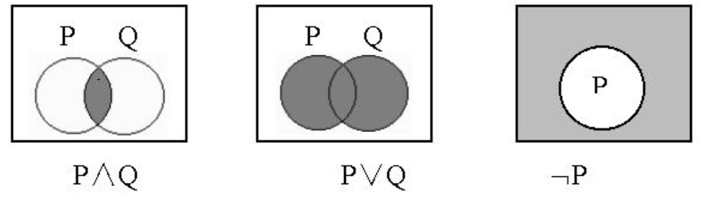
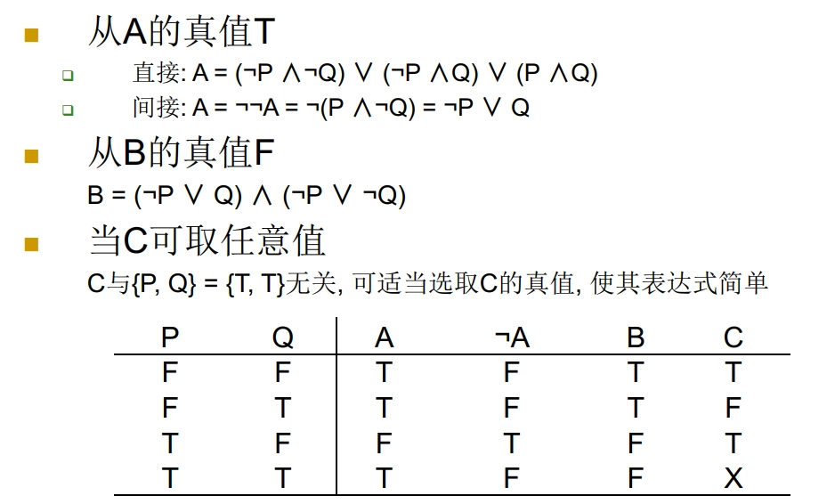
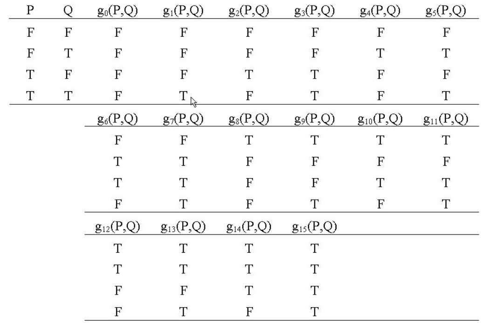
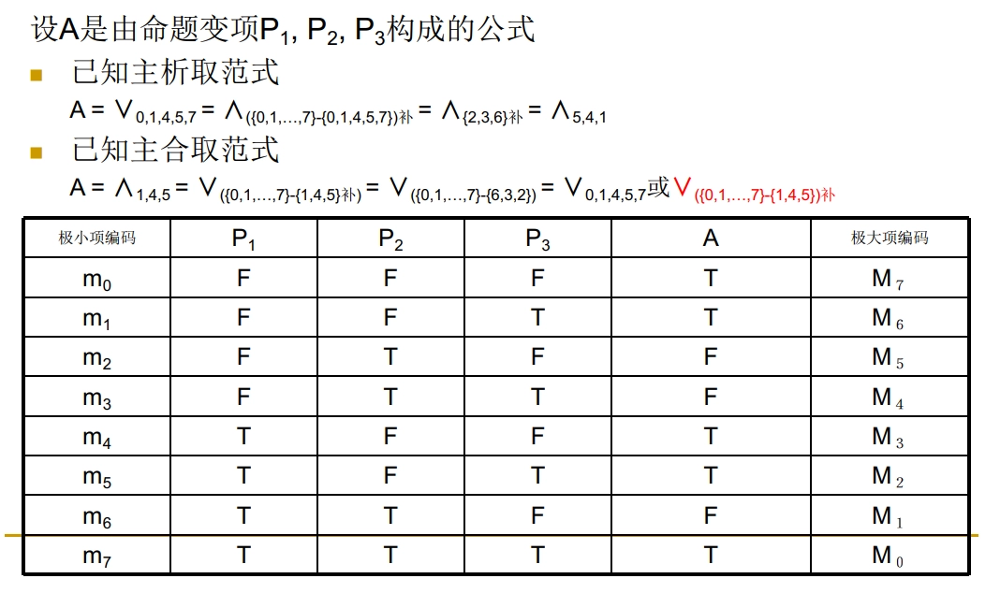

# 第二章 命题逻辑的等值和推演运算

## 等值定理

- **等值的定义**：给定两个命题公式 $A$ 和 $B$，而 $P_{1},\cdots,P_{n}$ 是出现于 $A$ 和 $B$ 中的所有命题变项，那么公式 $A$ 和 $B$ 共有 $2^{n}$ 个解释，若在其中的任一解释下，公式 $A$ 和 $B$ 的真值都相等，就称 $A$ 和 $B$ 是**等值**的（或称**等价**），记作 $A=B$ 或 $A \Leftrightarrow B$
	- 可以根据真值表来判明任何两个公式是否是等值的
- **等值定理**：对公式 $A$ 和 $B$，$A=B$ 的充分必要条件是 $A \leftrightarrow B$ 是重言式
- **等价关系**：$＝$ 作为逻辑关系符是一种等价关系，$A = B$ 是表示公式 $A$ 与 $B$ 的一种关系。 这种关系具有三个性质:
	1. 自反性：$A = A$
	2. 对称性：若 $A = B$，则 $B = A$
	3. 传递性：若 $A = B$，$B = C$，则 $A = C$

## 等值公式
### 基本等值公式（命题定律）

- 双重否定律

	$$
	\neg \neg P=P
	$$

- 结合律

	$$
	\begin{aligned} (P \vee Q) \vee R &= P \vee(Q \vee R)\\\ (P \wedge Q) \wedge R &= P \wedge(Q \wedge R)\\ (P \leftrightarrow Q) \leftrightarrow R &= P \leftrightarrow(Q \leftrightarrow R) \end{aligned}
	$$

- 交换律

	$$
	\begin{aligned} P \vee Q &= Q \vee P \\ P \wedge Q &= Q \wedge P \\ P \leftrightarrow Q &= Q \leftrightarrow P \end{aligned}
	$$

- 分配律

	$$
	\begin{aligned} P \vee(Q \wedge R) &= (P \vee Q) \wedge(P \vee R) \\ P \wedge(Q \vee R) &= (P \wedge Q) \vee(P \wedge R) \\ P \rightarrow(Q \rightarrow R) &= (P \rightarrow Q) \rightarrow(P \rightarrow R) \\ P \leftrightarrow(Q \leftrightarrow R) &\neq(P \leftrightarrow Q) \leftrightarrow(P \leftrightarrow R) \end{aligned}
	$$

- 等幂律（恒等律）

	$$
	\begin{aligned} P \vee P &= P \\ P \wedge P &= P \\ P \rightarrow P &= T \\ P \leftrightarrow P &= T \end{aligned}
	$$

- 吸收律

	$$
	\begin{aligned} P \vee(P \wedge Q) &= P \\ P \wedge(P \vee Q) &= P \end{aligned}
	$$

- 摩根律

	$$
	\begin{aligned} \neg(P \vee Q) &= \neg P \wedge \neg Q \\ \neg(P \wedge Q) &= \neg P \vee \neg Q \end{aligned}
	$$

	对蕴涵词；双条件词作否定有

	$$
	\begin{aligned} \neg(P \rightarrow Q) &= P \wedge \neg Q \\ \neg(P \leftrightarrow Q) &= \neg P \leftrightarrow Q\\ &= P \leftrightarrow \neg Q\\ &= (\neg P \wedge Q) \vee(P \wedge \neg Q) \end{aligned}
	$$

- 同一律

	$$
	\begin{aligned} P \vee F &= P \\ P \wedge T &= P \\ T \rightarrow P &= P \\ T \leftrightarrow P &= P\\ P \rightarrow F &= \neg P \\ F \leftrightarrow P &= \neg P \end{aligned}
	$$

- 零律

	$$
	\begin{aligned} P \vee T &= T \\ P \wedge F &= F\\ P \rightarrow T &= T \\ F \rightarrow P &= T \end{aligned}
	$$

- 补余律

	$$
	\begin{aligned} P \vee \neg P &= T \\ P \wedge \neg P &= F\\ P \rightarrow \neg P &= \neg P \\ \neg P \rightarrow P &= P \\ P \leftrightarrow \neg P &= F \end{aligned}
	$$

### Venn 图

- 将 $P, Q$ 理解为某总体论域上的子集合，并规定：
	- $P \wedge Q$ 为两集合的公共部分(交集合)
	- $P \vee Q$ 为两集合的全部(并集合)
	- $\neg P$ 为总体论域(如矩形域)中 $P$ 的余集

### 常用等值公式

- $P\rightarrow Q=\neg P\vee Q$
- $P\rightarrow Q=\neg Q\rightarrow \neg P$
- $P\rightarrow (Q\rightarrow R)=(P \wedge Q)\rightarrow R$
- $P \leftrightarrow Q = (P\wedge Q)\vee(\neg P\wedge \neg Q)$
- $P \leftrightarrow Q = (P\vee \neg Q)\wedge(\neg P\vee Q)$
- $P \leftrightarrow Q = (P\rightarrow Q)\wedge(Q\rightarrow P)$
- $P\rightarrow (Q\rightarrow R)=Q\rightarrow (P\rightarrow R)$
- $(P\rightarrow R)\wedge (Q\rightarrow R)=(P \vee Q)\rightarrow R$
- $P \leftrightarrow Q = \neg P \leftrightarrow \neg Q$
- 归谬论：$(P\rightarrow Q)\wedge(P\rightarrow\neg Q) = \neg P$

### 置换规则

- **置换的定义**；对公式 $A$ 的子公式，用与之**等值**的公式代换称为**置换**
- **置换规则**
	- 公式置换后，$A$ 化为公式 $B$，必有 $A=B$
	- 当 $A$ 是重言式时，置换后的公式 $B$ 必也是重言式。
- 置换与代入的区别：
	- 置换只要求 $A$ 的某一子公式作代换，置换规则被替换的不一定是简单命题
	- 等值必须对所有同一的子公式都作代换，代入规则被替换的只能是简单命题

## 命题公式与真值表关系
### T 列写

- **T 列写**：各项间用 $\vee$，每项内用 $\wedge$

	$$
	A=(\cdots)_1 \vee (\cdots)_2 \vee (\cdots)_3
	$$

- 每项内书写方法：
	- 例：真值表中 $P=T$ 且 $Q=F$ 等价于 $P \wedge \neg Q=T$
- 简化方法： 有时 $A$ 的表达通过 $\neg A$ 来描述

### F 列写

- **F 列写**：各项间用 $\wedge$，每项内用 $\vee$

	$$
	A=(\cdots)_1 \wedge (\cdots)_2 \wedge (\cdots)_3
	$$

- 每项内书写方法：
	- 例：真值表中 $P=T$ 且 $Q=F$ 等价于 $\neg P \vee Q=F$
- 简化方法： 有时 $A$ 的表达通过 $\neg A$ 来描述

## 联结词的完备集
### 命题联结词的个数

- 按照合式公式的定义，由命题变项和命题联结词可以构造出无限多个合式公式.可把所有的合式公式加以分类，将等值的公式视为同一类，从中选一个作代表称之为**真值函项**。对一个真值函项就有一个联结词与之对应。
- **一元联结词**是联结一个命题变项的，如 $P$。它取值只有真假 $2$ 种情形，于是联结词作用于 $P$，可建立 $2^2=4$ 种不同的真值函项，相应的可定义出四个不同的一元联结词 $f_0,f_1,f_2,f_3$

	| $P$ | $f_0(P)$ | $f_1(P)$ | $f_2(P)$ | $f_3(P)$ |
	|-----|----------|----------|----------|----------|
	|  T  |	T	 |	F	 |	T	 |	F	 |
	|  F  |	F	 |	T	 |	F	 |	T	 |

	- $f_0(P) = F$ (永假式)
	- $f_1(P) = P$ (P 自身)
	- $f_2(P) = \neg P$ (否定词)
	- $f_3(P) = T$ (永真式)

- **二元联结词**是联结两个命题变项的，如 $P$ 和 $Q$。它取值有真假 $4$ 种情形，于是联结词作用于 $P$ 和 $Q$，可建立 $2^4=16$ 种不同的真值函项，相应的可定义出 $16$ 个不同的二元联结词 $f_{00},f_{01},\ldots,f_{15}$

- **对于 $n$ 个命题变元，有 $2^{2^n}$ 个不同的个真值函项**

### 联结词的完备集

- **定义**：如果对任一命题公式都有由 $\mathrm{C}$ 中的联结词表示出来的公式与之等值，就说 $\mathrm{C}$ 是完备的联结词集合，或说 $\mathrm{C}$ 是联结词的**完备集**
- **完备集**
	- 显然全体联结词的无限集合是完备的
	- $\{\neg,\vee,\wedge\}$ （不独立）
	- $\{\neg, \vee\}$ （独立）
	- $\{\neg, \wedge\}$ （独立）
	- $\{\neg, \rightarrow\}$ （独立）
	- $\{\uparrow\}$ （独立）
	- $\{\downarrow\}$ （独立）
- **不完备**
	- $\{\neg\}$
	-  $\{\vee, \wedge\}$
	- $\{\vee, \wedge, \rightarrow, \leftrightarrow\}$ 的任何子集都是不完备的
	- $\{\neg, \leftrightarrow\}$ 的任何子集也是不完备的
	- 如果一个联结词的集合是不完备的，那么它的任何子集都是不完备的
- **最小的联结词的完备集——基底**：完备的联结词集合的联结词是独立的，也就是说这些联结词不能相互表示。
	- 只含一个联结词的:
		- NK；NA
	- 含两个联结词的:
		- N,C；N,K；N,A；N,NC；F,C；T,NC；C,NE；E,NC；C,NC
	- 含三个联结词的:
		- F,K,E；F,A,E；T,K,NE；T,A,NE；K,E,NE；A,E,NE
	- 其中：
		- A=$\vee$
		- K=$\wedge$
		- E=$\leftrightarrow$
		- C=$\rightarrow$
		- N=$\neg$

## 对偶式

- **对偶式**：将 $A$ 中出现的 $\vee,\wedge,T,F$ 分别以 $\wedge,\vee,F,T$ 代换，得到公式 $A^{\star}$，则称 $A^{\star}$ 是 $A$ 的对偶式，或说 $A$ 和 $A^{\star}$ 互为对偶式
- **内否式**：若 $A=A\left(P_{1},\cdots,P_{n}\right)$，令 $A$ 的内否式 $A^{-}=A\left(\neg P_{1},\cdots,\neg P_{n}\right)$
- **定理**：
	- $\neg\left(A^{\star}\right)=(\neg A)^{\star}$，$\neg\left(A^{-}\right)=(\neg A)^{-}$
	- $\left(A^{\star}\right)^{\star}=A$，$\left(A^{-}\right)^{-}=A$
	- $\neg A=A^{\star-}=A^{-\star}$
	- 其他：
		- $(A \vee B)^{\star}=A^{\star} \wedge B^{\star}$
		- $(A \wedge B)^{\star}=A^{\star} \vee B^{\star}$
		- $(A \vee B)^{-}=A^{-} \vee B^{-}$
		- $(A \wedge B)^{-}=A^{-} \wedge B^{-}$
	- 若 $A=B$，必有 $A^{\star}=B^{\star}$
	- 若 $A \rightarrow B$ 永真，必有 $B^{\star} \rightarrow A^{\star}$ 永真
	- $A$ 与 $A^{-}$ 同永真，同可满足；$\neg A$ 与 $A^{\star}$ 同永真，同可满足

## 范式
### 范式

- 相关概念：
	- **范式**：一种命题公式的统一标准形式
	- **文字**：简单命题 $P$ 及其否定式 $\neg P$ 统称为文字
	- **合取式**：有限个文字的合取称为合取式（也称**短语** ）
	- **析取式**：有限个文字的析取称为析取式（也称**子句** ）
	- **互补对**：$P$ 与 $¬P$ 称为互补对
	- **析取范式**：有限个合取式的析取式，形如 $A_{1} \vee A_{2} \vee \cdots \vee A_{n}$，其中 $A_{i}(i=1,\cdots,n)$ 为合取式
	- **合取范式**：有限个析取式的合取式，形如 $A_{1} \wedge A_{2} \wedge \cdots \wedge A_{n}$，其中 $A_{i}(i=1,\cdots,n)$ 为析取式
- **范式定理**：任一命题公式都存在与之等值的合取范式和析取范式
- **求范式的步骤**：
	1. 消去已给公式中的联结词 $\rightarrow$ 和 $\leftrightarrow$。这可利用如下等值式：

		$$
		\begin{array}{c} A \rightarrow B=\neg A \vee B \\ A \leftrightarrow B=(\neg A \vee B) \wedge(A \vee \neg B) \\ =(A \wedge B) \vee(\neg A \wedge \neg B) \end{array}
		$$

	2. 重复使用摩根律和双重否定律，把否定词内移到直接作用于命题变项上。这可利用等值式：

		$$
		\begin{array}{c} \neg(A \wedge B)=\neg A \vee \neg B \\ \neg(A \vee B)=\neg A \wedge \neg B \\ \neg \neg A=A \end{array}
		$$

		将所有的否定词，都内移到命题变项前，这也是范式的要求

	3. 重复使用分配律的等值变换。这可利用等值式：

		$$
		\begin{array}{l} A \wedge(B \vee C)=(A \wedge B) \vee(A \wedge C) \\ A \vee(B \wedge C)=(A \vee B) \wedge(A \vee C) \end{array}
		$$

		将公式化成一些合取式的析取，或化成一些析取式的合取，都必须使用分配律来实现

- **范式功能**
	- 判断重言式：合取范式中所有析取式都有互补对
	- 判断矛盾式：析取范式中所有合取式都有互补对
	- 判断公式等值：范式不唯一，引入唯一主范式，便于判断公式等值

### 主析取范式

- **极小项定义与编码**：$Q_1\wedge \cdots \wedge Q_n$ 是由 $n$ 个命题变项 $P_1, \cdots, P_n$ 组成的公式，其中 $Q_i=P_i$ 或 $\neg P_i$，我们称其为极小项，一般用 $m_j$ 表示 $(0\leq j\leq 2^{n}-1)$
	- 例： $P_1, P_2$ 的极小项有四个
		- $\neg P_1\wedge \neg P_2 (m_0)$
		- $\neg P_1\wedge P_2 (m_1)$
		- $P_1\wedge \neg P_2 (m_2)$
		- $P_1\wedge P_2 (m_3)$
	- 极小项必须含有 $Q_1, \cdots, Q_n$ 全部 $n$ 个文字
- **主析取范式定义**：仅由极小项构成的析取式
- **主析取范式唯一性定理**：任一含有 $n$ 个命题变项的公式， 都有唯一一个与之等值的恰仅含这 $n$ 个命题变项的主析取范式
- **提取主析取范式**：
	- 由真值表写主析取范式：从 T 写
	- 由析取范式写主析取范式：填满命题变项法, 永真式
- **极小项性质**：
	- 所有可能的极小项个数：$2^{n}$
	- 每个极小项只在一个解释下为真，对于每个解释只有一个极小项为真
	- 极小项两两不等值，而且 $m_{i} \wedge m_{j}=\mathrm{F}(i \neq j)$
	- 任一含有 $n$ 个变项的公式，都可由 $k$ 个 $\left(k \leqslant 2^{n}\right)$ 极小项的析取来表示，或说所有的极小项可建立一个“坐标系”
	- 恰由 $2^{n}$ 个极小项的析取构成的公式，必为重言式

	    $$
	    \vee_{i=0}^{2^{n}-1} m_{i}=\mathrm{T}
	    $$

	- 若 $A$ 由 $k$ 个极小项的析取组成，那么其余的 $2^{n}-k$ 个极小项的析取必是公式 $\neg A$

### 主合取范式

- **极大项定义与编码**：$Q_1\vee \cdots \vee Q_n$ 是由 $n$ 个命题变项 $P_1, \cdots, P_n$ 组成的公式，其中 $Q_i=P_i$ 或 $\neg P_i$，我们称其为极大项，一般用 $M_j$ 表示 $(0\leq j\leq 2^{n}-1)$
	- 例： $P_1, P_2$ 的极大项有四个
		- $\neg P_1\vee \neg P_2 (M_0)$
		- $\neg P_1\vee P_2 (M_1)$
		- $P_1\vee \neg P_2 (M_2)$
		- $P_1\vee P_2 (M_3)$
	- 极大项必须含有 $Q_1, \cdots, Q_n$ 全部 $n$ 个文字
- **主合取范式定义**：仅由极大项构成的合取式
- **主合取范式唯一性定理**：任一含有 $n$ 个命题变项的公式， 都有唯一一个与之等值的恰仅含这 $n$ 个命题变项的主合取范式
- **提取主合取范式**：
	- 由真值表写主合取范式：从 F 写
	- 由合取范式写主合取范式：填满命题变项法, 永假式
- **极大项性质**：
	- 所有可能的极大项个数：$2^{n}$
	- 每个极大项只在一个解释下为假，对于每个解释只有一个极大项为假
	- 极大项两两不等值，而且 $M_{i} \vee M_{j}=T(i \neq j)$
	- 任一含有 $n$ 个变项的公式，都可由 $k$ 个 $\left(k \leqslant 2^{n}\right)$ 极大项的合取来表示，或说所有的极大项可建立一个“坐标系”
	- 恰由 $2^{n}$ 个极大项的合取构成的公式，必为矛盾式

	    $$
	    \wedge_{i=0}^{2^{n}-1} M_{i}=\mathrm{F}
	    $$

	- 若 $A$ 由 $k$ 个极大项的合取组成，那么其余的 $2^{n}-k$ 个极大项的合取必是公式 $\neg A$

### 主析取范式与主合取范式的转换

- $\neg P$ 看成 $0$，$P$ 看成 $1$，按变项的字典序连起来形成一个二进制数 $x$
	- 极小项简记为 $m$，主析取范式可记为 $\vee_{m_1;m_2;\cdots}$
	- 极大项简记为 $M$，主合取范式可记为 $\wedge_{M_1;M_2;\cdots}$

- 注意：
	- 从真值表列写公式的主析取范式和主合取范式时，除了分别从 T 和 F 列写外，在填写合取式和析取式时是取变项还是其否定是有区别的， 这就是主合取范式、主析取范式转换过程要求补的原因
	- 数字补不同于补集。这里的数字求补是对 $2^n-1=2^3-1=7$ 而言的，如 $2$ 的补是 $5$，因为 $2+5=7$

## 推理形式

- **重言蕴含**：如果给定两个公式 $A,B$，只要 $A$ 取值为真，$B$ 就必取值为真，便称 $A$ **重言（永真）蕴涵** $B$，或称 $B$ 是 $A$ 的**逻辑推论**，记为 $A \Rightarrow B$
	- 符号“$\Rightarrow$”表示两个公式间的一种真值关系，它不是逻辑联结词，$A \Rightarrow B$ 也不是合式公式
	- 对以 $A \rightarrow B$ 表示的推理形式来说，推理形式是正确的，就同 $A$ 重言蕴涵 $B$ 是同一概念了，于是正确的推理形式便可以 $A \Rightarrow B$ 表示了
- **性质**：
	- 如果 $A \Rightarrow B$，$A$ 为重言式，则 $B$ 也是重言式
	- 如果 $A \Rightarrow B$，$B \Rightarrow A$ 同时成立，必有 $A=B$
	- 反过来，$A=B$ 也必有 $A \Rightarrow B$ 和 $B \Rightarrow A$
	- 如果 $A \Rightarrow B$，$B \Rightarrow C$，则 $A \Rightarrow C$
	- 如果 $A \Rightarrow B$，$A \Rightarrow C$，则 $A \Rightarrow B \wedge C$
	- 如果 $A \Rightarrow C$，$B \Rightarrow C$，则 $A \vee B \Rightarrow C$

## 基本推理公式

1. 化简律：$P \wedge Q \Rightarrow P$
2. $\neg(P \rightarrow Q) \Rightarrow P$
3. $\neg(P \rightarrow Q) \Rightarrow \neg Q$
4. 附加律：$P \Rightarrow P \vee Q$
5. $\neg P \Rightarrow P \rightarrow Q$
6. $Q \Rightarrow P \rightarrow Q$
7. 析取三段论：$(P \vee Q) \wedge \neg P \Rightarrow Q$
8. 假言推理/分离规则：$(P \rightarrow Q)  \wedge P \Rightarrow Q$
9. 拒取式：$(P \rightarrow Q) \wedge \neg Q \Rightarrow \neg P$
10. 假言三段论/三段论：$(P \rightarrow Q) \wedge(Q \rightarrow R) \Rightarrow P \rightarrow R$
11. 等价三段论：$(P \leftrightarrow Q) \wedge(Q \leftrightarrow R) \Rightarrow P \leftrightarrow R$
12. 构造性二难（特殊形式）：$(P \rightarrow R) \wedge(Q \rightarrow R) \wedge(P \vee Q) \Rightarrow R$
13. 构造性二难：$(P \rightarrow Q) \wedge(R \rightarrow S) \wedge(P \vee R) \Rightarrow Q \vee S$
14. 破坏性二难：$(P \rightarrow Q) \wedge(R \rightarrow S) \wedge(\neg Q \vee \neg S) \Rightarrow \neg P \vee \neg R$
15. $(Q \rightarrow R) \Rightarrow((P \vee Q) \rightarrow(P \vee R))$
16. $(Q \rightarrow R) \Rightarrow((P \rightarrow Q) \rightarrow(P \rightarrow R))$

### 证明推理公式的方法

- $A \Rightarrow B$ 成立的充分必要条件是 $A \rightarrow B$ （或 $\neg A \vee B$）为重言式
- $A \Rightarrow B$ 成立的充分必要条件是 $A \wedge \neg B$ 是矛盾式
- 还可以用：逆否命题法、解释法、真值表法、等值演算、范式

## 推理演算

- **基本思想**：从前提 $A_1, \cdots, A_n$ 出发（即 $A = A_1 \wedge A_2 \wedge \cdots \wedge A_n$）运用推理规则和基本推理公式，逐步推演出结论 $B$， 即证明 $A \Rightarrow B$
- **推理规则**
	- **前提引入规则**：在推理过程中，可以随时引入前提
	- **结论引用规则**：在推理过程中所得到的中间结论，可作为后续推理的前提
	- **代入规则**：在推理过程中，对**重言式** 中的命题变项可使用代入规则
	- **置换规则**：在推理过程中，命题公式中的任何部分公式都可以用与之等值的命题公式来置换
	- **分离规则**（假言推理）：如果已知命题公式 $A \rightarrow B$ 和 $A$，则有命题公式 $B$
	- **条件证明规则**（附加前提）：$A_{1} \wedge A_{2} \Rightarrow B$ 与 $A_{1} \Rightarrow A_{2} \rightarrow B$ 是等价的

## 归结推理

- **特点**
	- 定理机器证明方法
	- 只有一条归结推理规则
	- 易于机器实现
	- 可推广到谓词逻辑推理
- **基本思想**
	- 证明 $A \Rightarrow B$ 等价于证明 $A \wedge \neg B$ 是矛盾式
	- 用反证法，即假设 $A \wedge \neg B$ 在某种解释下为真，最后导出矛盾，得以证明
- **归结证明过程**
	1. 从 $A \wedge \neg B$ 出发建立子句集 $S$
		- 将 $A \wedge \neg B$ 化为合取范式，每个析取式均作为一个子句，构成这些子句的集合，记为 $S$
		- 如

		    $$
		    P \wedge(P \vee R) \wedge(\neg P \vee \neg Q) \wedge(\neg P \vee R)\\ S=\{P,(P \vee R),(\neg P \vee \neg Q),(\neg P \vee R)\}
		    $$

	2. 对 $S$ 作归结
	   进而对 $S$ 的子句作归结（消互补对），如子句 $P \vee R$ 与 $\neg P \vee \neg Q$ 作归结，得归结式 $R \vee \neg Q$，并将这归结式仍放入 $S$ 中。重复这过程。

	3. 直至归结出矛盾式 $\square$
- **归结式定义**：设 $R_1=P\vee Q_1, R_2=\neg P\vee Q_2$ 为两个子句，有互补对 $P$ 和 $\neg P$，则新子句 $R(R_1, R_2)= Q_1 \vee Q_2$ 称为 $R_1, R_2$ 的归结式
- **推理规则** $R_1\wedge R_2 ⇒ R(R_1, R_2)$
	- 设在任一解释下, $R_1\wedge R_2=T$, 则 $R_1=T$ 且 $R_2=T$
	- 若 $P=T$, 则 $\neg P=F$, $Q_2=T$, $R(R_1, R_2)= Q_1\vee Q_2=T$
	- 若 $P=F$, 则 $\neg P=T$, $Q_1=T$, $R(R_1, R_2)= Q_1\vee Q_2=T$
	- 若 $Q_1=T$ 或者 $Q_2=T$, 都有 $R(R_1, R_2)= Q_1\vee Q_2=T$

