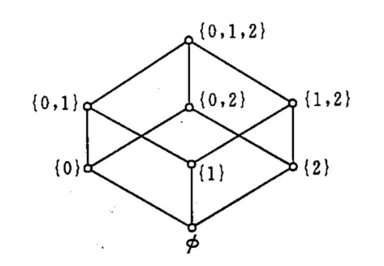
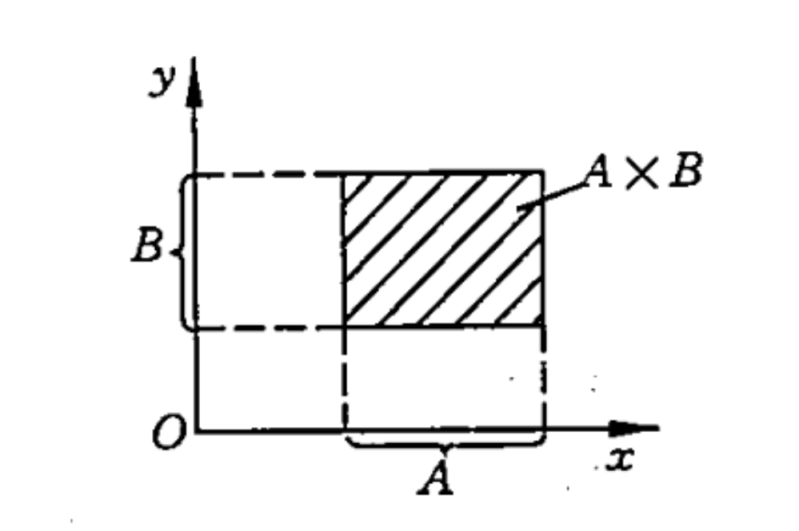

# 第九章 集合

## 集合的概念和表示方法
### 集合的概念

- **定义**：集合是一些确定的、可以区分的事物汇聚在一起组成的一个整体。组成一个集合的每个事物称为该集合的一个 **元素** ，或简称一个 **元**

	- 如果 $a$ 是集合 $A$ 的一个元素，就说 $a$ **属于** $A$，或者说 $a$ 在 $A$ 中，记作 $ a \in A$

	- 如果 $b$ 不是集合 $A$ 的一个元素，就说 $b$ **不属于** $A$，或者说 $b$ 不在 $A$ 中，记作 $ b \notin A$

- **性质**：

	- 集合的元素可以是任何事物，也可以是另外的集合（集合的元素不能是该集合自身）

	- 一个集合的各个元素是可以互相区分开的。这意味着，在一个集合中不会重复出现相同的元素

	- 组成一个集合的各个元素在该集合中是无次序的

	- 任一事物是否属于一个集合，回答是确定的。也就是说，对一个集合来说，任一事物或者是它的元素或者不是它的元素，二者必居其一而不可兼而有之，且结论是确定的

### 集合的表示方法

- 常用集合

	- $\mathbb{N}$ 表示全体自然数的集合

	- $\mathbb{Z}$ 表示全体整数的集合

	- $\mathbb{Q}$ 表示全体有理数的集合

	- $\mathbb{R}$ 表示全体实数的集合

	- $\mathbb{C}$ 表示全体复数的集合

- **外延表示法**：一一列举集合的全体元素

	- $\mathbb{N} = \{0, 1, 2, 3, \ldots\}$

- **内涵表示法**：用谓词来描述集合中元素的性质

	- $\mathbb{N} = \{x \mid x \text{ 是自然数}\}$ 

- 罗素（Russell）悖论：

	- $H = \{x \mid x \text{ 是一个集合且 } x \notin x\}$ 不存在

	- 集合论不能研究“所有集合组成的集合”。

## 集合间的关系和特殊集合

### 集合间的关系
#### 相等

- 两个集合是相等的，当且仅当它们有相同的元素。若两个集合 $\mathrm{A}$ 和 $\mathrm{B}$ 相等，则记作 $A=B$；若 $A$ 和 $B$ 不相等，则记作 $A \neq B$。

- 这个定义也可以写成

	$$
	\begin{aligned} A=B &\Leftrightarrow(\forall x)(x \in A \leftrightarrow x \in B)\\ A \neq B &\Leftrightarrow \neg(\exists x)(x \in A \leftrightarrow x \in B) \end{aligned}
	$$

- 这个定义就是集合论中的 **外延公理**，也叫 **外延原理**。它实质上是说“一个集合是由它的元素完全决定的”

#### 子集

- 对任意两个集合 $A$ 和 $B$，若 $A$ 的每个元素都是 $B$ 的元素，就称 $A$ 为 $B$ 的 **子集合** ，或称 $B$ 包含 $A$，或称 $B$ 是 $A$ 的 **超集合** ，记作

	$$
	A \subseteq B \mathrm{或} B \supseteq A
	$$

- 这个定义也可以写成

	$$
	A \subseteq B \Leftrightarrow(\forall x)(x \in A \rightarrow x \in B)
	$$

- 当 $A$ 不是 $B$ 的子集合时，即 $A \subseteq B$ 不成立时，记作 $A \nsubseteq B$（子集合可简称为子集）

- **定理**：

	- **两个集合相等的充要条件是它们互为子集**，即 $A=B \Leftrightarrow(A \subseteq B \wedge B \subseteq A)$

	- 对任意的集合 $A,B,C$：

		- 自反性：$A \subseteq A$

		- 反对称性：$(A \subseteq B \wedge B \subseteq A) \Rightarrow A=B$

		- 传递性：$(A \subseteq B \wedge B \subseteq C) \Rightarrow A \subseteq C$

#### 真子集

- 对任意两个集合 $A$ 和 $B$，若 $A \subseteq B$ 且 $A \neq B$，就称 $A$ 为 $B$ 的 **真子集** ，或称 $B$ **真包含** $A$，或称 $B$ 是 $A$ 的 **真超集合** ，记作

	$$
	A \subset B \text{ 或 } B \supset A
	$$

- 这个定义也可以写成

	$$
	A \subset B \Leftrightarrow(A \subseteq B \wedge A \neq B)
	$$

#### 不相交

- 若两个集合 $A$ 和 $B$ 没有公共元素，就称 $A$ 和 $B$ 是不相交的。这个定义也可以写成 

	$$
	A 和 B 不相交 \Leftrightarrow \neg(\exists x)(x \in A \wedge x \in B)
	$$

- 若 $A$ 和 $B$ 不是不相交的，就称 $A$ 和 $B$ 是相交的

### 特殊集合
#### 空集

- 不含任何元素的集合称为空集，记作 $\emptyset$，空集的定义也可以写成

	$$
	\emptyset=\{x \mid x \neq x\}
	$$

- 显然， $(\forall x)(x \notin \emptyset) $ 为真。

	- $A = \emptyset$ 当且仅当 $\{x \mid x \neq x\}$.

	- $A \neq \emptyset$ 当且仅当 $\{x \mid (\exists y)(y \in x)\}$

- **定理**：

	- 对于任意的集合 $A$，$\emptyset \in A$

	- 空集是唯一的

#### 全集

- 在给定的问题中，所考虑的所有事物的集合称为全集，记作 $E$，全集的定义也可以写成

	$$
	E=\{x \mid x=x\}
	$$

## 集合的运算
### 集合的基本运算

对集合 $A$ 和 $B$，

- 并集 $A \cup B$ 定义为

	$$
	A \cup B=\{x \mid x \in A \vee x \in B\}
	$$

- 交集 $A \cap B$ 定义为

	$$
	A \cap B=\{x \mid x \in A \wedge x \in B\}
	$$

- 差集（又称 $B$ 对 $A$ 的相对补集，补集）$A-B$ 定义为

	$$
	\begin{aligned} A-B &=\{x \mid x \in A \wedge x \notin B\} \\ &= \{x \mid x \in A \wedge \neg(x \in B)\} \\ &= \{x \mid x \in A \wedge x \in -B\} \\ &= A \cap -B \\ &= A - (A \cap B) \end{aligned}
	$$

- 余集（又称 $A$ 的绝对补集）$-A$ 定义为

	$$
	-A = E-A =\{x \mid x \notin A\} =\{x \mid \neg(x \in A)\}
	$$

	其中 $E$ 为全集，$A$ 的余集就是 $A$ 对 $E$ 的相对补集

- 对称差 $A \oplus B$ 定义为

	$$
	A \oplus B=(A-B) \cup(B-A)=\{x \mid x \in A \overline{\vee} x \in B\}
	$$

### 广义交和广义并

若集合 $A$ 的元素都是集合，则

- 把 $A$ 的所有元素的元素组成的集合称为 $A$ 的 **广义并** ，记作 $\cup A$

- 把 $A$ 的所有元素的公共元素组成的集合称为 $A$ 的 **广义交** ，记作 $\cap A$

$$
\begin{aligned} \cup A&=\{x \mid(\exists z)(z \in A \wedge x \in z)\} \\ \cap A&=\{x \mid(\forall z)(z \in A \rightarrow x \in z)\} \end{aligned}
$$

- 此外，规定 $\cup \emptyset=\emptyset$，规定 $\cap \emptyset$ 无意义

### 幂集

若 $A$ 是集合，则把 $A$ 的所有子集组成的集合称为 $A$ 的幂集，记作 $P(A)$，这个定义也可以写成

$$
P(A)=\{x \mid x \subseteq A\}
$$

- **性质**：

	- $P(A)$ 有 $2^{|A|}$ 个元素

	- $\emptyset \in P(A)$

	- $A \in P(A)$

- **例子**：

	- $P(\emptyset)=\{\emptyset\}$

	- $P(\{\emptyset\})=\{\emptyset,\{\emptyset\}\}$

	- $P(\{a,b\})=\{\emptyset,\{a\},\{b\},\{a,b\}\}$

### 笛卡尔积

- **有序对**：

	- **定义**：两个元素 $x$ 和 $y$（允许 $x=y$）按给定次序排列组成的二元组合称为一个有序对，记作 $\langle x,y\rangle$，其中 $x$ 是它的第一元素，$y$ 是它的第二元素。

	- **性质**：

		- $x \neq y \Rightarrow\langle x,y\rangle \neq\langle y,x\rangle$

		- $\langle x,y\rangle=\langle u,v\rangle \Leftrightarrow x=u \wedge y=v$

	- 在平面直角坐标系上一个点的坐标就是一个有序对

	- **用集合定义有序对**：有序对 $\langle x,y\rangle$ 定义为

		$$
		\langle x,y \rangle=\{\ \{x\},\{x,y\} \ \}
		$$

	- **定理**：

		- $\langle x,y\rangle=\langle u,v\rangle \Leftrightarrow x=u \wedge y=v$

		- $x \neq y \Rightarrow\langle x,y\rangle \neq\langle y,x\rangle$

- **$n$ 元组**：

	- **定义**：若 $n \in \mathbb{N}$ 且 $n>1,x_{1},x_{2},\cdots,x_{n}$ 是 $n$ 个元素，则 $n$ 元组 $\left\langle x_{1},\cdots,x_{n}\right\rangle$ 定义为

		- 当 $n=2$ 时，二元组是有序对 $\left\langle x_{1},x_{2}\right\rangle$

		- 当 $n \neq 2$ 时，$\left\langle x_{1},\cdots,x_{n}\right\rangle=\left\langle\left\langle x_{1},\cdots,x_{n-1}\right\rangle,x_{n}\right\rangle$

	- 按照这个定义，有序对就是二元组，$n$ 元组就是多重有序对。

- **笛卡尔积**：

	- **定义**：两个集合 $A$ 和 $B$ 的笛卡儿积（又称卡氏积、乘积、直积）$A \times B$ 定义为

		$$
		\begin{aligned} A \times B &=\{z \mid x \in A \wedge y \in B \wedge z=\langle x,y\rangle\}\\ &=\{\langle x,y\rangle \mid x \in A \wedge y \in B\} \end{aligned}
		$$

	- 在 $A = B$ 时，可把 $A \times A$ 简写为 $A^2$

- **$n$ 阶笛卡尔积**：

	- **定义**：若 $n \in \mathbb{N}$ 且 $n>1$，而 $A_{1},A_{2},\cdots,A_{n}$ 是 $n$ 个集合，它们的 $n$ 阶笛卡儿积记作 $A_{1} \times A_{2} \times \cdots \times A_{n}$，并定义为

		$$
		A_{1} \times A_{2} \times \cdots \times A_{n}=\left\{\left\langle x_{1},\cdots,x_{n}\right\rangle \mid x_{1} \in A_{1} \wedge \cdots \wedge x_{n} \in A_{n}\right\}
		$$

	- 当 $A_{1}=A_{2}=\cdots=A_{n}$ 时，它们的 $n$ 阶笛卡儿积可以简写为 $A^{n}$

### 优先权

| 优先级 | 运算符 | 运算符 |
| --- | --- | --- |
| 1 | 一元运算符 | $-A, P(A), \cap A, \cup A$ |
| 2 | 二元运算符 | $-, \cap, \cup, \oplus, \times$ |
| 3 | 集合关系符 | $=, \subseteq, \subset, \in$ |
| 4 | 一元联结词 | $\neg$ |
| 5 | 二元联结词 | $\wedge, \vee, \rightarrow, \leftrightarrow$ |
| 6 | 逻辑关系符 | $\Leftrightarrow, \Rightarrow$ |

- 此外，还使用数学上惯用的括号表示优先权方法、从左到右的优先次序。规定:

	1. 括号内的优先于括号外的；

	2. 同一层括号内，按上述优先权，

	3. 同一层括号内，同一优先级的，按从左到右的优先次序。

## 集合的图形表示法

- **文氏图**：集合的图形表示法通常使用 **维恩图/文氏图**（Venn Diagram）来表示集合之间的关系。

	- 矩形内部的点表示全集的所有元素。

	- 在矩形内画不同的圆表示不同的集合，用圆内部的点表示相应集合的元素。

	- 圆形的重叠来表示集合的交集、并集和差集等运算。

- **幂集的图示法**：可以用一个网络图中的各结点表示幂集的各元素。设 $A = \{0, 1, 2\}$，则 $P(A)$ 的各元素如下图表示。图中结点间的连线表示二者之间有包含关系。

- **笛卡尔积的图示法**：在平面直角坐标系上，如果用 $x$ 轴上的线段表示集合 A，并用 $y$ 轴上的线段表示集合 $B$，则由两个线段画出的矩形就可以表示笛卡儿积 $A \times B$，如下图所示。

## 集合运算的性质和证明
### 基本运算的性质

对任意的集合 $A$，$B$ 和 $C$，有

- 交换律

	$$
	\begin{aligned} A \cup B=B \cup A\\ A \cap B=B \cap A \end{aligned}
	$$

- 结合律

	$$
	\begin{aligned} (A \cup B) \cup C=A \cup(B \cup C)\\ (A \cap B) \cap C=A \cap(B \cap C) \end{aligned}
	$$

- 分配律

	$$
	\begin{aligned} A \cup(B \cap C)=(A \cup B) \cap(A \cup C)\\ A \cap(B \cup C)=(A \cap B) \cup(A \cap C) \end{aligned}
	$$

- 幂等律

	$$
	\begin{aligned} A \cup A=A\\ A \cap A=A \end{aligned}
	$$

- 吸收律

	$$
	\begin{aligned} A \cup(A \cap B)=A\\ A \cap(A \cup B)=A \end{aligned}
	$$

- 摩根律

	$$
	\begin{aligned} A-(B \cup C)&=(A-B) \cap(A-C)\\ A-(B \cap C)&=(A-B) \cup(A-C)\\ -(B \cup C)&=-B \cap-C\\ -(B \cap C)&=-B \cup-C \end{aligned}
	$$

- 同一律

	$$
	\begin{aligned} A \cup \emptyset=A\\ A \cap E=A \end{aligned}
	$$

- 零律

	$$
	\begin{aligned} A \cup E=E\\ A \cap \emptyset=\emptyset\\ -\emptyset=E\\ -E=\emptyset \end{aligned}
	$$

- 补余律

	$$
	\begin{aligned} A \cup-A=E\\ A \cap-A=\emptyset \end{aligned}
	$$

- 双补律

    $$
    -(-A)=A
    $$

- $A \cup B=A \cup C, A \cap B=A \cap C \Rightarrow B=C$

**证明**：

- 谓词法

- 集合法

### 差集的性质

对任意的集合 $A,B$ 和 $C$，有

- $A-B=A-(A \cap B)$

- $A-B=A \cap-B$

- $A \cup(B-A)=A \cup B$

- $A \cap(B-C)=(A \cap B)-C$

### 对称差的性质

对任意的集合 $A,B$ 和 $C$，有

- 交换律 $A \oplus B=B \oplus A$

- 结合律 $(A \oplus B) \oplus C=A \oplus(B \oplus C)$

- 分配律 $A \cap(B \oplus C)=(A \cap B) \oplus(A \cap C)$

- 同一律 $A \oplus \emptyset=A$

- 零律 $A \oplus A=\emptyset$

- $A \oplus(A \oplus B)=B$

- $(A-B) \oplus(A-C)=\emptyset$ 的充要条件是 $A-B=A-C$

### 子集的性质

对任意的集合 $A,B,C$ 和 $D$，有

- $A \subseteq B \Rightarrow(A \cup C) \subseteq(B \cup C)$

- $A \subseteq B \Rightarrow(A \cap C) \subseteq(B \cap C)$

- $(A \subseteq B) \wedge(C \subseteq D) \Rightarrow(A \cup C) \subseteq(B \cup D)$

- $(A \subseteq B) \wedge(C \subseteq D) \Rightarrow(A \cap C) \subseteq(B \cap D)$

- $(A \subseteq B) \wedge(C \subseteq D) \Rightarrow(A-D) \subseteq(B-C)$

- $C \subseteq D \Rightarrow(A-D) \subseteq(A-C)$

### 幂集合的性质

对任意的集合 $A$ 和 $B$，有

- $A \subseteq B \Leftrightarrow P(A) \subseteq P(B)$

- $A=B \Leftrightarrow P(A)=P(B)$

- $P(A)\in P(B) \Rightarrow A \in B$

- $P(A)\cap P(B)=P(A\cap B)$

- $P(A)\cup P(B)\subseteq P(A\cup B)$

- $P(A-B)\subseteq (P(A)-P(B))\cup \{\emptyset\}$

### 传递集合及其性质

- **定义**：如果集合的集合 $A$ 的任一元素的元素都是 $A$ 的元素，就称 $A$ 为 **传递集合** ，即

	$$
	(\forall x)(\forall y)((x \in y \wedge y \in A) \rightarrow x \in A)
	$$

	- 推论：$x \subseteq A, y \subseteq A $

- **定理**：

	- 对集合的集合 $A$，$A$ 是传递集合 $\Leftrightarrow A \subseteq P(A)$

	- 对集合的集合 $A$，$A$ 是传递集合 $\Leftrightarrow$ $P(A)$ 是传递集合

### 广义并和广义交的性质

对集合的集合 $A$ 和 $B$，有

- $A \subseteq B \Rightarrow \cup A \subseteq \cup B$

- $A \subseteq B \Rightarrow \cap B \subseteq \cap A$，其中 $A$ 和 $B$ 非空

- $\cup(A \cup B)=(\cup A) \cup(\cup B)$

- $\cap(A \cup B)=(\cap A) \cap(\cap B)$，其中 $A$ 和 $B$ 非空

- $\cup(P(A))=A$

- 若集合 $A$ 是传递集合，则 $\cup A$ 是传递集合

- 若集合 $A$ 的元素都是传递集合，则 $\cup A$ 是传递集合

- 若非空集合 $A$ 是传递集合，则 $\cap A$ 是传递集合，且 $\cap A=\emptyset$

- 若非空集合 $A$ 的元素都是传递集合，则 $\cap A$ 是传递集合

### 笛卡尔积的性质

- $A \times \emptyset=\emptyset \times B=\emptyset$

- 若 $A \neq \emptyset$，$B \neq \emptyset$ 且 $A \neq B$，则 $A \times B \neq B \times A$

- $A \times(B \times C) \neq(A \times B) \times C$

- 若 $A$ 是集合，$x \in A, y \in A$，则 $\langle x, y \rangle \in PP(A)$。

	- $PP(A)$ 表示 $P(P(A))$

- $A \times(B \cup C)=(A \times B) \cup(A \times C)$

- $A \times(B \cap C)=(A \times B) \cap(A \times C)$

- $(B \cup C) \times A=(B \times A) \cup(C \times A)$

- $(B \cap C) \times A=(B \times A) \cap(C \times A)$

- 若 $C \neq \emptyset$，则 $(A \subseteq B) \Leftrightarrow(A \times C \subseteq B \times C) \Leftrightarrow(C \times A \subseteq C \times B)$

- 对任意的非空集合 $A, B, C$ 和 $D$，有 $(A \times B \subseteq C \times D) \Leftrightarrow(A \subseteq C \wedge B \subseteq D)$

## 有限集合的基数

- **定义**：如果存在 $n \in \mathbb{N}$，使集合 $A$ 与集合 $\{x \mid x \in \mathbb{N} \wedge x<n\}=\{0,1,2,\cdots,n-1\}$ 的元素个数相同，就说集合 $A$ 的 **基数** 是 $n$，记作 $\#(A)=n$ 或 $|A|=n$ 或 $\operatorname{card}(A)=n$

	- 空集 $\emptyset$ 的基数是 $0$

- **有限集合与无限集合**：

	- 如果存在 $n \in \mathbb{N}$，使 $n$ 是集合 $A$ 的基数 $.$ 就说 $A$ 是 **有限集合**。

	- 如果不存在这样的 $n$，就说 $A$ 是 **无限集合**

### 幂集和笛卡儿积的基数

- 对于有限集合 $A$，$|P(A)|=2^{|A|}$

- 对有限集合 $A$ 和 $B$，$|A\times B|=|A|\cdot|B|$

### 基本运算的基数

- 对有限集合 $A_{1}$ 和 $A_{2}$，有

	$$
	\begin{aligned} \left|A_{1} \cup A_{2}\right| & \leqslant\left|A_{1}\right|+\left|A_{2}\right| \\ \left|A_{1} \cap A_{2}\right| & \leqslant \min \left(\left|A_{1}\right|,\left|A_{2}\right|\right) \\ \left|A_{1}-A_{2}\right| & \geqslant\left|A_{1}\right|-\left|A_{2}\right| \\ \left|A_{1} \oplus A_{2}\right| & =\left|A_{1}\right|+\left|A_{2}\right|-2\left|A_{1} \cap A_{2}\right| \end{aligned}
	$$

- **排斥原理**：对有限集合 $A_{1}$ 和 $A_{2}$，有

	$$
	\left|A_{1} \cup A_{2}\right|=\left|A_{1}\right|+\left|A_{2}\right|-\left|A_{1} \cap A_{2}\right|
	$$

	- 推广到 $n$ 个集合：若 $n \in \mathbb{N}$ 且 $n > 1, A_{1}, A_{2}, \ldots, A_{n}$ 是有限集合, 则

		$$
		\begin{aligned} |A_{1} \cup A_{2} \cup \ldots \cup A_{n}| &= \sum |A_{i}| - \sum |A_{i} \cap A_{j}| + \sum |A_{i} \cap A_{j} \cap A_{k}| + \\ & \cdots + (-1)^{(n - 1)}|A_{1} \cap A_{2} \cap \ldots \cap A_{n}| \end{aligned}
		$$

