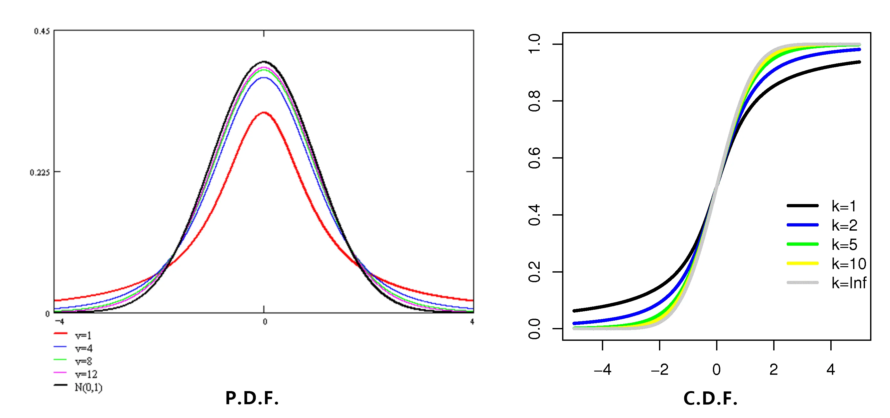

# 第六章 数理统计的预备知识

- [Back to Course Home](index.md)

## 数理统计基本知识
### 总体和个体

- 一般地，所研究对象的某个（或某些）数量指标的全体称为 **总体**。

- 如果所研究的问题只有一个数量指标，就是一个 **随机变量**，如果所研究的问题有多个数量指标，就是 **多维随机变量**。

- **个体** 就是总体的每个数量指标。

### 样本和样本空间

- 一般地，为研究总体的特征，从总体中抽取部分个体，称为 **样本**

- 若从某个总体 $X$ 中抽取了 $n$ 个个体，记为 $\left(X_{1},X_{2},\cdots,X_{n}\right)$，则称其为总体 $X$ 的一个容量为 $n$ 的样本. 

- 依次对它们进行观察得到 $n$ 个数据 $\left(x_{1},x_{2},\cdots,x_{n}\right)$，称这 $n$ 个数据 ($n$ 维实向量) 为总体 $X$ 的一个容量为 $n$ 的 **样本观测值**，简称 **样本值**

- 可以将它们看作 $n$ 维随机向量 $X$ 的一组可能的取值，样本 $\left(X_{1},X_{2},\cdots,X_{n}\right)$ 的所有可能取值的集合称为 **样本空间**，记为 $\chi$

### 样本与函数

- **简单随机样本**：若来自总体 $X$ 的一个样本 $\left(X_{1},X_{2},\cdots,X_{n}\right)$ 为 $X$ 的一个 **简单随机样本**，则其满足：

	- **同分布性**，即 $X_{1},X_{2},\cdots,X_{n}$ 都与 $X$ 服从相同的分布

	- **独立性**，即 $X_{1},X_{2},\cdots,X_{n}$ 相互独立

- **分布函数**：总体的分布函数为 $F(x)$，则 $\left(X_{1},X_{2},\cdots,X_{n}\right)$ 的联合分布函数为

	$$
	F\left(x_{1},x_{2},\cdots,x_{n}\right)=\prod_{i=1}^{n} F\left(x_{i}\right)
	$$

- **概率密度**：总体的概率密度为 $f(x)$，则 $\left(X_{1},X_{2},\cdots,X_{n}\right)$ 的联合概率密度为

	$$
	f\left(x_{1},x_{2},\cdots,x_{n}\right)=\prod_{i=1}^{n} f\left(x_{i}\right)
	$$

### 统计量

- **统计量**：总体 $X$ 的简单随机样本 $\left(X_{1},X_{2},\cdots,X_{n}\right)$，有不含除自变量之外的未知参数的实连续函数 $g\left(r_{1},r_{2},\cdots,r_{n}\right)$，使随机变量 $g\left(X_{1},X_{2},\cdots,X_{n}\right)$ 为 **统计量**

- **样本值**：统计量 $g\left(X_{1},X_{2},\cdots,X_{n}\right)$ 的一个 **样本值**：$g\left(x_{1},x_{2},\cdots,x_{n}\right)$

#### 常用统计量
设 $\left(X_{1},X_{2},\cdots,X_{n}\right)$ 为总体 $X$ 的一个容量为 $n$ 的样本

- **样本均值**

	$$
	\bar{X}=\frac{1}{n} \sum_{i=1}^{n} X_{i}
	$$

	- $\bar{X}$ 的样本值记为 $\bar x$

	- 与数学期望的区别

		- 样本均值是随机变量，具有分布

		- 数学期望是常数

		- 依概率收敛到数学期望

- **样本方差**

	$$
	S^{2}=\frac{1}{n-1} \sum_{i=1}^{n}\left(X_{i}-\bar{X}\right)^{2}
	$$

	- $S^2$ 的样本值记为 $s^2$

- **样本标准差**

	$$
	S=\sqrt{\frac{1}{n-1} \sum_{i=1}^{n}\left(X_{i}-\bar{X}\right)^{2}}
	$$

	- $S$ 的样本值记为 $s$

	- 样本均值、样本方差与期望、方差的关系

		$$
		\begin{aligned} E(\bar{X})&=E(X)\\ D(\bar{X})&=\dfrac{D(X)}{n}\\ E(S^2)&=D(X)\\ \end{aligned}
		$$

- **样本 k 阶原点矩**

	$$
	M_{k}=\frac{1}{n} \sum_{i=1}^{n} X_{i}^{k}(k=1,2,\cdots)
	$$

	- $M_k$ 的样本值记为 $m_k$

	- $M_1 = \bar X$

- **样本 k 阶中心矩**

	$$
	(C M)_{k}=\frac{1}{n} \sum_{i=1}^{n}\left(X_{i}-\bar{X}\right)^{k}(k=1,2,\cdots)
	$$

	- $(CM)_k$ 的样本值记为 $(\mathrm{cm})_k$

	- $(CM)_2 = M_2 - \bar X^2$

		- 由均值和平方的均值即可求 2 阶中心矩

	- $(CM)_2 = \dfrac{n-1}{n}S^2\triangleq S_n^2$

		- 由 2 阶中心矩即可求方差

	- 样本方差 $\boldsymbol{S^2}$ 与样本二阶中心矩 $\boldsymbol{S_n^2}$ 的关系：

		$$
		\begin{aligned} S^2 = \dfrac{n}{n-1}S_n^2 \\ E(S_n^2) = \dfrac{n-1}{n}\ \sigma^2\quad E(S^2) = \sigma^2 \end{aligned}
		$$

#### 顺序统计量
将一组样本的样本值 $(x_1,x_2,\cdots,x_n)$ 从小到大排序后记为 $x_{1}^{\star} \leqslant x_{2}^{\star} \leqslant \cdots \leqslant x_{n}^{\star}$，定义 $X_{(k)}=x_{k}^{\star},k=1,2,\cdots,n$，$X_{(k)}$ 的取值为样本中从小到大排第 $k$ 位的数，则称 $X_{(1)},X_{(2)},\cdots,X_{(n)}$ 为 **顺序统计量**

- **极差**

	$$
	D_{n}=X_{(n)}-X_{(1)}
	$$

- **样本中位数**

	$$
	\tilde{X}=\left\{\begin{array}{cc} X_{\left(\frac{\mathrm{n}+1}{2}\right)},& \mathrm{n} \text { 为奇数 } \\ \dfrac{1}{2}\left(X_{\left(\frac{\mathrm{n}}{2}\right)}+X_{\left(\frac{\mathrm{n}}{2}+1\right)}\right),& \mathrm{n} \text { 为偶数 } \end{array}\right.
	$$

- **样本经验分布函数**

	$$
	F_{n}(x)=\left\{\begin{array}{lc} 0,& x<x_{(1)} \\ \dfrac{k}{n},& x_{(k)} \leq x<x_{(k+1)} \\ 1,& x \geq x_{(n)} \end{array} \quad k=1,2,\cdots,n-1\right.
	$$

	- $n\to \infty$，$F_n(x)\xrightarrow[n\to \infty]{p=1} F(x)$，$F_n(x)$ 以概率 1 一致收敛于分布函数 $F(x)$

- **$\boldsymbol \alpha$ 分位数**：

	- **上侧 $\boldsymbol\alpha$ 分位数 $\boldsymbol x_\alpha$**：

		$$
		P(X>x_\alpha) = \alpha
		$$

		- $\alpha$ 为 $(0,1)$ 内的给定常数

	- **双侧 $\boldsymbol\alpha$ 分位数 $\boldsymbol x_{\alpha/2}$** (对于偶函数)：

		$$
		P(|\ X\ | > x_{\alpha/2}) = \alpha
		$$

		- $\alpha$ 为 $\left(0,\dfrac12\right)$ 内的给定常数

## 抽样检验（常用统计量的分布）
### 正态分布：$X \sim N(\mu,\sigma^2)$
若随机变量 $X_{1},X_{2},\cdots,X_{n}$ 相互独立，且 $X_{i} \sim N\left(\mu_{i},\sigma_{i}^{2}\right)(i=1,2,\cdots,n)$，则

$$
\sum_{i=1}^{n} a_{i} X_{i} \sim N\left(\sum_{i=1}^{n} a_{i} \mu_{i},\sum_{i=1}^{n} a_{i}^{2} \sigma_{i}^{2}\right)
$$

特别地，当 $X_{i} \sim N\left(\mu,\sigma^{2}\right)(i=1,2,\cdots,n)$,

$$
\frac{1}{n} \sum_{i=1}^{n} X_{i} \sim N\left(\mu,\frac{\sigma^{2}}{n}\right)
$$

- 均值的期望与方差：

	$$
	E\left(\frac{1}{n} \sum_{i=1}^{n} X_{i}\right) = \mu,\quad D\left(\frac{1}{n} \sum_{i=1}^{n} X_{i}\right) = \frac{\sigma^{2}}{n}
	$$

### 卡方分布：$\sum_{i=1}^{n} X_{i}^{2} \sim\chi^{2}(n)$
设随机变量 $X_{1},X_{2},\cdots,X_{n}$ 相互独立，且均服从标准正态分布 $N(0,1)$，则称统计量 $\chi^{2}=\displaystyle\sum_{i=1}^{n} X_{i}^{2}$ 服从自由度为 $n$ 的 $\chi^2$ 分布，记为 $\displaystyle\sum_{i=1}^{n} X_{i}^{2} \sim\chi^{2}(n)$，其概率密度为

$$
f_{\chi^{2}}(x)=\left\{\begin{array}{ll}\displaystyle \frac{1}{2^{\frac{n}{2}} \Gamma\left(\dfrac{n}{2}\right)} \mathrm{e}^{-\frac{x}{2}} x^{\frac{n}{2}-1},& x>0,\\ 0,& x \leqslant 0, \end{array}\right.
$$

其中 $\Gamma(x)=\displaystyle\int_{0}^{+\infty} t^{x-1} \mathrm{e}^{-t} \mathrm{d} t$ 

- $n = 2$ 时，$\Gamma(\dfrac{n}{2}) = \Gamma(1) = 1$，则 $\chi^2(2)$ 的概率密度为

	$$
	f_{\chi^{2}}(x)=\left\{\begin{array}{ll}\displaystyle \frac{1}{2} \mathrm{e}^{-\frac{x}{2}},& x>0,\\ 0,& x \leqslant 0, \end{array}\right.
	$$

#### 性质

1. 对于 $\chi^{2}=\displaystyle\sum_{i=1}^{n} X_{i}^{2},X_{i} \sim N(0,1),i=1,2,\cdots,n$，

	$$
	E(\chi^2) = n,\quad D(\chi^2) = 2n
	$$

2. 若 $X_1\sim\chi^2(n_1),X_{2} \sim \chi^{2}(n_{2})$，且两者相互独立，则

	$$
	X_{1}+X_{2} \sim \chi^{2}\left(n_{1}+n_{2}\right)
	$$

3. 当 $n$ 很大时，$\displaystyle\chi^{2}=\sum_{i=1}^{n} X_{i}^{2}$ 近似服从正态分布 $N(n,2n)$

4. $\chi^2(n)$ 的上侧 $\alpha$ 分位数 $\chi^2_\alpha(n)\ \bigg(P\big(\chi^2>\chi^2_\alpha(n)\big) = \alpha\bigg)$ 可查表

### t 分布：$T\sim t(n)$
设 $X \sim N(0,1),Y \sim \chi^{2}(n)$ 且 $X,Y$ 相互独立，则称随机变量 $T = \dfrac{X}{\sqrt{\dfrac{Y}{n}}}$ 服从自由度为 $n$ 的 $t$ 分布 (又称为 student 分布)，记为 $T \sim t(n)$，其概率密度为

$$
f(t)=\frac{\Gamma\left(\dfrac{n+1}{2}\right)}{\sqrt{n \pi} \ \Gamma\left(\dfrac{n}{2}\right)}\left(1+\frac{t^{2}}{n}\right)^{-\frac{n+1}{2}},\quad-\infty<t<+\infty
$$

#### 性质

1. $t$ 分布的概率密度 $f(t)$ 为偶函数，且当 $n\to+\infty$ 时,

	$$
	f(t) \rightarrow \varphi(t)=\frac{1}{\sqrt{2 \pi}} \mathrm{e}^{-\frac{t^{2}}{2}}
	$$

	即当自由度 $n$ 充分大时，$t$ 分布近似服从标准正态分布，当 $n>45$ 时，$t$ 分布可用标准正态分布近似

2. $t$ 分布的上侧 $\alpha$ 分位数 $t_\alpha(n)\ \Big(P\big(T>t_\alpha(n)\big) = \alpha\Big)$ 可查附表，且

	$$
	t_{1-\alpha}(n)=-t_{\alpha}(n)
	$$

### F 分布：$F \sim F(m,n)$
设 $U \sim \chi^{2}(m),V \sim \chi^{2}(n)$ ，且 $U,V$ 相互独立，则称随机变量 $F = \dfrac{U / m}{V / n}$ 服从第一自由度为 $m$，第二自由度为 $n$ 的 $F$ 分布，记为 $F \sim F(m,n)$，其概率密度为

$$
f_{F}(t)=\left\{\begin{array}{ll} \frac{\Gamma\left(\dfrac{m+n}{2}\right)}{\Gamma\left(\dfrac{m}{2}\right) \Gamma\left(\dfrac{n}{2}\right)}\left(\dfrac{m}{n}\right)^{\frac{m}{2}} t^{\frac{m}{2}-1}\left(1+\dfrac{m}{n} t\right)^{-\frac{m+n}{2}},& t>0,\\ 0,& t \leqslant 0 \end{array}\right.
$$

#### 性质

1. 若 $F \sim F(m,n)$，则 $\dfrac{1}{F} \sim F(n,m)$

2. $F(m,n)$ 的上侧 $\alpha$ 分位数 $F_{\alpha}(m,n)\Big(P\big(F>F_{\alpha}(m,n)\big)=\alpha\Big)$ 可查附表，且

	$$
	F_{1-\alpha}(m,n)=\frac{1}{F_{\alpha}(n,m)}
	$$

3. 与 $t$ 分布关系

	$$
	t_{1-\frac{\alpha}{2}}^{2}(n)=F_{\alpha}(1,n)
	$$

## 正态总体的抽样分布
### 单个正态总体的抽样分布
设 $X \sim N\left(\mu,\sigma^{2}\right)$，$\left(X_{1},X_{2},\cdots,X_{n}\right)$ 是来自总体 $X$ 的一个简单随机样本，$\bar{X},S^2$ 分别是样本均值与样本方差，则

1. 样本均值的分布

	$$
	\bar{X} \sim N\left(\mu,\frac{\sigma^{2}}{n}\right)
	$$

	或者

	$$
	\frac{\bar{X}-\mu}{\sigma / \sqrt{n}} \sim N(0,1)
	$$

2. 样本方差的分布

	$$
	\frac{(n-1) S^{2}}{\sigma^{2}}=\sum_{i=1}^{n}\left(\frac{X_{i}-\bar{X}}{\sigma}\right)^{2} \sim \chi^{2}(n-1)
	$$

	注意区分

	$$
	\sum_{i=1}^{n}\left(\frac{X_{i}-\mu}{\sigma}\right)^{2} \sim \chi^{2}(n)
	$$

3. 样本均值与样本方差的独立性

	- 样本均值 $\bar{X}$ 与 $\dfrac{(n-1) S^{2}}{\sigma^{2}}$ 相互独立

4. 推论：设 $X \sim N\left(\mu,\sigma^{2}\right),\left(X_{1},X_{2},\cdots,X_{n}\right)$ 是来自总体 $X$ 的一个简单随机样本，$\bar X,S^2$ 分别是样本均值与样本方差，则

	$$
	\frac{\bar{X}-\mu}{\dfrac{S}{\sqrt{n}}} \sim t(n-1)
	$$

## 两个正态总体的抽样分布
设 $X \sim N\left(\mu_1,\sigma_1^{2}\right),\left(X_{1},X_{2},\cdots,X_{n}\right)$ 是来自总体 $X$ 的一个简单随机样本，$Y \sim N\left(\mu_{2},\sigma_{2}^{2}\right),\left(Y_{1},Y_{2},\cdots,Y_{m}\right)$ 是来自总体 $Y$ 的一个简单随机样本，且 $X,Y$ 相互独立，则

$$
\begin{aligned} \bar{X}&=\frac{1}{n} \sum_{i=1}^{n} X_{i}\quad S_{1}^{2}=\frac{1}{n-1} \sum_{i=1}^{n}\left(X_{i}-\bar{X}\right)^{2}\\ \bar{Y}&=\frac{1}{m} \sum_{j=1}^{m} Y_{j}\quad S_{2}^{2}= \frac{1}{m-1} \sum_{j=1}^{m}\left(Y_{j}-\bar{Y}\right)^{2} \end{aligned}
$$

则有

1. 样本方差的商的分布

	$$
	\frac{S_{1}^{2}}{S_{2}^{2}} \Bigg/ \frac{\sigma_{1}^{2}}{\sigma_{2}^{2}} \sim F(n-1,m-1)
	$$

	当 $\sigma_1 = \sigma_2$ 时，

	$$
	\frac{S_{1}^{2}}{S_{2}^{2}} \sim F(n-1,m-1)
	$$

2. 当 $\sigma_{1}=\sigma_{2}=\sigma$ 时,

    $$
    \frac{(\bar{X}-\bar{Y})-\left(\mu_{1}-\mu_{2}\right)}{\sqrt{\dfrac{1}{n}+\dfrac{1}{m}} \sqrt{\dfrac{(n-1) S_{1}^{2}+(m-1) S_{2}^{2}}{n+m-2}}} \sim t(n+m-2)
    $$

