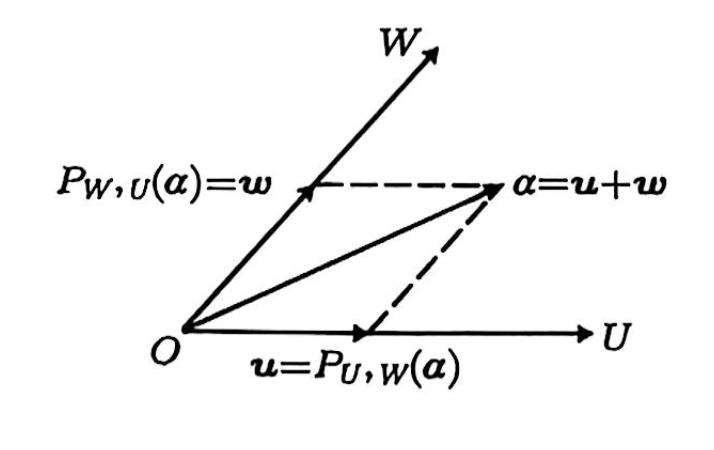

# 第一章 线性空间

- [Back to Course Home](index.md)

## 1.1 线性空间的概念

基础知识见往期笔记：[MATH1205-线性代数/4.线性空间与线性变换](../MATH1205-线性代数/4.线性空间与线性变换.md)

## 1.2 线性子空间
### 线性子空间的概念

概念同样见往期笔记：[MATH1205-线性代数/4.线性空间与线性变换](../MATH1205-线性代数/4.线性空间与线性变换.md/#_3)

### 矩阵的列空间、零空间、行空间和左零化空间

- **定义**：设 $A_{m\times n} \in \mathbb{F}^{m\times n}$，则

    - $A$ 的 **列空间** $R(A)$：$A$ 的列向量生成的空间；

        - $R(A) = \{A\boldsymbol{x} \mid \boldsymbol{x} \in \mathbb{F}^n\} = L(\alpha_1, \alpha_2, \ldots, \alpha_n) \subseteq \mathbb{F}^m$

        - $\dim R(A) = \mathrm{rank}(A)$

    - $A$ 的 **零化空间** $N(A)$：齐次线性方程组 $A\boldsymbol{x}=\boldsymbol{0}$ 的解空间；

        - $N(A) = \{\boldsymbol{x} \in \mathbb{F}^n \mid A\boldsymbol{x} = \boldsymbol{0}\} \subseteq \mathbb{F}^n$

        - $\dim N(A) = n - \mathrm{rank}(A)$

    - $A$ 的 **行空间** $R(A^\top)$：$A$ 的行向量生成的空间；

        - $R(A^\top) = \{A^\top\boldsymbol{y} \mid \boldsymbol{y} \in \mathbb{F}^m\} = L(\beta_1, \beta_2, \ldots, \beta_m) \subseteq \mathbb{F}^n$

        - $\dim R(A^\top) = \mathrm{rank}(A)$

    - $A$ 的 **左零化空间** $N(A^\top)$：齐次线性方程组 $\boldsymbol{y}A=\boldsymbol{0}$ 的解空间；

        - $N(A^\top) = \{\boldsymbol{y} \in \mathbb{F}^m \mid \boldsymbol{y}A = \boldsymbol{0}\} \subseteq \mathbb{F}^m$

        - $\dim N(A^\top) = m - \mathrm{rank}(A)$

- **性质**：设 $A_{m\times n} \in \mathbb{F}^{m\times n}$，构造矩阵 $(I,A)$，经行变换化为 $(P,H_A)$，其中 $I$ 表示单位矩阵，$H_A$ 为 $A$ 的 Hermitian 标准形，则

    - 设 $H_A$ 中每个非零行的第 $1$ 个非零元素所在列为 $j_1 < j_2 < \dots < j_r$。从 $A$ 中挑选出第 $j_1,j_2,\dots,j_r$ 列，这 $r$ 个列向量为 $R(A)$ 的一组基；

    - $H_A \boldsymbol{x} = \boldsymbol{0}$ 的一个基础解系是 $N(A)$ 的一组基；

    - $H_A$ 的前 $r$ 个非零行的转置为 $R(A^\top)$ 的一组基；

    - 矩阵 $P$ 的后 $m-r$ 行的转置是 $N(A^\top)$ 的一组基。

- **示例**：

    $$
    A=
    \begin{pmatrix}
    3 & -1 & 3 & 2 & 5 \\
    5 & -3 & 2 & 3 & 4 \\
    1 & -3 & -5 & 0 & -7 \\
    2 & -2 & -1 & 1 & -1
    \end{pmatrix}
    $$

    左边添加单位矩阵 $I$，构造矩阵 $(I,A)$

    $$
    (I,A)=
    \left(
    \begin{array}{cccc|ccccc}
    1 & 0 & 0 & 0 & 3 & -1 & 3 & 2 & 5 \\
    0 & 1 & 0 & 0 & 5 & -3 & 2 & 3 & 4 \\
    0 & 0 & 1 & 0 & 1 & -3 & -5 & 0 & -7 \\
    0 & 0 & 0 & 1 & 2 & -2 & -1 & 1 & -1
    \end{array}
    \right)
    $$

    经过行变换化为 $(P,H_A)$，其中 $H_A$ 为 $A$ 的 Hermitian 标准形

    $$
    (P,H_A)=
    \left(
    \begin{array}{cccc|ccccc}
    0 & 0 & -\frac12 & \frac34 & 1 & 0 & \frac74 & \frac34 & \frac{11}{4} \\[2mm]
    0 & 0 & -\frac12 & \frac14 & 0 & 1 & \frac94 & \frac14 & \frac{13}{4} \\[2mm]
    1 & 0 & 1 & -2 & 0 & 0 & 0 & 0 & 0 \\
    0 & 1 & 1 & -3 & 0 & 0 & 0 & 0 & 0
    \end{array}
    \right)
    $$

    则有

    - 列空间 $R(A)$ 的一组基为

        $$
        \begin{pmatrix} 3 \\ 5 \\ 1 \\ 2 \end{pmatrix},
        \begin{pmatrix} -1 \\ -3 \\ -3 \\ -2 \end{pmatrix}
        $$

    - 零化空间 $N(A)$ 的一组基为

        $$
        \begin{pmatrix} -\frac74 \\[2mm] -\frac94 \\[2mm] 1 \\ 0 \\ 0 \end{pmatrix},
        \begin{pmatrix} -\frac34 \\[2mm] -\frac14 \\[2mm] 0 \\ 1 \\ 0 \end{pmatrix},
        \begin{pmatrix} -\frac{11}{4} \\[2mm] -\frac{13}{4} \\[2mm] 0 \\ 0 \\ 1 \end{pmatrix}
        $$

    - 行空间 $R(A^\top)$ 的一组基为

        $$
        \begin{pmatrix} 1 & 0 & \frac74 & \frac34 & \frac{11}{4} \end{pmatrix},
        \begin{pmatrix} 0 & 1 & \frac94 & \frac14 & \frac{13}{4} \end{pmatrix}
        $$

    - 左零化空间 $N(A^\top)$ 的一组基为

        $$
        \begin{pmatrix} 1 & 0 & 1 & -2 \end{pmatrix},
        \begin{pmatrix} 0 & 1 & 1 & -3 \end{pmatrix}
        $$

### 线性子空间的交与和

- 设 $V$ 是数域 $F$ 上的线性空间，若 $U$ 是 $V$ 的子空间，$W$ 是 $U$ 的子空间，则 $W$ 是 $V$ 的子空间

- **子空间的交**：设 $V$ 是数域 $F$ 上的线性空间，$V$ 的任意多个子空间的交仍是 $V$ 的子空间，称为子空间的交。

    - 特别地，对于 $V$ 中的任意两个子空间 $U$ 和 $W$ 而言：

        - $U\cap W$ 仍是子空间

        - $U\cup W$ 不一定是子空间：$U\cup W$ 为子空间 $\iff U\subseteq W$ 或 $W\subseteq U$。

    - 子空间的交是包含在这些子空间中的最大子空间。

- **子空间的和**：设 $V$ 是数域 $F$ 上的线性空间，$U$ 和 $W$ 是 $V$ 的两个子空间。令

    $$
    U+W=\{u+w\mid u\in U,w\in W\},
    $$

    则对于 $V$ 上的加法和纯量乘法运算，$U+W$ 也是 $V$ 的子空间，称为 $U$ 与 $W$ 的和。

## 1.3 线性空间的分解
### 线性子空间的直和

- **维数定理**：设 $V$ 是数域 $F$ 上的线性空间，$U$ 和 $W$ 是 $V$ 的两个子空间，则

    $$
    \dim(U+W)=\dim U+\dim W-\dim(U\cap W)
    $$

- **直和**：设 $V$ 是数域 $F$ 上的线性空间，$U$ 和 $W$ 是 $V$ 的两个子空间，若 $\dim(U\cap W)=0$，则称 $U$ 与 $W$ 的和为直和，记为 $U\oplus W$。

    - 也可以说，若 $U\cap W=\{\boldsymbol{0}\}$，则称 $U$ 与 $W$ 的和为直和。

- **直和的判定**：设 $V$ 是数域 $F$ 上的线性空间，$U$ 和 $W$ 是 $V$ 的两个子空间，则下列陈述等价。

    1. $U+W$ 是直和；

    2. $U\cap W=\{\boldsymbol{0}\}$；

    3. 对任意 $\alpha \in U+W$，存在唯一的一组向量 $(u,w)$，其中 $u \in U$ 和 $w \in W$，使得 $\alpha = u + w$；

    4. 若 $0 = u + w$，其中 $u \in U$ 和 $w \in W$，则 $u = w = 0$；

    5. $\dim(U+W) = \dim U + \dim W$。

- **多子空间直和的判定**：设 $V$ 是数域 $F$ 上的线性空间，$U_1,\dots,U_k$ 是 $V$ 的子空间。则下列陈述等价：

    1. $U_1+\dots+U_k$ 是直和，记作 $U_1 \oplus \dots \oplus U_k$；

    2. 对每一个 $i=1,2,\dots,k$，都有 $\dim\left(U_i \cap \sum\limits_{j\neq i} U_j\right) = 0$；

    3. 零向量的分解式唯一。

    4. 任意向量 $\alpha \in U_1+\dots+U_k$，即存在 $u_i \in U_i$，我们有分解式 $\alpha = u_1 + \dots + u_k$，则分解式唯一；

    5. $\dim(U_1+\dots+U_k) = \dim U_1 + \dots + \dim U_k$；

- 设 $A$ 为 $n$ 阶复矩阵，$\lambda_1,\dots,\lambda_k$ 为 $A$ 的不同特征值，则

    $$
    V_{\lambda_i} = \{\boldsymbol{x} \in \mathbb{C}^n \mid A\boldsymbol{x} = \lambda_i \boldsymbol{x}\}
    $$

    为 $A$ 的 $\lambda_i$ 特征值对应的特征子空间。若 $A$ 可相似对角化，则

    $$
    V_{\lambda_1} \oplus \dots \oplus V_{\lambda_k} = \mathbb{C}^n
    $$

### 线性子空间的补空间

- **补空间**：设 $V$ 是数域 $F$ 上的线性空间，$U$ 是 $V$ 的一个子空间。那么一定存在 $V$ 的子空间 $W$ 使得 $V = U \oplus W$，称 $W$ 是 $U$ 在 $V$ 中的补空间。

### 向量在子空间上的投影

- **投影**：设 $V$ 是线性空间，$U$ 和 $W$ 是 $V$ 的互补的子空间，即 $V = W \oplus U$。这样，对任意的 $\alpha \in V$，都存在唯一的 $u \in U$，$w \in W$，使得 $\alpha = u + w$。称 $u$ 为向量 $\alpha$ 沿子空间 $W$ 在子空间 $U$ 上的投影，记作 $P_{U,W}(\alpha)$，如下图所示：
    

- **投影的性质**：设 $V$ 是线性空间，$U$ 和 $W$ 是 $V$ 的互补的子空间。则

    1. 对任意的 $u \in U$，都有 $P_{U,W}(u) = u$；

    2. 对任意的 $w \in W$，都有 $P_{U,W}(w) = 0$；

    3. 对任意的 $\alpha \in V$，都有 $P_{U,W}(\alpha) + P_{W,U}(\alpha) = \alpha$；

        - $P_{U,W}+P_{W,U}=I$

    4. 对任意的 $\alpha \in V$，都有 $P_{U,W}(P_{U,W}(\alpha)) = P_{U,W}(\alpha)$；

        - $P_{U,W}^2 = P_{U,W}$

    5. 对任意的 $\alpha \in V$，都有 $P_{U,W}(P_{W,U}(\alpha)) = 0$。

        - $P_{U,W}\circ P_{W,U}=0$

- **投影矩阵**：如果存在 $\mathbb{F}^n$ 中互补的两个子空间 $U$ 和 $W$，对任意的 $\alpha \in V$，都有 $A\alpha = P_{U,W}(\alpha)$，那么称方阵 $A$ 为为沿子空间 $W$ 在子空间 $U$ 上的投影矩阵，简称投影矩阵。

- **幂等矩阵**：设 $A$ 是 $n$ 阶方阵。如果 $A$ 满足 $A^2 = A$，那么称 $A$ 为幂等矩阵。

    - **定理**：设 $A$ 是数域 $\mathbb{F}$ 上的 $n$ 阶幂等矩阵，$U$ 是 $A$ 的对应到特征值 $1$ 的特征子空间，$W$ 是 $A$ 的对应到特征值 $0$ 的特征子空间。那么

        1. $U$ 恰好是 $A$ 的列空间，$W$ 恰好是 $A$ 的零空间，即 $U = R(A), W = N(A)$。

        2. $\mathbb{F}^n = U \oplus W$。

- **幂等矩阵与投影矩阵**：设 $A$ 为数域 $\mathbb{F}$ 上的 $n$ 阶方阵，当且仅当 $A$ 是幂等矩阵时，矩阵 $A$ 为投影矩阵。

- **定理**：设 $U$ 和 $W$ 是 $n$ 维列向量线性空间 $\mathbb{F}^n$ 中互补的子空间，$u_1,\dots,u_r$ 是 $U$ 的一组基，$w_1,\dots,w_{n-r}$ 是 $W$ 的一组基。令 $X=(u_1,\dots,u_r)$ 为 $n\times r$ 阵，$Y=(w_1,\dots,w_{n-r})$ 为 $n\times(n-r)$ 阵，则

    $$
    P_{U,W}=(X,0)(X,Y)^{-1}
    $$

    为沿子空间 $W$ 在子空间 $U$ 上的投影矩阵，且这个矩阵是唯一的。
