# 第六章 应用安全基础

- [Back to Course Home](index.md)

## 应用安全概述

1. **研究背景**

	- 信息技术、移动通信技术等的紧密结合与快速发展，以及智能终端软硬件的不断升级与换代，促进了移动互联网、云计算、大数据、物联网等应用的不断普及。

	- 海量用户个人信息跨系统、跨生态圈乃至跨国境流转常态化

		- 住宿出行

		- 移动社交媒体平台

		- 移动支付

2. **研究范围**

	- **定义**：应用安全是指为保障各种应用系统在信息的获取，存储，传输和处理各个环节的安全所涉及的相关技术的总称。

	- 

	- e.g.

		1. 云计算：

			- 云计算已成为当前普及的一种信息服务提供方式，为政府和企业提供了新信息系统构建方式和计算方式。

			- 由于云计算造成了数据所有权和管理权的分离

			- 在以下两方面开展持续研究：

				- 云计算基础设施的可信性

				- 云数据安全保障

		2. 工业互联网：

			- 数据汇集到云端，要保证系统的可靠运行，需要保证数据的机密性、完整性、访问和流转的可控性以及系统软硬件的安全性

		3. 大数据：

			- 大数据是一种规模大到在获取、存储、管理、分析方面大大超出了传统数据库软件工具能力范围的数据集合

			- 大数据本质上是一种方法论，是组合分析多源异构的数据来进行更好的决策，获得的数据越多越能发现数据中蕴含的知识、价值和规律

			- 实现大数据安全应用的关键：

				- 保证数据来源的真实

				- 促进多源数据的共享

				- 有效挖掘数据的价值

				- 保障数据所有者的权益

		4. 人工智能：

			- 人工智能在图像识别、自然语言理解、知识发现与数据挖掘、博弈等方面取得了显著的成就 

			- 人工智能技术越来越多的应用在网络安全防护、密码设计与分析领域

		5. 区块链：

			- 区块链是数字加密货币-比特币的基础支撑技术

			- 区块链本身安全问题、隐私保护问题亟待解决，同时对于互联网信息服务、金融安全也带来相应的风险

## 身份认证的主要方法

1. **身份认证定义**

	- **认证(Authentication)是证实客户的真实身份与其所声称的身份是否相符的过程**，是保证系统安全的重要措施之一。当服务器提供服务时，需要确认请求者的身份，请求者有时也需要确认服务提供者的身份。

	- 实现身份认证的基本途径：

		- 所知：个人掌握的知识，如口令，秘密

		- 所有：个人所具有的东西，如身份证、令牌、密钥等

		- 个人特征：指纹、笔迹等

2. **身份认证的主要方法**

	- 用户名/口令认证(所知)

		- 优点：简单易用，不需要任何硬件设备

		- 缺点：

			- 口令易泄露；

			- 弱口令容易被猜测，

			- 易受字典攻击和暴力攻击；

			- 复杂的强安全口令难于记忆

	- 动态口令/一次性口令 OTP(所有)

		- 一次性口令是变化的密码，它来源于 **产生密码的运算因子是变化的**

		- 一次性口令产生因子一般都采用 ISO/IEC 9798-2-2008 标准的双运算因子(Two Factor)，其一是有效期较长的共享密钥，其二是 **随机因子**

			- 1)基于时间同步

			- 2)基于事件同步

			- 3)短信验证码

	- 挑战应答认证(所有)

		- 通过一轮应答实现服务器对用户的认证，利用一次性随机数实现防重放攻击

		- 

		- 基于单向密码函数

		- 基于数字签名算法

	- 基于生物特征的认证(个人特征)

		- **生物统计学**(Biometrics)方法正在成为实现个人身份认证最简单而安全的方法

		- 签名、指纹、人脸、虹膜、语音等

		- 优点

			- 可信度高

			- 个人特征因人而异，难以伪造

			- 随时携带，不易丢失

		- 缺点

			- 不够稳定(辨别失败率高)

			- 不能挂失

	- 图灵测试

		- 验证登录信息系统的是人还是自动化执行的程序

		- 采用的方式利用人能快速回答，而机器回答困难的问题

		- 目的是防范利用计算机程序对系统进行暴力破解

	- 多因子认证

		- **实际应用当中，多采取多种认证方式结合，构成多因子认证方式。**

3. **公钥基础设施 PKI**

	- **定义**：

		- PKI：公钥基础设施(**P** ublic **K** ey **I** nfrastructure) 是一种遵循标准的利用公钥理论和技术建立的提供安全服务的 **基础设施**。

	- 目的：

		- 解决网上 **身份认证、电子信息的完整性和不可抵赖性** 等安全问题，为网络应用提供可靠的安全服务。

	- 任务：

		- 确立可信任的数字身份。

	- **数字证书**：

		- 一个用户的 **身份** 与其所持有的 **公钥** 绑定，由一个可信任的权威机构 CA 对该用户身份及对应公钥相绑定的证书进行数字签名，以证明证书的有效性，从而证明用户的身份。

	- 信任体系：

		-  X.509 标准采用树型的信任体系。根 CA 自签发证书，是整个信任体系的锚点

		- 上级 CA 为下级 CA 或者用户颁发证书

		- Alice 和 Bob 的证书沿着信任路径可以到达相同的证书节点，就可以建立信任关系

		- 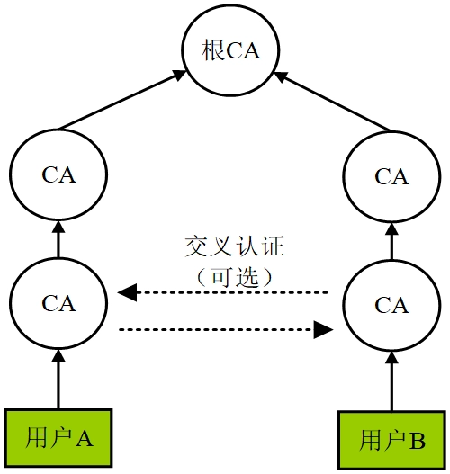

4. 身份认证的主流标准

	1. **RADIUS**：

		- **远程认证拨入业务协议 RADIUS** (Remote Authentication Dial-In User Service protocol)是由 Livingston 公司发明的，用于接入认证和计费服务。RADIUS 规范文本可以参看 RFC 2865 和 RFC2856。RAIUS 在许多企业信息系统接入过程中得到应用。

		- 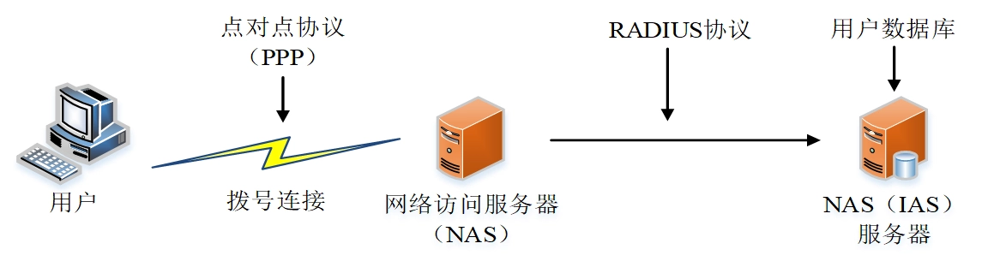

	2. **FIDO**：

		- **在线快速身份认证**(Fast Identity Online)使用 **生物特征识别技术代替口令** 对在线用户进行身份认证

		- **主要思想**

			- **基于生物特征识别解锁设备上的加密密钥，使用公钥密码或者对称密码方案与服务器进行身份认证**，从而可完全 **通过本地身份认证实现无口令的登录。**

		- FIDO 联盟于 2012 年创立，主旨是制定无口令身份认证协议。

		- 分类：

			- **通用身份认证框架 UAF**(Universal Authentication Framework)

			- **通用第二因子认证协议 U2F**( Universal 2nd Factor)

			- 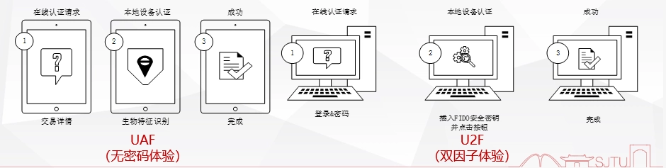

		- FIDO 注册流程

			- 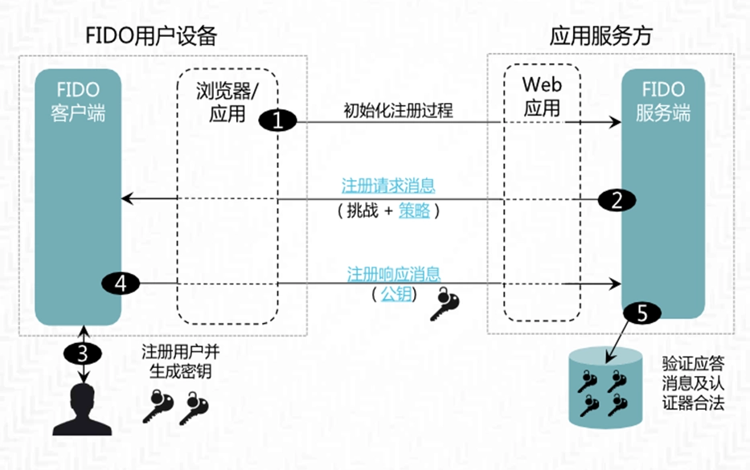

		- FIDO 认证流程

			- 

	3. **FIM**：

		-  **联盟身份管理 FIM**(Federated Identity Management)可以使 **用户使用同一个身份在组成联盟的所有企业中访问相应的资源**，支持用户身份跨安全域链接，用户可以在一个域中认证之后，不需要再进行独立的登录过程就可以访问另一个域的资源。

		- **Oauth**(Open Authorization)是典型的 FIM 系统，定义了 **资源所有者、资源服务器、客户、授权服务器** 四个角色。任何服务提供商都可以实现自身的 OAUTH 认证服务，很多大的公司如 Google，Yahoo，Microsoft 等都提供了 OAUTH 认证服务。

		- **SSO 单点登录** 是身份联盟的一个重要组件。SSO 单点登陆是一种集中式访问控制技术，允许主体在系统上进行一次身份认证，并且不需要再次身份认证，就可以访问多个资源。公司的文件传输系统 ipan 就使用的单点登陆，学校的邮箱和网站，一套密码应用于所有身份认证系统

		- 工作流程

			- 

			- 客户端(Client)向资源所有者(Resource Owner)请求授权。

			- 客户端(Client)收到用户授权，这是代表资源所有者(Resource Owner)授权的凭证(Authorization)。

			- 客户端(Client)通过与授权服务器(Authorization Server)进行身份验证并提供授权许可来请求访问令牌(Access Token)。

			- 授权服务器(Authorization Server)对客户端进行身份验证并验证授权许可，如果有效，则颁发访问令牌(Access Token)。

			- 客户端(Client)从资源服务器(Resource Server)请求受保护的资源并通过提供访问令牌(Access Token)进行身份验证。

			- 资源服务器(Resource Server)验证访问令牌(Access Token)，如果有效，则为请求提供服务。

## 访问控制模型

1. **访问控制的概念和目标**

	- **概念**：

		- 访问控制是通过某种途径 **显式地准许或限制访问能力及范围** 的一种方法，是针对越权使用资源的防御措施，通过限制对关键资源的访问，防止非法用户侵入或因为合法用户的不慎操作而造成的破坏，保证网络资源受控地，合法地使用。

	- **基本目标**：

		- 防止对任何资源(如计算资源、通信资源或信息资源)进行 **未授权的访问**；

		- 允许被授权的主体对某些客体的访问、拒绝向非授权的主体提供服务

		- 未授权的访问包括：

			- **非法用户进入系统**

			- **合法用户对系统资源的非法使用**

2. **访问控制模型**

	- **自主访问控制模型 DAC**

		- 资源拥有者按照自己的意愿来决定是否将自己所拥有资源的访问权限授予其他用户，策略灵活但安全性较差

	- **强制访问控制模型 MAC**

		- 为用户和数据划分安全等级，实现了信息的单向流动，但权限管理效率偏低、缺少灵活性

	- **基于角色的访问控制模型 RBAC**

		- 通过角色对访问控制策略进行描述，系统中的用户和权限均对应于某些特定的角色。角色的引入实现了用户与权限之间的分离，简化了授权管理。

		- **核心思想**：将访问权限与角色相联系

			- 给用户分配合适的角色

			- 让用户与访问权限相关联

			- 用户可以在角色间进行转换

			- 系统可以添加、删除角色

		- **特点**：

			- 以角色作为访问控制的主体

			- 角色继承

			- 用户可以在角色间进行转换

			- 最小特权

## 零信任模型

1. **零信任模型(Zero Trust Model)**

	- 核心思想

		- **网络边界内外的任何实体，在未验证之前都不予以信任**，典型系统是谷 BeyondCorp 体系

	- 特点：

		- 内网应用程序和服务不再对公网可见

		- 企业内网的边界消失

		- 基于身份、设备、环境认证的精准访问控制

		- 提供网络通信的端到端加密

## 典型应用及其安全

1. **隐私保护**

	- 定义：

		- **隐私保护是指在发布或者共享数据中不能识别出具体个人的数据**

		- **个人信息** 是指自然人的相关数据

		- **隐私** 是指 **个人敏感信息**

			- 包括身份证号码、电话号码、住址、住房类型、居住时间、过敏信息、疾病和药品使用状况、财务状况、信用记录、车辆识别码、品牌爱好、交通工具、出行地、出行时间、购买记录、指纹、掌纹、虹膜、社交账号、犯罪信息等

	- 隐私保护方法：

		- **基于数据扰乱方法**：扰乱是指在数据发布前通过加入噪声、引入随机因子及对私有向量进行线型变换等手段对敏感数据进行扰乱(数据泛化、数据扭曲、数据清洗、数据屏蔽等)，以实现对原始数据改头换面的目标。这种处理方法可以快速地完成，但其安全性较差，且以降低数据的精确性为代价，从而影响数据分析结果，一般这种处理手段仅能得到近似的计算结果。

		- **基于密码的方法**：主要是研究构造适用于隐私保护、与传统数据加解密不同的密钥管理机制、同态密码方案以及混淆方法、多方计算等 。

2. **K-匿名性**

	- 仅在数据集中去掉名字不能起到匿名效果。数据集中存在一些准标识符，当与其他数据集中的信息组合在一起的时候可以重新标识身份。

	- 1998 年 Sweeney 提出 K-匿名。

3. **L-多样性**

	- 同质性攻击(Homogeneity attack)

	- 背景知识攻击(background knowledge attack)

4. **t-邻近(t-closeness)**

	- 隐私是观测到的信息增益; 看到发布的数据表之前，得到的敏感属性的先验信息；看到发布数据之后，得到后验信息；

	- **隐私是先验信息和后验信息的差额**

5. **差分隐私(Differential Privacy)**

	- 定义：

		- 一个数据集进行统计查询计算时，**不能通过多次不同的查询方式推断出数据集中是否包含一个特定个体的数据**。

		- 称一个算法 A 满足 ϵ-差分隐私 $(ϵ-DP)$，其中 $ϵ>0$，当且仅当对于任意的两个只相差一个元素的数据集 D 和 D’，有以下条件满足：$\forall T \subseteq Range(A): Pr[A(D)\in T] \leq e^\epsilon Pr[A(D^\prime)\in T]$

	- 实现方式：

		- $M(f(D)) = f(D) + x$，  

			- $f$: 查询函数

			- $x$: 随机噪声

		- 拉普拉斯机制 $Lap(x│\miu,b) = \frac{1}{2b}  e^{(−\frac{|x−\miu|}{b})} $

	- 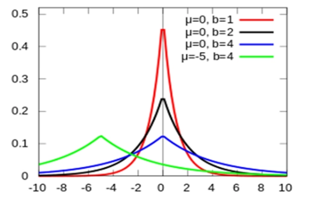

6. **隐私计算**

	- 定义：

		- **隐私计算是面向隐私信息全生命周期保护的计算理论和方法**，是隐私信息的所有权、管理权和使用权分离时隐私度量、隐私泄漏代价、隐私保护与隐私分析复杂性的可计算模型与公理化系统

	- 地位：

		- **隐私计算是泛在网络空间隐私信息保护的重要理论基础**

	- 在处理视频、音频、图像、图形、文字、数值、泛在网络行为性信息流等信息时，对所涉及的隐私信息进行 **描述、度量、评价和融合** 等操作，形成一套符号化、公式化且具有量化评价标准的隐私计算理论、算法及应用技术，支持多系统融合的隐私信息保护

7. **隐私保护的法律法规**

	- HIPAA

	- Regulation P(Privacy of Consumer Financial Information)

	- FACT(Fair and Accurate Credit Transaction Act 2003)

	- GDPR(General Data Protection Reform)

	- 网络安全法

	- 个人信息保护法

8. **云计算**

	- 定义：

		- 云计算是一种基于网络访问、以按需分配、共享使用的方式对物理计算资源进行供应和管理的模式

	- 云部署方式

		- 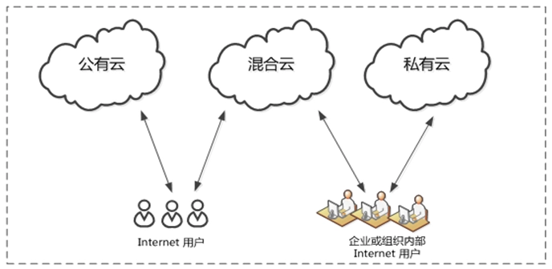

	- 云计算服务模型

		- SaaS

		- PaaS

		- IaaS

	- **云计算基础：虚拟化技术**

		- 裸金属架构

			- VMware vSphere， Xen， Hyper-V， KVM 

		- 寄居架构

			- VMware Workstation， VirtualBox

		- 容器

			- Docker

		- 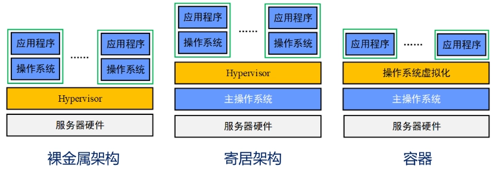

9. **云计算安全**

	- 云基础设施安全

		1. 虚拟机逃逸

			- 利用虚拟机管理软件或者虚拟机中 **运行软件的漏洞**，控制虚拟机管理系统或者在 **宿主机上运行恶意软件**，进而获得 **其他虚拟机的完全控制权限**

		2. 边信道攻击

			- 攻击者 **控制的虚拟机与目标虚拟机使用相同的物理层硬件**，二者交替执行。攻击者首先借助恶意虚拟机访问共享硬件和缓存，然后在交替执行的过程中通过边信道信息来推断出目标虚拟机的行为，识别相应的信息，最终导致目标虚拟机内的用户数据泄露。

		3. 网络隔离

			- 云计算平台中，数据包在虚拟网络中移动，不用通过物理网络传输，在物理网络上的监控和过滤工具永远看不到这些流量，在多租户的公有云网络中引发的安全问题尤为显著

		4. 镜像和快照的安全

			- 云计算平台往往通过特定的镜像来创建虚拟机或者服务实例；

			- 攻击者通过入侵虚拟机管理系统并感染镜像，可以大幅提升攻击的效率和影响范围。若攻击者非法恢复了快照，历史数据将被清除，攻击行为将被彻底隐藏

	- 云数据安全

		1. 云存储数据安全

			- **云加密数据库**

				- 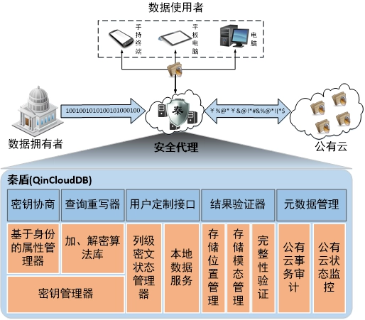

			- **密文搜索**

				- 可搜索加密技术是搜索技术和加密技术的结合。可搜索加密能够实现将用户的数据进行特殊的加密后上传到云服务器上，并且可以实现根据关键字进行检索的功能，在方便用户使用的过程中，也保护了文件的隐私安全。

				- 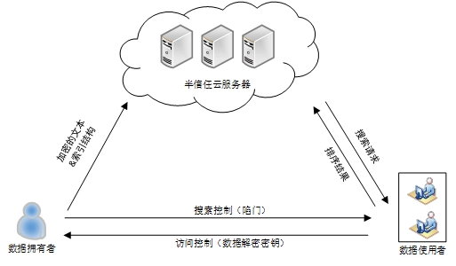

				- 当前可搜索加密机制分为： 

					1. 对称可搜索加密(Symmetric Searchable Encryption SSE)

						- 对称可搜索加密的构造通常基于伪随机函数，具有计算开销小、算法简单、速度快的特点。

						- 除了加解密过程采用相同的密钥外，其陷门生成也需密钥的参与。

						- 单用户模型的单用户特点使得对称可搜索加密非常适用于该类问题的解决：用户使用密钥加密个人文件并上传至服务器，检索时，用户通过密钥生成待检索关键词陷门，服务器根据陷门执行检索过程后返回目标密文。

					2. 非对称可搜索加密(Asymmetric Searchable Encryption ASE)

						- 非对称可搜索加密使用两种密钥：公钥用于明文信息的加密和目标密文的检索，私钥用于解密密文信息和生成关键词陷门。

						- 非对称可搜索加密算法通常较为复杂，加解密速度较慢，然而，其公私钥相互分离的特点，非常适用于多用户体制下可搜索加密问题的解决：发送者使用接收者的公钥加密文件和相关关键词，检索时，接收者使用私钥生成待检索关键词陷门，服务器根据陷门执行检索算法后返回目标密文。

						- 该处理过程避免了在发送者与接收者之间建立安全通道，具有较高的实用性。

					- 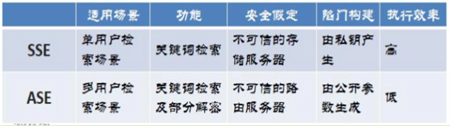

		2. 云计算数据安全

			- 保密计算旨在保护使用中的数据。

				- 通过加密数据，让云服务器在密文数据上进行计算。

				- 相关技术：同态加密、特定计算安全外包、可验证外包计算

				- 

			- **基于 SGX 的保密计算**

				- SGX(Software Guard Extensions)，是 Intel CPU 提供的可信执行环境，可以为云上数据代码的完整性和保密性提供芯片级的安全保障。

					1. 在计算平台上提供一个可信的空间，保障用户关键代码和数据的机密性和完整性。

					2. 把应用程序分为两部分：安全应用程序和非安全应用程序；

					3. 将合法软件的安全操作封装在一个 `飞地`(enclave)中；

					4. 当调用 enclave 函数时，只有 enclave 内部的代码才能查看其数据，并始终拒绝外部访问；当调用结束时，enclave 的数据会留在受保护的内存中。

					5. 注：一个 CPU 中可以存在多个 `飞地`，大家互不干扰，同时进行自己秘密的操作。

		3. 云共享数据安全

			- 数据拥有者通常会将数据加密后上传到云端，给数据共享带来困难。

				- 大规模用户的数据共享需要大量密钥，生成、分发和保管这些密钥困难

				- 如何制定灵活可控的访问策略，实施细粒度的访问控制，会成倍增加密钥数量

				- 用户访问权限更新或撤销时，需要重新生成信的密钥，计算量大

				- 相关技术：基于属性的加密技术(Attributed Based Encryption ABE)、访问策略表达技术、访问权限撤销技术、访问控制效率增强技术

			- **CP—ABE(密文策略属性加密)**

				- 在 ABE 系统中，用户的密钥和密文被标记为描述性属性集，而特定密钥只有在密文的属性与用户密钥之间匹配的情况下才能解密特定的密文。

					- 以属性作为公钥对用户数据进行加密

					- 用户的私钥也和属性相关，只有当用户私钥具备解密数据的基本属性时，用户才能够解密出数据明文，当密文和私钥之间至少 K 个属性重叠时，密码系统允许解密。

				- CP-ABE：将访问控制策略嵌入到密文当中，只有当用户拥有满足访问控制策略的属性集合及其对应的私钥情况下才能解密密文。

				- 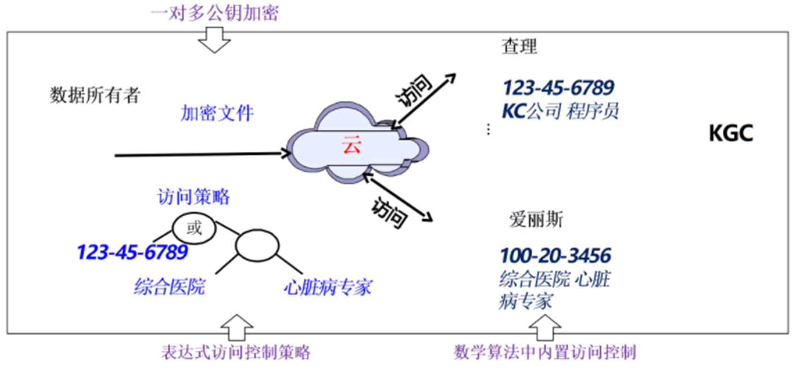

10. **比特币与区块链**

	- 区块链

		- 2008 年 11 月，中本聪(Satoshi Nakamoto)发表 Bitcoin: A Peer-to-Peer Electronic Cash System，提出了无中心电子现金系统

		- 区块链是比特币的底层技术

		- 区块链是一个公开、透明的分布式账本

		- 区块链是一条 **哈希链**，**用哈希串联信息**，实现完整性，防止篡改，公开验证

		- 区块链具有不可篡改性。

			- 区块链中存储的交易信息每一条都有相对应的 Hash 值，由每一条记录的 Hash 值作为叶子节点生成二叉 Merkle 树。

			- Merkle 树的根节点（Hash 值）保存在本区块的块头部分，区块头部除了当前区块的 Merkle 树的根节点，还保存时间戳以及前一个区块的 Hash 形成一条链式结构。

			- 因此，要想篡改区块链中的一条记录，不仅要修改本区块的 Hash 值，还要修改后续所有区块的 Hash 值，或者生成一条新的区块链结构，使得新的链比原来的链更长。

			- 实际上，这是很难实现的。一般一个区块后面有 6 个新的区块生成时，即可认为该区块不可篡改，可以将该区块加入到区块链的结构中。

	- 区块

		- 比特币网络中，**数据以文件的形式被永久记录，称这些记录为区块**

		- 新区块一旦被记录在区块链上，就不能被改变或者删除

			- **时间戳** 记录特定的数据生成时间

			- 默克尔树用来存储当前区块的所有交易信息

			- 难度系数用于控制区块的生成速度，**比特币每 10 分钟产生一个区块**

		- 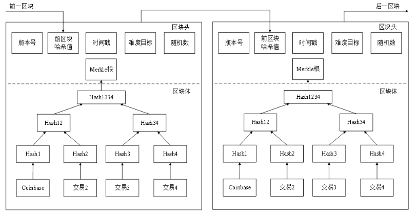

	- 共识机制

		- 网络中各个参与节点需要 **确认交易的机制**，使得在网络中存在故障或不可信节点的情况下，区块链网络中的交易能按照预期的正确方式执行，**确保各个节点最终结果的一致性**。

		- e.g.

			- PoW(Proof of Work) 算力证明机制

			- PoS(Proof of Stake) 权益证明机制

			- DPoS(Delegated Proof of Stake) 股份授权证明机制

			- PBFT(Practical Byzantine Fault Tolerance)拜占庭容错算法

	- 智能合约

		- 智能合约是 **运行在链上并可针对区块链数据库进行读写操作的代码**，可以自动执行参与方指定的数字契约

		- 特点:

			- 无须中介，满足合约条件即可自动执行与验证计算机协议

			- 最小化意外或恶意情况的发生

			- 最小化信任中介职能

			- 降低仲裁以及强制执行的成本

			- 降低违约带来的损失

		- 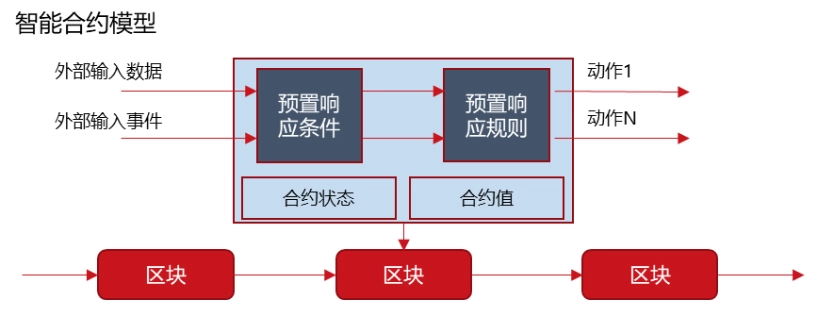

	- 区块链主要类型

		- **公有链**

			- 自由加入和退出(比特币、以太坊等)

		- **联盟链**

			- 通过授权加入和退出(Hyperledger、R3)

		- **私有链**

			- 私有机构单中心网络

	- 区块链的安全

		- **51%算力攻击**：当攻击者掌握了超过全网 50%的算力，就很容易阻止其他节点确认交易，也可以逆转当前区块已经完成的交易，并在网络中双花电子货币。2018 年，Zencash、Verge、Ethereum Classic 就受到了 51%攻击

		- **攻击交易所**：加密货币交易所拥有大量的加密货币，若安全防范措施不到位，成为黑客们关注的目标。当前对交易所的攻击频发，数字货币被窃时有发生

		- **软件漏洞**：2018 年钱包和去中心化 APP 的软件 bug 导致了超过 2400 万美元的损失。需要完备的代码审计、渗透测试和智能合约监控

		- **隐私泄露**：公有链数据可以公开获取，通过大数据关联分析，可能对特定用户去标识化，从而泄露用户隐私信息。

	- 区块链的安全事件
		<!-- - 零时科技 联合多家媒体共同发布《2019 年度区块链十大安全事件》：51%算力攻击

		- 2019 年 3 月 29 日，韩国知名数字货币交易所 Bithumb 疑似遭到黑客攻击，黑客窃取了价值 1000 万多美元的 EOS 和价值 600 万多美元的 XRP；

		- 2019 年 3 月 24 日，新加坡 DragonEx 交易所遭到黑客入侵，被盗价值 600 余万元的数字货币，黑客使用含有 0day 的软件进行钓鱼攻击。

		- 2019 年 5 月 7 日，知名数字货币交易所发出公告称，黑客从币安热钱包中盗取了 7000 枚比特币，价值数千万美元。 -->

11. **人工智能**

	- 主要技术领域

		- 自然语言处理

			- 通过计算机对自然语言的分析，对词法、句法、语法和语义进行理解分析，实现人机信息交流

		- 计算机视觉

			- 让计算机具备理解图像表示内容、图像中物体存在的关系等能力。如文字识别、图像处理、图像识别

		- 数据挖掘

			- 从数据中提取出具有潜在价值的信息和知识。如用户精准画像，智能推荐等

		- 深度学习

			- 通过建立模拟人脑分析学习的神经网络对数据进行解释。常见的深度学习模型：卷积神经网络(CNN)、循环神经网络(RNN)、对抗生成网络(GAN)和强化学习(RL)等

	- 安全问题

		- 对抗样本

			- 对待预测样本添加特定很小的扰动或者进行细微的修改，使模型对于该样本判断出错，“熊猫”图像添加少量噪声后就会被识别为长臂猿，且可信度为 99.3%

		- 模型萃取

			- 通过构造请求向目标服务发起查询，取得目标模型参数或者构造出与目标模型功能相似可替代的模型

		- 投毒攻击

			- 在模型训练过程中修改训练数据集或者投放精心构造的恶意样例，来使训练数据中毒或者被污染，从而干扰机器学习模型的训练过程，降低最终得到模型的判断准确性

		- 训练数据窃取

			- 攻击模型训练集，获得训练数据集的具体样本及统计分布，或者判断某条数据是否在该训练数据集中

	- 人工智能与网络空间安全的影响

		- 复杂性挑战：

			- 复杂的技术构成和应用场景势必会产生新的安全漏洞

		- 网络犯罪

			- 伪造语音、图片、视频，生成虚假内容，识别验证码

		- 隐私保护侵犯

			- 收集、识别个人隐私，精准画像

		- 不确定性风险

			- 人工智能不可控，产生意外损害

		- 智能网络攻防

			- 自动化的网络攻防

		- 人工智能伦理

			- 人工智能与人类的关系，是否会取代人类