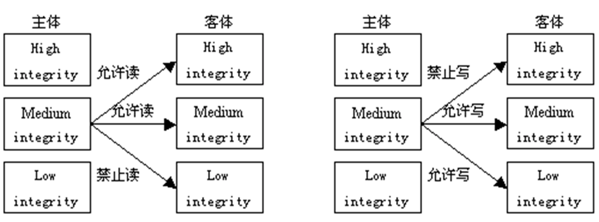

# 第四章 系统安全基础

- [Back to Course Home](index.md)

## 系统安全思维

1. **系统安全指导思想**
	- **系统安全定义**：
		- 是指在**系统生命周期内**应用**系统安全工程**和**系统安全管理**方法，辨识系统中的隐患，并采取有效的控制措施使其危险性最小，从而使系统在**规定的性能、时间和成本范围内**达到**最佳**的安全程度。
	- 网络空间系统安全：
		- 以系统思维应对安全问题；
		- 应对系统所面临的安全问题，以整体的观点看待系统。
	- 指导思想：在系统思维的指引下，从**系统建设、使用和全生命周期**应对系统所面临的安全问题，正视系统的**体系结构**对系统安全的影响，以**生态系统的视野**全面审视安全对策。

2. **系统安全的演进**
	- 

3. **系统与系统安全**
	- **系统定义**：
		- 一个系统（System）是由**相互作用**或**相互依赖**的**元素或成份**构成的某种类型的一个**统一整体**，其中的元素完整地关联在一起。
		- 位于系统边界内部的元素属于系统的**组成元素**
		- 位于系统边界外部的元素属于系统的**环境**
	- 观察系统的方法
		- 自外观察法：观察者位于系统之外对系统进行观察，通常是通过观察系统的输入和输出来分析系统的行为
		- 自内观察法，观察者位于系统之内对系统进行观察，此时，观察者属于系统的一个组成部分，通常是通过观察系统的外部环境来分析系统的行为
	- 在**网络空间中观察系统的环境**：系统在风险的包围之中，必须具有一定的安全性，才能正常运转。
	- **系统的安全性需要以系统化的视野去观察**

4. **整体论与还原论**
	- **还原论**：把大系统分解为小系统，然后通过对小系统的研究去推知大系统的行为。
		- 把系统分解成它的组成部分，通过对系统的组成部分的研究去了解原有系统的情况。
		- **局限性**：某些宏观性质是无法通过其微观组成部分的性质反映出来
	- **整体论**：把一个系统看成一个完整的统一体，一个完整的被观察单位，而不是简单的微观组成元素的集合。
		- 整体特性：
			- 综合特性：可以分解为系统组成部分的特性
			- 涌现性：不可还原（即不可分解）为系统组成部分的特性
				- **安全性属于涌现性**
		- 操作系统的分解：进程管理、内存管理、外设管理、文件管理、处理器管理。   

5. **核心理念及概念**
	- 网络空间系统安全知识领域的核心理念：
		- 保护对象
		- 思维方法（系统化思维方法）
			- **系统化思维方法运用到网络空间安全之中称为系统安全思维**

6. **系统工程及安全工程**
	- **系统工程**(Systems Engineering)：
		- 定义：涵盖系统生命周期的具有关联**活动和任务**的技术性和非技术性过程的**集合**。
		- 技术性过程应用工程分析与设计原则去建设系统
		- 非技术性过程通过工程管理去保障系统建设工程项目的顺利实现
		- 目标：获得总体上可信赖的系统，核心是系统整体思想

	- **系统安全工程**(Systems Security Engineering)：
		- 定义：把安全性相关活动和任务融合到系统工程的过程之中，形成的一个系统工程专业分支。
		- 力求从系统生命周期的全过程去保障系统的安全性
		- 系统的安全性值得信赖等价于系统具有可信的安全性

## 系统安全原理

1. **基本原则**
	- 在系统的设计与实现中应遵守的原则包括**限制性原则、简单性原则、方法性原则**
	- 

2. **威胁建模**
	- 威胁建模(Threat Modeling)：
		- **定义**：标识潜在安全威胁并审视风险缓解途径的过程。
		- 威胁(Threat)：给某物造成伤害或损失的意图
		- 风险(Risk)：某物遭受伤害或损失的可能性
		- 安全(Security)：某物能避免或抵御他物带来的潜在伤害或损失

3. **威胁建模方法**
	- 威胁建模目标：
		- **为防御者提供系统地分析应采取的控制或防御措施的机会**
	- 基本类型：
		- 以风险为中心
		- 以资产为中心
		- 以攻击者为中心
		- 以软件为中心
	- 典型方法：
		- STRIDE
			- 身份欺骗、数据篡改、抵赖、信息泄露、拒绝服务、特权提升的缩写
			- 具体步骤：
				1. 建立数据流图
				2. 标识系统实体、事件和边界
				3. 发现风险
		- PASTA
		- Trike
		- VAST 等

## 系统安全控制及管理

1. **安全控制**
	- **访问行为的形式化表示 (s, o, p)**
		- s：主体
		- o：客体
		- p：操作
		- 典型操作：read、copy、modify、execute
	- **授权的矩阵表示**
		- 矩阵 $M$ 
		- s：主体
		- o：客体
		- m：操作权限的集合，例如`m = {read, write}`
	- **微调的授权的矩阵表示**
		- 矩阵 $M^{R}$ 
		- r：角色
		- o：客体
		- m：操作权限的集合

2. **访问控制策略**
	- 访问控制策略 1
		- 构造访问控制矩阵 M ，给矩阵 M 中的元素赋值，对于任意 (s, o, p) 访问请求，在 M 中找到 s 和 o 交叉位置上的元素 m，当 p∈m 时，允许 (s, o, p) 执行，否则，禁止 (s, o, p) 执行
	- 访问控制策略 2
		- 构造访问控制矩阵 $M^{R}$ ，设计角色分配方案 $f_{R}$ ，给矩阵 $M^{R}$ 中的元素赋值，按方案 $f_{R}$ 给每个用户分配角色，对于任意 (u, o, p) 访问请求，u 表示用户，确定角色 $r = f_{R}(u)$ ，在 $M^{R}$ 中找到 r 和 o 交叉位置上的元素 m，当 p∈m 时，允许 (u, o, p) 执行，否则，禁止 (u, o, p) 执行
	- 访问控制策略 3
		- 制定主体等级分配方案 $f_{S}$ 和客体密级分配方案 $f_{O}$，设计主体等级与客体密级的对比方法 cmp，设定任意操作 x 应该满足的条件 con(x)，给每个主体分配涉密等级，给每个客体分配保密级别，对于任意 (s, o, p) 访问请求，当 $cmp(f_{S}(s), f_{O}(o))$ 满足条件 con(p) 时，允许(s, o, p) 执行，否则，禁止 (s, o, p) 执行

3. **安全控制-强制访问控制 MAC 模型**
	- Bell-Lapadula 安全模型
		- 
	- Biba 安全模型
		- 

4. **安全监测**
	- 系统完整性检查：从开机引导到应用运行，各个环节都进行检查，帮助发现系统中是否有重要组成部分受到篡改或破坏。
	- 病毒查杀和恶意软件检测：对系统中的各种文件进行扫描，帮助发现或清除进入到系统之中的大多数病毒或恶意软件。
	- 入侵检测：对恶意行为或违反安全策略的现象进行监测，一旦发现情况就及时报告，必要时发出告警。

5. **安全管理**
	- 安全管理(Security Management)：
		- 定义：在安全策略的指导下进行的一系列管理活动。把一个组织的资产标识出来，并制定、说明和实施保护这些资产的策略和流程。
		- 资产：系统、信息、机器、建筑物、人员
		- 安全管理策略
			- 管理的任务、目标、对象、原则、程序和方法。
		- 安全管理活动
			- 制定计划、建立机构、落实措施、开展培训、检查效果和实施改进等。

	- 把风险管理原则应用到安全威胁管理之中
		- 标识威胁
		- 评估现有威胁控制措施的有效性
		- 确定风险的后果
		- 基于可能性和影响的评级排定风险优先级
		- 划分风险类型并选择合适的风险策略或风险响应
		- 它聚焦系统的日常管理，讨论如何把安全理念贯穿到系统安全管理工作的全过程中，帮助系统管理人员明确和落实系统管理工作中的安全责任以便从系统管理的角度提升系统的安全性。

## 系统安全结构

1. **硬件系统安全**
	- 硬件安全关注于给软件提供什么样的安全支持，如何帮助软件实现想要的安全功能，以及硬件自身存在的安全隐患对系统安全的影响。
	- 处理器硬件从可用指令集和可用内存区域两个方面出发，定义了处理器工作的两种状态：
		- 内核态：操作系统用，看到所有的指令和地址空间
		- 用户态：其他程序用，看到其中部分的指令和地址空间
		- 用户态程序不能干扰内核态的程序。
	- **硬件安全涉及**：硬件设计、访问控制、安全多方计算、安全密钥存储、密钥真实性保障等方面。

2. **检查程序是否被篡改的基本方法**
	- 检查程序是否被篡改
		- 通过计算程序的摘要并与原始摘要对比来检查程序是否被篡改
	- 硬件防篡改方法：
		1. 提供密码计算功能
			- 通用处理器提供密码运算指令
			- 独立的安全密码处理器（密码加速器）
				- **硬件安全模块**（HSM）：用安全密码处理器芯片实现的硬件计算设备（密码处理+密钥管理和保护）
		2. 提供数字指纹（确定机器的身份）
			- 使用物理不可克隆函数（PUF）硬件器件实现

3. **操作系统安全**
	- **操作系统安全是系统安全的基础**：
		- 各种应用软件均建立在操作系统提供的系统软件平台之上，上层的应用软件要想获得运行的高可靠性和信息的完整性、保密性，必须依赖于操作系统提供的系统软件基础
	- 操作系统的安全可信性分为不同的级别
		- 
	- 操作系统建立**可信交互路径**，实现应用系统和加密功能的有效衔接
		- 
	- 操作系统安全功能：
		- 用户管理与身份认证
		- 自主访问控制
			- 文件的拥有者可以自主确定任何用户对该文件的访问权限
			- 访问权限既可以授给用户，也可以授给用户组
		- 日志功能
			- 记录系统中发生的重要活动的详细信息
		- 强制访问控制
			- 实现多级安全策略（MLS）等。

4. **数据库安全**
	- 数据库安全控制模型
		- 
	- **数据库系统**：
		- 定义：提供通用数据管理功能的软件系统
		- 构成：
			- 有数据库管理系统(DBMS)：为用户及应用程序提供数据访问，并具有对数据库进行管理、维护等多种功能
			- 数据库应用：按一定的方式存取数据  
	- **存取控制**：
		- 防止非授权的数据库存取
		- 防止非授权的对模式对象的存取
		- 控制磁盘使用
		- 控制系统资源使用
		- 审计用户动作
	- **数据库系统安全**：
		- 系统运行安全（法律政策安全；物理控制安全；硬件运行安全；操作系统安全；灾害故障恢复；死锁的避免与解除；电磁信息泄露的防止）
		- 信息安全（用户口令鉴别；用户存取权限控制；数据存取权限和方式控制；审计跟踪；数据加密）
	- **数据库系统的主要威胁**：
		- 非法访问数据库信息；
		- 恶意破坏数据库或未经授权非法修改数据库；
		- 用户网络访问数据库时受到各种攻击，如搭线窃听等；
		- 对数据库不正确的访问导致数据库数据的错误等
	- **数据库系统的安全需求**：
		- 完整性、可靠性、有效性、保密性、可审计性及可存取控制与用户身份鉴别等。
	- 在一般的计算机系统中，安全措施是一级一级层层设置的

5. **数据库访问控制**
	- 自主访问控制
		- 访问授权
		- 撤销授权
	- 数据推理
		- 根据**合法的非敏感数据**推导出**非法的敏感数据**
	- 对数据库数据进行非法间接访问
	- 推理威胁源自统计数据库：利用合法的统计数据推导出不合法的敏感数据
	- 强制访问控制/多级安全数据库
		- 根据数据的敏感程度，确定数据的敏感级别
	- 根据用户在工作中应该涉及的数据的敏感程度，为用户分配敏感等级
	- 可以基于表、字段或记录建立敏感级别

6. **数据库 SQL 注入攻击**
	- SQL 注入攻击是攻击者把 SQL 命令插入到 Web 表单的输入域或页面请求的查询字符串，欺骗服务器执行恶意的 SQL 命令。
		- 详细:SQL 注入攻击是指 Web 应用程序对用户输入数据的合法性没有判断，攻击者可以在 web 应用程序中事先定义好的查询语句结尾添加额外的 SQL 语句，以此来实现欺骗数据库服务器执行非授权的任意查询，从而进一步得到相应的数据信息。
	- SQL 注入一般存在于形如：http://xxx.xxx.xxx/abc.aspx?id=XX 等带有参数的 asp/aspx/php/jsp 等动态网页中。
	- **应对 SQL 注入攻击的办法**
	- 在应用系统的代码中添加对用户的输入进行严格检查的功能，禁止在输入中滥用转义字符

7. **基于 Web 的应用安全——论坛**
	- 例如，论坛中的跨站脚本（XSS）攻击，用户在评论中嵌入脚本，导致其他用户的敏感信息被传输到攻击者指定的服务器中。
	- 脚本
		- 定义：运行在网页服务器上的，使用一种特定的描述性语言，依据一定的格式编写的纯文本保存的程序，
		- 例如：ASP、PHP、CGI、JSP 等
		- 一般都是要结合数据库如 ACCESS、MSSQL、MYSQL、Oracle 等来使用
	- 跨站脚本攻击(XSS):
		- 在脚本中加入一些破坏计算机系统的命令，这样当用户浏览网页时，一旦调用这类脚本，便会使用户的系统受到攻击。
	- 安全风险
		- 攻击者可以劫持用户会话
		- 插入恶意内容
		- 重定向用户
		- 使用恶意软件劫持用户浏览器
		- 繁殖 XSS 蠕虫
		- 甚至破坏网站、修改路由器配置信息等

8. **cookie 攻击**
	- **Cookie**
		- 浏览器与服务器交互时，由 Web 服务器建立、发送，由(Web 客户端)浏览器保存的一些**赋值信息**，在后续交互时，浏览器会把这些信息返还给服务器，使服务器了解浏览器的过往行为
		- 简单的文本文件，约由 255 个字符组成，占 4KB 空间
		- 有些 WEB 服务能够收集有关用户的特定状态信息，用来在以后的会话中使用
		- Cookie 会帮把在该网站上所输入的文字信息或是一些选择和操作都纪录下来，并将**信息保存在用户的硬盘上**，这些信息将保存在用户的浏览器中，当**下一次用户连接到这个服务器时，浏览器就可以将合适的状态发送给服务器使用**，服务器依据 Cookie 里的内容来判断使用者，送出特定的网页内容，提高了浏览网页的效率
	- **安全性问题**在于它可能泄露用户的信息，欺骗（攻击者通过修改存放在客户端的 cookie 来达到欺骗服务器认证目的）等问题。
		- Cookie 包含的信息包括用户的 IP 地址、用户密码个人资料等重要信息，服务器对其检索不是在服务器上进行，而是在用户的硬盘上进行 

## 安全生态系统

1. **生态学系统/生态系统**
	- 物质循环和能量流动的相互影响以及来自亚系统的反馈共同构成一个自我调整的动态平衡
	- 生态系统是个控制论系统，包括生态系统中的信息网络、物理和化学信息连接起来的组分等。

2. **数字生态系统**
	- 数字生态系统是一个分布式的、适应性的、开放的**社会-技术系统**，受自然生态系统启发，具有自组织性、可伸缩性、和可持续性。数字生态系统模型受到了自然生态系统知识的启示，尤其是在形形色色的实体之间的竞争与合作的相关方面。

3. **网络空间生态系统**
	- 像自然生态系统一样，由形形色色的、出于多种目的进行**交互**的各种**成员**构成，主要成员包括私营企业、非营利组织、政府、个人、过程和网络空间设备等，主要设备包括计算机、软件、通信技术等

4. 生态系统视角下的安全威胁模型
	- 问题应对
		- 理念方面：把系统的概念拓展到生态系统的范围，重新认识安全威胁，重新构建安全模型；
	- 技术方面：要有新的支撑技术
	- 模型建立
		- 不但要考虑企业自身的安全因素；
	- 还必须考虑合作伙伴的安全因素。
	- 关键支撑技术
		- 自动化 Automation：让响应速度跟上攻击速度，而不是以人力的响应速度应对机器的攻击速度；
	- 互操作性 Interoperability：由策略而不是技术约束定义网络空间共同体，允许网络空间生态系统成员在自动化的团体防御中无缝地、动态地协作；
	- 认证 Authentication：为在线决策建立基础，由人员认证扩展到包含设备认证，设备可以是计算机、软件、或信息等。