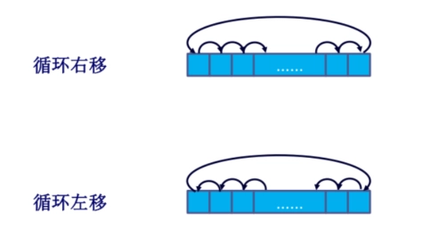

# Ch10 指令集：特征和功能

- [Back to Course Home](index.md)

## 机器指令的要素

- 操作码

- 源操作数引用

- 结果操作数引用

- 下一条指令引用

## 操作数个数

- 三地址：操作数 1，操作数 2，结果，$c=a+b$

- 双地址：其中一个地址既是操作数也存储结果，$a=a+b$

- 单地址：寄存器操作

- 零地址：pop，push 等

- 更多的地址：更复杂强大的指令，更复杂的 CPU，更少的程序指令数

- 更少的地址：更简单的指令和 CPU，更多的程序指令数

## 移位操作

1. 逻辑移位

	- 逻辑右移 1 位相当于：无符号整数除以 2

	- 逻辑左移 1 位相当于：无符号整数乘以 2

	- 

2. 算数移位

	- 算术右移 1 位相当于：带符号整数除以 2

	- 算术左移 1 位相当于：带符号整数乘以 2

	- 

3. 循环移位：

	- 保留所有被处理的位，检查某一位的状态，高低位交换

	- 循环右移 & 循环左移

	- 

## 数端

- 大数端(big-endian ordering)：最高有效字节存放在最低的地址上

- 小数端(little-endian ordering)：最高有效字节存放在最高的地址上

## 内存对齐

- 内存对齐是指数据在内存中存放时，地址必须是某个特定值的倍数，以提高访问效率。

- 例如，32 位数据要求在 4 字节对齐的地址上存放，64 位数据要求在 8 字节对齐的地址上存放。