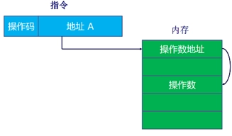
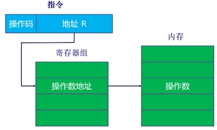
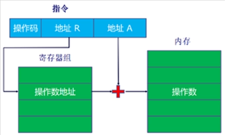

# Ch11 指令集：寻址方式和指令模式

- [Back to Course Home](index.md)

### 符号说明：

- $A$：指令中出现的地址/数据的内容

- $R$：指令中出现的寄存器存储的地址/数据的内容

- $EA$：被访问位置的实际有效地址

- $(X)$：位置 $X$ 的内容

## 立即寻址

- 操作数 = $A$

- 优点：不要求存储访问，速度快

- 缺点：操作数范围受限

## 直接寻址

- $EA = A$，即实际访问位置的地址写在指令中。

- 优点：只需要一次内存引用。

- 缺点：地址范围受限。

- 

## 间接寻址

- $EA = (A)$，即指令中存储的地址指向一个内存位置，该位置存储着实际访问位置真正的地址。

- 优点：地址范围更大。

- 缺点：需要两次内存引用（第一次获取真正地址，第二次获取实际数据）。

- 

## 寄存器寻址（类似直接寻址）

- $EA = R$，即指令中存储的地址指向一个寄存器，实际访问内容存储在该寄存器中。

- 优点：无需内存引用；指令中寄存器地址通常较短。

- 缺点：寄存器地址空间有限。

## 寄存器间接寻址（类似间接寻址）

- $EA = (R)$，即指令中存储的地址指向一个寄存器，该寄存器存储着实际访问位置的真正地址。

- 优点：地址范围更大；相比间接寻址只需一次内存访问；指令内地址更短。

- 

## 偏移寻址（寄存器间接寻址和直接寻址的结合）

- $EA = (R) + A$，实际地址由寄存器内容与指令内地址相加得到。

	- 相对寻址：

		- $R = PC$，$A$ 为补码，有效地址 = 指令地址 + 偏移量（可正可负）。

	- 基址寄存器寻址：

		- $(R)$ 为基址，$A$ 为偏移量（相对寻址是其特例）。

	- 变址寻址：

		- $A$ 为基址，$(R)$ 为偏移量，常用于迭代场景。

- 

## 堆栈寻址

- 操作数在栈顶，通过指令隐式对栈顶进行操作

- 本质是通过存储在寄存器中的栈指针进行寄存器间接寻址，对栈顶元素进行操作。