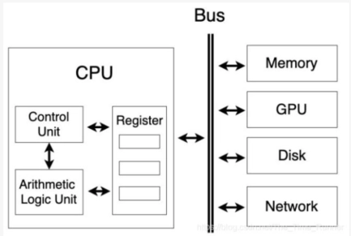
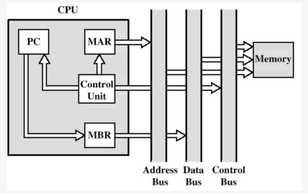
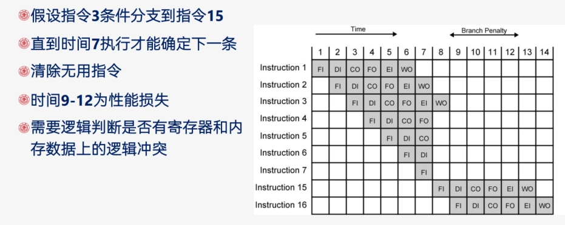

# Ch12 CPU 结构和功能

- [Back to Course Home](index.md)

## CPU 内部结构

- 包含 ALU（算术逻辑单元）、CU（控制单元）、寄存器组、状态标志等。
- 内部处理器总线用于在 ALU 和寄存器间传递数据，因 ALU 仅能操作 CPU 内部存储数据。

## 寄存器组织

1. 用户可见寄存器：
   - 通用寄存器：多功能用途。
   - 数据寄存器：仅存储数据。
   - 地址寄存器：可能通用或专用于特定寻址模式（如栈指针）。
   - 设计问题：通用化灵活但指令长；专用化指令短但不灵活；寄存器数量过少需频繁访存，过多则收益不显著。
2. 控制和状态寄存器：
   - 程序计数器（PC）：保存下条指令地址。
   - 指令寄存器（IR）：存储最近读取的指令。
   - 内存地址寄存器（MAR）：保存地址，与地址总线直接相连。
   - 内存缓冲寄存器（MBR）：保存数据，与数据总线直接相连。
   - 程序状态字（PSW）：包含条件码等状态信息。

## 指令周期的数据流

1. 取指周期
	- 下条指令地址：PC → MAR → 地址总线 → 主存。
	- 指令：主存 → 数据总线 → MBR → IR，同时 PC++（除非指令修改 PC）。
	- 
2. 间接周期（如有）
	- MBR 的低 N 位 → MAR → 地址总线。
	- 
3. 执行周期
	- 复杂多样，取决于具体指令。
4. 中断周期
	- PC 复制到 MBR，特定地址由控制单元给 MAR，MBR 数据存至主存。
	- PC 装载中断服务程序地址
	- 

## 流水线技术

1. 经典六阶段流水：
	- 取指令(FI)
	- 指令译码(DI)
	- 计算操作数(CO)
	- 取操作数(FO)
	- 执行指令(EI)
	- 写操作数(WO)
2. 条件转移与流水线总清：
	- 条件转移可能导致流水线停顿，需清空流水线并重新取指。
	- 
3. 流水线性能增强的限制：
	- 访存冲突（FI，FO，WO）
	- 每个指令执行时间不完全相同
	- 转移指令
	- 中断
4. 流水线阶段并非越多越好：阶段越多开销越大，单指令执行时间越长，且相关性更复杂。
5. 流水线性能
	- 流水线周期时间：通过流水线把一组指令推进一个阶段所需时间

	    $$
	    \tau = \tau_m + d
	    $$

	    其中 $\tau_m$ 为最大阶段延迟，$d$ 为锁存器延迟（通常可忽略）。

	- n 条指令总时间：

	    $$
	    T_{k,n} = [k + (n-1)]\tau
	    $$

	    （k 阶段流水线，无分支）。

	- 加速比：

	    $$
	    S_k = \frac{nk\tau}{[k + (n-1)]\tau} = \frac{nk}{k + n - 1}
	    $$

	    当 $n\rightarrow\infty$ 时，$\lim S_k = k$。

6. 流水线冲突：流水线由于条件不允许继续执行而停顿
	- 资源冲突：
		- 访存冲突（FI/FO/WO 同时请求内存）
		- ALU 冲突（多条指令同时需 ALU）
	- 数据冲突：
		1. 写后读（RAW）：前指令修改数据，后指令读取时数据未更新。
		2. 读后写（WAR）：后指令写数据时，前指令尚未读取该数据。
		3. 写后写（WAW）：后指令写数据覆盖前指令未完成的写操作。

## 条件分支处理

- 多指令流：复制流水线初始部分，同时取两条指令，但可能引发资源争用。
- 预取分支目标：识别转移时取两个分支指令，仅做取指和译指直至某分支执行。
- 循环缓冲区：存储最近取的顺序指令，转移时检查目标是否存在，适用于循环。
- 分支预测：
	- 静态预测：如预测从不跳转、总是跳转、按操作码预测。
	- 动态预测：如 1 位预测（根据上次跳转预测）、2 位预测（连续两次失败才反转预测）。

## 转移历史表

- 在预测分支并取来转移目标指令时，条件转移语句还没完成译指、计算操作数，无法得到转移目标语句的地址。
- 转移历史表：通过表格维护转移目标
	- 分支语句的地址
	- 转移目标语句的地址
	- 转移历史位
- 预测转移时：
	- 从表中直接查询得出转移目标地址
	- 如果该分支语句在表中不存在：等到操作数计算完成后，加入表中