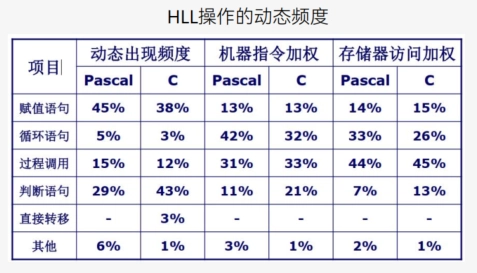
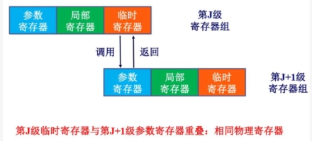
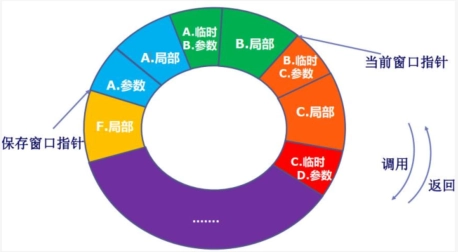
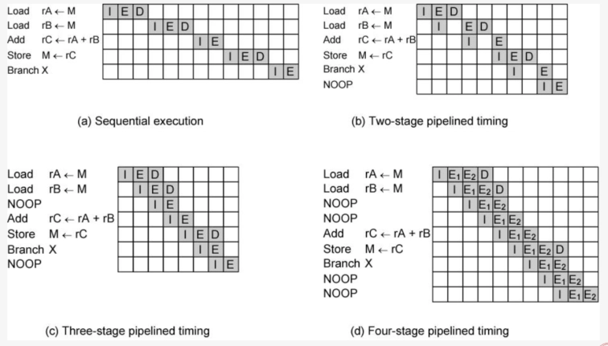
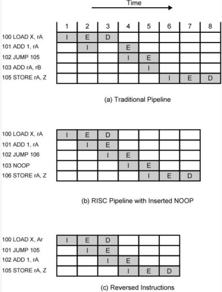

# Ch13 精简指令集计算机 RISC

- [Back to Course Home](index.md)

## RISC 的主要特性

- 大量通用寄存器，使用编译器优化寄存器用法。
- 有限、简单的指令集。
- 强调优化指令流水线。

## 现代精简指令集的特点

- 每个机器周期一条指令。
- 寄存器-寄存器操作。
- 简单的寻址模式和指令格式。

## CISC

1. 朝向 CISC 的原因：
	- 出现了功能强大的复杂高级程序设计语言（HLL）
	- 导致程序设计语言与汇编语言之间的语义间隙增大
	- 出现了更复杂的机器指令、寻址方式，硬件实现的 HLL 语句
2. CISC 的目标：
	- 提高执行效率
	- 简化编译
	- 用复杂的机器指令执行复杂的 HLL 语句

## 对 HLL 操作的研究

- HLL 操作动态频度：过程调用在机器指令加权和存储器加权下占比很高，尤其存储器加权场景。
- 操作数：局部标量变量占多数，数组/结构次之。
- 过程调用：
	- 非常耗时的原因：
		- 过程传递的参量和变量数、过程嵌套深度
		- 大部分过程调用的传送的参变量、使用的局部标量变量不多
		- 很少出现长的一系列调用跟着一系列返回
- 结论：
	- 过程调用是 HLL 中最耗时的操作，应该优化
	- 优化方法：优化寄存器的使用（从而减少访存）；优化流水线（减少分支影响）；

## 优化方法
### 大寄存器组（硬件方案）

- 依据/适用情况：参数、局部变量少，调用深度有限
- 寄存器（几百个）分为很多个组，每个过程对应一组寄存器
- 发生过程调用时，直接切换到另一个寄存器组（将过程调用优化为寄存器访问）
- 对程序，任何时刻只有一组寄存器可见
- 解决参数和返回值传递：

	

- 解决全局变量：用一组全局寄存器，所有过程可见
- 解决深度过深：将一部分寄存器存储在内存中
- 进一步优化：环形寄存器组织

	

### 寄存器优化（软件方案）

1. 编译器的优化
	- 编译器为每个变量指派一个虚拟寄存器
	- 并通过某种方法将虚拟寄存器映射到真实寄存器
	- 生命周期不重叠的虚拟寄存器可以共享同一个真实寄存器
	- 实在安排不下，就考虑内存
2. 实现方法：图着色法
	1. 画点，每个点代表一个虚拟寄存器
	2. 连线，在两个生命周期有重叠的虚拟寄存器之间连线
	3. 着色，若有 n 个真实寄存器，则尽量用 n 种颜色给图上色，要求相邻（有连线）的节点颜色不能相同；无法上色的节点就存在内存里。

	

## RISC 流水线
### 流水线的效果

### 流水线优化

- 空指令（NOOP）：在流水线阶段插入空操作，解决数据相关性，保证指令顺序执行。
	- 
- 延迟转移：交换分支指令与前序指令位置，使分支延迟期间执行有效指令，适用于无条件分支。
	- 
- 循环展开