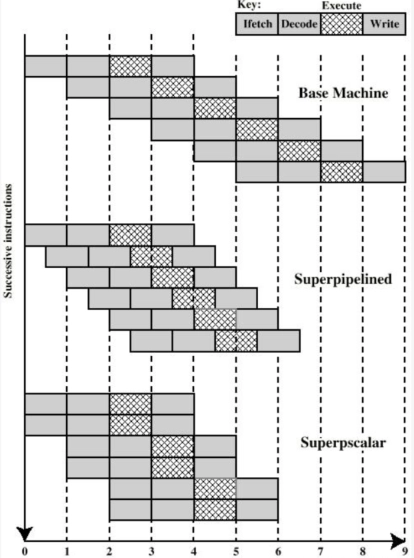

# Ch14 指令级并行性和超标量处理器

- [Back to Course Home](index.md)

## 超标量和超流水的区别

- 超标量：多条指令同时启动独立执行，即多条流水线
- 超流水：流水线阶段时间短于时钟周期，内部时钟速率加倍，外部周期内发两条指令。

## 指令相关性

1. 数据相关性：访问操作数的位置有冲突
	1. 写后读（RAW）或真相关：
		- 一条指令修改寄存器或内存位置，后续指令读取该内存或寄存器位置中的数据。
		- 冲突：写操作完成之前发生了读操作
	2. 读后写（WAR）或反相关
		- 冲突：读操作发生前完成了写操作
		- 乱序发射会造成读后写冲突（按序发射一定不会出现前面的指令还没开始执行后面的指令已经执行完成的情况）
	3. 写后写或输出相关
		- 冲突：写操作的顺序与预期顺序相反
		- 乱序完成会造成写后写冲突
2. 过程相关性
	- 即转移后的指令不能再转移指令未执行前执行
	- 超标量中，若某条流水线上发生了分支预测错误，则所有流水线上都要进行流水线总清！
3. 资源相关性
	- 访存冲突、ALU 冲突

## 乱序执行

- 按序发射按序完成：指令按顺序发射和完成，可能因相关性停顿。
- 按序发射乱序完成：指令按序发射，完成顺序可乱序，可能会造成写后写相关性，引发 WAW 冲突。
- 乱序发射乱序完成：指令发射顺序可乱序，需指令窗口检测相关性，可能会造成读后写相关性，引发 WAR 冲突。

## 寄存器重命名：解决写后写和读后写相关性

- 产生写后写相关性和读后写相关性的原因：
	- 寄存器值不再反应程序流顺序
- 解决方法：
	- 寄存器重命名
		- 由 CPU 硬件动态分配寄存器
		- 每产生一个新的寄存器值就分配一个新的真实寄存器