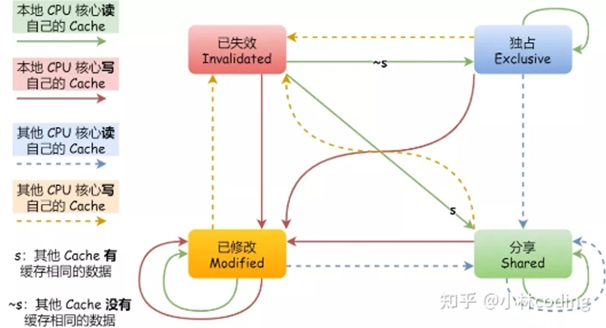
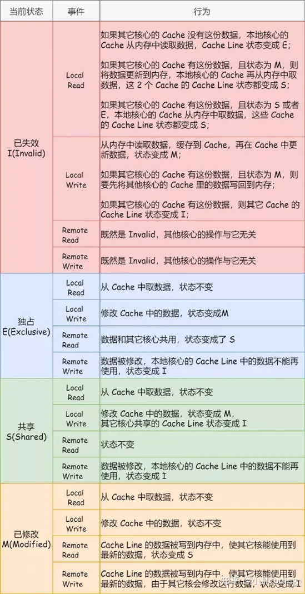

# Ch17 并行处理

- [Back to Course Home](index.md)

## 并行处理机分类

- 单指令单数据流（SISD）：传统单处理器。
- 单指令多数据流（SIMD）：同一指令对不同数据组在不同处理器执行。
- 多指令单数据流（MISD）：未实现。
- 多指令多数据流（MIMD）：分为紧耦合、松耦合。

## 紧耦合

- 处理器共享存储器，通过共享存储器相互通信

### 对称多处理器（SMP）

1. 定义
	- 共享内存、IO，通过共享总线分时共享
	- 存储器在任何范围内的存储时间对各个处理器大致相同
	- 所有处理器能完成同样的功能(对称)，地位平等
	- 系统由一个集中式操作系统控制
2. 优点：
	- 性能好，可以并行执行
	- 可用性，单个故障总体不会停机
	- 增量式增长和可扩展性

### 非一致性内存访问（NUMA）
存储器在不同范围内的存储时间对不同处理器是不同的

## Cache 一致性问题与 MESI 协议

1. 问题：
	- 同一数据在不同的 Cache 中都有副本
	- CPU 读取数据时会先检查 Cache，导致不同的 CPU 眼里的内存不一样
	- 回写显然会导致不一致，写直达也会，不过可以通过监听消除
2. 目录协议
	- 收集维护有关数据块的副本放在哪里的信息
	- 目录放在主存中
	- 优点：适用于多总线或复杂的大型系统
	- 缺点：产生了中央瓶颈
3. 监听协议
	- Cache 必须识别每一行是否共享、是否与主存相同
	- 优点：适合使用总线的多处理机
	- 缺点：增大了总线传输量
	- 有两种策略：
		1. 写-失效：适用于回写
			- 多个监听者，单个修改者
			- 某 Cache 写操作时，其他 Cache 中的该行数据失效
			- 发出写操作的处理器将获得数据独享直到其他 Cache 访问该行
			- 例子：MESI 协议
		2. 写-更新：适用于写直达
			- 多个读者，多个写者
			- 更新的字被广播到其他 Cache

### MESI 协议

- M（Modified）：已修改，数据仅在本 Cache，未写回主存。
- E（Exclusive）：独占，数据在本 Cache 和主存，其他 Cache 无副本。
- S（Shared）：共享，数据在本 Cache 和主存，其他 Cache 有副本。
- I（Invalid）：失效，数据不在本 Cache 或已过时。

## 松耦合（如集群）

- 独立处理器或 SMP 互联，分布式存储器，通信通过网络。
- 优点：可扩展性强、可用性高、性价比高。

## 集群与 SMP 对比

- 共同点：
	- 提供多处理器支持高端应用
	- 均商用化，SMP 历史更久。
- SMP 优点：
	- 易于配置管理
	- 接近单处理器模型
	- 占用物理空间小
	- 耗电少
	- 稳定
- 集群优点：
	- 运行中可增减机器
	- 高增量
	- 绝对可扩展性强
	- 高可用性