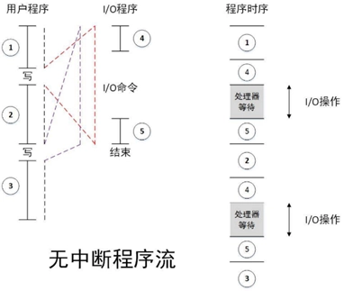
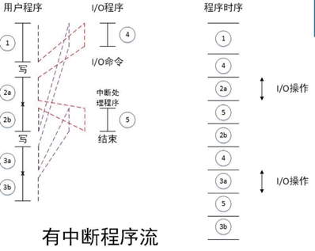

# Ch3 计算机功能和互连的顶层视图

- [Back to Course Home](index.md)

## 计算机的寄存器

- PC：程序计数器，保存下条要执行的指令的地址

- IR：指令寄存器

- MAR：内存地址寄存器，保存地址

- MBR：内存缓冲寄存器，保存数据

## 机器周期和指令周期

1. 机器周期（CPU 周期）：

	- 定义：从寄存器中取出两个数，执行一次 ALU 操作，并将结果存回寄存器所需时间

	- 人为规定的对一条指令执行过程的划分

	- 一个机器周期一般包含了多个时钟周期，一个指令周期包含了多个机器周期；一个指令周期包含多个流水线阶段，一个流水线阶段包含了一至多个机器周期。

2. 指令周期：单条指令所需要的处理时间，可粗略分为取指周期和执行周期

	- 取指周期：

		- CPU 从 PC 获得地址并读取该地址存储的指令，PC++（除非指令修改 PC），指令被加载到指令寄存器 IR，CPU 译指

	- 执行周期：

		- 计算操作数地址，获取操作数（从内存或 IO 到 CPU），数据操作，数据保存（从 CPU 到内存或 IO）

## 中断

1. 类型：

	- 程序中断（溢出、除 0）

	- CPU 定时器中断

	- IO 中断

	- 硬件故障

2. 无中断程序：

	- CPU 必须等待 IO 操作完成才能执行自己的下一条指令，图中的④表示为 IO 操作做准备的一系列指令，⑤表示 IO 操作完成后用来完成操作（收尾，比如设置标志之类）的一系列指令。

	- 

3. 中断：

	- CPU 在调用 IO 时仅执行④（准备代码和实际 IO 指令），之后马上返回用户程序。

	- 在 IO 操作的过程中，CPU 也在执行用户程序指令。

	- 在 IO 完成 IO 操作后，即 IO 准备好接受服务后，IO 向处理器发出中断请求信号。

	- 处理器响应中断请求，挂起当前程序，执行中断处理程序（图中的⑤）。

	- 中断处理程序执行完成后，CPU 恢复用户程序的执行。

	- 

4. 中断周期：指令周期的一部分

	- 处理器检查是否有中断请求，若没有，则执行下一条指令；若有，则：

		- 挂起当前程序，保存上下文；

		- 将 PC 设置为中断处理程序的起始地址；

		- 处理中断；

		- 恢复上下文并继续执行被中断的程序。

5. 多中断：两种解决方法

	- 禁止中断：

		- CPU 在处理中断时禁止其他中断；

		- CPU 处理完当前中断后检测是否还存在未响应的中断；

		- 中断严格按照顺序处理。

	- 定义优先级：高优先级中断可中断低优先级中断，嵌套处理。

## 计算机顶层互联

1. 内存：

	- 输入：读写控制信号，地址，数据

	- 输出：数据

2. IO 模块：通过多个端口控制多个外设

	- 输入：读写控制信号，地址，来自计算机的数据，来自外设的数据

	- 输出：送给 CPU 的数据，送给外设的数据数据，中断信号

3.  CPU：

	- 输入：指令、数据、中断信号

	- 输出：地址、控制信号、数据

## 计算机总线：
连接两个及以上设备的共享的通信通道，一次只能有一个设备传输成功

1. 系统总线：连接主要计算机组件（CPU、M、IO）的总线

	- 系统总线又分为：

		- 数据总线：数据总线的宽度是决定系统整体性能的关键因素，称为字长。

		- 地址总线：地址总线的位宽决定了系统可能的最大内存容量。

		- 控制总线、控制对数据总线、地址总线的访问和应用。

2. 总线类型：

	- 专用总线：数据线和地址线分离

	- 复用总线：数据和地址共享线路，靠数据有效/地址有效控制。线路少，单控制复杂，性能低

3. 单一总线：传输延迟、总线带宽瓶颈

4. 总线仲裁：

	- 不止一个模块能控制总线，但同一时刻只有一个模块能控制总线。

	- 集中式：总线仲裁器控制总线的访问

	- 分布式：每个模块都能宣布对总线的控制

5. 时序

	- 同步时序：时钟信号决定事件发生，一个 0-1 变化称为一个总线周期，通常以上升沿同步，通常一个总线周期对应一个事件。

	- 异步时序：完全依赖线路引脚通知。

6. PCI Express

	- 高带宽、独立于处理器的总线，可用于中间层和外设总线，为高速 IO 子系统提供了更好的性能。（图形、网络、磁盘控制器）