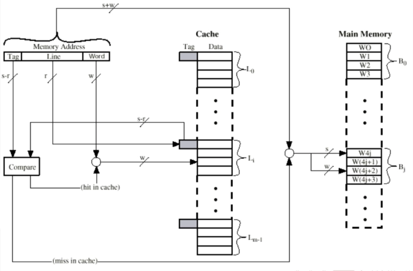
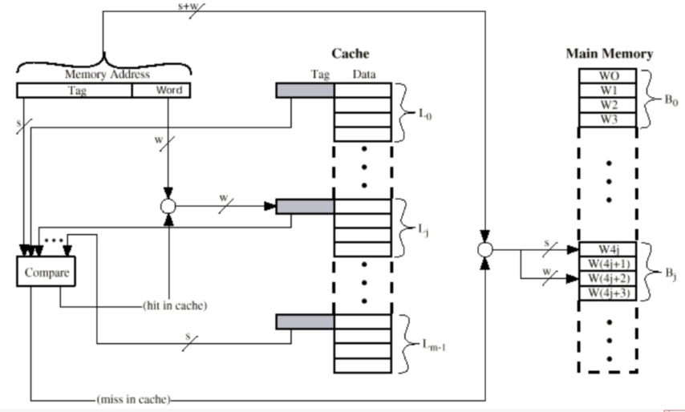

# Ch4 Cache 存储器

- [Back to Course Home](index.md)

## Cache 的传输单位

1. 字：存储器组织的天然单位，存储器单次传输所能传输数据的宽度

2. 可寻址单元：能唯一确定地址的最小单位。一般是字或字节。

	- 地址位数 $A$ 与可寻址单元个数 $N$：$2^A=N$

3. 传输单位：

	- 对主存：一次读出/写入存储器的位数，通常是数据总线宽度。

	- 对外存：以块为单位

## Cache 访问数据单元的方式

1. 顺序访问：必须以特定线性顺序访问，访问时间高度变化。

	- 磁带

2. 直接访问：存储器中每个数据块有唯一地址，以此先通过块间跳转找到块，再在块内顺序搜索定位可寻址单元。访问时间变化。

	- 磁盘

3. 随机访问：存储器中每个可寻址位置都是唯一的，以此直接定位可寻址单元。访问时间固定。

	- 主存

4. 关联存取：属于随机访问类型的存储器，根据数据部分内容确定存储位置，存取时间与数据位置无关。

	- Cache

## Cache 性能

1. 访问时间（延迟）：

	- 对随机访问存储器：读写操作所需时间

	- 对非随机访问存储器：定位时间

2. 存储器周期时间：随机访问存储器，访问时间+第二次访问开始前所需额外时间

3. 传输速率：通常以 $bit/s(bps)$ 为单位

	- 对随机：

		$$
		\text{传输速率}=\frac{1}{\text{周期时间}}
		$$

	- 对非随机：

		- $$
		    T_n=T_A+\frac{n}{R}
		    $$

		- $T_n=$ 读/写 n 位的平均时间；

		- $T_A=$ 平均访问时间；

		- $n=$ 位数；$R=$ 传输速率，以 $bps$ 为单位。

## Cache 特性

- 越快越贵

- 越快越耗能

- 越大越慢

- 越大越便宜

- 越大越耗能

## 访问局部性原理：

- 在程序执行期间，CPU 对指令、数据的访问往往比较集中，即在某一段时间内，CPU 对某些指令或数据的访问频率较高，这种现象称为访问局部性。

	- 时间局部性：如果某个数据被访问过，那么在不久的将来，它很可能会再次被访问。

	- 空间局部性：如果某个数据被访问过，那么它附近的数据很可能会被访问。

## 存储器分层：

- 从上至下：

	- 容量越来越大

	- 每位价格越来越便宜

	- 速度越来越慢

	- 访问频率越来越低（依赖于访问局部性原理）

## Cache 原理和操作：

- 主存由多个块构成，每个块包含 $K$ 个字。

- Cache 由多个块构成，每个块称为一行，每行包括 $K$ 个字以及若干位标签、控制位（行的大小为 $K$ 个字，不算标签和控制位）。

- 主存和 Cache 之间以块为单位传输，Cache 和 CPU 之间以字为单位传输。

- Cache 读操作：

	- 检查数据是否在 Cache 中；

	- 若命中，直接访问 Cache；

	- 若缺失，从主存中加载包含这个字的块，并将这个字送到 CPU 中，两个操作同时发生。

- Cache 写操作：

	- 检查数据是否在 Cache 中；

	- 若命中，直接更新 Cache 行；

	- 若缺失，从主存中加载包含这个字的块，并更新 Cache 行。

## 主存块与 Cache 行之间的映射方式

### 直接映射

$$
i=j \mod m
$$

$i=$ 高速缓存行号；$j=$ 主存块号；$m=$ 高速缓存行总数。

- 从主存来看：

	- 主存地址长度 = $(s+w)$ 位，其中最低 $w$ 位指定主存的一个块内的 $2^w$ 个字中的一个字/字节，剩下 $s$ 位指定主存内的 $2^s$ 个块中的一块

	- 可寻址单元个数 = $2^{(s+w)}$ 个字/字节

	- 块大小=行大小 = $2^w$ 个字/字节

- 从 Cache 来看：

	- 主存地址最高 $s$ 位 = 低 $r$ 位 + 高 $(s-r)$ 位，其中低 $r$ 位指定 Cache 的 $2^r$ 行中的一行，高 $(s-r)$ 位被当作标签存储。

	- Cache 行数：$2^r$ 行

	- Cache 大小：$2^{(r+w)}$ 个字/字节

	- 标签大小：$(s-r)$ 位

	- 即：$(s-r)$ 位标签 + $r$ 位 Cache 内行号 = $s$ 位主存块号

- 优点：简单便宜

- 缺点：任何给定块都只有固定的 Cache 存储位置。若程序需要访问的两个块正好映射到同一行，这两个块就会不断交换，降低命中率，称为抖动。

### 全关联映射：
允许每个主存块加载到任意 Cache 行，标签 = 主存块号

- 优点：命中率提高

- 缺点：访问时需要复杂电路并行检查全部行的标签

### K 路组关联映射

$$
\begin{aligned} m=v \times k\\ i=j \mod v \end{aligned}
$$

$i$ = Cache 的组号；$j$ = 主存块号；$m$ = Cache 中的行数；$v$ = 组数；$k$ = 每组中的行数。

- 从主存来看：

	- 主存地址长度 = $(s+w)$ 位，其中最低 $w$ 位指定主存的一个块内的 $2^w$ 个字中的一个字/字节，剩下 $s$ 位指定主存内的 $2^s$ 个块中的一块

	- 可寻址单元个数 = $2^{(s+w)}$ 个字/字节

	- 块大小 = 行大小 = $2^w$ 个字/字节

- 从 Cache 来看：

	- 主存地址最高 $s$ 位 = 低 $d$ 位 + 高 $(s-d)$ 位，其中低 $d$ 位指定 Cache 的 $2^d$ 组中的一组，高 $(s-d)$ 位被当作标签存储。

	- Cache 组数：$v=2^d$ 行

	- Cache 行数：$m=kv=k\times 2^d$

	- Cache 大小：$k\times 2^{(d+w)}$ 个字/字节

	- 标签大小：$(s-d)$ 位

	- 即：$(s-d)$ 位标签 + $d$ 位 Cache 内组号 = $s$ 位主存块号

- 优点：灵活，标签较小，且只需并行比较组内的 $k$ 个标签

## 替换算法
当 Cache 已满而又有新块需要调入，就必须替换 Cache 中的块。

- 最近最少使用算法（LRU）

	- 替换组内在 Cache 中最久没有被引用过的块。以 2 路组关联为例，当组中一行被引用时，其 USE 位置 1，另一行 USE 置 0。替换时选择 USE 为 0 的行。

- 先进先出算法（FIFO）

	- 替换组内最早进入 Cache 的块。

- 最不经常使用（LFU）：

	- 替换组内使用频率最低的块。

- 随机

	- 随机选择组内的一个块进行替换。

## 写策略

- 通写（写直达）：所有写都会施加于 Cache 和主存。任何其他处理器和 Cache 都可以监视到主存的改变以维护一致性。

	- 优点：简单

	- 缺点：产生大量主存流量，让写变慢

- 回写：CPU 写的更新仅在 Cache 中执行，此时 USE 为置 1。当一个块被替换时，仅当 USE 位为 1 才会被写回主存。

	- 优点：最小化主存写操作

	- 缺点：部分主存在块替换前是无效的，IO 存取只能通过 Cache 进行。

## 行/块大小
随着行大小从很小到较大，命中率先上升后下降。

- 原因：

	- 行较大时 Cache 中行数较少；

	- 行较大时离访问位置较远的字再次访问概率低（局部性原理）