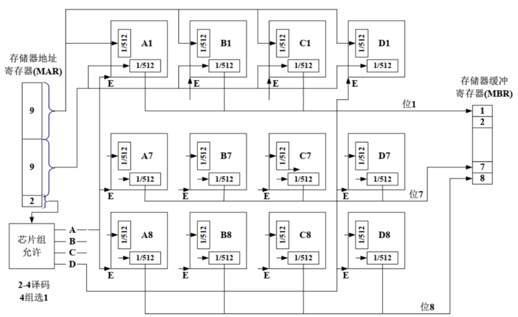
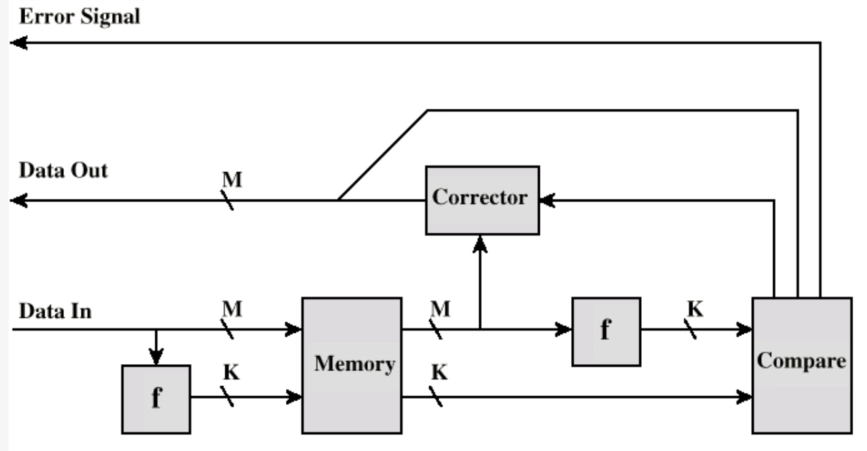
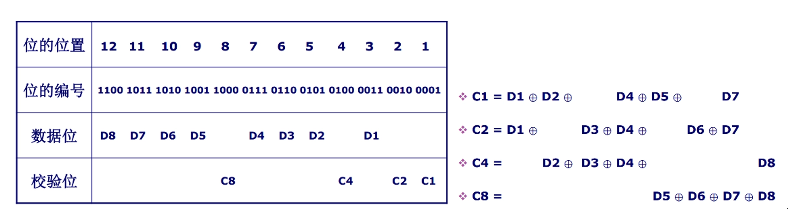

# Ch5 内部存储器

- [Back to Course Home](index.md)

## 半导体存储器类型
| 存储器类型 | 种类 | 可擦除性 | 写机制 | 易失性 |
| --- | --- | --- | --- | --- |
| 随机存储器(RAM) | 读-写存储器 | 电，字节级 | 电 | 易失 |
| 只读存储器(ROM) | 只读存储器 | 不能  | 掩模 | 不易失 |
| 可编程 ROM(PROM) | 只读存储器 | 不能 | 电 | 不易失 |
| 可擦 PROM(EPROM) | 读多次存储器 | 紫外线，字节级 | 电 | 不易失 |
| 电可擦 PROM(EEPROM) | 读多次存储器 | 电，字节级 | 电 | 不易失 |
| 快闪存储器 | 读多次存储器 | 电，块级 | 电 | 不易失 |

注：SRAM 和 DRAM 都需要持续供电。

## DRAM（动态 RAM）

- 数据被存储为电容上的电荷
- 由于电容有漏电的天性，DRAM 需要定期充电（刷新）。
- 结构简单，成本较低，速度较慢。常用于主存。

## SRAM（静态 RAM）

- 用触发器逻辑门存储数据
- 不漏电，不需要定期刷新（但也需要持续供电！）
- 结构更复杂，成本更高，体积更大，但速度更快。常用于 Cache。

## 存储器芯片组织

1. 位扩展：增加存储模块单次传输所能传输的位
	- N 块芯片读取相同的地址，每块芯片同时输出其在相同行列位置上存储的数据（假设输出 $m$ bit），则存储模块的一个地址可以存储 $(N\times m)bit$ 数据。
	- 例：位扩展前，一个芯片只能输出 $1$ bit；位扩展后，$8$ 个芯片同时根据 MAR 信号输出 $8$ bit 数据。
	- 
2. 字位扩展：增加存储模块的大小（即增加存储模块能够存储的字的数量）
	- 假设一组芯片有 $N$ 个，存储模块由 $M$ 组芯片构成，此时地址要增加 $\log_2 M$ bit，用于选择 $M$ 组芯片中的一组。
	- 
3. 字节级精度的访问
	- 存储模块一次传输能够传输 $N$ bit 数据（一般 $N$ 为 8 的倍数）,则可以实现字节级精度访问。需要在原地址信号的基础上添加 $\log_2 \frac{N}{8}$ 位地址。
	- 以 $N=16$ 为例，此时地址新添加 $1$ 位作为最低位。
		- 若要读取 $16$ bit 数据，且地址为偶数，则新添加的最低位置 $0$，可一次读取完成。
		- 若地址为奇数则新添加的最低位置 $1$，需要两次读取：CPU 先读取奇数地址上的 $16$ bit，只保留 A9-A16 芯片上的 $8$ bit 作为低 $8$ bit；CPU 再将地址 $+1$ 读取 $16$ bit，只保留 A1-A9 芯片上的 $8$ bit 作为高 $8$ bit。
4. 数据对齐
   - 例如，$2$ Byte 的 short 型变量的地址通常为偶数，$4$ Byte 的 int 型变量的地址通常为 $4$ 的倍数。
   - 否则，读取时 CPU 要进行两次读取。

## 纠错码
数据 $M$ bit，校验码/纠错码 $K$ bit，实际存储 $(M+K)$ bit。

### 以汉明码和文氏图为例

- 初始数据为 $1110$，放在 $A$、$B$、$C$ 三个圈相交位置；
- 在 $A$、$B$、$C$ 三个圈中生成纠错码，满足每个圈中四个数字异或结果为 $0$；
- 若传输过程中出现错误，可进行定位；
- 发现 $A$、$C$ 两个圈中异或结果不为 $0$，$B$ 异或结果为 $0$，则错误出现在与 $A$、$C$ 相交但不与 $B$ 相交的位置。

### 纠错码设计：
数据 $M$ bit，校验码/纠错码 $K$ bit，实际存储 $(M+K)$ bit，则应满足：$2^K-1≥M+K$

- 纠错码全 $0$ 表示 $(M+K)$ bit 数据都正常，因此 $K$ bit 纠错码能表示 $2^K-1$ 个数，要求 $K$ bit 纠错码必须能表示 $(M+K)$ bit 数据的位置，因此有上述关系式。

具体纠错过程为：

- 根据右图公式计算纠错码 $C8'\ C4'\ C2'\ C1'$，与存储的原纠错码 $C8\ C4\ C2\ C1$ 一一异或，得到结果 $C8'' C4'' C2'' C1''$
- 若只有一项异或结果为 1，即只有一个纠错码与原纠错码不同，则错误出现在该纠错码上，翻转该纠错码即可。例如，若只有 $C8''=1$，即 $C8''\ C4''\ C2''\ C1''=1000$，表示位置 8 出错，即 $C8$ 自身出错。
- 若有两项异或结果为 1，即有两个纠错码与原纠错码不同，则错误出现在纠错码所表示的位置对应的数据上。例如，若 $C1''=C4''=1$，即 $C8''\ C4''\ C2''\ C1''=0101$，则错误出现在位置 $0101$ 对应数据，即 $D2$ 上；从右图的公式里也可以看到，只有 $D2$ 能同时影响 $C1 C4$。