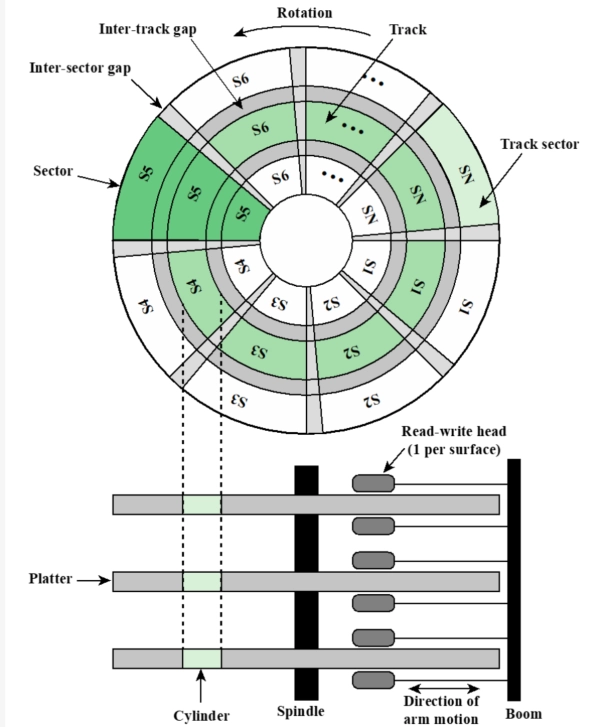
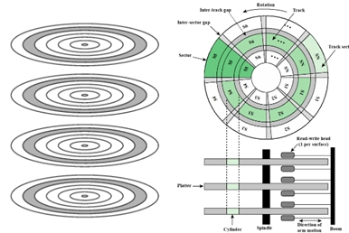

# Ch6 外部存储器

- [Back to Course Home](index.md)

## 磁盘数据组织

1. 磁道：一组同心圆环。相邻磁道间由磁道间隔隔开（防止相互干扰）。

2. 扇区：最小读写单位。一个磁道通常被划分成多个扇区，相邻扇区由扇区间隔隔开。

## 磁盘读写机制
由于角速度相同时，线速度外大内小，必须补偿，使得磁头读取所有的位的速度相同。

1. 恒定角速度：增大外层扇区间隔。

	- 优点：构造简单，磁头移到固定位置等待扇区来即可。

	- 缺点：浪费了外层磁道容量。

2. 多区段记录：每个区段包含多个磁道，区段内每个磁道位数固定，半径大的区段内的磁道比半径小的区段内的磁道容纳更多的位。同一区段的读取角速度相同，不同区段读取角速度不同。

	- 优点：充分利用磁道容量。

	- 缺点：需要更复杂的电路控制角速度。

## 寻找扇区
附加数据标记磁道和扇区，这些数据只对磁盘驱动器可见。

## 磁头

- 固定磁头：一个磁道一个磁头，安装在一个固定支架上

- 可移动磁头：每面一个，可伸缩支架

## 多盘片

## SSD

- 优点：高速启动，低噪音，机械可靠性更高

- 缺点：成本较高，容量较低，写入寿命较短

## 磁盘性能参数：
### 传送时间：

$$
T=\frac{b}{rN}
$$

其中：

- $b$ = 传送的字节数；

- $r$ = 磁盘旋转速率（转/秒）；

- $N$ = 每磁道字节数。

### 平均存取时间：

$$
T_a=T_s+\frac{1}{2r}+\frac{b}{rN}
$$

其中：

- $T_s$ = 平均寻道时间，指磁盘移动支架使磁头对准磁道所需时间；

- $\frac{1}{2r}$ = 平均旋转延迟，是磁道旋转半圈的时间。

	- 旋转延迟，指等待相关扇区旋转到磁头可读写位置的时间。

- $\frac{b}{rN}$ = 传送时间，指从磁道上读取或写入 $b$ 字节所需的时间。

## 磁盘调度算法

- 先来先服务算法（FCFS）：

	- 按照请求到达的顺序处理磁盘请求。

	- 优点：简单，公平。

	- 缺点：可能导致长时间等待，尤其是当请求分布不均时。

- 最短寻道时间优先算法（SSTF）：

	- 选择距离当前磁头位置最近的请求进行处理。

	- 优点：减少平均寻道时间。

	- 缺点：可能导致饥饿现象，即某些请求长时间得不到处理。

- 扫描算法（SCAN）：

	- 磁头在磁盘上来回扫描，处理沿途的请求。

	- 优点：减少平均寻道时间，避免饥饿现象。

	- 缺点：可能导致某些请求等待较长时间。

- 循环扫描算法（C-SCAN）：

	- 磁头在磁盘上来回扫描，但当到达一端时，磁头直接跳到另一端继续扫描。

	- 优点：提供更均匀的服务，避免了长时间等待。

	- 缺点：可能导致某些请求等待较长时间。

## 磁盘冗余阵列（RAID）
使用多个磁盘增加冗余提高可靠性，本质是一组物理磁盘驱动器，但被操作系统看作一整个逻辑驱动器

- 在阵列上条带分布

- 冗余磁盘用于存储校验信息

| RAID 级别 | 描述 | 数据可用性 | 大型 I/O 数据传输能力 | 小型 I/O 请求率 | 需要的磁盘数 |
| --- | --- | --- | --- | --- | --- |
| 0 | 无冗余 | 无 | 非常高 | 低于单个磁盘 | N |
| 1 | 镜像 | 非常高 | 读操作可达单个磁盘的两倍；写操作与单个磁盘相同 | 读操作比单个磁盘高；写操作与单个磁盘相同 | 2N |
| 2 | 通过海明码冗余 | 所有列出的选择中最高 | 大约是单个磁盘的两倍 | 远高于单个磁盘；可与 RAID 3、4、5 相比较 | N+m（m 与 logN 成正比） |
| 3 | 位交叉奇偶校验 | 所有列出的选择中最高 | 远高于单个磁盘；可与 RAID 2、4、5 相比较 | 大约是单个磁盘的两倍 | N+1 |
| 4 | 块交叉奇偶校验 | 无 | 远高于单个磁盘；可与 RAID 2、3、5 相比较 | 读操作与 RAID 0 相同；写操作明显低于单个磁盘 | N+1 |
| 5 | 块交叉分布奇偶校验 | 高 | 远高于单个磁盘；可与 RAID 2、3、4 相比较 | 读操作与 RAID 0 相同；写操作一般低于单个磁盘 | N+1 |
| 6 | 块交叉双分布奇偶校验 | 所有列出的选择中最高 | 读操作与 RAID 0 相同；写操作低于 RAID 5 | 读操作与 RAID 0 相同；写操作明显低于 RAID 5 | N+2 |