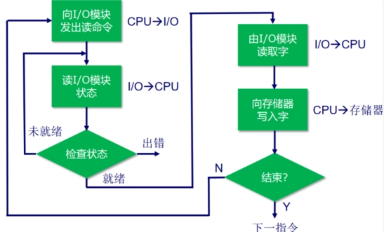
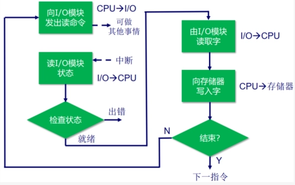

# Ch7 输入输出

- [Back to Course Home](index.md)

## 外部设备

- 外部设备：计算机系统外部的设备，通常通过 IO 模块与计算机系统连接。

- 人可读的

	- 显示屏、打印机、键盘

- 机器可读的

	- 磁盘（功能上是存储器，但结构上被 I/O 模块控制）、传感器

- 通信设备

	- 网卡，调制解调器

## IO 模块

- 为什么需要 IO 模块

	- 各种外设操作逻辑、数据格式和字长都不一样，且运行速度比主存和 CPU 慢很多

- 主要功能

	- 通过系统总线或中央交换机与 CPU 和内存连接；

	- 通过定制数据线连接一至多个外设；

	- 具体包括：控制和定时，与 CPU、内存和外设通信，数据缓冲，检错

## 读 IO 步骤

- CPU 查询 IO 模块状态

- IO 返回设备状态

- 若设备就绪，CPU 请求数据传输

- IO 从外设处获取数据

- IO 将数据放到数据总线上传给 CPU

## IO 设备寻址

1. 内存映射寻址：

	- 内存位置和 IO 设备共享同一个地址空间

	- CPU 把 IO 模块的状态和数据寄存器看作内存位置

	- 访问内存和操作 IO 所需机器指令相同

2. 独立寻址：

	- CPU 将内存和 IO 模块看作两个独立的地址空间

	- 需要 IO 或内存选择线控制

	- 需要特殊的 IO 命令操作 IO

## IO 技术

1. 可编程式 IO：无中断，数据通过 CPU 传输，即 IO-CPU-内存

	- 在 IO 模块操作未完成，CPU 一直保持定期检查 IO 状态的周期，浪费 CPU 时间。

	

2. 中断驱动式 IO：有中断，数据通过 CPU 传输，即 IO-CPU-内存

	- CPU 向 IO 模块发出命令后执行其他程序。当 IO 操作完成时，即 IO 模块就绪时，IO 模块会向 CPU 发送中断请求，CPU 响应中断请求并开始传输数据。

	- 无需 CPU 一直周期性检查，克服了 CPU 等待的问题。

	

3. 存储器直接存储（DMA）：有中断，数据通过 DMA 传输，即 IO-DMA-CPU

	- DMA 操作：CPU 通知 DMA 相关命令，之后 CPU 执行其他程序；DMA 负责传输数据；DMA 传输完成后，向 CPU 发出中断请求。

	- 周期窃取：DMA 必须在 CPU 不使用总线时，或迫使处理器挂起，才能够使用总线传输数据。一般地，CPU 在访问总线前被挂起，DMA 接管一个总线周期传输一个字，然后 CPU 继续访问总线。稍微降低了 CPU 速度，不是中断，CPU 不用转换现场。

## 中断处理

- 中断认可信号是 CPU 告诉发出中断的 IO：我已经收到了你的中断请求信号并开始处理，你可以停止发送中断请求信号了。

- PSW：程序状态字，一个寄存器，存储 CPU 状态。

- 软件部分：即中断服务程序（ISR）。

## 中断请求的定位和优先级

1. 多中断信号线法：直接在 CPU 与每个 IO 模块之间提供多中断信号线，一般不用，硬件太复杂。

2. 软件轮询法：CPU 检测到中断后，执行中断服务程序，中断服务程序挨个轮询每个 IO 模块，找到所有发出中断的。

	- 优先级：由中断服务程序决定先处理哪个。

	- 优点：硬件简单，优先级安排、修改简单，灵活。

	- 缺点：速度慢。

3. 菊花链法（硬件轮询、向量）：所有 IO 共享一条中断请求线，但是中断响应线以菊花链形式连接各个 IO 模块。

	- CPU 感知到中断后，发出中断响应信号，沿菊花链传播。

	- 当中断响应信号传播到某个 IO 模块时：

		- 若该 IO 发出了中断，则会在数据线上放向量（一个字，IO 模块的地址或唯一标识符，CPU 认为其指向适合的设备服务例程）。CPU 会根据向量来定位 IO 模块并处理中断。该 IO 模块的中断处理完后，才会将中断响应信号传给下个 IO 模块；

		- 若该 IO 没有发出中断，则直接将中断响应信号传给下个 IO 模块；

	- 优先级：菊花链上游的 IO 模块中断优先级更高。是固定的，不灵活。

	- 优点：速度快。

	- 缺点：优先级固定，不灵活。

4. 总线仲裁（向量）：由中断控制器控制哪个 IO 模块能够获得总线控制权。IO 模块只有获得总线控制权后才能发送中断，一次只有一个 IO 模块能发送中断，中断控制器检测到 CPU 的中断响应信号时，将发出中断的 IO 模块对应向量放到数据线上。