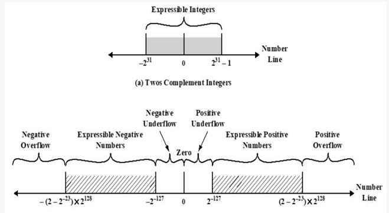
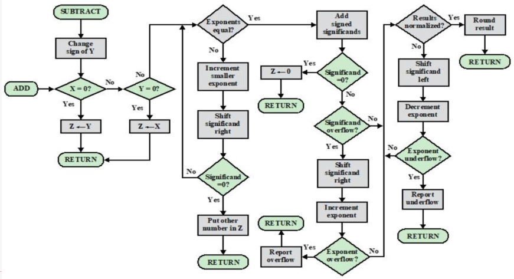
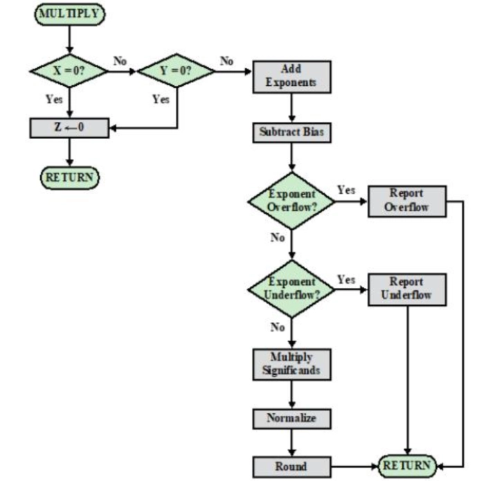

# Ch9 计算机算术

- [Back to Course Home](index.md)

## 整数：2 的补码法

- $N$ bit 整数，最高位为符号位，0 表示正数，1 表示负数。
- 正数：最高位为 0，剩下 $N-1$ 位为二进制。
- 负数：先写出对应正数，然后对 $N$ 位全部按位取反，再将其视作无符号数 $+1$。
- 表示范围：$N$ bit 能表示：$[-2^{N-1},2^{N-1}-1]$ 范围内的整数。
- 符号填充：符号位移到新最高位，空余的，对正数填全 0，对负数填全 1。

## 整数的加减法

- 用加法实现减法
- 溢出规则：两个数相加，若他们同为正或同为负，当且仅当结果符号相反时发生上溢。

## 无符号乘法

- $M\times Q=AQ$，$M$ 为被乘数，$Q$ 为乘数，$AQ$ 为结果，由寄存器 $A$ 和寄存器 $Q$ 拼接而成。
- 每个循环，若 $Q$ 最低位为 1，则将 $M$ 加在 $A$ 上；若为 0，则不相加。
- 然后将 $AQ$ 整体右移一位，$Q$ 最低位舍弃，$A$ 最高位为相加的溢出位。
- $Q$ 有几位，就执行几个循环。

## 有符号乘法：Booth 算法

- $Q_0Q_{-1}=10$，则 $A=A-M$（记忆：最高位为 1，负数，减），然后 shift
- $Q_0Q_{-1}=01$，则 $A=A+M$（记忆：最高位为 0，正数，加），溢出位舍去，然后 shift
- $Q_0Q_{-1}=00$ 或 $11$，则直接 shift
- Shift 将 $Q_{-1}$ 舍去，$Q_0$ 位移到 $Q_{-1}$，新最高位和原最高位相同。
- $Q$ 有几位，循环几个周期。最终结果为 $AQ$ 相拼接，不算 $Q_{-1}$！

## 浮点数表示
以 32bit 为例：

- 1bit 符号位 $m$ + 8bit 指数 $E$（移码表示）+ 23bit 有效数 $B$
	- 移码表示：$N$ bit 二进制，按照无符号数理解，得到在 $0~2^N-1$ 之间的整数，再减去一个固定的偏阶（为 $2^{N-1}-1$），得到真正的指数，范围为 $-2^{N-1}+1~2^{N-1}$
		- 8bit 范围为-127~+128
- 规格化数：有效数的最高位一定为 1，且不实际存储到内存中。因此，23bit 有效数 $B$ 实际表示 24bit，表示一个二进制小数：1.B
- 综上，浮点数被表示为：$(-1)^m×1.B×2^{E-2^{N-1}+1}$
- 范围：
	- 以 32bit 为例：正数在 $2^{-127}~(2-2^{-23})×2^{128}$，负数在 $-(2-2^{-23})×2^{128}~-2^{-127}$
	- 因此有正上溢、正下溢、负上溢、负下溢

### IEEE754 的一些特殊表示:

- 当 $E=0$ 且 $M=0$ 时,表示 0。
- 当 $E=0$ 且 $M≠0$ 时,表示非规格化数(下溢数)。
- 当 $E=255$ 且 $M=0$ 时,表示∞。
- 当 $E=255$ 且 $M≠0$ 时, 表示 NAN。

## 浮点数加减法：

1. 零检查
	- 若是减法运算，则改变减数符号并改为加法运算。若某个操作数为 0，则另一个操作数直接作为结果。否则，将存储的 23bit 有效数扩充成 24bit 实际有效数。
2. 对齐
	- 若两数指数不相等，则增加较小的指数，并右移其有效位数。若此过程中出现有效位数为 0，则另一个数直接作为结果。
3. 有效数相加
	- 即 1.B 相加。若产生上溢，则右移有效位数并增加指数。若此操作产生了指数上溢，报错。
4. 规格化
	- 若加法结果最高位不为 1，则左移有效位数并减小指数。若此操作产生了指数下溢，报错。

注：有效数右移时可以在右边增加保护位以确保精度。

## 浮点数乘法

1. 预处理
	- 零检查：若有一个操作数为 $0$，则另一个操作数直接作为结果。
	- 符号位计算：$m = m_1 \oplus m_2$，即两个操作数的符号位进行异或运算。
	- 规格化
2. 指数相加
	- $E = E_1 + E_2 - 127$，即两个操作数的指数相加后减去偏阶。
3. 有效数相乘
	- $B = B_1 \times B_2$，即两个操作数的有效数相乘。
4. 规格化
	- 若乘法结果的有效数最高位不为 $1$，则左移有效位数并减小指数。若此操作产生了指数下溢，报错。
	- 若乘法结果的有效数最高位为 $1$，则直接将结果存储为 $1.B$ 的形式。

## 浮点数除法

1. 零检查
2. 指数相减
	- $E = E_1 - E_2 + 127$，即被除数的指数减去除数的指数后加上偏阶。
3. 判断溢出
4. 有效数相除
5. 规格化