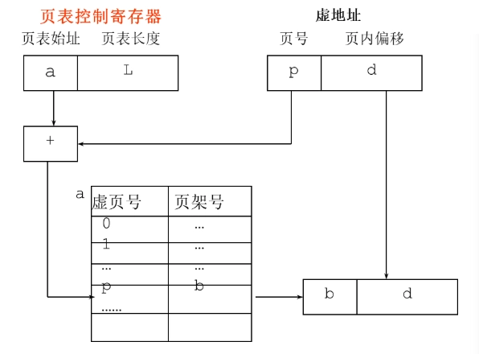
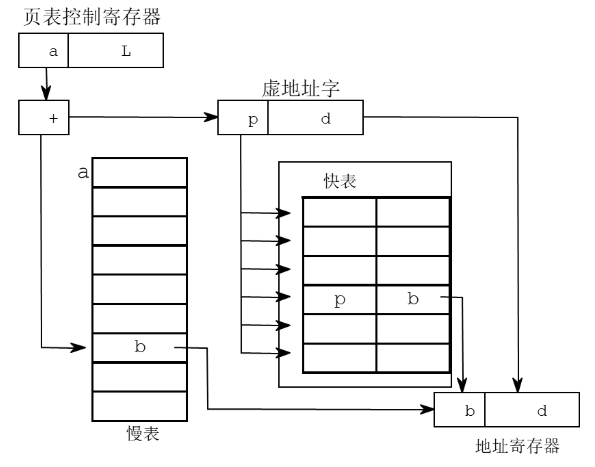
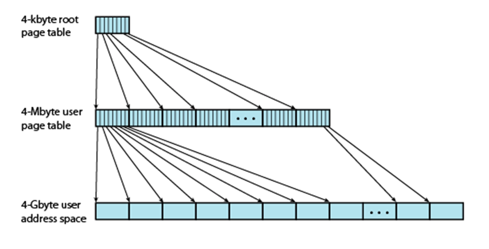
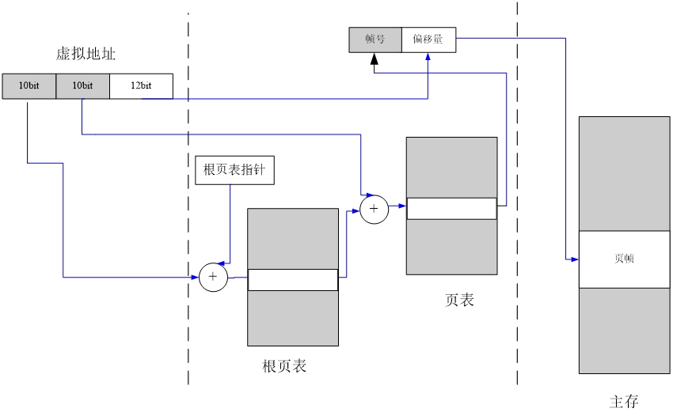
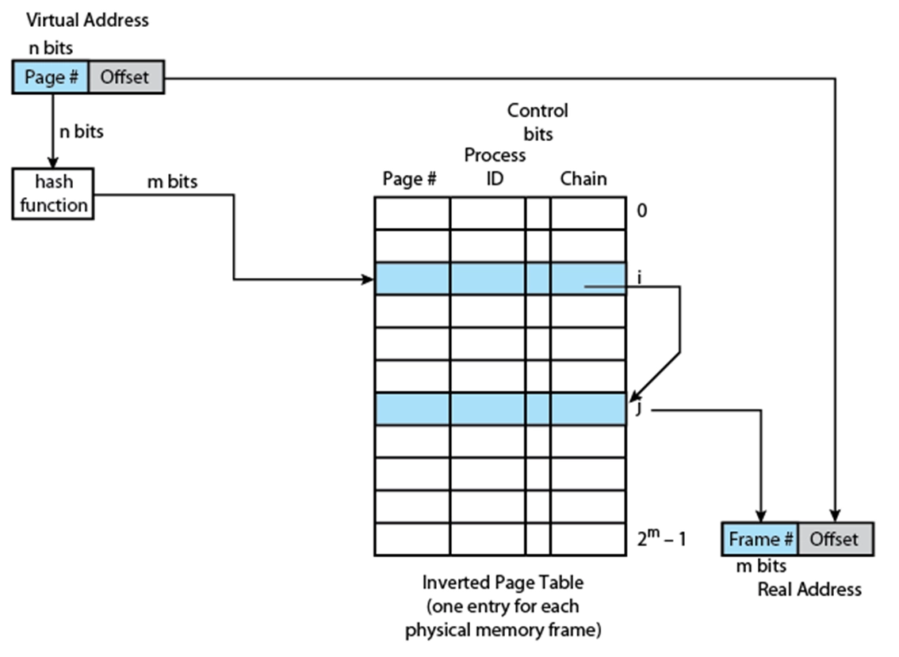
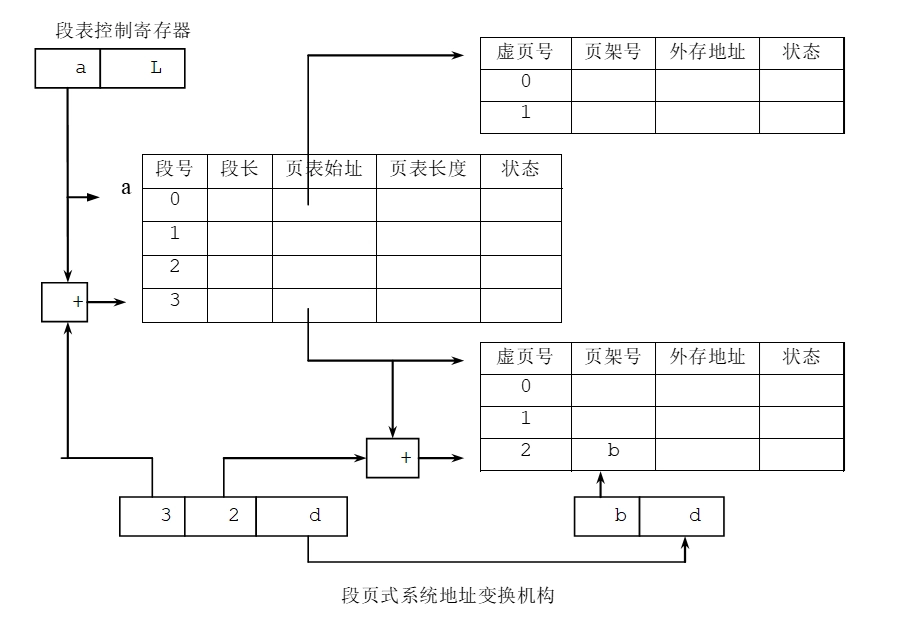
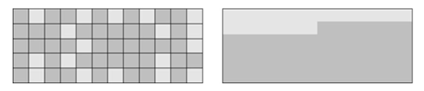
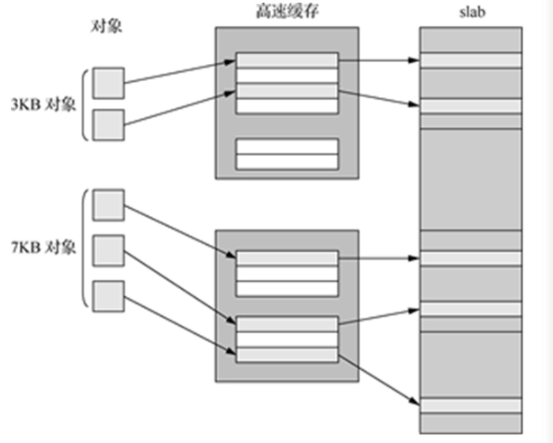

# 内存管理

- [Back to Course Home](index.md)

## 内存管理的概念

- 作用：提高主存的利用率，将尽可能多的作业同时加载到主存中

- 层次：

	- 寄存器

	- 主存

	- 辅助存储器

- 需求：

	- 重定位：进程装入内存中的地址变化 （不固定）

	- 保护：防止进程越界访问

	- 共享：对共享区域的受控访问

	- 逻辑组织：逻辑地址的组织更符合程序的构造

	- 物理组织：管理主存、辅存等分级存储方式

## 存储管理技术

- 单一连续区（不分区）

- 固定分区

	- 大小一致

	- 大小不一致

- 动态可变分区

	- 不会产生内部碎片

- 单纯分页/分段

- 虚拟存储系统

	- 分页

	- 分段

	- 段页式

### 地址重定位

- 固定定位

- 静态重定位

- 动态重定位

	- 将逻辑地址变换成物理地址由硬件自动完成

	- 优点：

		- 运行期间可以换进换出内存：换出阻塞的进程

		- 可以在内存中移动进程：搜集内存中的外部碎片

		- 空间不必连续

		- 便于信息共享

		- 是内存虚拟管理的基础

### 动态可变分区分配算法

- 首次适配（First）：空闲分区链表按地址排序，分配快，回收效率高，小碎片多

- 临近适配（Next）：从上次分配的地址开始查找，减少搜索时间

- 最佳适配（Best）：空闲分区链表按块从小到大排序，选择最小的足够大的空闲分区，小碎片多

- 最差适配（Worst）：空闲分区链表按块从大到小排序，选择最大的空闲分区，多中等碎片

- 算法对比

	- 复杂度：最佳（2+2）> 最差（1+2）>首次（1+1）>循环（1+1）

	- 小碎片产生的可能性：最佳 >首次 > 循环 > 最差

	- 后继大作业分配成功的可能性：最佳 >首次 > 循环 > 最差

### 内存扩充技术

- 主辅存交换

	- 覆盖技术：

		- 用于一个作业的内部

		- 同一程序按程序的逻辑结构分段，不会同时运行的程序段分在一组内，该组称为覆盖段

		- 极端情况下覆盖段在主存中只保留一个段，其他段在辅存中

		- 应用程序不透明，需要程序员干预

	- 交换技术（虚拟存储技术）：

		- 用于不同的作业，任一时刻主存中只保留一个完整的用户作业

		- 对应用程序而言是透明的，无需程序员干预

### 虚拟存储技术

- 简单分页——页表（page table）

	- 逻辑地址到物理地址的转换：

		- 逻辑地址 = 页号 + 页内偏移

		- 物理地址 = 帧号 + 页内偏移

- 系统抖动：频繁换入换出页面

- 虚拟存储器的大小限制：

	- 存放程序指令和数据的外存区域称为交换区。

	- 虚拟存储器大小 = 交换区大小 + 内存大小

- 虚拟地址空间大小：

	- 计算机地址结构的限制（例如，指令地址字长度等）

- 地址映射

	- 将进程中程序的虚拟（逻辑）地址转化为物理地址

	- 维护地址映射表

- 物理内存的管理

	- 物理内存的回收、分配

- 缺页异常的处理

	- 分配内存

	- 将需要的内容从磁盘 swap 区加载到内存

- 页大小

	- 页越大，内零头越大；

	- 页越小，需要的页越多，页表就越大

### 逻辑地址到物理地址的转换

- 页表（page table）

	- 逻辑地址 = 页号 + 页内偏移

	- 物理地址 = 帧号 + 页内偏移

	

- 快表（TLB：Translation Lookaside Buffer）

	- 页表在 Cache 或寄存器中的副本

	- 用于加速地址转换

	

- 多级页表

	- 把整个页表进行分页，分成一张张小页表，每个小页表的大小与页框相同。

	- 对小页表顺序编号，允许小页表分散存放在不连续的页框中。

	- 为了进行索引查找，应该为这些小页表建一张页目录表（一级页表），其表项指出小页表（二级页表）所在页框号及相关信息。

	- 逻辑地址结构有三部分组成：页目录号、页号和位移。

	
	

- 反向页表（Inverted Page Table）

	- 虚拟地址的页号使用散列函数映射到哈希表中。

	- 把 $n$ 位页号映射到 $m$ 位帧号（$n > m$）

	- 大小与物理内存成正比

	

## 空闲内存页的管理

- 位图方式：

	- 每个 Bit 表示一块的使用状态。0 表示空闲，1 表示已分配。

	- 表示能力：32MB 主存，页大小为 4K，1KB 的空间就足够表示。

	- 效率高：只要修改对应 bit 就可以

- 空闲链表方式：

	- 用链结构表示空闲页。

## 物理页框回收

- 全局淘汰策略：从所有作业所占用的帧中选择。

- 局部淘汰策略：从本作业所占用的帧中选择

### 淘汰算法

1. 最优淘汰算法（OPT-Optimal）

	- 淘汰将来最长时间不使用的页面。

	- 需要预知未来的页面访问情况，实际不可行。

	- 作为理论上的评价标准，用以鉴别其他淘汰算法的优劣

2. 先进先出淘汰算法（FIFO）

	- 淘汰最先进入内存的页面。

	- 实现简单。

	- 可能导致系统抖动（频繁换入换出页面）。

3. 最近最少未使用算法（LFU-Least Frequently Used）

	- 淘汰在一定时间内未被访问的页面。

	- 为每页面设置访问计数器，通过比较所有页的计数器值来确定淘汰的页面。

	- 需要定期对计数器清零，以淘汰过期页

	- 过于复杂

4. 最久不使用淘汰算法（NUR-Not Used Recently），即 Clock 算法

	- 结合了 FIFO 和 LFU 的思想。

	- 1 个访问位

		- 每个页面有一个访问位，表示最近是否被访问过。

		- 使用一个指针指向当前检查的页面，按顺序检查页面。

		- 如果访问位为 1，则清零并继续检查下一个页面；如果为 0，则淘汰该页面。

	- 1 个访问位 + 1 个修改位

		- 每个页面有一个访问位和一个修改位。

		- 访问位表示最近是否被访问过，修改位表示页面是否被修改过。

		- 使用一个指针指向当前检查的页面，按顺序检查页面。

		- 如果访问位为 1，则清零并继续检查下一个页面；如果为 0，则淘汰该页面。

	- 适用于大多数实际情况，性能较好。

## 段页式虚拟存储管理

- **虚拟分段的优点**：

	- 简化不断增长的数据结构处理方式

	- 允许分块编译

	- 有助于进程间的共享

	- 有助于实现保护机制

- 段页式地址翻译 

	- 段号 $s$ + 页号 $p$ + 页内偏移 $d$

	- 为了进行地址变换，系统为每一个作业建立一张段表，再为每一段建立一张页表。同样，也有一个段表控制寄存器，存放当前作业段表的长度和始址。

	

- 读取策略

	- 请求式分页

	- 预约式分页

- 放置策略

	- 最佳适配

	- 首次适配

	- 近邻适配

	- 最差适配

- 替换策略

	- 算法

		- Opt

		- FIFO

		- LRU

		- Clock（NRU）

	- 页缓冲

- 清除策略（回写）

	- 请求式清除

	- 预约式清除

## 物理主存储器的分配和管理

- 伙伴系统（Buddy system）

	- 将内存分成大小为 $2^n$ 的块。

	- 分配时，寻找最小的满足要求的块。

	- 回收时，将相邻的块合并成更大的块。

	- 优点：减少碎片，提高内存利用率。

	```c
	Void get_hole( int i)
	{
	If ( i == ( u+1) ) failure;
	If ( <i_list empty> )
	{
	get_hole( i+1);
	<split hole into buddies>;
	<put buddies on i_list>;
	}
	<take first hole on i_list>;
	}
	```
	

- Slab 系统

	- 将内存分成多个大小相同的块（slab）。

	- 每个 slab 包含多个对象，每个对象大小相同。

	- 对象分配和回收时，直接在 slab 中进行，不需要频繁的内存分配和释放。

	- 优点：减少碎片，提高内存利用率。

	

- SLUB：在 SLAB 的基础上简化设计，提高性能。更适合多处理器系统使用。是目前 Linux 版本的默认配置。

- SLOB：为嵌入式系统提供极简的内存分配方案。