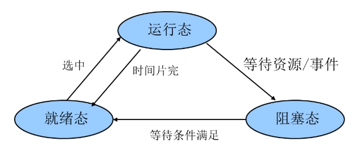
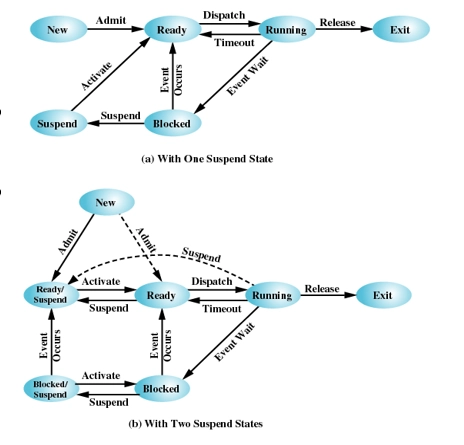
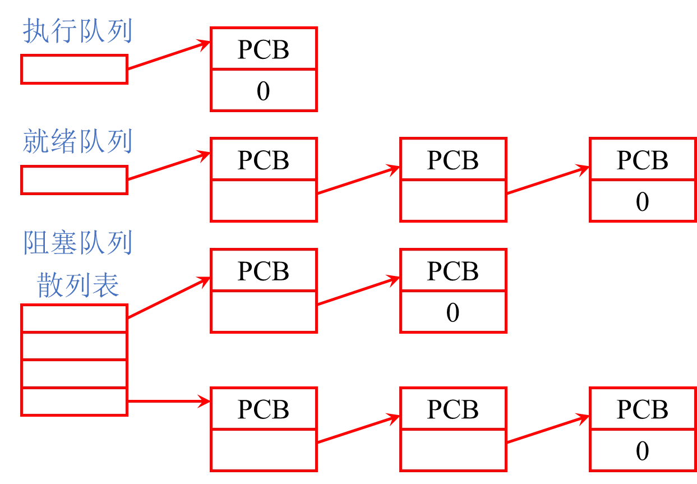
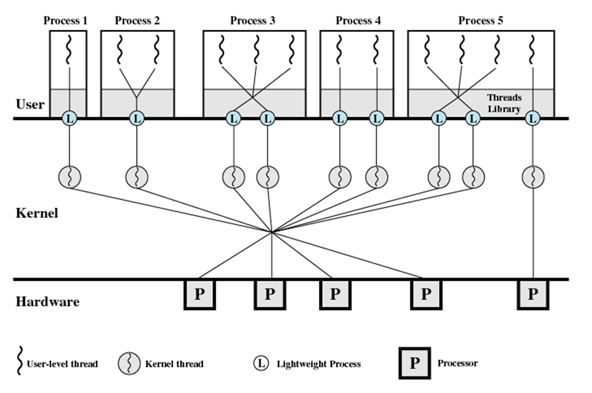
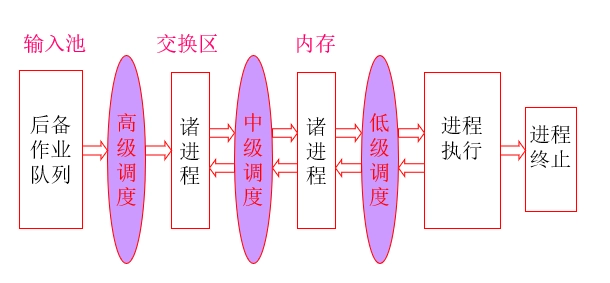

# 进程管理

- [Back to Course Home](index.md)

## 进程概念

- 进程的概念

	- 程序在操作系统上的一次运行过程。

	- 系统进行资源分配和调度的一个可并发执行的独立单位。

	- 在进程看来，自己独占计算机系统，并可以调用 OS 提供的服务。

- 进程的特性

	- 动态性：进程具有生命周期，经历创建、运行、消亡等过程。

	- 并发性：多个进程可以并发地执行。

	- 独立性：进程既是系统中资源分配和保护的基本单位，也是系统调度的独立单位。

- 进程的组成

	- 代码段：或叫共享正文段，在多个程序间可以实现共享。含代码和不变的数据。

	- 数据上下文：

		- 用户层：

			- 数据区：外部变量和静态变量

			- 工作区：即栈，包含局部变量，函数调用的现场。

		- 操作系统层：执行现场和核心栈

		- 寄存器层：控制寄存器和数据寄存器。

- 进程控制块(PCB)

	- 进程的基本信息和状态信息的集合。

	- **每个进程有且仅有一个进程控制块。**

	- 分为两部分：

		- 常驻内存部分：进程无论处于什么状态，系统都可能要查询的 PCB 成员。

		- 可交换部分：进程不在执行时系统不需要访问的 PCB 成员。内存紧张时可以将他们换出到磁盘上。

- 进程是程序的一次动态执行活动，而程序是进程运行的静态描述文本

## 进程状态与转移
### 进程状态

- 两状态：

	- Not Running

	- Running

- 三状态：

	- Running

	- Ready

	- Block

	

- 五状态：

	- Created：限制进程数量

	- Ready

	- Running

	- Sleep

	- Terminated：便于其他应用程序分析统计操作系统的性能

- 六/七状态：

	- 挂起 Suspend: 需要评估加载资源

	

### 进程状态转换

- 运行态 → 阻塞态

	- 等待资源/事件等；如等待外设传输，或人工干预。

- 阻塞态 → 就绪态

	- 资源得到满足；如外设传输结束；人工干预完成。

- 运行态 → 就绪态

	- 运行时间片到；出现有更高优先权进程。

- 就绪态 → 运行态

	- 选择一个就绪进程运行。

## PCB 的组织方式


- 链表方式

## 进程控制
### 进程创建与进程终止

- 进程创建

	- 系统调用：`fork`

		- 创建一个新进程，返回值为 0 表示子进程，返回值为子进程 ID 表示父进程。

	- 复制父进程的 PCB 和地址空间

		- 子进程与父进程共享代码段，但有独立的数据段和栈段。

	- 分配新的 PCB 和地址空间

		- 子进程拥有独立的 PCB 和地址空间。

	- 调用 `exec()` 函数

		- 用于加载新程序到子进程的地址空间中，替换子进程的代码段和数据段。

		- 子进程执行新的程序，父进程继续执行原来的程序。

- 进程终止

	- 系统调用：`exit()`

		- 释放 PCB 和地址空间

		- 释放子进程的资源

		- 通知父进程子进程已终止

	- 父进程等待子进程终止

		- 系统调用：`wait()`

		- 父进程阻塞，直到子进程终止

		- 父进程获取子进程的退出状态

	- 僵尸进程

		- 子进程终止后，父进程未调用 `wait()`，子进程的 PCB 仍然存在，称为僵尸进程。

		- 僵尸进程会占用系统资源，但不会占用 CPU 时间。

		- 父进程用 `while` 循环调用 `wait()` 来避免僵尸进程的产生。

```c
include <stdio.h>
include <stdlib.h>
include <sys/types.h>
include <unistd.h>
include <sys/wait.h>

int main() {
	pid_t pid;
	pid = fork();
	if (pid < 0) {
		perror("fork error");
		exit(EXIT_FAILURE);
	} else if (pid == 0) {
		// 子进程中使用execlp执行date命令，显示当前日期和时间
		if (execlp("date", "date", NULL) == -1) {
			perror("execlp error in child");
			exit(EXIT_FAILURE);
		}
	} else {
		// 父进程等待子进程结束
		int status;
		pid_t wpid = wait(&status);
		if (WIFEXITED(status)) {
			printf("Child process %d exited with status %d\n", wpid, WEXITSTATUS(status));
		}
		printf("Parent process %d continues.\n", getpid());
	}
	return 0;
}
```

### 进程模式

- 进程模式

	- 用户模式：用户程序运行的模式，限制访问系统资源。

	- 内核模式：操作系统内核运行的模式，允许访问所有系统资源。

- 进程切换与模式切换

	- 进程切换的目的：换一个新进程占用 CPU

	- 进程切换时机：

		- 外部中断（时间片、IO 等）：不可预知

		- 异常（div 0）：不可预知

		- 陷阱（Int x）：可预知\不可屏蔽

		- 系统调用

	- 模式切换的目的

		- 在用户态和核心态之间的切换

	- 模式切换的时机：

		- 同上

- 中断与陷阱的区别

- 发生模式切换并不一定发生进程切换，发生进程切换时，必然伴随着模式切换，因为，进程切换是核心功能，无法在用户模式下完成。

## 线程

- 线程的概念

	- 线程是进程中的一个执行单元，是操作系统调度和执行的基本单位。

	- **进程是资源分配的基本单位，而线程是 CPU 调度的基本单位。**

- 线程的基本特征

	- 独立的线程执行状态（运行、就绪、阻塞等）。

	- 独立的线程上下文环境。

	- 独立执行栈：保存线程的上下文。

	- 独立的静态存储区，用于存放局部变量

	- 存在独立的线程控制块来描述线程的各类管理信息。

	- 存取所属进程内的主存和其它资源，在本进程的范围内与所有线程共享这些资源。

		- 同一程序地址空间。

		- 运行代码。

		- 全局变量。

		- 设备和文件资源。

### 用户级多线程

- 一个线程被阻塞后，只代表该线程对应的执行线索暂停，不会必然导致整个进程的阻塞，同进程中的其它线程仍有可能被调度执行。

- 同进程内的线程是并发执行的（单 CPU 环境），能够实现一些资源的共享，如全局变量等。对共享的资源，在访问时需要解决同步或互斥的问题。

- 优势

	- 创建快：创建线程的开销（包括时间开销和资源开销）要远小于创建进程。

	- 终止快：终止一个线程比终止一个进程花费的时间少。

	- 切换快：同进程内的线程切换开销要远远小于进程之间的切换开销。

	- 通信快：进程内部的线程间的数据通信效率要远效率进程间的数据通信效率。

- 基本思想：

	- 内核以进程为单位进行调度，不知道线程的存在。

	- 线程的所有状态变化都发生在用户空间中。

	- 管理线程的工作由应用程序来完成，操作系统感觉不到进程内部的多执行线索。

- 管理线程的工作包括：

	- 线程创建和撤销

	- 线程间通信

	- 调度和现场保存与恢复等。

### 内核级多线程

- 基本思想：

	- 所有的线程管理工作全部由操作系统核心完成。

	- 操作系统核心为进程中的每个线程维护上下文。

	- 操作系统基于线程实现处理器调度，任何进程都至少包含一个线程。

- 缺点：

	- 即使同进程内的线程切换也需要进入核心态执行调度算法。（伴随着模式切换）

- 优点：

	- 如果一个线程被阻塞，内核可以调度同进程中的其他线程执行。

	- 同进程内的线程并行度好，可以分别调度到多个处理器上。

### 混合方法实现多线程


- 使用了 4 个实体：

	- 进程、用户级线程、轻量级进程、内核级线程

- 关系：

	- 轻量级进程和内核级线程严格 1 对 1。

	- 轻量级进程对应用程序可见，其数据结构在进程地址空间中。

	- 内核级线程的数据结构保存在内核地址空间中。

## 调度算法
### 调度的层次

- 高级调度(长程调度)：又称作业调度，它决定处于输入池中的哪个后备作业可以调入系统，成为一个或一组就绪进程。

- 中级调度（中程调度）：又称对换调度，它决定处于交换区中的就绪进程中哪一个可以调入内存，以便直接参与对 CPU 的竞争。在内存资源紧张时，将内存中处于阻塞状态的进程调至交换区。

- 低级调度（短程调度）：又称进程调度或处理机调度，它决定驻在内存中的哪一个就绪进程可以占用 CPU，使其获得实实在在的执行。



- 对内核级线程，操作系统使用线程技术，对线程的调度为低级调度。

- 对用户级线程，低级调度的对象是进程，线程的调度由应用程序来做。

- 对混合式线程，低级调度的对象是内核级线程。

### 作业调度算法

1. 先来先服务（FCFS）

	- 按作业到达的先后顺序进行调度。

	- 简单易实现，但可能导致长作业阻塞短作业，平均周转时间较长。

2. 短作业优先（SJF）

	- 优先调度执行时间短的作业。|

	- 可以减少平均周转时间，但可能导致长作业饥饿。

3. 最高响应比作业优先（HRN）

	- 计算每个作业的响应比，优先调度响应比高的作业。

	- $$
	    HRN = \frac{等待时间 + 服务时间}{服务时间} = \frac{T_w + T_s}{T_s} = 1 + \frac{T_w}{T_s}
	    $$

	- 既照顾了先来者，又优待了短作业。

### 进程调度算法

- 调度时机

	- 时钟中断：当前进程时间片结束

	- I/O 中断

	- Memory 异常，如缺页异常

	- Trap（陷阱）：软中断等

	- 系统调用

		- 如进程退出 exit（）

		- 打开文件

1. 先来先服务(FCFS-First Come First Server)

	- 非抢占式调度算法

2. 时间片轮转法(RR-Round-Robin)

	- 抢占式调度算法

	- 适用于交互式分时系统

	- 各就绪进程轮流运行一小段时间，这一小段时间称为时间片。

	- 在时间片内，如进程运行任务完成或因 I/O 等原因进入阻塞状态，该进程就提前让出 CPU。

	- 当一个进程耗费完一个时间片而尚未执行完毕，调度程序就强迫它放弃处理机，使其重新排到就绪队列末尾。

3. 最短进程优先(SPN-Shortest Process Next)

	- 非抢占式调度算法

	- 优先调度执行时间短的进程。

	- 可以减少平均周转时间，但可能导致长进程饥饿。

	- 难点：如何预测进程的运行时间

		- $$
		    \begin{aligned} S_{n+1}&=\alpha \cdot T_{n} + (1-\alpha) \cdot S_{n}\\ &= \alpha \cdot T_{n} + (1-\alpha)\alpha T_{n-1} + \cdots + (1-\alpha)^{i}\alpha T_{n-i} + \cdots + (1-\alpha)^{n-1}\alpha S_{1} \end{aligned}
		    $$

4. 最短剩余时间优先(SRT-Shortest Remaining Time)

	- 抢占式调度算法

	- 优先调度剩余执行时间短的进程。

	- 可以减少平均周转时间，但可能导致长进程饥饿。

	- 难点：如何预测进程的剩余执行时间

5. 最高响应比优先(HRRN-Highest Response Ratio Next)

	- 非抢占式调度算法

	- 计算每个进程的响应比，优先调度响应比高的进程。

	- $$
	    HRR = \frac{等待时间 + 服务时间}{服务时间} = \frac{T_w + T_s}{T_s} = 1 + \frac{T_w}{T_s}
	    $$

	- 既照顾了先来者，又优待了短进程。

6. 优先级调度算法

	- 抢占式或非抢占式调度算法

	- 静态优先级调度

		- 每个进程在创建时就被赋予一个固定的优先级。

		- 优先级高的进程先执行。

		- 可能导致低优先级进程饥饿。

	- 动态优先级调度

		- 优先级根据进程的运行情况动态调整。

7. 多级反馈队列调度算法(Feedback)

	- 将就绪队列分为多个优先级队列，每个队列有不同的时间片。

	- 向短时间作业、I/O 繁忙和交互式进程倾斜

|	| 选择函数   | 决策模式	   | 吞吐量		  | 响应时间				  | 开销   | 对进程的影响				| 饿死  |
|----|--------|------------|--------------|-----------------------|------|-----------------------|-----|
| FCFS | Max(w) | 非抢占		| 不强调		  | 可能很高，特别是当进程执行时间差别很大时 | 最小   | 对短进程不利；对 IO 进程不利	   | 无   |
| RR  | C	  | 抢占（时间片）   | 时间片太小，吞吐量很低 | 为短进程提供好的响应时间		  | 最小   | 公平					| 无   |
| SPN | Min(s) | 非抢占		| 高			| 为短进程提供好的响应时间		  | 可能较高 | 对长进程不利				| 可能  |
| SRT | Min(s-e) | 抢占（条件满足时） | 高			| 提供好的响应时间			  | 可能较高 | 对长进程不利				| 可能  |
| HRRN | Max（R） | 非抢占		| 高			| 提供好的响应时间			  | 可能较高 | 很好的平衡				 | 无   |
| Feedback |		| 抢占（时间片）   | 不强调		  | 不强调				   | 可能较高 | 可能对 IO 进程有利			 | 可能  |

## 实时调度

- 实时系统定义：系统的正确性不仅取决于计算的逻辑结果，而且还依赖于产生结果的时间

- 实时任务的特征：

	- 实时

		- 硬实时任务（100%实时）

		- 软实时任务(概率实时)

	- 周期

		- 非周期任务

		- 周期任务

- 调度算法

	- 静态表驱动(static table-driven scheduling)

		- 用于周期性任务

	- 静态优先级驱动抢占调度(static priority-driven preemptive scheduling)

		- 速率单调算法

	- 基于动态规划的调度(dynamic planning-based scheduling)

	- 动态尽力调度(dynamic best effort scheduling)

		- 时限调度算法

### 时限调度

1. 最早截止时间优先调度

	- 优先调度截止时间最早的任务。

	- 适用于硬实时系统。

2. 最小松弛时间优先调度

	- 优先调度松弛时间最小的任务。

	- 松弛时间 = 截止时间 - 当前时间 - 任务执行时间

	- 适用于软实时系统。

### 速率单调调度

- 优先级最高的任务是周期最短的任务，总是调度优先级最高的就绪进程。

- 在运行过程中，若有优先级更高的就绪进程，则 **剥夺** 当前运行进程，调度更高优先级进程运行。

- CPU 使用率：$U=\frac{C}{T}$

- 时间要求

	- 必要时间：

	    $$
	    \sum\frac{C_i}{T_i} \leq 1
	    $$

	- 精确计算：

	    $$
	    \sum\frac{C_i}{T_i} \leq n(2^{1/n}-1)
	    $$

### 优先级逆转（Priority inversion）问题

- 当较高优先级的任务需要去等待一个较低优先级的任务时，会产生优先级逆转问题

- 解决方法：

	- 优先级继承：

		- 优先级低的任务继承与它共享同一资源的优先级较高的任务的优先级

	- 优先级置顶：

		- 优先级与资源关联，每个资源都对应一个优先级。

		- 调度器动态地将资源的优先级分配给使用该资源的任务。

		- 任务结束时，优先级恢复原来的值。

### 多处理器调度

1. 负载共享调度算法

	- 进程并不分配给一个特定处理器，系统维护一个全局性就绪线程队列，当一个处理器空闲时，就选择一个就绪线程占有处理器运行。

	- 三种负载共享算法

		- 先来先服务

		- 最少线程数优先

		- 最少线程数优先（可抢占）

2. 群（组）调度算法

	- 把一组进程在同一时间一次性调度到一组处理器上运行。

	- 面向应用进程平均分配

		- CPU 资源浪费较大

	- 面向所有线程平均分配（加权）

3. 处理器专派调度算法

	- 给一个应用专门指派一组处理器，一旦一个应用被调度，它的每个线程被分配一个处理器并一直占有处理器运行直到整个应用运行结束。

4. 动态调度算法

	- 由操作系统和应用进程共同完成调度。分工如下：

		- 操作系统中的调度负责在应用进程之间划分处理器。即调度进程

		- 应用进程中的调度负责在分配给它的处理器上执行可运行线程的子集，哪一些线程应该执行，哪一些线程应该挂起完全是应用进程确定。即调度线程