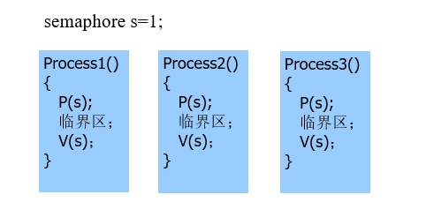
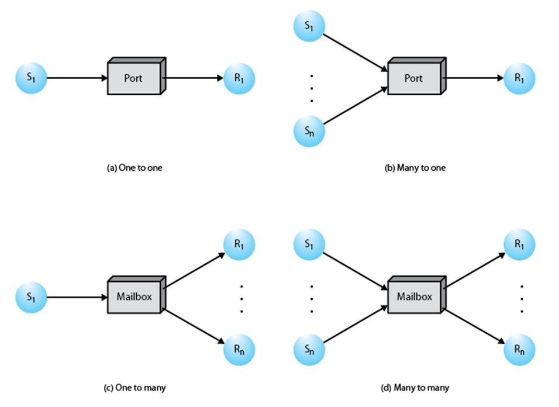
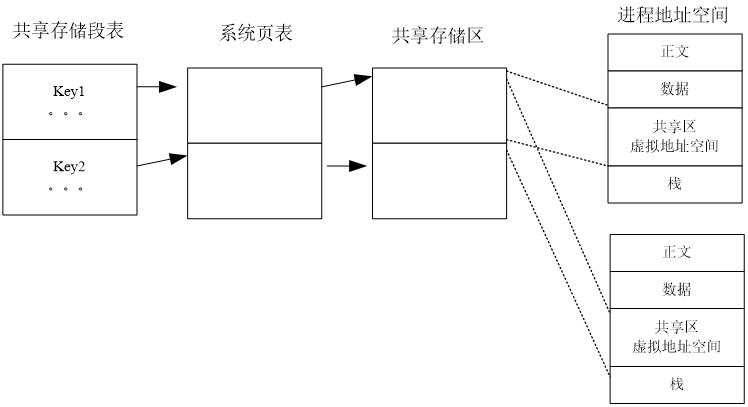
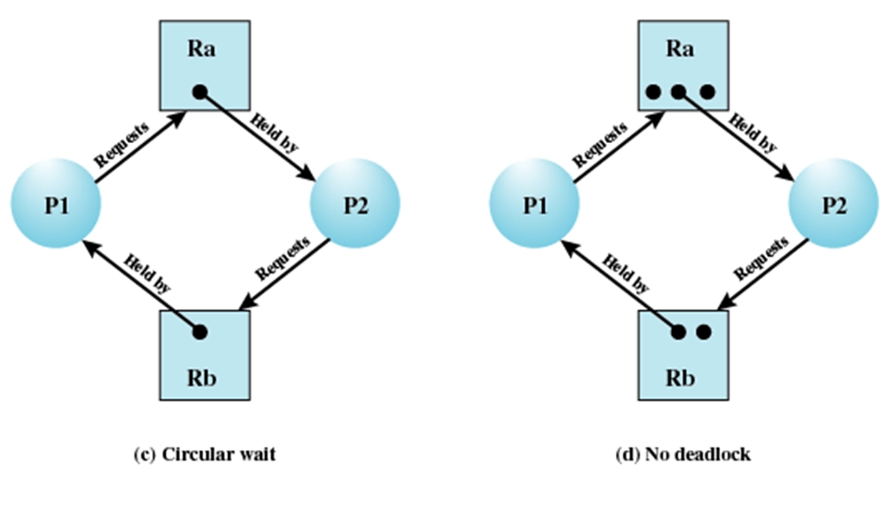
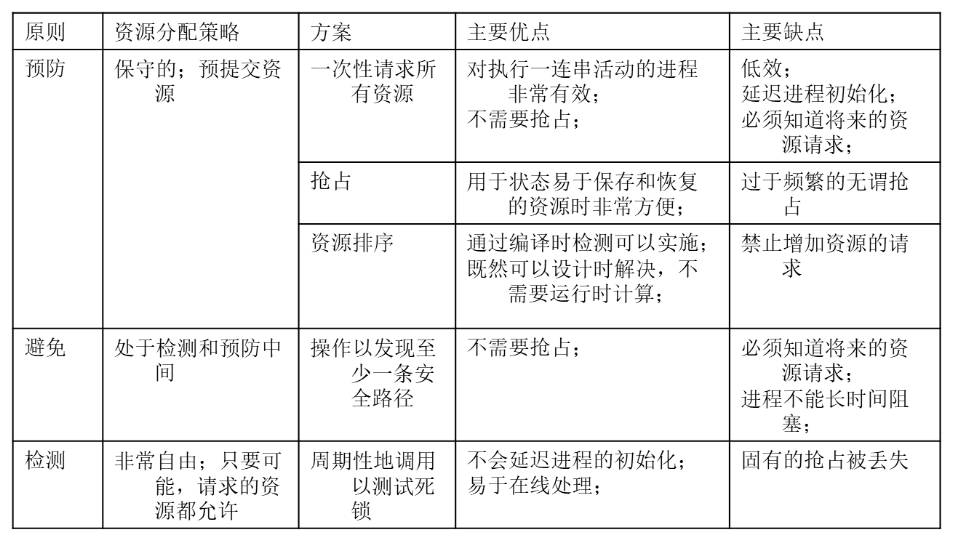

# 进程通信

- [Back to Course Home](index.md)

- 互斥
	- 要求各进程互斥地使用资源，当资源空闲时，任何进程都有资格使用该资源。
- 同步
	- 具有同步关系的进程之间必须按某种依赖关系相互合作，在指定的依赖关系未满足前，即使资源空闲也不允许被使用。
- 临界资源
	- 一个时刻只能被一个进程访问或使用的资源。临界资源可能是硬件设备，也可能是软件资源。
- 临界区：是一段代码。进程通过这段代码访问临界资源。当一个进程进入这段代码时，不允许其他进程进入。又称临界段或互斥段。
	- 进入临界区：进程开始执行临界区的代码。
	- 离开临界区：进程由执行临界区代码到不再执行临界区内的代码。
	- 临界区基本特征：原子性、可嵌套、可中断

## 互斥

- 互斥对系统的要求
	- 互斥进入：在所有共享相同资源或对象的临界段中，每次只能允许一个进程进入
	- 空闲让进：当无进程在临界区中，必须让某希望进入进程立即进入临界区。
	- 有限停留：一个进程只能在临界段内停留有限的时间。
	- 公平进入：不能让某进程无限等待进入临界区，不会出现饥饿状况。
	- 不受干涉：一个在非临界区停止的进程必须不干涉其他进程。
	- 硬件无关：对进程速度和处理器的数目没有任何要求和限制。
- 实现方法
	- 基于 CPU 特殊指令或硬件支持
		- 中断禁用
		- 特殊指令
			```text
			test&set
			test&clear
			exchange
			fetch&add
			```

	- 软件方法
		- Peterson 算法
		- 严格交替法
	- 程序设计语言支持的方法：
		- 管程（JAVA 等语言）
	- 操作系统支持的方法
		- 信号量、消息

### Peterson 算法

- 假定两个互斥进程，编号为 0，1
- 全局变量：设置进程状态数组`Wanted_In[2]`，
	- `Wanted_In[0/1] =0`,表示 0/1 号进程不在临界区，也不处于希望进入临界区的状态。
	- `Wanted_In[0/1] =1`,表示 0/1 号进程处在临界区，或者处于等待进入（或即将）临界区的状态。
- 全局变量：
	- `Observer`：标示最后一个试图（或成功）进入临界区的进程编号。

```c
int observer；				  /*当前观察进程*/		 
int wanted_in[2];			   /*记录进程是否希望进入临界区*/

/*进入临界区函数*/
enter_section(int process)
{
   int other = 1 - process;	 /* other：其它进程号*/
   wanted_in[process] = TRUE;   /*本进程要进入临界区*/
   observer = process;		  /*本进程要观察进入临界区情况*/
   while (observer == process &&  wanted_in[other]) {} /*测试进入*/
}

/*离开临界区函数*/
leave_section(int process)
{
	wanted_in[process] = FALSE;
}
```

## 信号量

- 基本思想
	- 进程要申请互斥资源，要等待信号的到来。
		- 如果缓存区中有信号，消耗一个信号后，占有资源
		- 如果缓冲区中没有信号，把自己阻塞在这个信号上。
			- 如果在阻塞过程中，收到信号，消耗掉该信号后，进程被唤醒执行。
			- 如果多个进程阻塞在一个信号上，有信号到来，会根据调度原则，决定哪个进程真正收到该信号。
	- 进程在释放资源时，发出释放资源的信号。
- 信号量的定义
	- 资源申请操作（`semWait`操作，`P`）（进入临界区前调用该操作）：
		- 信号灯的值减 1；
		- 如果其值为负值，把进程阻塞在该信号上。
	- 资源释放操作（`semSignal`操作，`V`）（离开临界区前调用该操作）：
		- 信号灯的值增 1；
		- 如果其值为负值或 0，表明有进程阻塞在该信号上。从阻塞的进程中，按调度原则挑选一个唤醒。

- `semWait`和`semSignal`操作是不可中断的，一般把这种不能中断的操作称作原语。即`semWait`原语、`semSignal`原语，又称`P`，`V`操作。

```text
/*信号量的定义*/
typedef struct semaphore {
	int   value;			/*可用资源数*/
	Queue  queue;		   /*被阻塞进程队列*/
} Semaphore;
Semaphore s;
Void P(semaphore s)
{
	s.value --;
	If (s.value < 0 ){
		将进程放入阻塞队列s.queue
		阻塞该进程,重新进程调度
	}
}
Void V(semaphore s)
{
	s.value ++; 
	If (s.value <= 0 ){
		从阻塞队列s.queue取出一进程,唤醒该进程
	}
}
```

### 信号量实现互斥

- 实现进程互斥，信号灯的取值含义：
	- 正值：表示还能有几个进程分配到资源（即进入临界区）。
	- 0：表示没有待分配资源，但也没有进程在等待资源。
	- 负值：（绝对值）等待分配资源的进程数，即阻塞的进程数。



### 信号量实现同步

- 用信号灯表示所等待的操作是否已经完成。
	- 用 P 操作表示等待其他进程协作任务完成的通知，
	- 用 V 操作（向其他进程）发送协作任务完成的通知。
	- 信号灯初始值一般为 0。
	- 一般一个进程执行 P 操作，另一个进程执行 V 操作。
- 半同步和全同步
	- 半同步：进程 a 要同步等待进程 b，而进程 b 则不必同步等待进程 a。
	- 全同步：进程 a 要同步等待进程 b，而进程 b 也要同步等待进程 a。

#### 生产者和消费者问题

- 问题描述：
	- 一群生产者，每个生产者每次生产一件产品。
	- 一群消费者，每个消费者每次消费一件产品。
	- 一个产品仓库（最大可暂存 n 个产品）。
	- 如果仓库满，生产者暂停生产。
	- 如果仓库空，消费者暂停消费。
- 信号量设置：
	- `Buffers`：表示仓库（缓冲区）的空闲容量。
		- 生产者生产一个产品后，放入缓冲区前，对此执行 wait 操作
		- 消费者消费一个产品后，对此执行 signal 操作
		- 初始值为 n
	- `Products`：表示仓库中的产品数量。
		- 生产者生产一个产品后，放入缓冲区对此执行 signal 操作
		- 消费者消费一个产品前，对此执行 wait 操作
		- 初始值为 0
	- `Mutex`：实现对缓存区操作的互斥
		- $1$：表示没有进程进行缓冲区操作
		- $0$：表示有一个进程正在对缓存区进行操作。
		- $-m$：表示有一个进程正在对缓存区进行操作，还有 m 个进程在等待进入缓存区操作。
	初始值为 1

```c
Semaphore Buffers=N;
Semaphore Products=0;
Semaphore mutex＝1；

/*生产者*/
Void Producer()
{
	while (TRUE) {
		/*生产产品*/
		P(Buffers);  /*等待缓冲区有空闲容量*/
		P(mutex);	/*进入临界区，互斥访问缓冲区*/
		/*向缓冲区放入产品*/
		V(mutex);	/*离开临界区*/
		V(Products); /*通知消费者有新产品可用*/
	}
}
/*消费者*/  
Void Consumer()
{
	while (TRUE) {
		P(Products); /*等待缓冲区有产品*/
		P(mutex);	/*进入临界区，互斥访问缓冲区*/
		/*从缓冲区取出产品*/
		V(mutex);	/*离开临界区*/
		V(Buffers);  /*通知生产者有空闲容量*/
		/*消费产品*/
	}
}
``` 

#### 读者/写者问题

- 问题描述：
	- 若干个并发进程对数据对象进行读写的情况。
	- 多个读操作可以并发执行（与生产/消费问题不同）。
	- 一个写者不能与任何的读者或者其它写者同时访问数据对象
- 全局变量和信号量设置：
	- `Count`：表示正在执行读操作的进程数目，初始值为 0
	- `Mutex`：表示是否有读者在对全局变量 count 进行修改，初始值为 1
	- `Wrt`：表示是否有进程在执行读或写的操作，1 表示没有，0 和负值表示有，初始值为 1

```c
Semaphore Count=0;
Semaphore Mutex=1;
Semaphore Wrt=1;

/*读者*/
Void Reader()
{
	while (TRUE) {
		P(Mutex);	   /*进入临界区，互斥访问Count*/
		Count++;		/*增加读者计数*/
		if (Count == 1) {
			P(Wrt);	 /*如果是第一个读者，阻止写者*/
		}
		V(Mutex);	   /*离开临界区*/
		/*执行读操作*/
		P(Mutex);	   /*进入临界区，互斥访问Count*/
		Count--;		/*减少读者计数*/
		if (Count == 0) {
			V(Wrt);	 /*如果是最后一个读者，允许写者*/
		}
		V(Mutex);	   /*离开临界区*/
	}
}

/*写者*/
Void Writer()
{
	while (TRUE) {
		P(Wrt);		 /*进入临界区，阻止读者和写者*/
		/*执行写操作*/
		V(Wrt);		 /*离开临界区，允许读者和写者*/
	}
}
```

- 优化：公平的思路：使用写者优先实现方法，即如果写者已在等待进入，后续的读者不应该进入。

## 管程（Monitor）

- 将临界资源和访问临界资源的代码（临界区）组织到同一个数据结构（对象）中
- 管程的实现方式：
	- 高级程序设计语言，如 JAVA，Pascal
	- 程序库

## 进程间数据交换

- 消息通信

	

- 共享存储区

	

- 管道通信
	- 匿名管道
		- 通过`pipe`函数创建
		- 通过`read`和`write`函数进行读写操作

		输入和输出端代码分别如下
		```c
		#include <stdio.h>
		#include <unistd.h>
		#include <sys/types.h>
		#include <sys/stat.h>
		#include <fcntl.h>
		#include <string.h>
		#define BUFFER_SIZE 10

		int main()
		{
			int fds[2];
			char buf[BUFFER_SIZE];
			// for (int i=0; i<BUFFER_SIZE; i++) buf[i]='0';
			//临时数组，用于存放通信的消息
			if(pipe(fds) < 0)
			{
				perror("pipe");
				return 1;
			}
			char inFilename[] = "testfile/local.txt";
			char outFilename[] = "testfile/target.txt";
			int in = open(inFilename, O_RDWR, 0666);
			int out = open(outFilename, O_CREAT | O_TRUNC | O_RDWR, 0666);
			//fflush(stdout);
			ssize_t length;
			pid_t pid = fork();
			if(pid == 0)
			{
				//子进程只写，关闭读出端
				printf("child process %d\n", getpid());
				close(fds[0]);
				while((length = read(in, buf, BUFFER_SIZE - 1)) > 0)
				{
					printf("child process %d read \"%s\" from file\n", getpid(), buf);
					write(fds[1],buf,strlen(buf)+1);
					printf("child process %d write \"%s\" to pipe\n", getpid(), buf);
					//将buf的内容写入管道
					memset(buf, 0, sizeof(buf));
				}
				close(fds[1]);
			}
			else
			{
				//父进程只读，关闭写入端
				printf("parent process %d\n", getpid());
				close(fds[1]);
				//从管道里读数据，放入buf
				while((length = read(fds[0],buf,BUFFER_SIZE)) > 0)
				{
					printf("parent process %d read \"%s\" from pipe\n", getpid(), buf);
					write(out, buf, strlen(buf));
					printf("parent process %d write \"%s\" to file\n", getpid(), buf);
					memset(buf, 0, sizeof(buf));
				}
				close(fds[0]);
			}
			return 0;
		}
		```

	- 命名管道（FIFO）
		- 通过`mkfifo`命令创建命名管道
		- 通过`open`函数打开命名管道进行读写操作

		```c
		#include <stdio.h>
		#include <unistd.h>
		#include <fcntl.h>
		#include <stdlib.h>
		#include <string.h>
		#include <errno.h>
		#include <sys/types.h>
		#include <sys/stat.h>
		#define BUFFER_SIZE 128

		int main()
		{
			char *file = "testfile/fifo.txt";
			int fd = open(file, O_WRONLY);
			if(fd<0)
			{
				perror("open failed");
			}
			printf("open fifo.txt success! \n");
			char inFilename[] = "testfile/local.txt";
			int in = open(inFilename, O_RDWR, 0666);
			umask(0);
			ssize_t ret = mkfifo(file, 0777);
			if(ret < 0)
			{
				if(errno != EEXIST)
					perror("mkfifo failed.");
			}
			printf("mkfifo success.\n");
			char buf[BUFFER_SIZE];
			while((ret = read(in, buf, BUFFER_SIZE - 1)) > 0)
			{
				ret = write(fd, buf, strlen(buf));
				if(ret<0)
				{
					perror("write failed.\n");
				}
				printf("read from input and write to buffer: %s\n", buf);
				memset(buf, 0, sizeof(buf));
			}
			printf("read closed.\n");
			close(in);
			close(fd);
			return 0;
		}
		```
		```c
		#include <stdio.h>
		#include <unistd.h>
		#include <fcntl.h>
		#include <stdlib.h>
		#include <string.h>
		#include <errno.h>
		#include <sys/types.h>
		#include <sys/stat.h>
		#define BUFFER_SIZE 128

		int main()
		{
			char *file = "testfile/fifo.txt";
			int fd = open(file, O_RDONLY);
			if(fd<0)
			{
				perror("open failed");
			}
			printf("open fifo.txt success! \n");
			umask(0);
			ssize_t ret = mkfifo(file, 0777);
			if(ret < 0)
			{
				if(errno != EEXIST)
					perror("mkfifo failed.");
			}
			printf("mkfifo success.\n");
			char buf[BUFFER_SIZE];
			char outFilename[] = "testfile/target.txt";
			int out = open(outFilename, O_CREAT | O_TRUNC | O_RDWR, 0666);
			while(1)
			{
				sleep(1);
				memset(buf, 0, sizeof(buf));
				ret = read(fd, buf, BUFFER_SIZE-1);
				if(ret<0)
				{
					perror("read failed.\n");
				}
				else if(ret==0)
				{
					printf("write closed.\n");
					return -1;
				}
				else
				{
					write(out, buf, strlen(buf));
					printf("read from buffer and write to output: %s\n", buf);
				}
			}
			close(out);
			close(fd);
			return 0;
		}
		```

- Socket 通信

## 进程死锁

- 资源分配图（Resource allocation graph）
	- 每个资源和进程用节点表示
	- 从进程到资源的边表示请求但还没授权；
	- 从资源到进程的边表示已经授权；
	- 圆点表示资源的实例。

	

### 死锁的产生条件

- 必要条件：
	- 互斥使用：（资源）每次只能允许一个进程占有和使用，其它申请该资源的进程被阻塞。
	- 保持并等待 ：当进程等待分配给它新的资源时，保持占有已分配的资源。
	- 不可剥夺 ：不能强迫回收进程占有的未使用完的资源。
- 充分条件：
	- 循环等待：存在一个闭合的进程─资源链

### 应对死锁的方法
#### 死锁预防：破环死锁产生的条件

1. 互斥占用：无法利用
2. 保持等待：
	- 静态分配策略：系统一次申请它所要用到的资源，如果能满足就分配，如果不能满足，一个也不分配。
3. 不可剥夺：
	- 主动释放
	- 强制回收
4. 循环等待：
	- 资源排序：采用有序资源使用法可以防止循环等待条件。如果一个进程已经分配了类型 R 的资源，那么以后它只能申请在资源顺序表中排在 R 后面的资源类型。

#### 死锁避免：允许 3 个必要条件，通过一定的策略使系统达不到死锁点(状态)。

- 银行家算法
	- $Resource = R = (R_1, R_2, ..., R_m)$ ，系统中每种资源的总量；
	- $Available = V = (V_1, V_2, ..., V_m)$ ，尚未分配的每种资源的数量；
	- $Claim = C = \left[\begin{array}{ccc}C_{11} & C_{12} & \ldots & C_{1m}\\C_{21} & C_{22} & \ldots & C_{2m}\\\vdots & \vdots & \ddots & \vdots\\C_{n1} & C_{n2} & \ldots & C_{nm}\end{array}\right]$，$C_{ij}$ 表示进程 i 对资源 j 的需求数量；
	- $Allocation = A =\left[\begin{array}{ccc}A_{11} & A_{12} & \ldots & A_{1m}\\A_{21} & A_{22} & \ldots & A_{2m}\\\vdots & \vdots & \ddots & \vdots\\A_{n1} & A_{n2} & \ldots & A_{nm}\end{array}\right]$，$A_{ij}$ 表示进程 i 已经分配了 j 类资源的数量。
	- 必须成立的条件
		- $R_{j}=V_{j}+\sum_{i=1}^{N}A_{ij}$，每类资源的未分配和已分配之和固定
		- $C_{ij}\leq R_{i}$, 对所有的 $i$, $j$ 请求受限
		- $A_{ij}\leq C_{ij}$, 对所有的 $i$, $j$ 获得小于等于请求
	- 仅当

	    $$
	    R_{j} \geq C_{(n+1) j} + \sum_{l=1}^{n} C_{i l j} \text {, 对所有的 } j
	    $$

	    成立时, 才启动进程 $P_{n+1}$。

- 缺点: 该策略假设了最坏情况, 即所有进程同时满足最大资源需求时才启动。
- 两个步骤：
	- 申请者申请资源时，需要同时把未来的资源最大需求量告诉系统。
	- 如果对资源的分配可能会导致死锁，就暂不允许进一步为进程分配资源。

#### 死锁检测

- 基本思路：
	- 使用死锁检测，只要可能，就将所申请的资源分配给进程。
	- 操作系统定期地执行检查算法，以判断是否存在条件 4 的循环等待链。
	- 待检测出死锁时，再想办法解决死锁。
- 检测的时机：
	- 可以在进程申请资源时进行检测
	- 可以在死锁解除过程中进行检测
- Coffman 算法
	- 基本数据结构：
		- 进程等待资源矩阵 Q：指明每个进程对每种资源的需求
		- 资源占用矩阵 Allocation：表明每个进程已经占用的每种资源的数量。
		- 剩余资源向量 Available：表明所剩余的每种资源的数量
		- 临时空闲资源向量 W：初始值等于 Available
	- 步骤：
		- 标记 Allocation 矩阵中行全为零的进程
		- 初始化 W，W=available
		- 查找下标 i，使进程 i 当前未标记且 Q 的第 i 行小于等于 W。
		- 如果找不到这样的行，终止算法
		- 如果找到这样的行，标记进程 i，并把 Allocation 中相应的行加到 W，返回步骤 3。
	- 算法结束时，如果有未标记的进程，则**每个未标记的进程都是可能死锁的进程**。



#### 死锁解除

- 强迫撤销所有的死锁进程。
- 将每一个死锁进程退回到一些以前定义的“检查点”，再启动进程。
	- 需要系统支持进程的回退和重启动机制。
- 逐个撤销死锁进程，直至死锁不存在。
	- 终止死锁进程的次序应当基于最小代价的标准。
	- 每终止一个进程后就调用死锁检测算法，以判定死锁是否还存在。
- 相继地剥夺进程所占的资源，直至死锁不再存在。同样，剥夺资源的次序应基于成本方面的考虑。
	- 被剥夺资源的进程必需回退到获得该资源之前的某个执行点上。

- 成本核算因素
	- 目前为止消耗的处理器时间最少
	- 目前为止产生的输出最少
	- 预计剩余时间最长
	- 目前为止分配的资源总量最少
	- 优先级最低

### 哲学家就餐问题

- 问题描述
	- n 位哲学家围坐圆桌
	- n 把筷子
	- m 个盘子
	- 每个哲学家需要同时使用 2 把筷子和 1 个盘子才能用餐
- 解决方法
	- 如果无法拿到右筷子，则释放左筷子，随机等待一段时间后再进餐。
		- 在大多数情况下可行，不能保证万无一失
	- 设计一个信号量，使得某一个时刻只能有 4 个哲学家进餐

```c
/* program diningphilosophers */
semaphore fork[n];
for (i=0; i<n; i++) {
	fork[i] = 1;
}
semaphore plate = min(n-1, m);
int i;

void philosopher(int i) {
	while (true) {
		think();
		wait(plate);
		wait(fork[i]);
		wait(fork[(i+1)%n]);
		eat();
		signal(fork[(i+1)%n]);
		signal(fork[i]);
		signal(plate);
	}
}
```