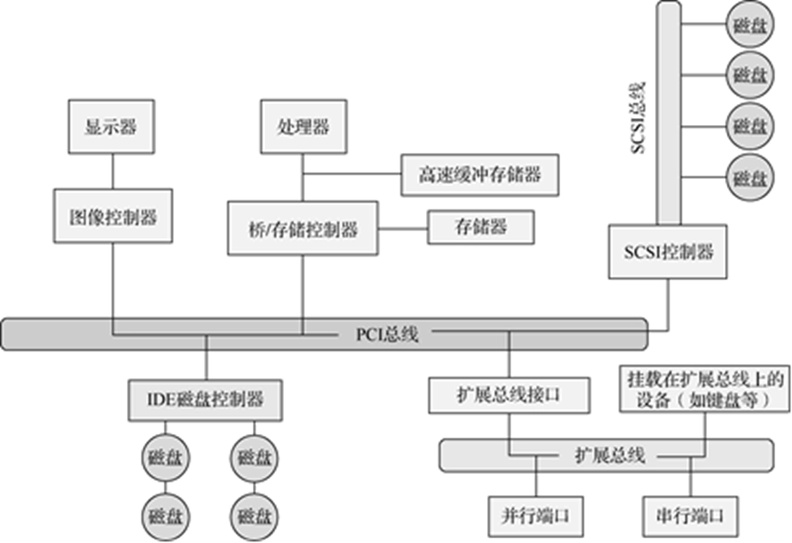
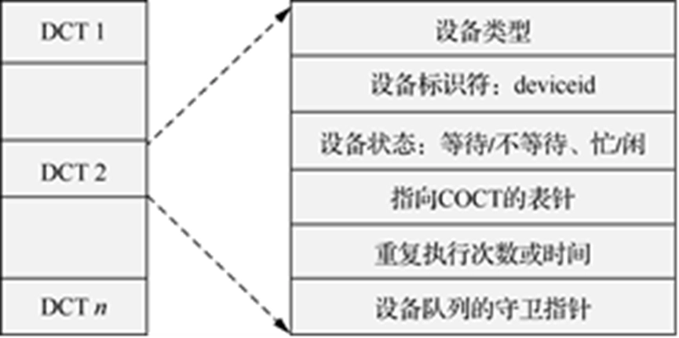
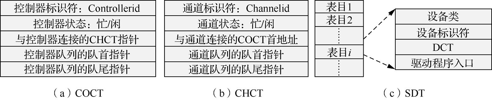

# 设备管理

- [Back to Course Home](index.md)

## 设备概述

- 设备分类
	- 按照数据传输方式分类
		- 字符设备：数据以字符为单位传输，如键盘、鼠标、打印机等。
		- 块设备：数据以块为单位传输，如硬盘、光盘等。
		- 流设备：数据以连续流的方式传输，如网络接口、串口等。
	- 按照访问方式分类
		- 顺序访问设备：只能按顺序访问数据，如磁带。
		- 随机访问设备：可以随机访问数据，如硬盘。
	- 按照功能分类
		- 输入设备：如键盘、鼠标、扫描仪等。
		- 输出设备：如显示器、打印机等。
		- 输入输出设备：如硬盘、网络接口等。
	- 按存在形式上（OS 角度）：
		- 物理设备
		- 逻辑设备
	- 按资源属性（OS 管理角度）：
		- 共享设备
		- 独占设备
		- 虚拟设备
- 设备管理层次关系
	- 底层通信（中断处理）：
		- 实现软件和硬件设备的通信。
	- 设备驱动：
		- 功能：接受来自上层的抽象操作请求，并负责操作的具体实施。
		- 主要组成：与设备打交道的软件、共享支持、缓冲区支持等。
	- 对用户层的 I/O 接口：
		- 每个 I/O 调用接口对应具体的设备抽象操作。
	- 使用设备的用户级程序：
		- 通过调用所提供的接口来实现对设备的使用或控制。

## 中断响应

- 设备向中断控制器发送中断信号
- 中断控制器比较各个中断的优先级。如果有未被屏蔽的中断，中断控制器向 CPU 发送中断信号。
- CPU 现场保存后，通过询问中断控制器，确定中断源（中断号）。
- 通过中断号，找到对应的中断处理程序。
- 中断处理结束后，
	- 原运行在核心态：恢复现场，转向被中断的任务继续执行。
	- 原运行在用户态：检查调度标志、信号设置标志（runrun）。如果被设置，进行相应处理。否则恢复现场，继续执行。

## 设备的四类资源

- I/O 地址
	- 需要把单个设备的 I/O 编址映射到系统全局编址。
- I/O 中断请求
	- 中断控制器支持的中断数量有限，每个进行了编号。设备接入系统后，需要分配中断号。
- I/O 通道
	- I/O 通道是一种 **硬件** 设施，带有专用处理器的，可以独立地完成系统处理器交付的 I/O 操作任务
	- 通道具有自己专门的指令集，即通道指令。通道执行来自处理器的通道程序，完成后只需向系统处理器发出中断，请求结束。
- DMA 数据传输通道
	- 内存和 I/O 设备之间的自动化数据通路，在主存和 I/O 设备之间成块传送数据过程中，不需要 CPU 干预，CPU 资源的利用率再次得到提高 。
	- DMA 不仅设有中断机构，而且，还增加了 DMA 传输控制机构（类似于 CPU）。
- I/O 缓冲区
	- 缓存区需求：
		- 提高 CPU 和外设的并行度
		- 缓解外设速度慢的瓶颈
	- 缓冲区分类：
		- 硬件缓冲：有些设备中会包含专门的硬件寄存器等用于缓冲。
		- 软件缓冲：直接在主存中。
			- 单缓冲：一个缓冲，外设和 CPU 互斥进行操作。
			- 双缓冲：设置两个缓冲区，交替使用。
			- 循环缓冲：类似于循环队列，依次使用。
			- 缓冲池：系统维护一组大小相同的缓冲区，进程和设备按需要申请，使用完后重新归入缓冲池中。

## 设备分配

- 设备分配表
	- 设备控制表（device control table，DCT）
		- 一张 DCT 对应一个设备
		- 有指向 COCT 的指针

		

	- 控制器控制表（controller control table，COCT）
		- 一张 COCT 对应一个控制器
		- 有指向 CHCT 的指针
	- 通道控制表（channel control table，CHCT）
		- 一张 CHCT 对应一个通道
		- 有指向 COCT 的指针
	- 系统设备表（system device table，SDT）
		- 一张 SDT 对应一个系统
		- 有指向 DCT 的指针

	

- 设备分配方式
	- 静态分配
		- 用于对独占设备的分配，在用户作业开始执行前由系统一次性分配该作业所要求的全部设备。
		- 静态分配方式不会出现死锁，但设备的利用率低。因此，静态分配方式不符合分配的总原则。
	- 动态分配
		- 在进程执行过程中根据执行需要进行。
		- 动态分配方式有利于提高设备的利用率，但如果分配算法使用不当，则有可能造成进程死锁。

## 上层统一接口

- 统一标识，统一操作
- 操作：抽象为文件名-文件操作
- 主设备号：可以找到相应的设备驱动程序
- 次设备号：指定具体的物理设备

## 设备驱动程序

- 设备驱动程序是操作系统内核的一部分，负责与硬件设备进行通信。
- 设备驱动程序的主要功能包括：
	- 初始化设备：在设备启动时进行初始化设置。
	- 处理 I/O 请求：接收来自上层的 I/O 请求，并将其转换为设备可以理解的格式。
	- 处理中断：响应设备发出的中断信号，处理设备状态变化。
	- 错误处理：处理设备操作中的错误情况。