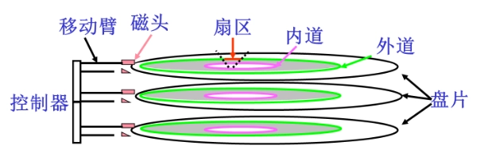
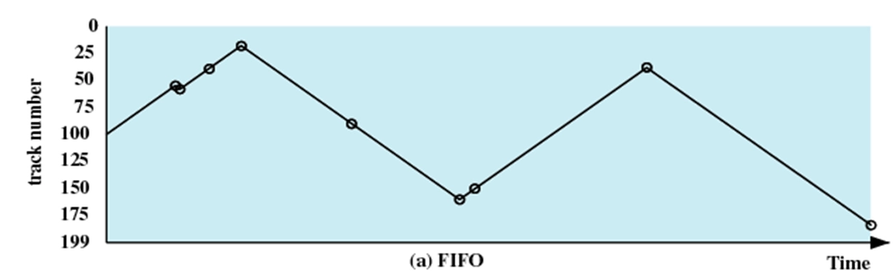
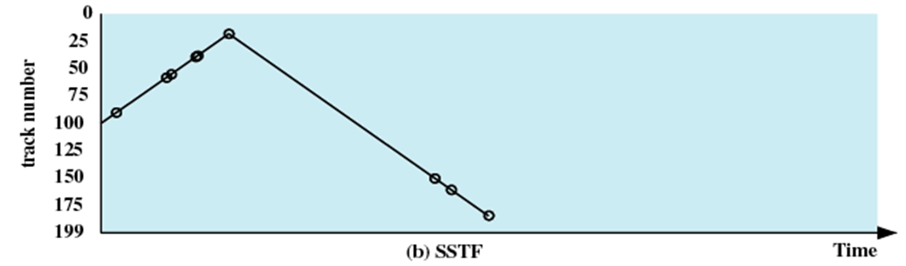
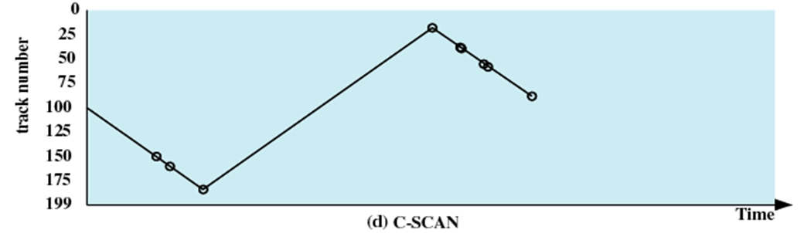

# 外部存储

- [Back to Course Home](index.md)

## HDD
### 磁盘结构

- 磁盘时延 = 寻道时间 + 旋转时间 + 传输时间 + 控制器负载
	- 寻道时间：依赖移动臂移动速度，磁道的位置 （Ts）
	- 旋转时间：依赖磁盘转速，扇区距离磁头的距离 （平均：1/2r）
	- 传输时间：依赖磁盘的带宽，需求的数据总量（T=b/rN）
		- b 表示要传送的字节数，N 表示一个磁道中的字节数，r 表示旋转速度
	- 总的存取时间为：$T = Ts + \frac{1}{2r} + \frac{b}{rN}$
- 应对延迟的方法
	- 缓存
		- 文件访问级缓存
	- RAM 磁盘
		- 保留部分 RAM 作为高速文件系统
	- RAID
		- 并行访问（容错）
	- 智能调度算法
		- 读写头调度
		- 元信息布置
- 磁盘高速缓存
	- **主存** 中的一块空间
	- 提高进程访问磁盘的速度
	- 粒度与扇区大小相等
	- 替换策略
		- 最近最少使用算法（LRU）
		- 最不常用算法（LFU）
		- 基于频率的替换算法

#### 磁盘调度

1. 先来先服务（FCFS）
	- 按照请求到达的顺序处理磁盘 I/O 请求。
	- 优点：
		- 简单易实现
		- 公平
	- 缺点：
		- 可能导致长时间的寻道时间，尤其是在请求分布不均匀时
		- 磁头移动幅度大
	- 适合较轻负载的系统

	

2. 最短寻道时间优先（SSTF）
	- 选择距离当前磁头位置最近的请求进行处理。
	- 优点：
		- 寻道时间较短，服务效率较高，服务平均等待时间较短。
		- 提供比 FIFO 更高的效率
	- 缺点：
		- 公平性差，可能导致饥饿现象，即某些请求长时间得不到处理
		- 对于远离当前磁头位置的请求，等待时间较长
		- 适合中度负载的系统

	

3. 电梯算法（SCAN）
	- 磁头从一端移动到另一端，处理所有请求，然后反向移动。
	- 算法特点:
		- 每个请求的等待时间不均匀，且平均等待时间长。
		- 如到达另一端反向时，将扫描的是刚刚扫描过的磁道，这里的请求显然少，而另一端的请求多，且等待服务的时间长。
	- 算法优化：
		- 磁头并不是每次扫描都移动到最远的磁道上，一旦在当前方向上前面没有请求，就开始反向移动。
	- 比较适合磁盘负载较重的系统。

	

4. 循环扫描算法（C-SCAN）
	- 磁头从一端移动到另一端，处理所有请求，然后返回到起始位置，继续处理请求。

	

5. PRI（基于进程优先级的调度）
6. LIFO（后进先出）
	- 局部性最好，资源利用率最高。
7. N-step-SCAN
	- 避免磁头臂粘性
	- 把请求分为长度为 N 的多个队列；一次处理一个队列；新到的请求加到其他队列中。
	- 特性：N 较大时，等价于 SCAN；N=1 时，等价于 FIFO
8. F-SCAN
	- N=2 时的 N-step-SCAN

- OpenEuler 的磁盘调度器
	- 电梯调度器(Elevator)
	- 时限 IO 调度器（deadline IO scheduler）
	- 预期 IO 调度器（anticipatory IO scheduler）

#### RAID

- 将文件数据分条（striped）到多个磁盘上
- 通过并行提高性能
- 通过冗余提高可靠性

和 *计算机组成与系统结构* 课程笔记结合食用更佳哦。

计算机组成与系统结构

## SSD

- SSD（Solid State Drive）是一种基于闪存技术的存储设备，具有更快的读写速度和更低的延迟。
- SSD 没有机械移动部件，因此更耐冲击，可靠性更高。
- SSD 的缺点包括价格较高和写入次数有限。
- 工作特性：
	- 闪存块不能覆盖写：必须先擦除整个块才能写入新数据。
	- 闪存块寿命有限
	- 闪存快存在读干扰
	- 闪存块可能出现坏块
	- 垃圾回收
		- SSD 会定期执行垃圾回收操作，将无效数据块合并，释放空间。
	- 写放大
		- 写入以块（block）为单位进行，可能导致实际写入的数据量大于请求写入的数据量。
		- 擦除以页（page）为单位进行，写入以块（block）为单位进行。
- 优势
	- 性能好
	- 功耗低
	- 防震
	- 低噪声
	- 体积小
- 缺点
	- 价格高