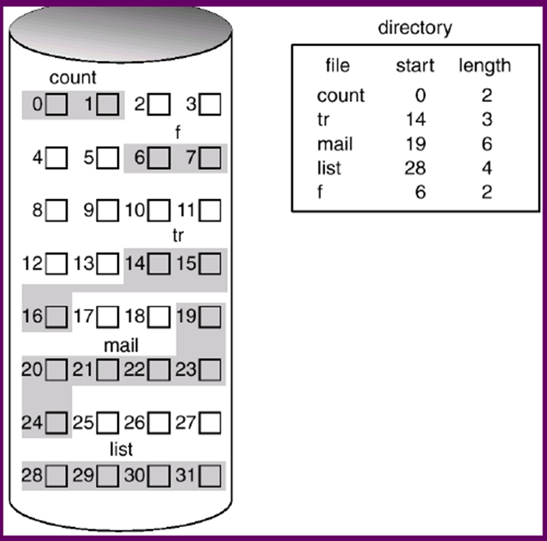
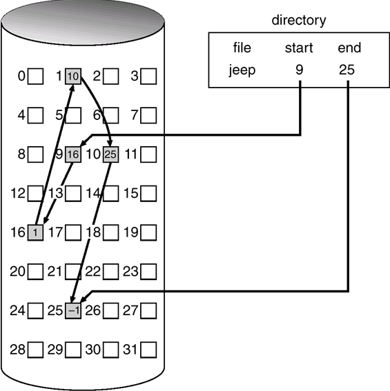
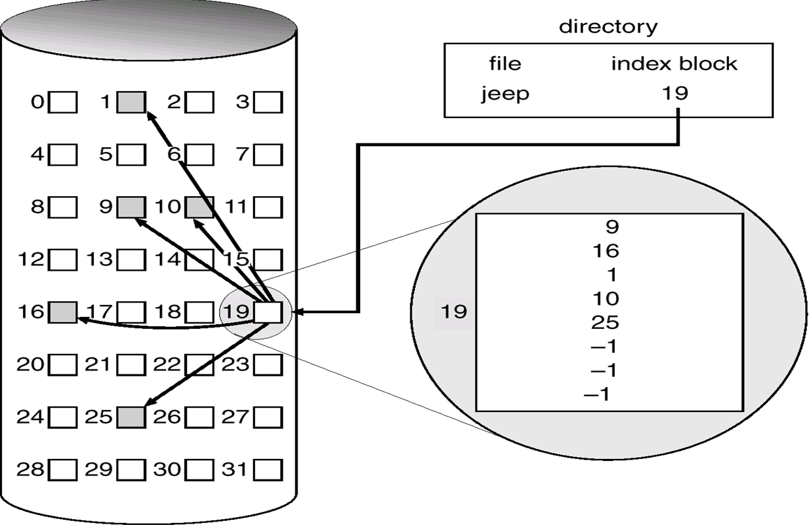
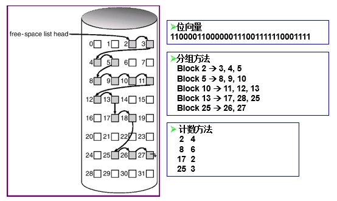
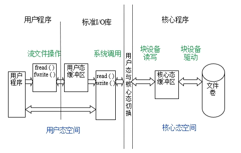
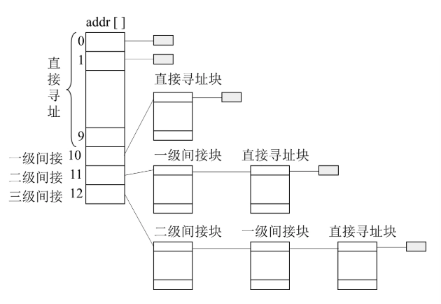
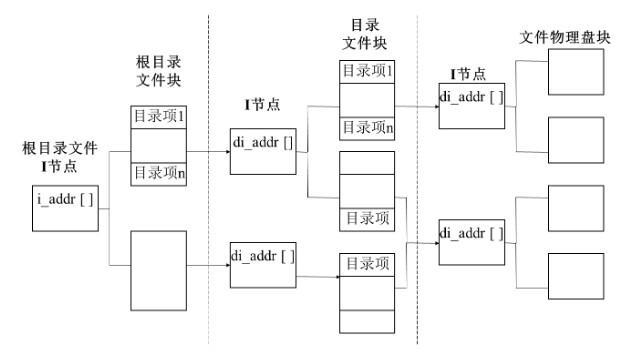
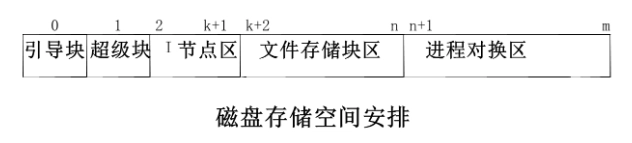
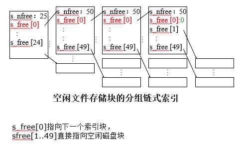
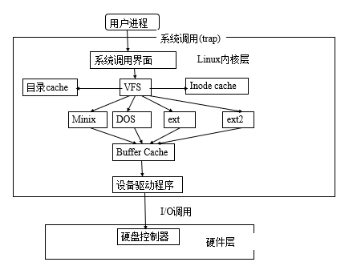

# 文件系统

- [Back to Course Home](index.md)

## 文件系统目标和要求

- 目标：方便用户管理自己的数据资源
- 基本要求
	- 文件按名存储
	- 文件有序组织，文件名分层次管理
	- 如支持树形目录结构
	- 操作简单，存取效率高。
- 其它要求：
	- 支持多用户系统，多用户能够共享同一个磁介质。
	- 有一定的安全性保证，最好能进行数据恢复。
	- 存储空间的利用率高

## 文件系统概念

- 文件：
	- 由文件名字标识的一组相关信息的集合。文件名是字母或数字组成的字母数字串 
- 文件系统：
	- 软件观点：操作系统中，为用户和应用程序管理文件的系统软件集合。
	- 存储格式观点：文件系统是文件在存储介质上保存和管理相关的约定。在操作系统中，这种约定的实现也被称为文件系统。一种相关约定就对应一种文件系统，所以目前存在多种文件系统：FAT，FAT32，NTFS，EXT2 等。
- 操作系统和文件系统
	- 早期：一个操作系统一般都支持一种文件系统。在设计操作系统时，常常会专门为此设计一种文件系统。
	- 目前：为实现文件和文件系统共享，一个操作系统除支持为它设计的文件系统外，还可能支持其他文件系统。如 Linux 支持 Ext2，FAT 等。
- 文件类型
	- 普通文件：即前面所讨论的存储在外存设备上的数据文件。
	- 目录文件：文件在管理普通数据文件时，需要保存其相应的文件和属性，这些属性以目录文件的形式存储在磁盘中。
	- 块设备文件：在 unix/Linux 等操作系统中，对应于磁盘、光盘或磁带等块设备的文件。
	- 字符设备文件：在 unix/Linux 等操作系统中，对应于终端、打印机等字符设备的文件。
- 文件属性
	- 文件的类型属性：如普通文件、目录文件、系统文件、隐式文件、设备文件等。
	- 文件的保护属性：如可读、可写、可执行、可创建、可删除等。
	- 创建者属性
	- 创建和访问时间属性
	- 文件大小
- 文件的逻辑组织方式
	- 堆文件
	- 顺序文件
	- 索引顺序文件
	- 索引文件
	- 散列文件

## 文件存储资源分配和磁盘空闲空间管理策略
### 分配策略

- 静态分配（预分配）
	- 在文件创建时就分配好所需的连续的存储空间。
	- 优点：访问速度快，文件存储连续。
	- 缺点：无法预知文件的未来大小，可能会出现分区浪费和预留分区的大小不够，难以动态调整。
- 动态分配
	- 在使用时，按文件大小分配磁盘空间。
	- 一般占有不连续的磁盘块。

### 分区大小

- 可变长、连续大分区
	- 文件访问性能高。无内部碎片
	- 难于重复使用存储空间。有外部碎片
	- 分配方法：
		- 首次适应
		- 最佳适应
		- 循环首次适应
- 块（固定大小）
	- 灵活性强、不一定相邻
	- 管理较复杂

### 文件存储方式

1. 连续分配
	- 一个文件占用磁盘上的一系列连续数据块
	- 初始块号以及占用的块数量放在目录项中（例如，FCB）
	- 优点
		- 速度快 – 可以实现最小寻道时间和磁头移动
		- 方便地访问文件中的任何块
	- 缺点
		- 类似于动态存储分配策略
			- 外部碎片 – 可以压缩
		- 文件增长困难
			- 可以找一个大的连续块，并搬迁文件的位置

	

2. 链接分配
	- 每一个数据块包含一个指向下一个数据块的指针
	- 查找时间复杂度为 $O(n)$ , $n$ 是文件的大小
	- 指针的损坏能造成整个文件的丢失

	

3. 索引分配
	- 一个索引块包含一些指向数据块的指针
	- 优点
		- 支持随机读写
		- 可靠性提高
	- 缺点：
		- 二次访问，性能不高
		- 需要额外空间来保存索引节点
	- 索引节点大小如何确定？
		- 大索引节点：小文件时浪费空间
		- 小索引节点：无法支持大文件

	

### 空闲空间管理

1. 位图法
	- 使用位图来表示磁盘块的使用情况
	- 每个磁盘块对应一个位，0 表示空闲，1 表示已分配
	- 优点：简单、易于实现
	- 缺点：需要额外的存储空间来保存位图
2. 链接表法
	- 使用链表来管理空闲块
	- 每个空闲块包含指向下一个空闲块的指针
	- 优点：节省空间，动态分配
	- 缺点：查找时间较长，指针损坏可能导致内存泄漏
3. 索引法
	- 使用索引块来管理空闲块
	- 索引块包含指向空闲块的指针
	- 优点：支持随机访问，查找时间较短
	- 缺点：需要额外的存储空间来保存索引块



### FAT 文件系统

- 采用链接分配方式
- 每个文件的目录项中包含一个指向 FAT 表的指针
	- FAT 表内容：
		- 位图法记录空闲块
		- 链表法记录文件数据地址
- FAT12
	- FAT entry size: 12bits：可支持 4K 个表项
	- 如果 cluster 大小为 32K，则可支持最大磁盘容量：128M
- FAT16
	- FAT entry size: 16bits：可支持表项数：64K
	- 如果 cluster 大小为 32K，则可支持最大磁盘容量 2G
- FAT32
	- 结构和 FAT12/16 完全不同
	- FAT 表项大小 32bits，28bit 用于保存 cluster 号
	- 可支持最大磁盘容量: (2**28)*32K=8T

## 目录结构

- 目录文件的内容
	- 目录下所有文件（含子目录）的属性信息：文件名，文件属性，文件内容存储的位置。
	- 每个文件对应的信息成为一个目录项。也就是说目录文件的内容是目录项的集合。
- 目录项的内容
	- 基本信息
		- 文件名：在一个特定的目录中具有唯一性。
		- 文件类型：例如文本文件，二进制文件，目标模块等。
		- 文件组织：系统所支持的不同组织形式。
	- 存储信息
		- 地址信息：文件存放在磁盘的物理地址（例如：柱面号、磁道号或在磁盘上的块号）。两种方式：
			- 起始地址
			- 扇区地址数组
		- 文件的大小，以字节、字或块计。
		- 分配大小：文件的最大尺寸
	- 存取控制信息
		- 文件主：拥有文件的控制权。文件主能授予和取消其他用户对文件的存取权和改变这些权限。
		- 访问控制：权限用户的口令和用户名等
		- 允许的操作：控制读、写、执行和在网上的传输等。
	- 使用信息
		- 创建日期：文件首次存放在目录中的时间。
		- 读时间：最后一次读文件的时间。
		- 修改时间：最后一次更新、插入或删除的时间。
		- 备份时间：文件最后一次备份到其他介质的时间。
- 间接式访问：如果对目录文件的属性进行修改，那么与该目录中文件的内容没有关系，实际上是：**修改上级目录文件的内容**。
- 目录结构
	- 线性结构 
	- Hash 表
	- 树

## 流文件操作与系统调用间的关系


## UNIX 文件系统
### UNIX 文件索引结构

UNIX 索引节点如下

```c
struct dinode { 
	ushort	   di_mode；	  // 文件控制模式
	short		di_nlink；	 // 文件的链接数
	ushort	   di_uid；	   // 文件主用户标识数
	ushort	   di_gid；	   // 文件主同组用户组标识数
	off_t		di_size；	  // 文件长度，以字节为单位
	char		 di_addr[40]；  // 地址索引表，存放文件的盘块号
	time_t	   di_atime；	 // 文件最近一次访问时间
	time_t	   di_mtime；	 // 文件最近一次修改时间
	time_t	   di_ctime；	 // 文件创建时间
} dinode;
```

其中的 `di_addr`字段是一个数组，存放文件的盘块号。每三个字节表示一个磁盘号；相当于能够表示 13 个磁盘号的数组

- 前 10 个表项是直接寻址。
	- 直接存放文件前 10 磁盘块地址。
	- 假定一个磁盘块 1K，那么可以表示 10K 以内的文件
	- 如果文件大小可用 10 以内磁盘块保存，后面间接寻址不使用。
- 第 11 个表项是一级间接寻址。
	- 表示的磁盘块不是直接存放文件的内容，而是存放直接寻址表项。即表明 $1024/3$ 个磁盘块号，用于存放文件内容。
	- 该级地址最多可表示文件大小 $1024/3 \times 1024$。
- 第 12 个表项是二级间接寻址。
	- 表示的磁盘块不是直接存放文件，而是存放一级间接寻址表项。即表明 $1024/3$ 个磁盘块号，用于存放一级寻址表项。
	- 该级地址最多可表示文件大小 $1024/3 \times 1024/3 \times 1024$。
- 第 13 个表项是三级间接寻址。
	- 表示的磁盘块不是直接存放文件，而是存放二级间接寻址表项。即表明 $1024/3$ 个磁盘块号，用于存放二级寻址表项。
	- 该级地址最多可表示文件大小 $1024/3 \times 1024/3 \times 1024/3 \times 1024$。



### UNIX 目录系统结构
目录项如下

```c
struct direct {
	ino_t d_ino;				// 文件的inode号
	char d_name[NAME_MAX + 1];  // 文件名
};
```



### UNIX 文件系统在磁盘的存储布局

- 分布概述：
	- 一个物理磁盘能够被划分成多个逻辑分区，相当于一个逻辑盘。对每一个逻辑盘，盘块的物理地址是连续的。
	- 可以把一个逻辑盘的存储地址空间看成一个一维的线性空间。
	- 一个文件系统对应一个逻辑盘。一个物理磁盘上可以同时存在多个文件系统。



- 引导块：
	- 在块号为 0 的引导块中包含操作系统的自举程序
	- 该块不属于文件系统一部分。
	- 有些逻辑分区上没有这一块的内容
- 超级块
	- 用于存放文件系统的核心数据
	- 各部分的盘块分布
	- 空闲节点数，空闲节点表
	- 空闲盘块数，空闲盘块索引
	- 文件系统的类型、版本号，文件系统的状态
	- 超级块在文件系统启动时，为了快速更新，被复制到内存一份。
	- 磁盘上超级块需要定时更新
	- 为了保证超级块的安全性，超级块在磁盘上有备份，用于文件系统恢复。

	```c
	struct filsys {
	ushort	   s_isize；		   /* 磁盘索引节点区所占用的盘块总数 */
	daddr_t	s_fsize；		 /* 整个文件系统的盘块总数 */
	Short		s_nfree；		   /* 直接管理的空闲块数目 */
	daddr_t	s_free[NICFREE]； /* 空闲块索引表 */
	Short		s_ninode；		  /*直接管理的空闲索引节点数 */
	ino_t		s_inode[NICINOD]； /* 空闲I节点索引表 */
	Char		 s_flock；		   /* 处理空闲块表时的加锁标志位 */
	Char		 s_ilock；		  /* 处理空闲I节点表时的加锁标志位 */
	Char		 s_fmod；			/* 文件系统超级块被修改标志 */
	daddr_t	s_tfree；		 /* 空闲数据块总数 */
	ino_t		 s_tinode；	 /* 空闲索引节点总数 */
	}
	```

- 进程对换区：
	- 连续磁盘区域。用于是换入/换出，作为内存的扩充。
	- 该块不属于文件系统的一部分。
	- 有些系统，如 Linux，可以以单独的一个逻辑盘作为交换区

### UNIX 文件系统对空闲磁盘块的管理

- 所有空闲磁盘块以多叉（50）树的方式组织。
- 树的每个叶子节点对应一个空闲磁盘块
- 树的每个中间节点存储在一个空闲磁盘块中，其内容表示下层的多（50）个磁盘块号。



### UNIX 文件控制块（FCB）

- 内存中的目录结构树
	- 必要性：
		- 访问一个文件时，系统要从根目录或当前目录出发，循序读取和搜索各级目录文件磁盘 I 节点，索引结构等，找到文件物理块号后再存取文件数据。
		- 涉及多次磁盘操作，速度慢。
	- 技术思路：
		- 在内存中，保存磁盘上的目录结构树的副本
		- 内存中并不是完整的副本，而是一部分：
			- 内存容量的限制
			- 根据局部性原理，保存一部分就能起到很好的效果
- 文件控制块
	- 文件被打开一次，就分配一个相应的文件控制块。
	- 用于保存文件打开后产生一些动态信息。
	- 存在的必要（为何动态信息不存放在内存索引节点中）
		- 内存索引节点主要存放文件相关的静态信息
		- 便于实现一个文件同时被多个进程打开。

	```c
	struct file { 
		char f_flag；			   /* 操作方式，如写、读、追加写等 */
		cnt_t f_count；			 /* 共享该file结构的进程数 */
		union {
			struct inode *f_uinode；/* 指向内存I节点 */
			struct file  *f_unext； /* 空闲file的链接指针 */
		} f_up；
		union {
			off_t f_off；		   /* 读写位置指针 */
		} f_un；
	}；
	```

## 打开文件表

- 进程的打开文件表
	- 每个进程都有一个打开文件表，保存该进程打开的所有文件的文件控制块。
	- 通过该表，进程可以访问其打开的文件。
	- 子进程继承父进程打开的文件。
- 系统的打开文件表
	- 系统中所有进程共享一个打开文件表，保存所有打开文件的文件控制块。
	- 通过该表，系统可以管理所有进程打开的文件。

## 文件搜索

- 相对路径搜索
- 绝对路径搜索

## 虚拟文件系统

- 背景和目标
	- Linux 需要支持多种文件系统。
	- 屏蔽下层的具体文件系统，向上提供统一的文件服务。
- 主要思路
	- 在具体文件系统和操作系统的文件服务接口间实现虚拟层
	- 对下层的具体文件系统进行统一封装和细节屏蔽
	- 对上层提供统一的文件服务接口
- 核心实现：
	- 对一些文件系统的具体实现，如果实现与具体文件系统无关，把这些实现统一到 VFS 层。如：一些结构的缓冲，索引节点
	- 当一个进程调用文件系统例程时，内核调用 VFS 函数 (这个函数是和具体结构无关的)，并将这个调用传递给物理文件系统中的相应函数,该函数和具体的物理结构有关。



## 可靠性问题

- 系统启动时的一致性检查
- 日志文件系统