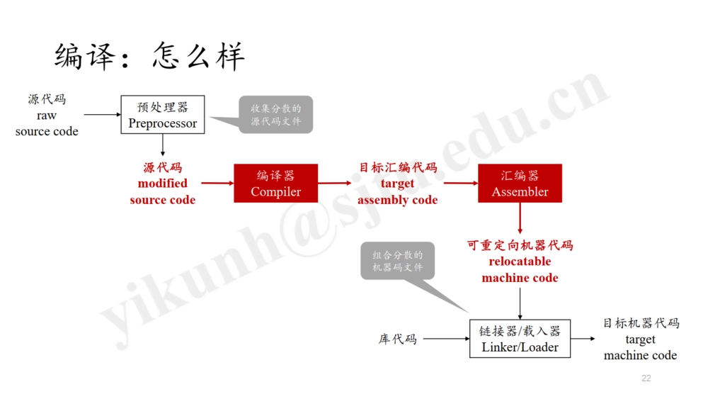
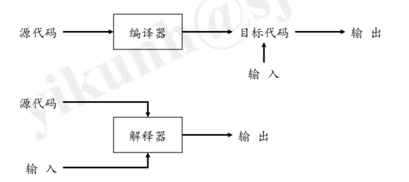
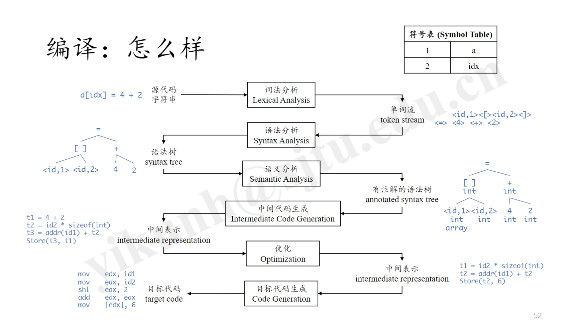

# Ch1 Intro

## 编译流程

- 解释器 vs. 编译器 (Interpreter vs. Compiler)
	- 解释器方便错误诊断 (Error Diagnosis)
	- 编译器得到的代码更加高效
	

### 编译器

- Ch1 Intro
	- 编译流程
		- 编译器
	- 词法分析：Lexical Analysis
	- 语法分析：Syntax Analysis
	- 词法分析 vs. 语法分析
	- 语义分析：Semantic Analysis
	- 中间代码生成：Intermediate Code Generation
	- 优化：Optimization
	- 目标代码生成：Target Code Generation

## 词法分析：Lexical Analysis

- Lexical Analysis: Scanning （词法分析：扫描）
	- Lexical Analyzer: Scanner （词法分析器：扫描器）
	- Recognize Words (Lexemes) -> Tokens & Symbol Table （识别单词（词素）-> 生成标记和符号表）
	- Token: <token-name, attribute-value (opt.)>
		- token-name: id, number, keywords, operators, etc. （标记名：标识符、数字、关键字、运算符等）
		- attribute-value: a pointer to the symbol table （属性值：指向符号表的指针）

## 语法分析：Syntax Analysis

- Syntax Analysis: Parsing （语法分析：解析）
	- Syntax Analyzer: Parser （语法分析器：解析器）
	- Produce the Grammatical Structure （生成语法结构）
		- The Relationships among Tokens （标记之间的关系）
		- Tree-like Intermediate Representation （树状中间表示）
	- Parse Tree （解析树）
		- Parser generates the Parse Tree, from which produces the Syntax Tree （解析器生成解析树，从中生成语法树）
	- Syntax Tree: Simplified Parse Tree （语法树：简化的解析树）
		- Interior Node: Operation （内部节点：操作）
		- Children: Arguments of the Operation （子节点：操作的参数）

## 词法分析 vs. 语法分析

- 做着相似的事情：处理字符串
- 词法分析 (Scanning)：拆分字符串成 Lexemes，并抽象成 Tokens
- 语法分析 (Parsing)：整理 Tokens 的逻辑关系

## 语义分析：Semantic Analysis

- Semantic Analysis （语义分析）
	- computing additional info needed for compilation （计算编译所需的附加信息）
		- which is not regarded as syntax （这些信息不被视为语法）
	- checking source code semantic consistency with the language definition （检查源代码与语言定义的语义一致性）
		- Type Checking （类型检查）

## 中间代码生成：Intermediate Code Generation

- Intermediate Code Generation （中间代码生成）
	- Intermediate Representations (IR), e.g., Syntax Tree, etc. （中间表示，例如语法树等）
	- Low-level or Machine-like IR （低级或类似机器的中间表示）
		- LLVM-IR (LLVM, Clang), Gimple (GCC), etc. （LLVM-IR（LLVM，Clang），Gimple（GCC）等）
		- Three-address Code, with at Most Three Operands per Instruction （三地址码，每条指令最多三个操作数）
		- Static Single Assignment (SSA) （静态单赋值）
			- Every variable is only assigned (defined) once and defined before used. （每个变量只能被赋值（定义）一次，并且在使用前必须定义。）

## 优化：Optimization

- Optimization （优化）
	- Improve the IR for Better Target Code （改进中间表示以生成更好的目标代码）
	- Better: Faster, Smaller, Greener （更好：更快、更小、更环保）

## 目标代码生成：Target Code Generation

- Target Code Generation （目标代码生成）
	- Instruction Selection （指令选择）
		- RISC vs. CISC
			- RISC: Reduced Instruction Set Computer （精简指令集计算机）
			- CISC: Complex Instruction Set Computer （复杂指令集计算机）
		- Intel Manual: > 6000 Pages （英特尔手册：超过 6000 页）
	- Register Allocation （寄存器分配）
		- Graph Coloring Problem （图着色问题）
	- Evaluation Order （计算顺序）
		- Arrange the Computation Order for Less Register Occupation （安排计算顺序以减少寄存器占用）
		- NPC (Non-Polynomial Complete) Problem （非多项式完全问题）
