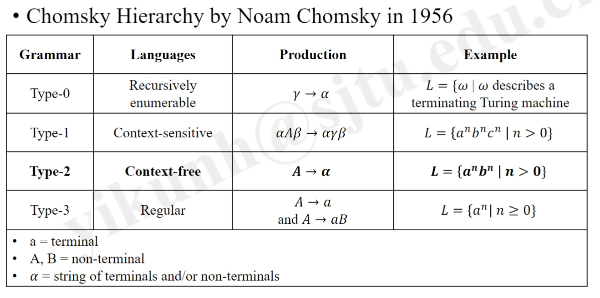

# Ch2 Syntax Definition

- [Back to Course Home](index.md)

## 文法的定义：Definition of Grammars

### 定义

- Grammar: a Set of Rules to Describe a Language.

- Language: a Sorted Set of Strings over some fixed Alphabet.

- 关系：Grammar Abstracts the Language to Cover All Its Strings. （文法是对语言的抽象，覆盖了语言的所有字符串）

- ∅: Empty Language (Set of Strings)

- 𝜺: Empty String (Set of Symbols)

### 组成

- Grammar G[S] = (VN, VT, P, S)

	- VT: A set of Terminal Symbols (终结符)

		- Atomic: 基本符号，不可再分

	- VN : A set of Non-terminals (非终结符)

		- A Non-terminal: a set of strings of Terminals

	- P: A set of Productions (生成式、规则)

		- A Non-terminal, an Arrow, a sequence of Terminals and/or Non-terminals

	- S: A Start Symbol (开始符)

		- A Non-terminal

## 推导：Derivations
### 定义

-  A Grammar derives strings by beginning with the **Start Symbol** and repeatedly replacing a **Non-terminal** with **Terminals** via its **Productions**. （文法通过从开始符开始，反复用生成式将非终结符替换为终结符来派生字符串）

	- 推导（Derivation）：反复根据生成规则用终结符替换非终结符

	- 归约（Reduction）：推导的反过程

### 语法分析（Syntax Analysis, Parsing）

- given a sequence of Terminals, figure out Whether it can be Derived from the Grammar and How if possible. （给定一个终结符序列，判断它是否可以由文法推导而来，如果可以，推导过程是什么）

- 一个语言可能有多个文法描述，而一个文法只会派生一个唯一语言

## 文法的二义性：Ambiguity
### 定义

- 语法树（Parse Tree）: A Graphical Representation of a Derivation without the Order of Applying Productions. （语法树是一个图形表示，表示了一个推导过程，但不考虑生成式应用的顺序）

- 二义性（Ambiguity）: When Parsing, given a sequence of Terminals, a Grammar is Ambiguous if there are more than one Parse Tree for the Derivation.（二义性是指一个文法可以产生多棵语法树）
### Fix the Grammar

- Example:

	- stmt -> if expr then stmt | if expr then stmt else stmt | other

	- if E1 then if E2 then S1 else S2

- Match each else with the **closest unmatched then**

	- the statement appearing between a then and an else must be “matched”

	- the interior statement must not end with an unmatched (open) then

- Listing All Cases then Tidying Them Up

	- if expr then matched_stmt

	- if expr then open_stmt

	- if expr then matched_stmt else matched_stmt

	- if expr then matched_stmt else open_stmt

	- so that:

		- matched_stmt -> if expr then matched_stmt else matched_stmt | other

		- open_stmt -> if expr then matched_stmt | if expr then open_stmt | if expr then matched_stmt else open_stm

	- finally:

		- stmt -> matched_stmt | open_stmt

		- matched_stmt -> if expr then matched_stmt else matched_stmt | other

		- open_stmt -> if expr then stmt | if expr then matched_stmt else open_stmt

## 文法和语言的分类：Classes of Languages

- 范围由 Type 0 到 Type 3 逐渐缩小