# Ch3 Scanning

- [Back to Course Home](index.md)

## 词法分析：Lexical Analysis
### Token, Pattern, and Lexemes

- The Analysis Partitions Input String into Substrings. （分析将输入字符串划分为子字符串。）
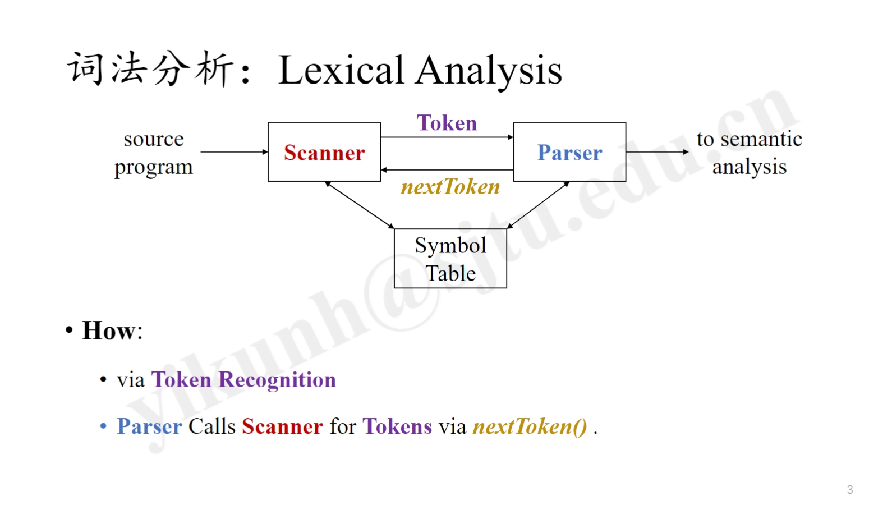

- **Token**: <token-name, attribute-value(opt.)>

	- token-name: the role of lexical unit （词法单元的角色）

		- often refer to Token by its token-name

	- attribute-value: any info associated to the Token （与 Token 相关的任何信息）

		- Generally, it has only ONE value: a pointer to the Symbol Table （通常只有一个值：指向符号表的指针）

			- In practice, the value of a constant can be stored as the attribute. （在实践中，常量的值可以作为属性存储。）

				- constant: strings, numbers （常量：字符串、数字）

- **Pattern**: description of the form lexemes of a token may  （描述词法单元的形式）

	- regular expression: \d, \w, ?, *, +, ...

- **Lexeme**: a sequence of characters matches a token's pattern （与模式匹配的字符序列）

	- Token vs. Lexeme: Class vs. Instance in C++

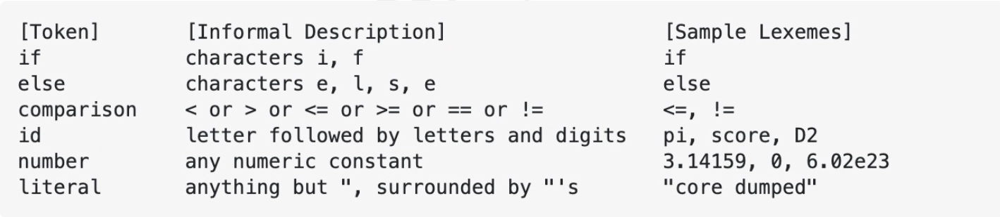

## Specification of Tokens
### Strings and Languages

- String: a finite sequence of Symbols from an Alphabet （字符串：来自字母表的有限符号序列）

- Language: any countable set of Strings （语言：任何可数的字符串集合）

- Terms for Parts of a String s （字符串 s 的部分术语）:

	- prefix：前缀

		- any string obtained by removing zero or more symbols from the end of s

	- suffix：后缀

		- any string obtained by removing zero or more symbols from the beginning of s

	- substring：子串

		- any string obtained by removing any prefix or any suffix from s （去掉前缀或后缀）

	- subsequence：子序列

		- any string obtained by removing zero or more not necessarily consecutive position of s （不一定连续的位置）

### Operations on Languages

- **Union**: （并集）

	- $L_1 ∪ L_2 = \{x | x ∈ L_1 \quad or \quad x ∈ L_2\}$

- **Concatenation**: （连接）

	- $L_1L_2 = \{xy | x ∈ L_1 \quad and \quad y ∈ L_2\}$

- **Kleene closure**: （星闭包）

	- $L^* = \bigcup_{1=0}^\infty L^i \\= {𝜖} ∪ L ∪ L^2 ∪ L^3 ∪ ... \\= \{x | x = x_1x_2...x_n, n ≥ 0, xi ∈ L\}$

	- 𝜖 is the empty string

- **Positive closure**: （正闭包）

	- $L^+ = \bigcup_{1=1}^\infty L^i \\= LL^* \\= \{x | x = x_1x_2...x_n, n ≥ 1, xi ∈ L\}$

### Regular Expressions
#### 定义

- **Regular Expression (Regex)**: a way to describe Patterns of Tokens of a programming language. （正则表达式：描述编程语言的词法单元模式的一种方式）

	-  Each Regular Expression r denotes a Language L $(r)$. （每个正则表达式 r 表示一个语言 L $(r)$）

		- Regular Language, Type-3 Language

	- The Regular Expressions are built recursively out of smaller ones, using the rules. （正则表达式是用规则递归构建的）

#### 语法

- **BASIS** （基础）

	- 𝜀 is a regular expression, and L(𝜀) = {𝜀}, the empty set. （空字符）

	- a is a symbol in a set Σ, then a is a regular expression, and L(a) = {a}. （集合中的字符）

- **INDUCTION** （归纳）：Suppose $r$ and $s$ are expressions denoting $L(r)$ and $L(s)$

	- $r | s$ : a regular expression denoting $L(r) ∪ L(s)$

	- $rs$ : a regular expression denoting $L(r)L(s)$

	- $r^*$ : a regular expression denoting $(L(r))^*$

	- $(r)$ : a regular expression denoting $L(r)$

		- We can add additional brackets around expressions. （我们可以在表达式周围添加额外的括号。）

- **定律**：
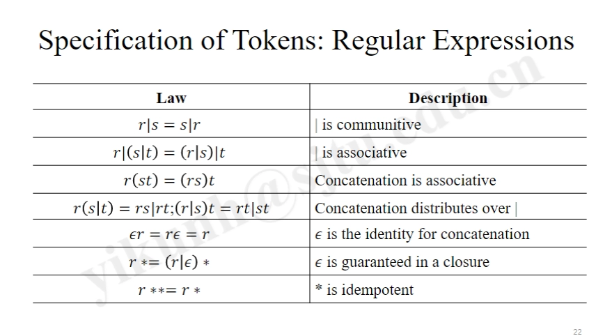

### Regular Definitions

- **Regular Definition**: a set of productions with non-terminals derived by regular expressions. （正则定义：一组通过正则表达式派生的非终结符的产生式）

### Extensions of Regex

- $+$ : one or more instances

	- $r^*$ = $r^+$ | 𝜖

	- $r^+$ = $rr^*$ = $r^*r$

- $?$ : zero or one instance

	- $r?$ = $r$ | 𝜖

- $[\quad]$ : character classes

	- $[abc]$ = $a$ | $b$ | $c$

	- $[a-z]$ = $a$ | $b$ | ... | $z$

### Regular Language / Grammar, and Regex
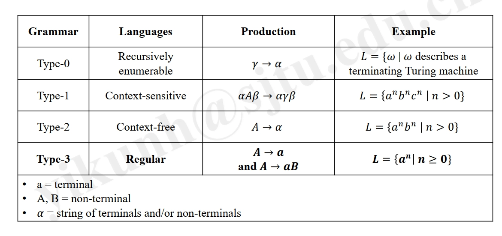

- **Regular Expression** $r$ denotes a Language $L(r)$.

	- Regular Language is Type-3 Language （正则语言是类型 3 语言）

	- Regular Language is that denoted by Regular Expressions. （正则语言是由正则表达式表示的）

- **Regular Grammar** is the grammar describes a Regular Language.

	- with the production form of $\mathbf{A}→\alpha$ or $\mathbf{A}→\alpha\mathbf{B}$

## Recognition of Tokens
### Input Buffer
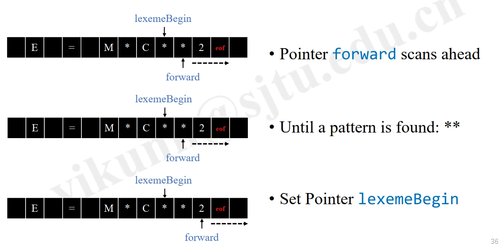

### Transition Diagrams

- **Transition Diagram = Nodes + Edges**, a Flowchart （状态流程图 = 节点 + 边）

	- **Nodes**: **states, conditions** that could occur when looking for a lexeme that matches one pattern. （节点：状态）

		- **States**: Circles （状态：圆圈）

		- **Start State**: Arrowhead, Beginning of a Pattern （起始状态：箭头，开始）

		- **End State(s)**: **Double Circles**, End of a Pattern （终止状态：双圆圈，结束）

	- **Edge**: **actions**, taken to transit from one State to Another. （边：动作）

		- labeled by a Symbol or a set of Symbols for matching （标记为符号或符号集以进行匹配）

	- **Deterministic**: at most ONE edge out of a given state with a given label. （确定性：在给定状态下，最多有一条边）

- **Example**: 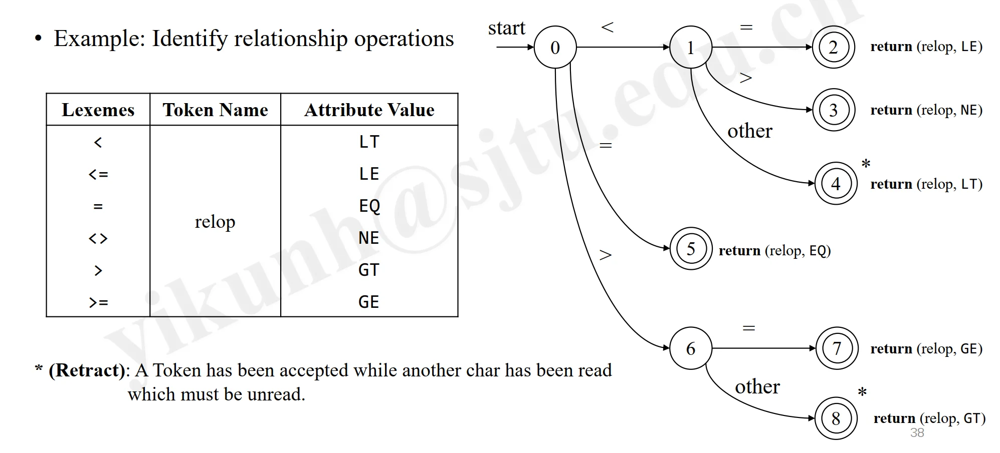

	- **\*(Retract)**: A Token has been accepted while another char has been read which must be unread. （回退：一个 Token 已经被接受，而另一个不应读取字符已经被读取，必须回退）

### Reserved Words （保留字）

- Keywords look like Identifiers.

	- if, then, ...

- Add reserved words into symbol table initially. （在符号表中添加保留字）

- Create **separate transition diagrams** for each keyword. （为每个关键字创建单独的转换图）

	- thenextone

	- 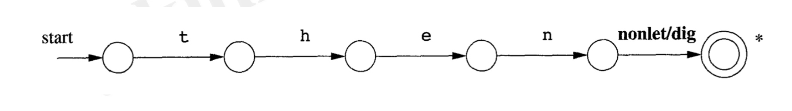

## 有穷自动机：Finite Automata
### Finite Automata

- **What**: an Abstract Machine that can be in exactly one of a Finite number of States at any given time. （有限自动机：在任何给定时间只能处于有限数量的状态之一的抽象机器）

	- Finite Automation = Finite-state Automation (FSA, plural: automata) （有限自动机 = 有限状态自动机）

		- Finite-state Machine (FSM), or simply State Machine （有限状态机，或简单地称为状态机）

	- changes from one state to another according to Inputs, called Transition （根据输入，从一个状态变化到另一个状态，称为转换）

- **Why**: used as the Recognizer for Scanning, identifying Tokens （用于扫描的识别器，识别 token）

- **How**: answers “YES” or “NO” about each input String （如何：对每个输入字符串回答“是”或“否”）

	- determines whether the String is valid for the given Grammar （确定字符串是否符合给定的语法）

### DFA vs. NFA

- FA: **Deterministic (DFA) or Non-deterministic (NFA)**

- **DFA**: have **exactly/at most one action** for each input symbol （每个输入符号有一个动作）

	- can be represented with a Transition Diagram

	- Recognition with DFA: Faster, may take More Space （识别 DFA：更快，可能占用更多空间）

	- complex to represent Regex, but more Precise, widely used （复杂表示正则表达式，但更精确，广泛使用）

- **NFA**: can have **multiple actions** for the same input symbol （同一输入符号可以有多个动作）

	- can be represented with a Transition Graph

	- Recognition with NFA: Slower, may take Less Space （识别 NFA：较慢，可能占用更少的空间）

	- simply represents Regex, but less Precise （简单表示正则表达式，但不够精确）

- **Example**: 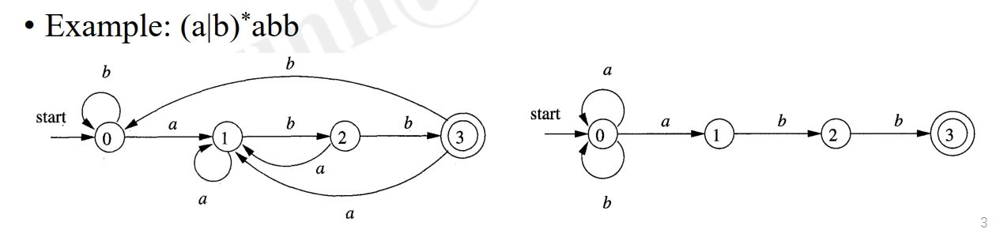

- Lexical Analysis **Workflow** with FA:

	- Regex -> NFA -> DFA

	- Regex -> DFA

### Nondeterministic Finite Automata (NFA)

- **An NFA M = $\mathbf{(S, 𝜮, move, 𝒔_0, F)}$** consists of:

	- $\mathbf{S}$: a finite set of States （有限状态集）

	- $\mathbf{𝜮}$: the Input Alphabet, excluding 𝜖 （不包含𝜖的输入符号集合）

	- $\mathbf{move}$, a Transition Function （转换函数）

		- move(State, Symbol) = set of Next States

		- move: $𝑆×(Σ ∪ \{𝜖\}) ⟶ ℙ(𝑆)$

	- $\mathbf{s_0} ∈ \mathbf{S}$, the Start State (or Initial State) （起始状态）

	- $\mathbf{F} ⊆ \mathbf{S}$, a set of Accepting States (or Final States) （终止状态）

- An NFA accepts Input String $s$ iff

	- there exists some path in the Transition Graph from the Start State to one Accepting State, （存在一条路径从起始状态到一个接受状态）

	- such that symbols along the path spell out $s$ （路径上的符号拼写出 $s$）

- **Transition Tables**：**rows** for States, **columns** for Input Symbols and 𝝐

	- Example: 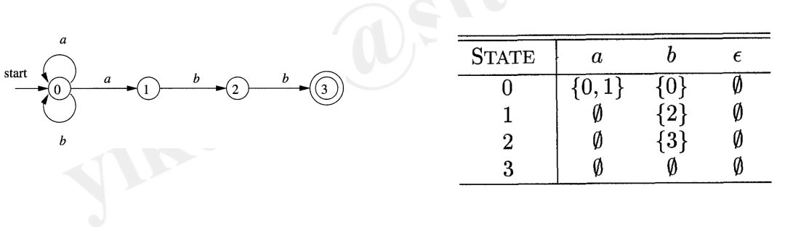

### Deterministic Finite Automata (DFA)

- **What**: a Special Case of an NFA, where

	- there are **no moves** on symbol 𝜖, and

	- for each state s and input symbol a, there is **Exactly ONE** edge out of s labeled by a. （每个状态 s 和输入符号 a，恰好有一条边出 s 标记为 a）

		- **COMPLETE**: It defines from each state a transition for each input symbol. （完整：它定义了从每个状态到每个输入符号的转换）

			- Transition function is a total function.

		- **Local Automation**: DFA not necessarily complete (... At Most ONE edge ...) （局部自动机：DFA 不一定是完全图）

			- Transition function is a partial function.

## Algorithm for Simulation
### Conversion: NFA --> DFA

- **Subset Construction** （子集构造）

	- removing 𝜖-transitions

	- combining multiple NFA’s states into ONE constructed DFA’s state （将多个 NFA 的状态组合成一个构造的 DFA 的状态，即：等势点合并）

- **Definitions**:

	- **𝜖-closure(s)**:

		- s: some State

		- = Set of NFA **States** reached by state s via 𝜖-transitions, including s itself. （NFA 中可以通过若干个空变换到达的状态的集合）

	- **𝜖-closure(T)**:

		- T: set of **States**

		- = $∪_{s∈T}$ 𝜖-closure(s)

	- **move(T, a)**:

		- T: set of States

		- a: Input Symbol

		- = NFA’s **States** reached by 𝑠 ∈ 𝑇 on a.

- **Algorithm Subset Construction**

	- Input: the start State **s0** and the Transition Diagram of NFA **N**.

	- Output: Transition Graph of DFA **Dtran**
	``` java
	add 𝝐-closure(s0) into Dstates //将初始状态s0的𝝐闭包加入Dstates
	while (Dstates has unsearched state S) { //当Dstates有未搜索的状态S时
		tag S as searched //将S标记为已搜索
		foreach input symbol a { //对每个输入符号a
			U = 𝝐-closure(move(S, a)) //设U为S进行a动作后状态S'的𝝐闭包
			if (U is new to Dstates) { //如果U是Dstates中的新状态
				add U into Dstates as unsearched //将U加入Dstates并标记为未搜索
			}
			Dtran(S, a) = U //将Dtran(S, a)设为U
		}
	}
	```

	- **最后得到的 Dtran 是一个 DFA 的转换表**，Dstates 是 DFA 的状态集合。

- **Algorithm 𝜖-closure(T) Computation**:

	- 上一步中 `U = 𝝐-closure(move(S, a))` 的实现逻辑：

	- Input: the State Set T

	- Output: 𝜖-closure(T)
	``` java
	push all states in T onto Stack //将T中的所有状态压入栈中
	while (Stack is not empty) { //当栈不为空时
		s = Stack.pop() //弹出栈顶元素s
		foreach (state u reached by s via 𝜖) { //对于每个s通过𝜖能达到的状态u
			if (u is not in 𝜖-closure(T)) { //如果u不在T的𝜖闭包中
				add u into 𝜖-closure(T) // 将其加入T的𝜖闭包
				Stack.push(u) //将u压入栈中
			}
		}
	}
	```

- **Example**: 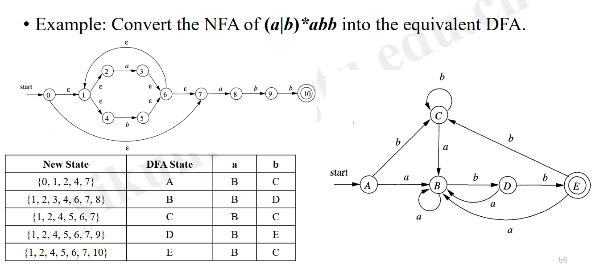

### Conversion: Regex --> NFA

- McNaughton-Yamada-Thompson Algorithm

- Regex's Definition:

	- **BASIS**:
		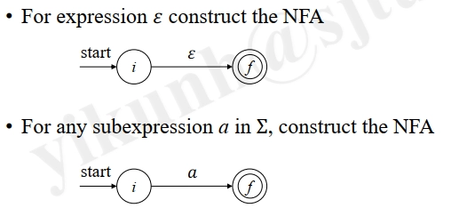

	- **INDUCTION**:
		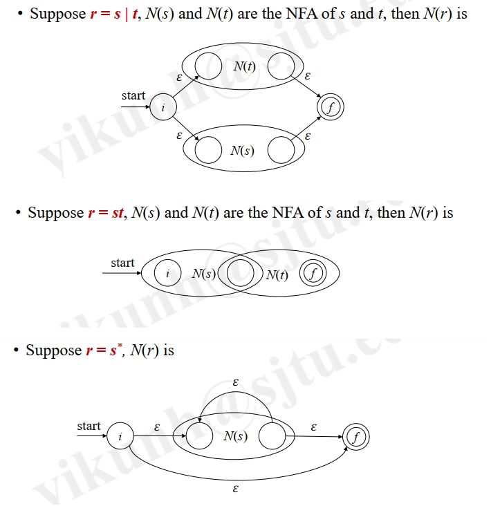

- **Example**:
	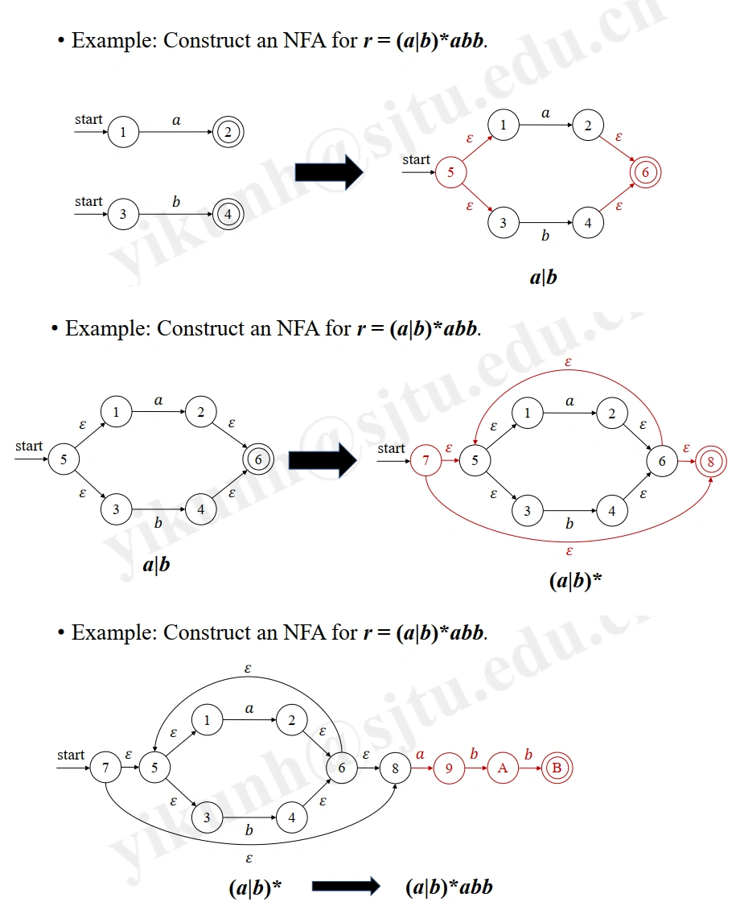

## Workflow

- The **Workflow** of Lexical Analyzer

	- Regex --> NFA Construction

	- NFA --> DFA Construction

	- Simulating DFA to Recognize Tokens

- Convert Regex Directly into DFA: PASS

- **DFA Simplification**: Minimizing the Number of States

## DFA Simplification

- **What and Why**:

	- **no REDUNDANT states** （无冗余状态）

		- REDUNDANCE: the states that NO accepted input string’s path passes through （没有路径到达终止状态的状态）

		- (in the transition graph)

	- **no EQUIVALENT states** （无等效状态）

		- EQUIVALENCE: states with the SAME side effects （具有相同副作用的状态）

		- (making the states indistinguishable)

	- **Distinguish States via Input String** （通过输入字符串区分状态）

		- State: s, t

		- String: x

		- x distinguishes s from t,

			- if one state can reach an accepting state via x, while the other cannot. （如果一个状态可以通过 x 到达终止状态，而另一个状态不能）

		- s is distinguishable from t,

			- if there is some string distinguishes them. （存在一些字符串可以区分它们）

		- Unify Indistinguishable States into One. （将不可区分的状态合并为一个）

- **How**：

	1. Start with the initial partition $\mathbf{Π}$ with two groups, the **accepting** and **non-accepting** states of the DFA. （将 DFA 的接受状态和非接受状态分为两个组）

	2. Let $\mathbf{Π_{new} := Π}$. Then, for each group $\mathbf{G}$ of $\mathbf{Π}$: （初始时令 $\mathbf{Π_{new} = Π}$，然后对于每个组 G）

		- For each input symbol $\mathbf{a}$, states $\mathbf{s},\mathbf{t}$ in $\mathbf{G}$ are partitioned if they transit to different groups of $\mathbf{Π}$ via $\mathbf{a}$; （对于每个输入符号 a，如果状态 s 和 t 通过 a 转移到不同的组，则他们被划分为不同的组）

		- Replace $\mathbf{G}$ in $\mathbf{Π_{new}}$ by the new subgroups. （用新的子组替换 $\mathbf{G}$）

	3. If $\mathbf{Π_{new}} ≠ \mathbf{Π}$, $\mathbf{Π: = Π_{new}}$ and repeat Step 2, Step 4 otherwise. （如果 $\mathbf{Π_{new}} ≠ \mathbf{Π}$，则令 $\mathbf{Π: = Π_{new}}$ 并重复步骤 2，否则跳到步骤 4）

	4. Aggregate the transitions among groups. （将组之间的转换聚合）

	5. The resulting DFA is the minimized DFA. （得到的 DFA 是最小化的 DFA）

- **Example**: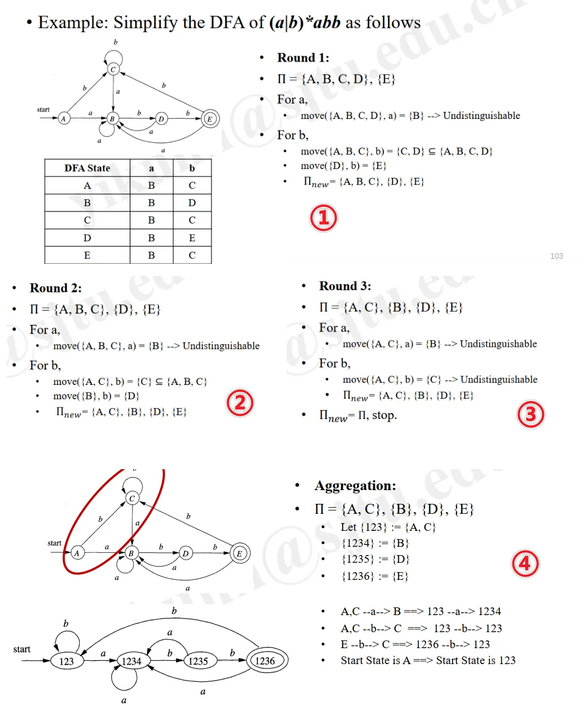