# Ch4 Parsing

- [Back to Course Home](index.md)

## 词法分析：Lexical Analysis
### Parser

- **What**: Given Tokens, Parsing Verifies whether the Token Names Can Be Generated by the Grammar for the Source Language. （给定 tokens，解析会验证 token 名称是否可以由源语言的语法生成）
- **Why**: We expect the Parser
	- to **report Syntax Errors** （报告语法错误）
	- to recover from Errors to continue following processes. （从错误中恢复以继续后续过程）
- **How**: Derivation or Reduction
	- **Top-down** and **Bottom-up** Parsing

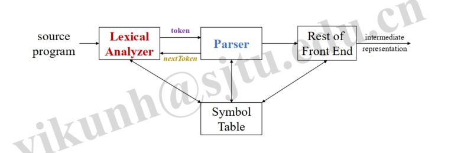

### Compiler Errors

- Lexical Errors
	- The string does not match the pattern of any token. （字符串与任何 token 的模式不匹配）
- Syntactic Errors
	- The string does not meet the requirements of the grammar. （字符串不符合语法要求）
- Semantic Errors: Type Mismatching （语义错误：类型不匹配）

### Error-Recovery Strategies

- **Panic-Mode Recovery** 
	- Discarding input symbols one at a time until meeting synchronizing tokens （丢弃输入符号，直到遇到同步 tokens）
		- synchronizing tokens, e.g. “;”, “}”, etc., decided by designers
	- simple, but may cause more errors
- **Phrase-Level Recovery**
	- Local Correction on Input, allowing the parser to continue （允许解析器继续）
		- e.g., “,” → “;”, delete/insert “;”
		- designers’ responsibility
	- helpless if error occurs before the point of detection
- **Error Productions**
	- augmenting grammar with productions generating erroneous constructs （用产生错误构造的产生式扩充语法）
	- relying on designers
- **Global Correction**
	- choosing a minimal sequence of changes for a globally least-cost correction （选择一系列最小的变化，以实现全局最低成本的修正）
	- costly, yardstick? should defined by designers

## Context-Free Grammar (CFG)
### Definition

- A **Context-Free Grammar** consists of:
	- Terminals
	- Non-terminals
	- Start Symbol
	- Productions: $\mathbf{A} \rightarrow \mathbf{\alpha}$
		- Header / Left Side → Body / Right Side
			- Header: A **Non-terminal**
			- Body: **zero or more Terminals or Non-terminals**
		- $\mathbf{V_N} \rightarrow (\mathbf{V_T}|\mathbf{V_N})^*$

### Derivation

- **What**: Beginning with the Start Symbol, replace a Non-terminal by the body of one of its Production. （从起始符号开始，用其产生式的右侧替换非终结符）
- **Why**:
	- corresponding to **Top-down** Construction of a Parse Tree （对应于自顶向下构造解析树）
	- helpful for Bottom-up Parsing
- **How**:
	- $\Rightarrow $ : derive in one step
	- $\overset{*}{\Rightarrow} $ : derive in zero or more steps
		- $\alpha \overset{*}{\Rightarrow} \alpha$
		- if $\alpha \overset{*}{\Rightarrow} \beta$ and $\beta \overset{*}{\Rightarrow} \gamma$, then $\alpha \overset{*}{\Rightarrow} \gamma$
	- $\overset{+}{\Rightarrow} $ : derive in one or more steps

- $\mathbf{S} \overset{*}{\Rightarrow} \alpha$ 
	- $\alpha$ is a **Sentential Form** of S. （$\alpha$ 是 S 的一个句子形式）
	- $\alpha$ may contain **Terminals**, **Non-terminals**, or may be **Empty**.
	- Sentence: a Sentential Form without Non-terminals. （没有非终结符的句子形式）
- What is a **Language**?
	- $L(G)$: set of Sentences generated by the Grammar $G$
	- A string of terminals $ \omega \in L(G) $ if and only if $ \omega $ is a Sentence of $ G $ (or $ S \overset{*}{\Rightarrow} \omega $).
- **Example**:
	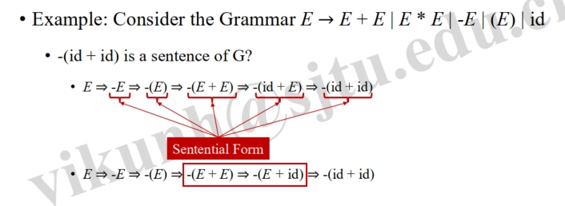

- **Leftmost Derivation**: the Leftmost Non-terminal is always replaced at first （最左边的非终结符总是第一个被替换）
	- $ \alpha \overset{lm}{\Rightarrow} \beta $
- **Rightmost Derivation**: $ \alpha \overset{rm}{\Rightarrow} \beta $

- **Parse Trees and Derivations**
	- What: A Graphical Representation of a Derivation （派生的图形表示）
		- filtering out the order in which productions applied to replace non-terminals （过滤出应用于替换非终结符的产生式的顺序）
	- **Example**：
		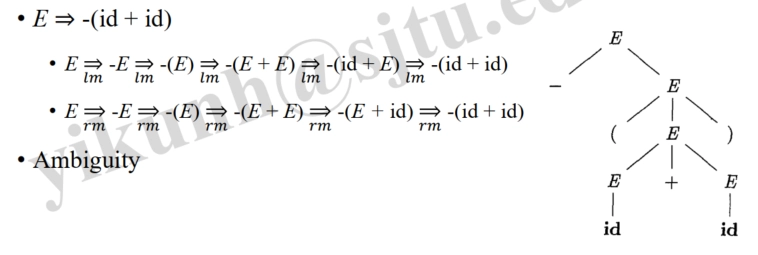

## Top-Down Parsing

- **What**: Create the Parse Tree from Top to Bottom （从上到下创建解析树）
	- from root to leaves （从根到叶）
- **Why**: for Parsing
- **How**: Derive an Input String in the **Leftmost** Manner （以最左边的方式派生输入字符串）
	- consistent with string scanning （与字符串扫描一致）
	- **Key**: determine the production to be applied for a non-terminal （确定要应用于非终结符的产生式）
	- **Recursive-Descent Parsing**
		- require **backtracking** to find right production （需要回溯以找到正确的产生式）
		- general, but inefficient
	- **Predictive Parsing**
		- a special case of Recursive-Descent Parsing
		- no backtracking, choosing by **looking ahead** at input symbols （无需回溯，通过提前查看输入符号进行选择）

### Recursive-Descent Parsing
```java
void A() {
	// Choose an A-production, A --> X1 X2 ...Xk;
	for (i = 1 to k) {
		if (Xi is a non-terminal)
			call Xi();
		else if (Xi equals the current input symbol a)
			advance the input to the next symbol;
		else ... // an error has occurred
	}
}
```

- Example:
	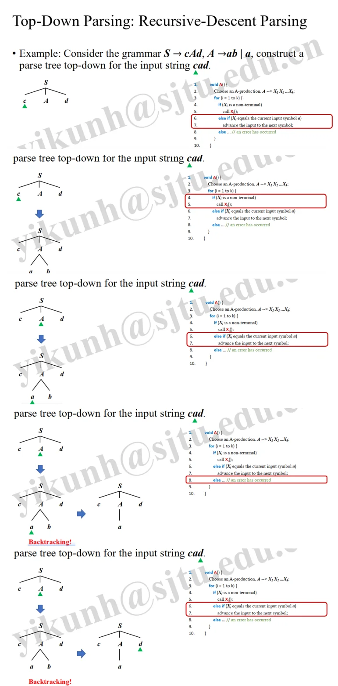

#### Left Recursion （左递归）

- **What**: The Grammar has a non-terminal A such that there exists a derivation $\mathbf{A} \overset{+}{\Rightarrow} \mathbf{A} \alpha$ （文法有一个非终结符 A，使得存在一个派生 $\mathbf{A} \overset{+}{\Rightarrow} \mathbf{A} \alpha$）
- **Why**: Recursive-Descent Parsing cannot handle Left Recursion. （递归下降解析无法处理左递归）
- **How**: Transform the grammar to **eliminate Left Recursion**. （转换文法以消除左递归）
	- ==**Immediate Elimination**: $\mathbf{A} \rightarrow \mathbf{A} \alpha | \beta \quad \Rightarrow \mathbf{A} \rightarrow \beta \mathbf{A'} , \mathbf{A'} \rightarrow \alpha \mathbf{A'} | 𝝐$==
	- $ \mathbf{A} \rightarrow \mathbf{A}\alpha_1 | \dots | \mathbf{A}\alpha_m \ | \ \beta_1 | \dots | \beta_n \quad \Rightarrow \ \mathbf{A} \rightarrow (\beta_1 | \dots | \beta_n) \mathbf{A'}, \mathbf{A'} \rightarrow (\alpha_1 | \dots | \alpha_m) \mathbf{A'} | \epsilon $
- **Example**:
	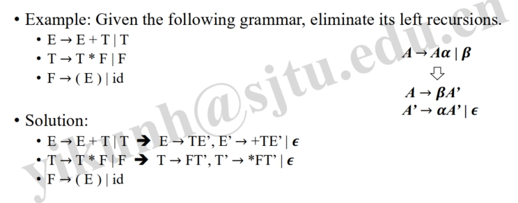

#### Left Recursion Elimination （消除左递归）

- **INPUT**: Grammar G without Cycles or 𝝐-productions （无循环或𝝐产生式的文法）
	- Cycle: $\mathbf{A} \overset{+}{\Rightarrow} \mathbf{A}$
	- 𝝐-production: $\mathbf{A} \rightarrow  \epsilon$
- **OUTPUT**: Equivalent Grammar **without Left Recursions** （没有左递归的等效文法）
- **Steps**:
	```javascript
	supposing there are the Non-terminals with Order A1, A2..., An
	for (i from 1 to n) {
		for (j from 1 to i-1) {
			replace each Ai → Aj𝛾 by Ai → 𝛿1𝛾 | 𝛿2𝛾 | ... | 𝛿𝑘𝛾, where:
				Aj  → 𝛿1 | 𝛿2 | ... | 𝛿𝑘 are all current Aj-productions
		}
		eliminate the Immediate Left Recursion among the Ai-productions
	}
	```

- **Example**:
	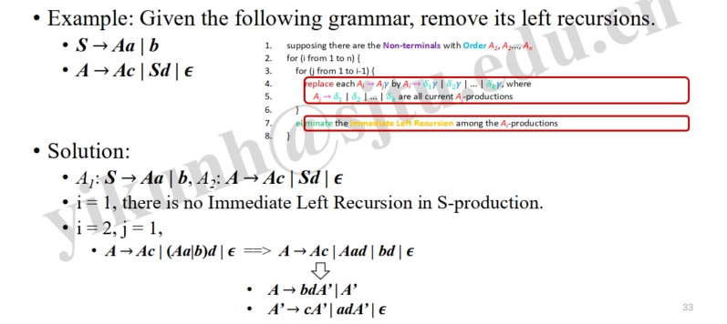

### Predictive Parsing

- **What**: recursive-descent parsers needing no backtracking （不需要回溯的递归下降解析器）
	- can be constructed for LL(k) grammar （可以为 LL(k)文法构造）
		- **L**: scanning input **from Left to right**
		- **L**: producing a **Leftmost derivation**
		- **k**: using **k input symbols** of lookahead at each step to make decision
- **Why**: a unique production to apply, or none to use (error)
- **Example: LL(1)**
	- stmt → **i**f (expr) stmt else stmt | **w**hile (expr) stmt | **{** stmt_list}
- **How**: FIRST and FOLLOW
	- assist in choosing which production to apply, based on the next input symbol （根据下一个输入符号选择应用哪个产生式）

#### FIRST and FOLLOW

- **FIRST**: the set of terminals that begin strings derived from a non-terminal or a string of grammar symbols. （从非终结符或语法符号字符串派生的字符串开始的终结符集合）
	- **FIRST(𝜶)**: what the first symbol would be for 𝜶
	- **𝜶**: string of grammar symbols
	- **return**: set of terminals that begin strings derived from 𝜶
		- first symbols of strings derived from 𝜶
	- **HOW**：
		- if $\mathbf{X}$ is a terminal, then $\mathbf{FIRST(X)} = \{\mathbf{X}\}$
		- if $\mathbf{X}$ is a non-terminal, and $\mathbf{X} \rightarrow \mathbf{Y_1} \mathbf{Y_2} \dots \mathbf{Y_k}$
			- add all **non-𝝐** symbols of $\mathbf{Y_1}$ to $\mathbf{FIRST(X)}$
			- add all **non-𝝐** symbols of $\mathbf{Y_2}$ to $\mathbf{FIRST(X)}$, if $\epsilon \in \mathbf{FIRST(Y_1)}$
			- ···
			- add all **non-𝝐** symbols of $\mathbf{Y_k}$ to $\mathbf{FIRST(X)}$, if $\epsilon \in \mathbf{FIRST(Y_1)}$ and $\epsilon \in \mathbf{FIRST(Y_2)}$ and ··· and $\epsilon \in \mathbf{FIRST(Y_{k-1})}$
			- add **𝝐** to $\mathbf{FIRST(X)}$, if $\epsilon \in \mathbf{FIRST(Y_1)}$ and $\epsilon \in \mathbf{FIRST(Y_2)}$ and ··· and $\epsilon \in \mathbf{FIRST(Y_k)}$
	- **Example**:
		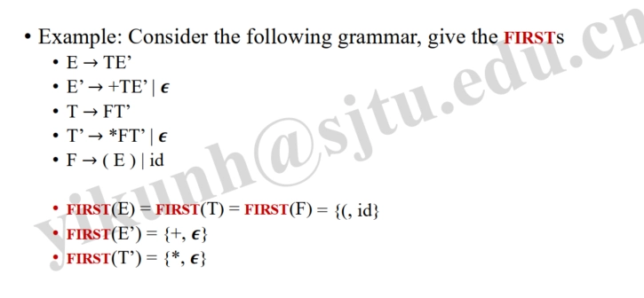

- **FOLLOW**: the set of terminals that can appear immediately to the right of a non-terminal in some sentential form. （在某些句子形式中，可以出现在非终结符右侧的终结符集合）
	- **FOLLOW(N)**: what is the next symbol of N
	- **N**: a non-terminal
	- **return**: set of terminals can appear immediately after N in a sentential form
	- **HOW**:
		- place **$** in  $\mathbf{FOLLOW(S)}$
			- **S**: start symbol
			- **$**: input right end-marker
		- for each production $\mathbf{M} \rightarrow \alpha \mathbf{N} \beta$
			- add all symbols in $\mathbf{FIRST(\beta)}$ to $\mathbf{FOLLOW(N)}$, except 𝝐
			- if $\epsilon \in \mathbf{FIRST(\beta)}$, add all symbols in $\mathbf{FOLLOW(M)}$ to $\mathbf{FOLLOW(N)}$
		- for each production $\mathbf{M} \rightarrow \alpha \mathbf{N}$
			- add all symbols in $\mathbf{FOLLOW(M)}$ to $\mathbf{FOLLOW(N)}$
	- **Example**:
		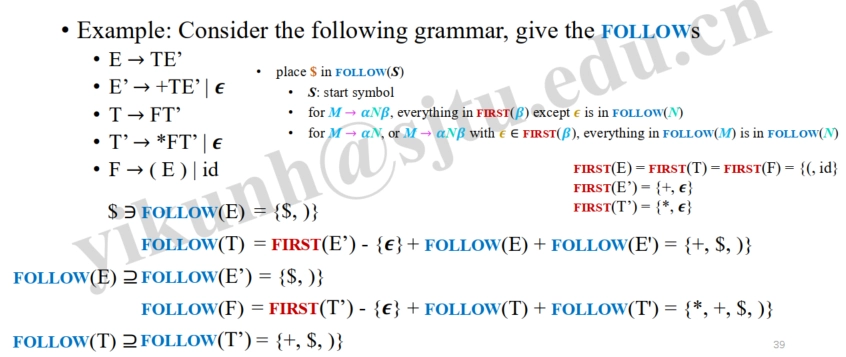

#### LL(1) Grammar

- **What**: Any $\mathbf{A} \rightarrow \mathbf{\alpha} \ | \ \mathbf{\beta}$ Represents two Distinct Productions （$\mathbf{A} \rightarrow \mathbf{\alpha} \ | \ \mathbf{\beta}$ 表示两个不同的产生式）
	- $\mathbf{FIRST(\alpha)}$ and $\mathbf{FIRST(\beta)}$ are disjoint sets.（二者是互不相交的集合）
		- For no terminal $\mathbf{a}$, do both $\mathbf{\alpha}$ and $\mathbf{\beta}$ derive strings beginning with $\mathbf{a}$. （二者不会同时派生以 $\mathbf{a}$ 开头的字符串）
		- At most one of $\mathbf{\alpha}$ and $\mathbf{\beta}$ can derive the empty string. （至多一个 $\mathbf{\alpha}$ 和 $\mathbf{\beta}$ 可以派生空字符串）
	- If $\mathbf{\epsilon} \in \mathbf{FIRST(\beta)}$, then $\mathbf{FIRST(\alpha)}$ and $\mathbf{FOLLOW(A)}$ are disjoint sets. （如果 $\mathbf{\epsilon} \in \mathbf{FIRST(\beta)}$，则 $\mathbf{FIRST(\alpha)}$ 和 $\mathbf{FOLLOW(A)}$ 是互不相交的集合）
- **Why**: Proper Production is Selected by Looking **ONLY** at the Next Input Symbol. （通过仅查看下一个输入符号来选择适当的产生式）
- **How**: By Parsing Table, a Two-Dimensional Array
	- $\mathbf{M[A, a]} = \mathbf{\alpha}$, when deriving $\mathbf{A}$, apply $\mathbf{A} \rightarrow \mathbf{\alpha}$ if coming up with $\mathbf{a}$. （当派生 $\mathbf{A}$ 时，如果出现 $\mathbf{a}$，则应用 $\mathbf{A} \rightarrow \mathbf{\alpha}$）

#### LL(1) Parsing

- **Predictive Parsing Table Construction**
	- **INPUT**: Grammar G.
	- **OUTPUT**: Parsing Table M.
	- **STEPS**:
		For each production $\mathbf{A} \rightarrow \mathbf{\alpha}$:

		1. For each terminal $\mathbf{a} \in \mathbf{FIRST(\alpha)}$, add $\mathbf{A} \rightarrow \mathbf{\alpha}$ to $\mathbf{M[A, a]}$.
		2. If $\mathbf{\epsilon} \in \mathbf{FIRST(\alpha)}$, then for each terminal $\mathbf{b} \in \mathbf{FOLLOW(A)}$, add $\mathbf{A} \rightarrow \mathbf{\alpha}$ to $\mathbf{M[A, b]}$.
		3. If $\mathbf{\epsilon} \in \mathbf{FIRST(\alpha)}$ and $\mathbf{\$} \in \mathbf{FOLLOW(A)}$, add $\mathbf{A} \rightarrow \mathbf{\alpha}$ to $\mathbf{M[A, \$]}$.
	- **Example**:
		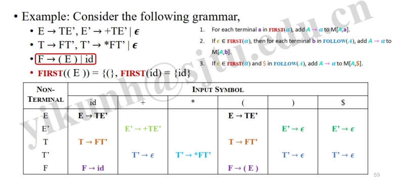
		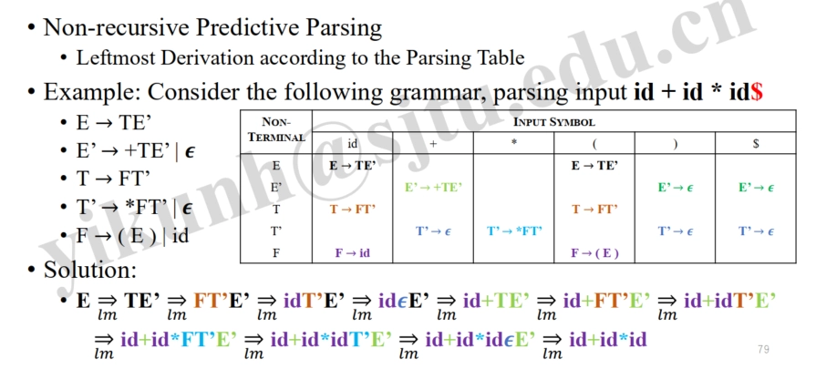

- **Implementation**
	- Stack-based Method, mimicking a leftmost derivation （基于栈的方法，模仿最左派生）

	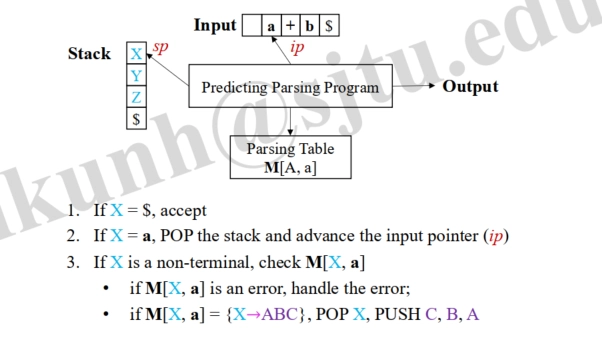

#### Left Factoring

- When the decision is not clear, defer it until seeing enough symbols. （当决策不明确时，推迟到看到足够的符号为止）
- **Left-Factored**:
	- $\mathbf{A} \rightarrow \mathbf{𝜶} \mathbf{𝜷_1} | \mathbf{𝜶} \mathbf{𝜷_2}\quad by \quad \mathbf{A} \rightarrow \mathbf{𝜶} \mathbf{A'}, \mathbf{A'} \rightarrow \mathbf{𝜷_1} | \mathbf{𝜷_2}$
- **How**:
	- For each non-terminal $\mathbf{A}$, find the longest common prefix $\mathbf{𝜶}$ of its alternatives.
	- If $\mathbf{𝜶}$ is not empty, replace all of the $\mathbf{A}$-productions
- **Example**:
	- $\mathbf{A} \rightarrow \mathbf{𝜶} \mathbf{𝜷_1} | \mathbf{𝜶} \mathbf{𝜷_2} | ... | \mathbf{𝜶} \mathbf{𝜷_n} | \mathbf{𝜸}\quad \quad by \quad \quad \mathbf{A} \rightarrow \mathbf{𝜶} \mathbf{A'} | 𝜸, \mathbf{A'} \rightarrow \mathbf{𝜷_1} | \mathbf{𝜷_2} | ... | \mathbf{𝜷_n}$

#### Non-LL(1) Grammar

- Non-LL(1) Grammars:
	- grammars with Left Recursion （左递归的文法）
	- grammars not Left Factored （未左因子化的文法）
	- grammars with Ambiguity （歧义文法）
- Thus, before Predictive Parsing,
	- **perform Left Factoring** （左因子化）
	- **eliminate Left Recursion** (prerequisite of the elimination?) （消除左递归）
	- remove Ambiguity （消除歧义）

## Bottom-Up Parsing

- **What**: the construction of a parse tree beginning at the leaves and working up to the root （从叶子开始构建解析树，直到根）
- **Why**: not all grammars can be made LL(1)
- **How**: construct rightmost derivation in the reverse order
	- **Reduction**: “Reversed Derivation”（归约：反向派生）
		- from the string to the start symbol （从字符串到起始符号）
		- The body of a production is replaced by the non-terminal at its header. （用产生式的头部替换产生式的主体）
	- $S \overset{rm}{\Rightarrow} \gamma_0 \overset{rm}{\Rightarrow} \gamma_1 \overset{rm}{\Rightarrow} \dots \overset{rm}{\Rightarrow} \gamma_n \overset{rm}{\Rightarrow} \omega$
		- find the rightmost derivation in the reverse order: “leftmost reduction” （找到右侧派生的反向顺序：最左侧归约）
	- “**L**eft-to-Right, **R**ightmost Derivation in Reverse”: **LR Parsing**
- **Example**：
	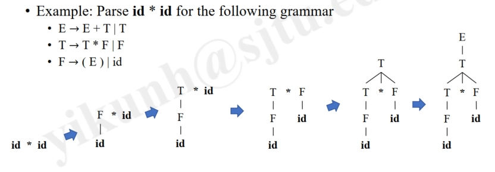

	- $E \Rightarrow T \Rightarrow T * F \Rightarrow T * id \Rightarrow F * id \Rightarrow id * id$

### Handles

- **What**: if $\mathbf{S} \overset{*}{\Rightarrow} \mathbf{\alpha A \omega} \overset{}{\Rightarrow} \mathbf{\alpha \beta \omega}$, then production $\mathbf{A \rightarrow \beta}$ in the position following $\mathbf{\alpha}$ is a **handle** of $\mathbf{\alpha \beta \omega}$.
	- a substring that matches the body of a production, representing a step of reduction （与产生式的主体匹配的子字符串，表示归约的一步）
	- a pair of values: **(production, position)**
- **Why**: handle pruning for bottom-up parsing （处理底向上解析的剪枝）
	- identify handles and reduce them to the appropriate   leftmost non-terminals （识别句柄并将其归约到适当的最左非终结符）
- **How**: by using a stack to keep track of the current position in the input string and the corresponding production rules （使用栈来跟踪输入字符串中的当前位置和相应的产生式规则）
- **Example**：
	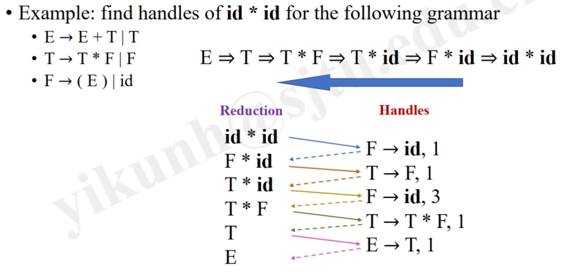

### Shift-Reduce Parsing （移进归约解析）

- **How**: Stack + Input Buffer
	- **Stack**: reduced Grammar Symbols
	- **Input Buffer**: rest of the String to be parsed
- **Actions**
	- **Shift**: move the next symbol onto stack
	- **Reduce**: replace the handle on the top of stack
	- **Accept**: announce the success of parsing
	- **Error**: discover syntax errors, and call for recovery
- **Example**:
	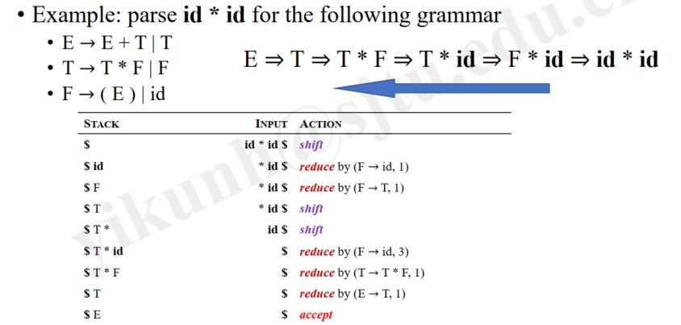

### Operator-Precedence Parsing （运算符优先解析）

- **What**: a shift-reduce parser handling operator-precedence grammar  （处理运算符优先文法的移位归约解析器）
	- operator-precedence grammar: a subset of LR(1) grammar （运算符优先文法：LR(1)文法的一个子集）
	- for each Production:
		- no 𝝐 in the body （主体中没有空字符）
		- no two consecutive non-terminals in the body （在主体中没有两个连续的非终结符）
- **Why**: to handle expressions with operator precedence and associativity （处理具有运算符优先级和结合性的表达式）
- **How**: find handles according precedence
	- **Precedence** （优先级）
		- $\mathbf{a} <· \mathbf{b}$: a’s precedence is lower than b’s
		- $\mathbf{a} =· \mathbf{b}$: … is equal to …
		- $\mathbf{a} >· \mathbf{b}$: … is higher than …
	- **Precedence Climbing Method** （优先级爬升法）
		- scan the input **from Left to Right** until >· is encountered
		- then, scan **backward** until <· is encountered
		- that between <· and >· is the **handle**
	- **Implementation with STACK** (栈实现)
		- let $\mathbf{a}$ be the **top Terminal** on the STACK （栈顶终结符）
		- let $\mathbf{b}$ be the INPUT Symbol under processing （正在处理的输入符号）
		- if $\mathbf{a} <· or =· \mathbf{b}$, **Shift**
		- else if $\mathbf{a} >· \mathbf{b}$, **Reduce**
- **Example**:
	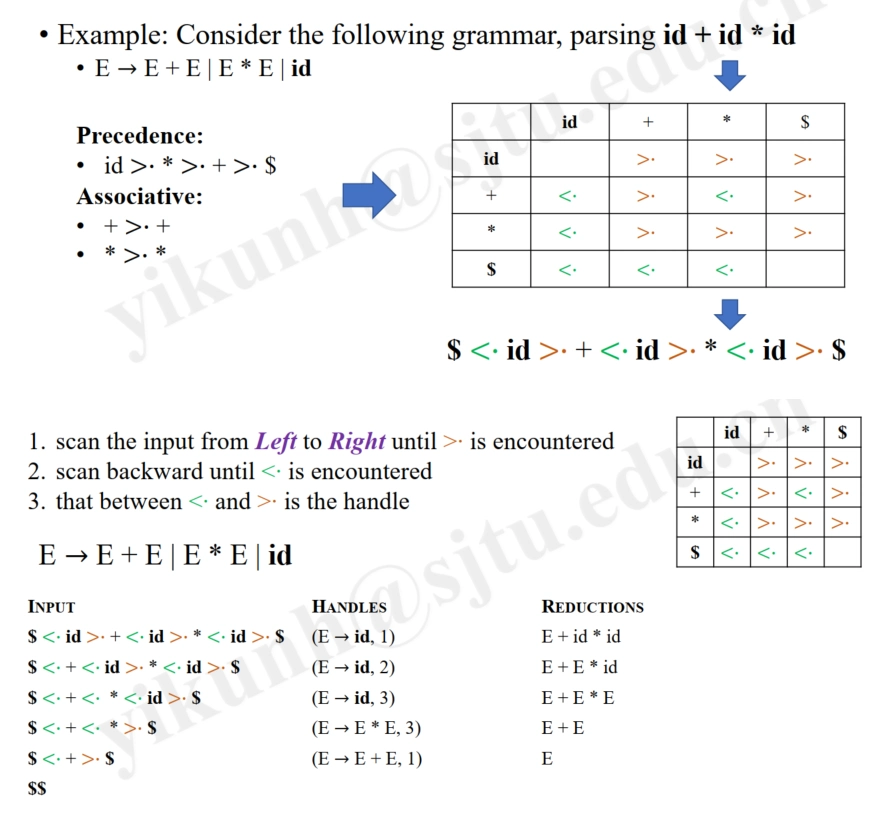
	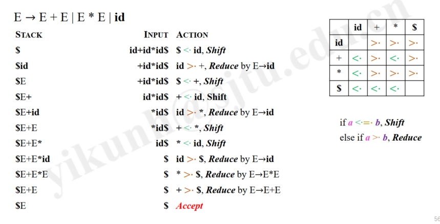

### OPP: Precedence Relation Construction （优先级关系构造）
#### Precedence Relation

- If operator $\mathbf{a}$ has higher precedence than $\mathbf{b}$
	- $\mathbf{a} >· \mathbf{b}$
	- $\mathbf{b} <· \mathbf{a}$
- If $\mathbf{a}$ and $\mathbf{b}$ has equal precedence
	- if left-associative, then $\mathbf{a} >· \mathbf{b}$ and $\mathbf{b} >· \mathbf{a}$
	- if right-associative, then $\mathbf{a} <· \mathbf{b}$ and $\mathbf{b} <· \mathbf{a}$
- For all operator $\mathbf{a}$
	- $\mathbf{a} <· id, \quad id >· \mathbf{a}$
	- $\text{\$} <· \mathbf{a}, \quad \mathbf{a} >· \text{\$}$
	- $\mathbf{a} <· (,\quad ( <· \mathbf{a}, \quad \mathbf{a} >· ), \quad ) >· \mathbf{a}$
	- $(=· )$

#### LEADING and TRAILING

- **LEADING**: the set of symbols that can appear at the beginning of a string derived from a non-terminal （可以出现在从非终结符派生的字符串开头的符号集合）
- $\mathbf{LEADING(Q)} = \{\mathbf{Y}, \mathbf{N} \ | \ \mathbf{Q} \overset{+}{\Rightarrow} \mathbf{Y\delta} \ or\ \mathbf{Q} \overset{+}{\Rightarrow} \mathbf{N Y \delta}, \mathbf{N} \in \mathbf{V_n}, \mathbf{Y} \in \mathbf{V_t}\}$
- for $\mathbf{Q} \rightarrow \mathbf{Y \delta}$ or $\mathbf{Q} \rightarrow \mathbf{N Y \delta}$, we have:
	- $\mathbf{Y}, \mathbf{N} \in \mathbf{LEADING(Q)}$
	- $\mathbf{LEADING(N)} \subseteq \mathbf{LEADING(Q)}$
- **TRAILING**: the set of symbols that can appear at the end of a string derived from a non-terminal （可以出现在从非终结符派生的字符串末尾的符号集合）
- $\mathbf{TRAILING(P)} = \{\mathbf{X}, \mathbf{N} \ | \ \mathbf{P} \overset{+}{\Rightarrow} \mu \mathbf{X} \ or \ \mathbf{P} \overset{+}{\Rightarrow} \mu \mathbf{X} \mathbf{N}, \mathbf{N} \in \mathbf{V_n}, \mathbf{X} \in \mathbf{V_t}\}$
- for $\mathbf{P} \rightarrow \mu \mathbf{X}$ or $\mathbf{P} \rightarrow \mu \mathbf{X} \mathbf{N}$, we have:
	- $\mathbf{X}, \mathbf{N} \in \mathbf{TRAILING(P)}$
	- $\mathbf{TRAILING(N)}\subseteq\mathbf{TRAILING(P)}$
- **Example**:
	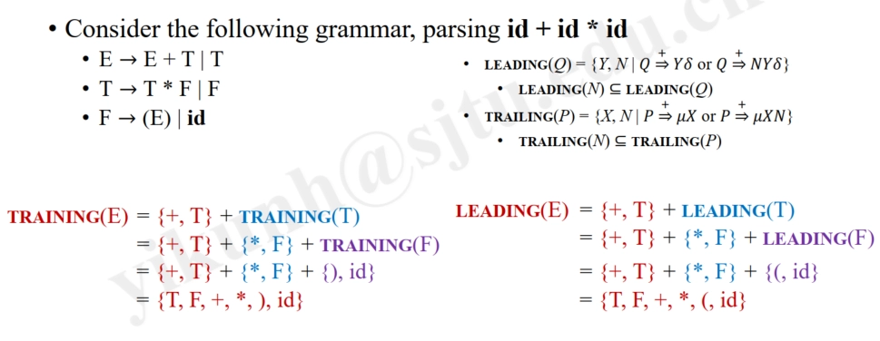

#### Constructing Precedence Relations

- $$
\mathbf{X} =· \mathbf{Y}
$$

	- if there is $\mathbf{A} \rightarrow \mathbf{\alpha X Y \beta}$, where $\mathbf{X}, \mathbf{Y} \in \mathbf{V}$, $\mathbf{\alpha}, \mathbf{\beta} \in \mathbf{V^*}$
	- or, there is $\mathbf{A} \rightarrow \mathbf{\alpha X N Y \beta}$, where $\mathbf{N} \in \mathbf{V_n} \cup \{\mathbf{\epsilon}\}$, $\mathbf{X}, \mathbf{Y} \in \mathbf{V_t}$
	- adjacent symbols have equal precedence （相邻符号具有相等的优先级）
	- at least one of them is a terminal （至少有一个是终结符）
	- e.g., $\mathbf{E} + \mathbf{T}$, $\mathbf{T} * \mathbf{F}$, $\mathbf{E} += \mathbf{T}$
- $$
\mathbf{X} <· \mathbf{Y}
$$

	- if there is $\mathbf{A} \rightarrow \mathbf{\alpha X Q \beta}$, and $\mathbf{Q} \overset{+}{\Rightarrow} \mathbf{Y \delta}$, where $\mathbf{X}, \mathbf{Y} \in \mathbf{V}$, $\mathbf{Q} \in \mathbf{V_n}$, $\mathbf{\alpha}, \mathbf{\beta}, \mathbf{\delta} \in \mathbf{V^*}$
	- or, there is $\mathbf{A} \rightarrow \mathbf{\alpha X Q \beta}$, and $\mathbf{Q} \overset{+}{\Rightarrow} \mathbf{N Y \delta}$, where $\mathbf{N} \in \mathbf{V_n} \cup \{\mathbf{\epsilon}\}$, $\mathbf{X}, \mathbf{Y} \in \mathbf{V_t}$
	- $\mathbf{LEADING(Q)} = \{\mathbf{Y}, \mathbf{N} \ | \ \mathbf{Q} \overset{+}{\Rightarrow} \mathbf{Y\delta} \ or\ \mathbf{Q} \overset{+}{\Rightarrow} \mathbf{N Y \delta}\}$
	- for $\mathbf{A} \rightarrow \mathbf{\alpha X Q \beta}$, we have $\mathbf{X}$ <· Symbols in $\mathbf{LEADING(Q)}$
- $$
\mathbf{X} >· \mathbf{Y}
$$

	- if there is $\mathbf{A} \rightarrow \alpha \mathbf{P} \mathbf{Y} \beta$, and $\mathbf{P} \overset{+}{\Rightarrow} \mu \mathbf{X}$, where $\mathbf{X}, \mathbf{Y} \in \mathbf{V}$, $\mathbf{P} \in \mathbf{V_n}$, $\alpha, \beta, \mu \in \mathbf{V}^*$
	- or, there is $\mathbf{A} \rightarrow \alpha \mathbf{P} \mathbf{Y} \beta$, and $\mathbf{P} \overset{+}{\Rightarrow} \mu \mathbf{X} \mathbf{N}$, where $\mathbf{N} \in \mathbf{V_n} \cup \{\epsilon\}$, $\mathbf{P} \in \mathbf{V_n}$, $\mathbf{X}, \mathbf{Y} \in \mathbf{V_T}$
	- $\mathbf{TRAILING(P)} = \{\mathbf{X}, \mathbf{N} \ | \ \mathbf{P} \overset{+}{\Rightarrow} \mu \mathbf{X} \ \text{or} \ \mathbf{P} \overset{+}{\Rightarrow} \mu \mathbf{X} \mathbf{N}\}$
	- for $\mathbf{A} \rightarrow \alpha \mathbf{P} \mathbf{Y} \beta$, we have Symbols in $\mathbf{TRAILING(P)} >· \mathbf{Y}$

#### Precedence Table

- **Steps**：
	- for each production $\mathbf{A} \rightarrow \mathbf{X_1 X_2 \dots X_k}$:
	- for each $\mathbf{X_i}$
	- if $\mathbf{X_i} \in \mathbf{V_t}$ and $\mathbf{X_{i+1}} \in \mathbf{V_t}$, then $\mathbf{X_i} =· \mathbf{X_{i+1}}$
	- if $\mathbf{X_i} \in \mathbf{V_t}$ and $\mathbf{X_{i+2}} \in \mathbf{V_t}$ and $\mathbf{X_{i+1}} \in \mathbf{V_n}$, then $\mathbf{X_i} =· \mathbf{X_{i+2}}$
	- if $\mathbf{X_i} \in \mathbf{V_t}$ and $\mathbf{X_{i+1}} \in \mathbf{V_n}$, then $\mathbf{X_i} <· \mathbf{LEADING(X_{i+1})}$
	- if $\mathbf{X_i} \in \mathbf{V_n}$ and $\mathbf{X_{i+1}} \in \mathbf{V_t}$, then $\mathbf{X_i} =· \mathbf{X_{i+1}}$ and $\mathbf{TRAILING(X_i)} >· \mathbf{X_{i+1}}$
	- for the Start Symbol $\mathbf{S}$:
		- $\$ <· \mathbf{LEADING(S)}$
		- $\mathbf{TRAILING(S)} >· \$$
- **Example**:
	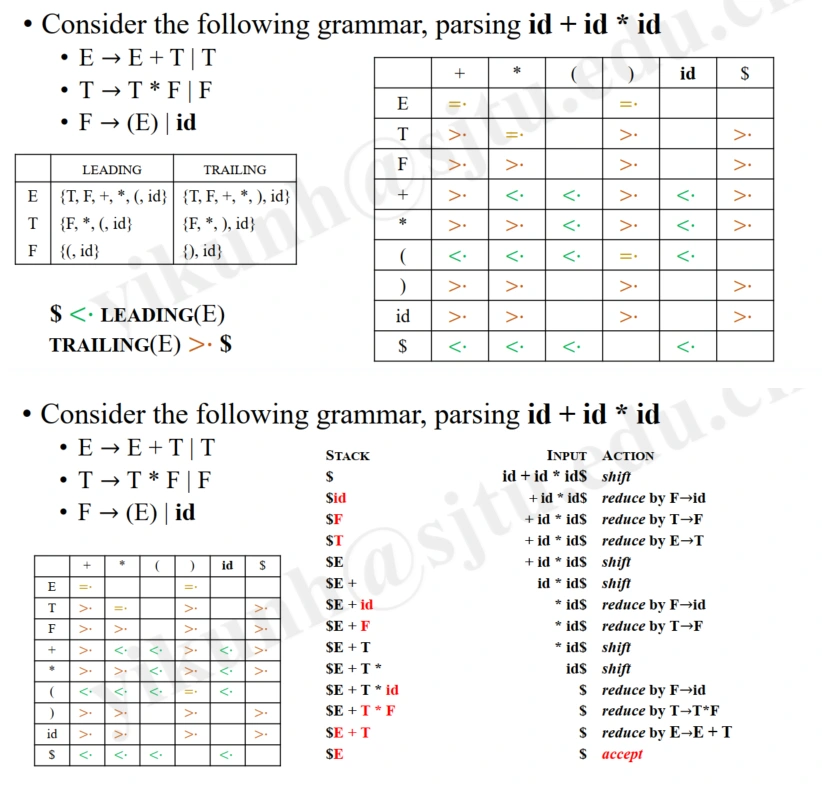

### OPP: Some More

- Unary Minus vs. Binary Minus （一元负号与二元负号）
- Leave It to Scanners （留给扫描器）
	- return two different tokens for the two （返回两个不同的 tokens）
	- lookahead is required （需要向前看）
- OPPs are not used often in practice （运算符优先级在实践中不常用）
	- limited scenarios and applications （有限的场景和应用）
	- but, simple -> part of a complex parsing system （但简单，是复杂解析系统的一部分）

## LR Parsing

- **What**:
	- left-to-right scanning
	- rightmost derivation in reverse
- **Why**
	- can recognize virtually all programming languages of context-free grammars （几乎可以识别所有上下文无关文法的编程语言）
	- is the most general non-backtracking shift-reduce parsing method known （已知的最通用的非回溯移位归约解析方法）
		- yet is still efficient （仍然高效）
	- can detect a syntax error as soon as possible （尽快检测语法错误）
	- is a proper superset of the predictive parsing （是预测解析的适当超集）

### LR(0) Parsing
#### Items and the LR(0) Automaton

- **Problem**: when to shift and when to reduce?
	- how to decide whether that on the top of the stack is a handle? （如何判断栈顶的句柄？）
- **LR(0) Items**: a production with a dot at some position in its body （LR(0) 项目：在其主体的某个位置有一个点的产生式）
	- prefixes of a valid production, indicating how much we have seen at the point （有效产生式的前缀，指示我们在该点上已经看到多少）
	- e.g. $\mathbf{A} \rightarrow \mathbf{XYZ}$ yields four items（例如 $\mathbf{A} \rightarrow \mathbf{XYZ}$ 产生四个项）：
		- $\mathbf{A} \rightarrow \cdot \mathbf{XYZ}$: hope to see $\mathbf{XYZ}$ next on the input
		- $\mathbf{A} \rightarrow \mathbf{X} \cdot \mathbf{YZ}$: hope to see $\mathbf{YZ}$ next on the input
		- $\mathbf{A} \rightarrow \mathbf{XY} \cdot \mathbf{Z}$: hope to see $\mathbf{Z}$ next on the input
		- $\mathbf{A} \rightarrow \mathbf{XYZ} \cdot$: hope to see nothing next on the input
	- kind of state + transition → automaton
- **Kernel and Non-Kernel Items**
	- **Kernel Items**: the Initial Item + those whose dots are not at the left
	- **Non-Kernel Items**: Otherwise
- **LR(0) Automaton**: **CLOSURE + GOTO**
	- **CLOSURE**: set of **Items** （项集的闭包）
	- **GOTO**: the **Transition Function** （转换函数）

#### CLOSURE and GOTO

- $\mathbf{CLOSURE(I)}$:
	- $\mathbf{I}$: a set of Items for a grammar $\mathbf{G}$（文法 $\mathbf{G}$ 的项集）
	- construct by two rules:
		1. every Item in $\mathbf{I}$ is added in to $\mathbf{CLOSURE(I)}$ （$\mathbf{I}$ 中的每个项目都添加到 $\mathbf{CLOSURE(I)}$ 中）
		2. if $\mathbf{A} \rightarrow \mathbf{\alpha} \cdot \mathbf{B} \mathbf{\beta}$ is in $\mathbf{CLOSURE(I)}$ and $\mathbf{B} \rightarrow \mathbf{\gamma}$ is a production of $\mathbf{G}$, then add $\mathbf{B} \rightarrow \cdot \mathbf{γ}$ to $\mathbf{CLOSURE(I)}$ （如果 $\mathbf{A} \rightarrow \mathbf{\alpha} \cdot \mathbf{B} \mathbf{\beta}$ 在 $\mathbf{CLOSURE(I)}$ 中，并且 $\mathbf{B} \rightarrow \mathbf{\gamma}$ 是 $\mathbf{G}$ 的一个产生式，则将 $\mathbf{B} \rightarrow \cdot \mathbf{γ}$ 添加到 $\mathbf{CLOSURE(I)}$ 中）
	- **Example**:
		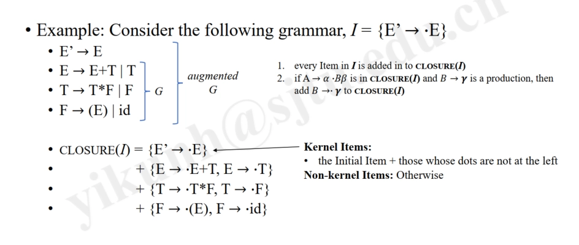

- $\mathbf{GOTO(I, X)}$:
	- $\mathbf{I}$: a set of Items for a grammar $\mathbf{G}$ （文法 $\mathbf{G}$ 的项集）
	- $\mathbf{X}$: a grammar symbol （文法符号）
	- the closure of the set of items [$\mathbf{A} \rightarrow \mathbf{\alpha X} \cdot \mathbf{\beta}$] such that [$\mathbf{A} \rightarrow \mathbf{\alpha} \cdot \mathbf{X} \mathbf{\beta}$] is in $\mathbf{I}$ （$\mathbf{GOTO(I, X)}$ 是 $\mathbf{I}$ 中所有形如[$\mathbf{A} \rightarrow \mathbf{\alpha} \cdot \mathbf{X \beta}$]的项所对应的项[$\mathbf{A} \rightarrow \mathbf{\alpha X} \cdot \mathbf{\beta}$]的集合的闭包）
		- the transition from the state for $\mathbf{I}$ under input $\mathbf{X}$ （在输入 $\mathbf{X}$ 下，$\mathbf{I}$ 的状态转换）
	- construct by
		1. for each Item $\mathbf{A} \rightarrow \mathbf{\alpha} \cdot \mathbf{X} \mathbf{\beta}$ in $\mathbf{I}$
		2. then every Item in $\mathbf{CLOSURE(A \rightarrow \alpha X \cdot \beta)}$ is added to $\mathbf{GOTO(I, X)}$
	- **Example**:
		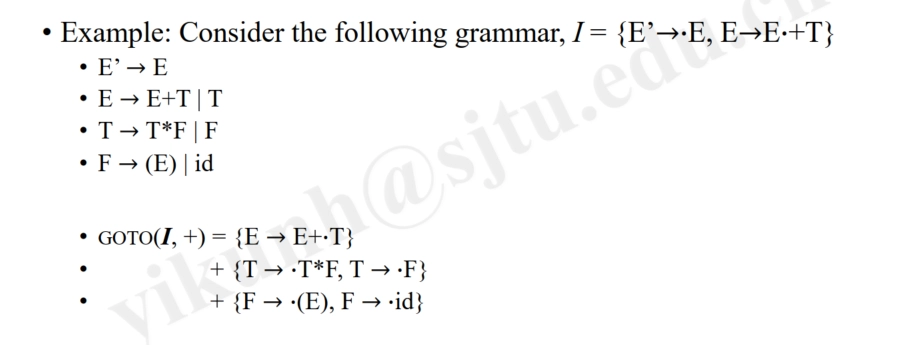

#### Automaton Construction

- **INPUT**: a grammar $\mathbf{G}$
- **OUTPUT**: a LR(0) automaton
- **Construction**:
	1. augment $\mathbf{G}$ to $\mathbf{G'}$ by adding a new start symbol $\mathbf{S'}$ and production $\mathbf{S'} \rightarrow \mathbf{S}$ （通过添加新的起始符号 $\mathbf{S'}$ 和产生式 $\mathbf{S'} \rightarrow \mathbf{S}$ 扩展文法 $\mathbf{G}$ 至 $\mathbf{G'}$）
	2. $\mathbf{C}$:=  {$\mathbf{CLOSURE(S' \rightarrow \cdot S)}$} （先求 $\mathbf{CLOSURE(S' \rightarrow \cdot S)}$，作为闭包的集合 $\mathbf{C}$ 中的第一个闭包）
	3. repeat:
		- for each Item $\mathbf{I}$ in $\mathbf{C}$ and each grammar symbol $\mathbf{X}$ in $\mathbf{G'}$ （对 $\mathbf{C}$ 中每个项目 $\mathbf{I}$ 和 $\mathbf{G'}$ 中的每个文法符号 $\mathbf{X}$）
			- if $\mathbf{GOTO(I, X)}$ is not empty and not in $\mathbf{C}$ （如果 $\mathbf{GOTO(I, X)}$ 不为空且不在 $\mathbf{C}$ 中，注意 $\mathbf{GOTO(I, X)}$ 是项集 $\mathbf{I}$ 在输入符号 $\mathbf{X}$ 下的转换的闭包）
				- add $\mathbf{GOTO(I, X)}$ to $\mathbf{C}$
	4. until no new Items are added to $\mathbf{C}$
- **Example**:
	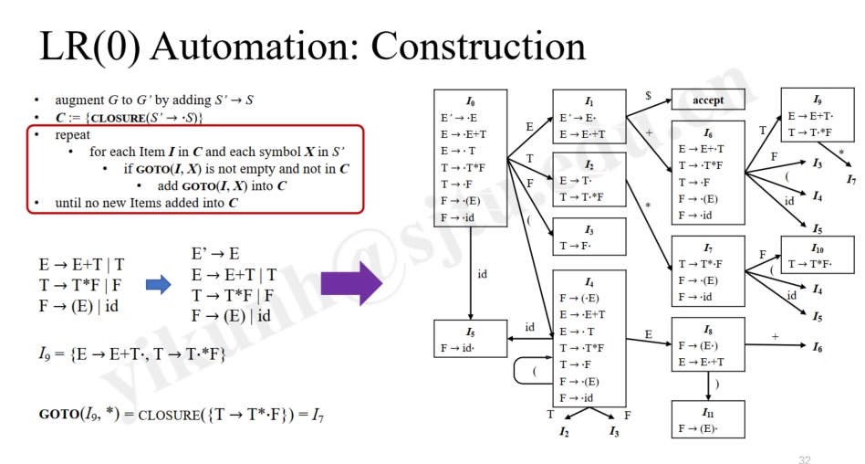

#### Parsing Table Construction

- **LR(0) Parsing Table $\mathbb{T}$**:
	- **Rows**: **states**
	- **Columns**: **grammar symbols**
		- **terminals** for $\mathbf{SHIFT}$ and $\mathbf{REDUCE}$ actions
		- **non-terminals** for $\mathbf{GOTO}$ actions
	- **Construction**:  each edge $\mathbf{X}$: $(s_m, s_n)$ （对于每条边 $\mathbf{X}$，$(s_m, s_n)$ 为其起始和终止状态，X 为文法符号）
		- if $\mathbf{X}$ is a **terminal** $\mathbf{a}$, then $\mathbb{T}[s_m, a] = \mathbf{SHIFT}\ n$ （记作 s n）
		- if $\mathbf{X}$ is a **non-terminal** $\mathbf{A}$, then $\mathbb{T}[s_m, A] = \mathbf{GOTO}\ n$ （记作 n）
		- if $\mathbf{A} \rightarrow \mathbf{\beta} \cdot$ is in $s_m$, then for each **terminal** $\mathbf{a}$, $\mathbb{T}[s_m, a] = \mathbf{REDUCE}\ \mathbf{A} \rightarrow \mathbf{\beta}$ （记作 r n，其中 n 是产生式的编号，用罗马数字表示）
		- if $\mathbf{S'} \rightarrow \mathbf{S} \cdot$ is in $s_m$, then for each **terminal** $\mathbf{a}$, $\mathbb{T}[s_m, a] = \mathbf{ACCEPT}$ （记作 a/acc）
	- 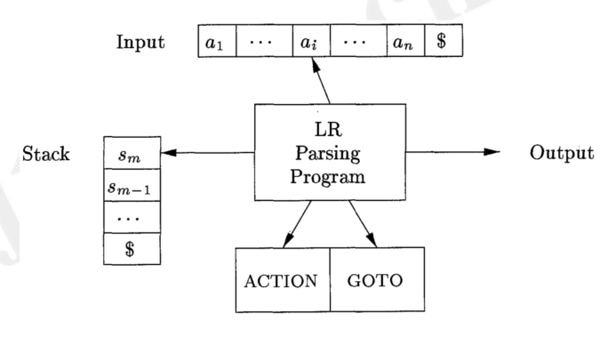

- **Example**:
	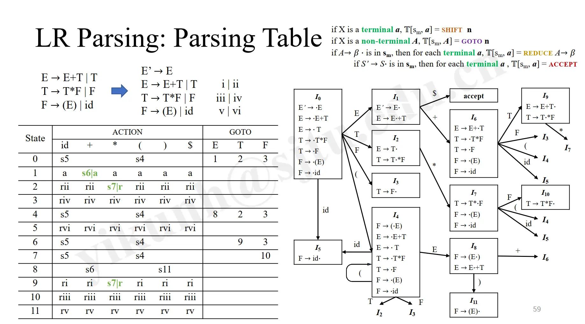
	> 注：在上面的例子中，状态 1、2、9 均存在移进-归约冲突，因此不属于 LR(0)文法。

#### Alogrithm and Implementation （算法与实现）

- **INPUT**: an input string $\mathbf{\omega}$ and an LR-parsing table $\mathbb{T}$ for a grammar $\mathbf{G}$
- **OUTPUT**: if $\mathbf{\omega} \in \mathbf{L(G)}$, the reduction steps of a bottom-up parse for $\mathbf{\omega}$
- **STEPS**:
	```java
	let a be the first symbol of 𝜔$ //设a是输入字符串𝜔$的第一个符号
	push state 0 onto the stack //将状态0推入栈中
	while (1) {
		let s be the state on top of the stack //设s是栈顶的状态
		if (ACTION[s, a] = shift t) { //如果ACTION[s, a] = shift t
			push t onto the stack //将t推入栈中
			let a be the next input symbol //设a是下一个输入符号
		}
		else if (ACTION[s, a] = reduce A→𝛽) { //如果ACTION[s, a] = reduce A→𝛽
			pop |𝛽| symbols off the stack //从栈中弹出|𝛽|（𝛽包含的符号数）个状态
			let t be the top of the stack now //设t是栈顶的状态
			push GOTO[t, A] onto the stack //将GOTO[t, A]推入栈中
		}
		else if (ACTION[s, a] = accept) break //如果ACTION[s, a] = accept，则结束
		else call error-handling routine
	}
	```

- **Example**:
	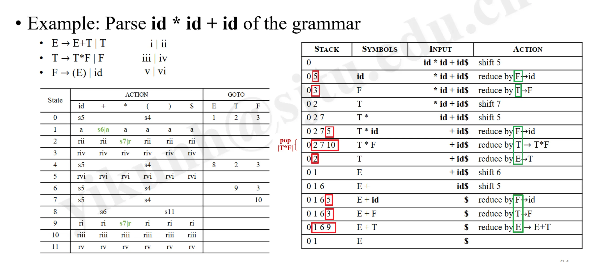

#### LR(0) Conflicts

- **Reduce-Reduce Conflicts**: 
	- state has two reduce items
	- e.g. $\mathbf{A} \rightarrow \mathbf{\alpha} \cdot$ and $\mathbf{B} \rightarrow \mathbf{\beta} \cdot$
- **Shift-Reduce Conflicts**: 
	- state has a reduce item and a shift item
	- e.g. $\mathbf{A} \rightarrow \mathbf{\alpha} \cdot \mathbf{k \gamma}$ and $\mathbf{B} \rightarrow \mathbf{\beta} \cdot$

- To avoid conflicts: **SLR(1) Parsing**

### SLR(1) Parsing
#### Parsing Table Construction

- **LR(0) Parsing Table** $\mathbb{T}$ $\Rightarrow$ **SLR(1) Parsing Table** $\mathbb{T}$
	- **Rows**: **states**
	- **Columns**: **grammar symbols**
		- **terminals** for $\mathbf{SHIFT}$ and $\mathbf{REDUCE}$ actions
		- **non-terminals** for $\mathbf{GOTO}$ actions
	- **Construction**: each edge $\mathbf{X}$: $(s_m, s_n)$
		- if $\mathbf{X}$ is a **terminal** $\mathbf{a}$, then $\mathbb{T}[s_m, a] = \mathbf{SHIFT}\ n$
		- if $\mathbf{X}$ is a **non-terminal** $\mathbf{A}$, then $\mathbb{T}[s_m, A] = \mathbf{GOTO}\ n$
		- if $\mathbf{A} \rightarrow \mathbf{\beta} \cdot$ is in $s_m$, then for each **terminal** $\mathbf{a} \in \mathbf{FOLLOW(A)}$, $\mathbb{T}[s_m, a] = \mathbf{REDUCE}\ \mathbf{A} \rightarrow \mathbf{\beta}$ （只对 $\mathbf{FOLLOW(A)}$ 中的终结符进行归约）
		- if $\mathbf{S'} \rightarrow \mathbf{S} \cdot$ is in $s_m$, then $\mathbb{T}[s_m, \$] = \mathbf{ACCEPT}$ （只对\$进行归约）

- **Example**:
	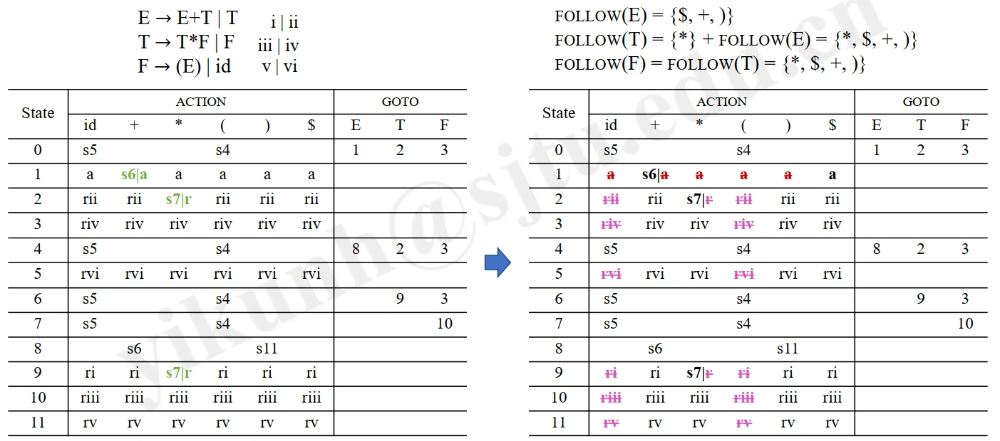

#### SLR(1) Conflicts

- **Reduce-Reduce Conflicts**:
	- state has two reduce items
	- e.g. $\mathbf{A} \rightarrow \mathbf{\alpha} \cdot$ and $\mathbf{B} \rightarrow \mathbf{\beta} \cdot$
		- if $\mathbf{FOLLOW(A)} \cap \mathbf{FOLLOW(B)} = \emptyset$, safe for SLR(1) （如果 $\mathbf{FOLLOW(A)} \cap \mathbf{FOLLOW(B)} = \emptyset$，则 SLR(1)安全）
- **Shift-Reduce Conflicts**:
	- state has a reduce item and a shift item
	- e.g. $\mathbf{A} \rightarrow \mathbf{\alpha} \cdot \mathbf{k \gamma}$ and $\mathbf{B} \rightarrow \mathbf{\beta} \cdot$
		- if $\mathbf{k} \notin \mathbf{FOLLOW(B)}$, safe for SLR(1) （如果 $\mathbf{k} \notin \mathbf{FOLLOW(B)}$，则 SLR(1)安全）

### LR(1) Parsing

- **How**: check the **immediate** following symbols of non-terminals for reduction （检查非终结符的直接后续符号以进行归约）
- **LR(1) Item** = [**LR(0) Item**, **Following Symbol**]
	- e.g. $[\mathbf{A} \rightarrow \mathbf{XY} \cdot \mathbf{Z}, \mathbf{a}]$
	- where $\mathbf{a}$ is the following **terminal** symbol of $\mathbf{A}$ （$\mathbf{a}$ 是 $\mathbf{A}$ 的后续终结符）
	- when $\mathbf{Z}$ is not empty, the same as LR(0) Item （当 $\mathbf{Z}$ 不为空时，与 LR(0)项相同）
	- otherwise, $\mathbf{A} \rightarrow \mathbf{XY} \cdot \mathbf{Z}$ is applied only when the next input symbol is $\mathbf{a}$ （否则，只有在下一个输入符号为 $\mathbf{a}$ 时才应用 $\mathbf{A} \rightarrow \mathbf{XY} \cdot \mathbf{Z}$）
		- instead of SLR(1)'s ALL $\mathbf{A}$'s following symbols, let along LR(0)'s ALL terminal symbols （而不是 SLR(1)的所有 $\mathbf{A}$ 的后续符号，甚至 LR(0)的所有终结符）

#### LR(1)'s CLOSURE and GOTO

- **LR(1)'s $\mathbf{CLOSURE(I)}$**
	- every Item in $\mathbf{I}$ is added in to $\mathbf{CLOSURE(I)}$
	- repeat:
		- if $[\mathbf{A} \rightarrow \mathbf{\alpha} \cdot \mathbf{B} \mathbf{\beta}, \mathbf{a}]$ is in $\mathbf{CLOSURE(I)}$ and $\mathbf{B} \rightarrow \mathbf{\gamma}$ is a production of $\mathbf{G}$, then for each terminal $\mathbf{b}$ in $\mathbf{FIRST(\beta a)}$, add $[\mathbf{B} \rightarrow \cdot \mathbf{\gamma}, \mathbf{b}]$ into $\mathbf{CLOSURE(I)}$
		- until no more new Items can be added into $\mathbf{CLOSURE(I)}$
	- only reduce $\mathbf{B}$ when it is followed by that in $\mathbf{FIRST(\beta a)}$ （仅在后面跟着 $\mathbf{FIRST(\beta a)}$ 中的项时才归约 $\mathbf{B}$）
- **LR(1)'s $\mathbf{GOTO(I, B)}$**
	- if $[\mathbf{A} \rightarrow \mathbf{\alpha} \cdot \mathbf{B} \mathbf{\beta}, \mathbf{a}]$ in $\mathbf{I}$
	- then every Item in $\mathbf{CLOSURE(\{[\mathbf{A} \rightarrow \mathbf{\alpha} \mathbf{B} \cdot \mathbf{\beta}, \mathbf{a}]\})}$ is in $\mathbf{GOTO(I, B)}$
		- $\mathbf{GOTO(I, B)} \supseteq \mathbf{CLOSURE(\{[\mathbf{A} \rightarrow \mathbf{\alpha} \mathbf{B} \cdot \mathbf{\beta}, \mathbf{a}]\})}$
			- [$\mathbf{A} \rightarrow \mathbf{\alpha} \mathbf{B} \cdot \mathbf{\beta}, \mathbf{a}$]: **Kernel Item**
		- **Those of Kernel Items inherited from the previous state** （从前一个状态继承的内核项）
- **Example**:
	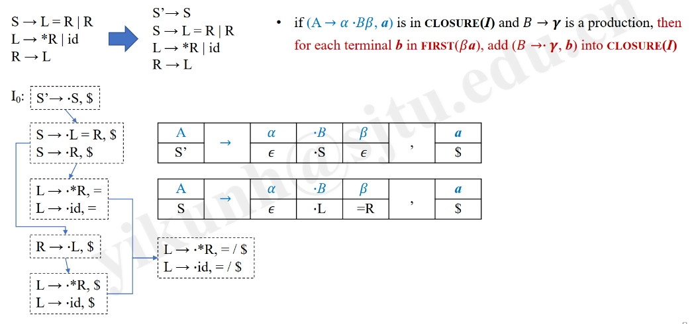

#### Automaton Construction

- **INPUT**: a grammar $\mathbf{G}$
- **OUTPUT**: a LR(1) automaton
- **Construction**:
	1. augment $\mathbf{G}$ to $\mathbf{G'}$ by adding a new start symbol $\mathbf{S'}$ and production $\mathbf{S'} \rightarrow \mathbf{S}$ （扩展文法）
	2. $\mathbf{C}$:=  {$\mathbf{CLOSURE({[S' \rightarrow \cdot S, \$]})}$} （初始化项集 C）
	3. repeat:
		- for each Item $\mathbf{I}$ in $\mathbf{C}$ and each grammar symbol $\mathbf{X}$ in $\mathbf{G'}$
			- if $\mathbf{GOTO(I, X)}$ is not empty and not in $\mathbf{C}$
				- add $\mathbf{GOTO(I, X)}$ to $\mathbf{C}$
	4. until no new Items are added to $\mathbf{C}$
- **Example**:
	1. **Example**:
		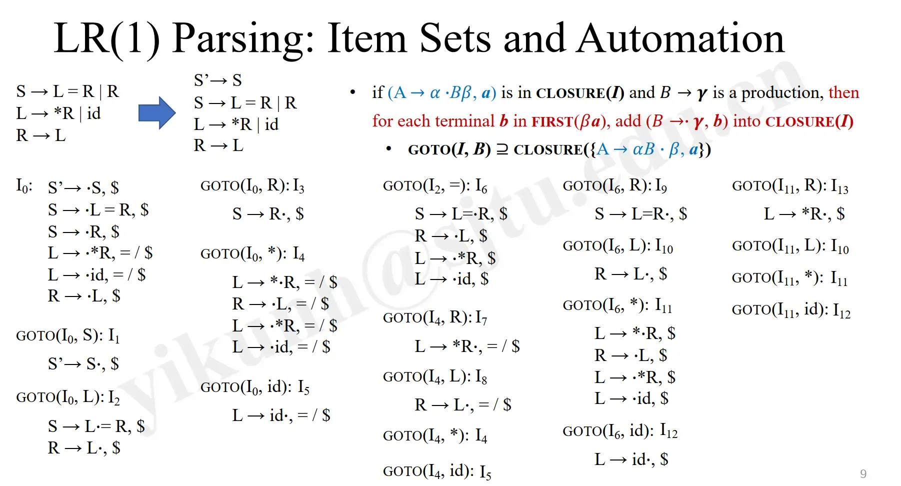

	2. **Exercise**:
		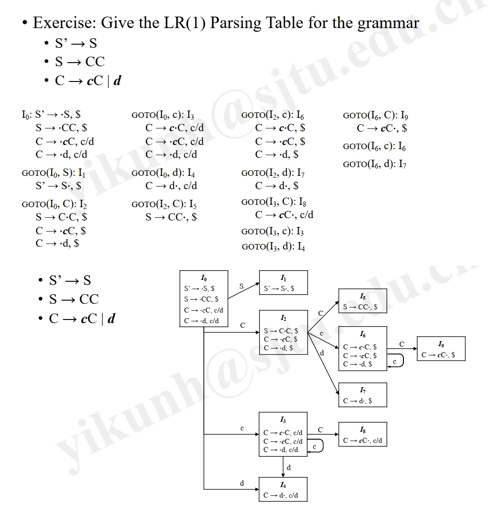

#### Parsing Table Construction

- **LR(1) Parsing Table $\mathbb{T}$**:
	- **Rows**: **states**
	- **Columns**: **grammar symbols**
		- **terminals** for $\mathbf{SHIFT}$ and $\mathbf{REDUCE}$ actions
		- **non-terminals** for $\mathbf{GOTO}$ actions
	- **Construction**: each edge $\mathbf{X}$: $(s_m, s_n)$
		- if $\mathbf{X}$ is a **terminal** $\mathbf{a}$, then $\mathbb{T}[s_m, a] = \mathbf{SHIFT}\ n$
		- if $\mathbf{X}$ is a **non-terminal** $\mathbf{A}$, then $\mathbb{T}[s_m, A] = \mathbf{GOTO}\ n$
		- if $[\mathbf{A} \rightarrow \mathbf{\beta} \cdot, \mathbf{a}]$ (the kernel) is in $s_m$, then $\mathbb{T}[s_m, a] = \mathbf{REDUCE}\ \mathbf{A} \rightarrow \mathbf{\beta}$
		- if $[\mathbf{S'} \rightarrow \mathbf{S} \cdot, \$]$ is in $s_m$, then $\mathbb{T}[s_m, \$] = \mathbf{ACCEPT}$
- **Example**:
	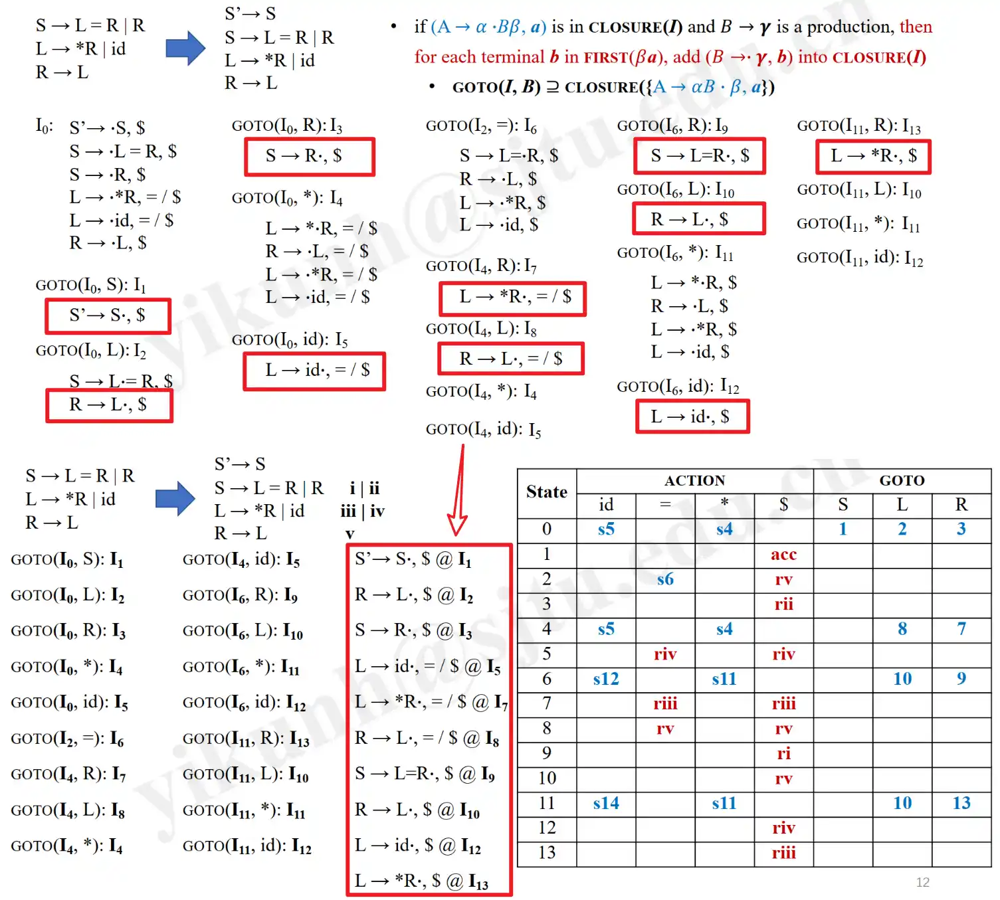
	> 注：上表中 $[11, id]$ 应为 $s12$，即 $\mathbb{T}[11, id] = s12$。

### LALR(1) Parsing

- **What**: **L**ook **A**head **LR(1)**
- **Why**: smaller parsing table than **LR(1)** for practice（比 LR(1)小的解析表）
	- equal to **SLR(1)** in state number （与 SLR(1)状态数相等）
		- e.g. In C, serveral hundred for SLR(1), serverals of thousands for LR(1)
	- more powerful than **SLR(1)** in processing more grammars （比 SLR(1)更强大，能处理更多文法）
- **How**: combine **Items** with the same **Production Set** in LR(1) （将 LR(1)中具有相同产生式集的项（同心集）组合在一起）
	- e.g. $[\mathbf{A} \rightarrow \mathbf{\alpha} \cdot, \mathbf{a}]$ and $[\mathbf{A} \rightarrow \mathbf{\alpha} \cdot, \mathbf{b}]$ are combined into one state
- Compared to **LR(1)**:
	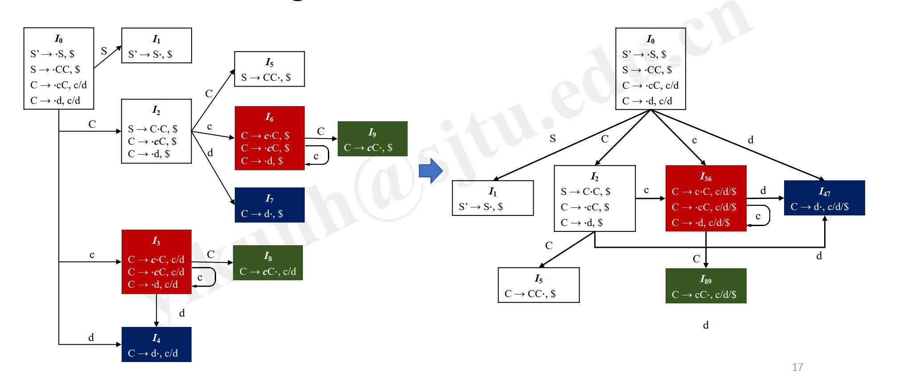

#### Automaton Construction

- **INPUT**: a grammar $\mathbf{G}$
- **OUTPUT**: a LALR(1) automaton
- **Construction**:
	1. Construct **LR(0)** items as **LALR(1)** items' cores for the grammar $\mathbf{G'}$，then remove the non-kernel items （为文法 $\mathbf{G'}$ 构造 LR(0)项作为 LALR(1)项的核心，然后删除非核心项）
	2. For each kernal items $\mathbf{K}$ in $\mathbf{I_i}$ and each grammar symbol $\mathbf{X}$ in $\mathbf{G'}$, calculate the lookahead symbols' **INIT** and **PROPAGATION**. （对于每个项集 $\mathbf{I_i}$ 中的核心项 $\mathbf{K}$ 和文法符号 $\mathbf{X}$，计算前瞻符号的初始值和传播）
		- For each item $(\mathbf{A} \rightarrow \mathbf{\alpha} \cdot \mathbf{\beta})$ in $\mathbf{K}$
			- $\mathbf{J} := \{\mathbf{CLOSURE({[A \rightarrow \alpha \cdot \beta, \#]})}\}$ （初始化 $\mathbf{J}$）
			- if $[\mathbf{B \rightarrow \gamma \cdot X \delta, a}]$ in $\mathbf{J}$ and $\mathbf{a \neq} \#$, then $\mathbf{B \rightarrow \gamma X \cdot \delta}$ in $\mathbf{GOTO(I_i, X)}$ has a **SELF-generated** lookahead symbol $\mathbf{a}$ （$\mathbf{J}$ 中的项若出现不为#的前瞻符号，则它是自发生成的）
			- if $[\mathbf{B \rightarrow \gamma \cdot X \delta,} \#]$ in $\mathbf{J}$, then lookahead symbols are **propagated** from $\mathbf{A \rightarrow \alpha \cdot \beta}$ to $\mathbf{B \rightarrow \gamma X \cdot \delta}$ in $\mathbf{GOTO(I_i, X)}$. （$\mathbf{J}$ 中的项若出现#的前瞻符号，则该项会传播前瞻符号）
		- Specifically, $\mathbf{\$}$ in $\mathbf{[S' \rightarrow S \cdot, \$]}$ is SELF-generated.
	3. Construct the $\mathbf{FROM-TO}$ table base on $\mathbf{GOTO}$ for the kernel items to show the propagation of lookahead symbols （为核心项构建 $\mathbf{FROM-TO}$ 表，以显示前瞻符号的传播）
		- in step 2, we calculate **propagated** relationships.
	4. Propagate the lookahead symbols according to the $\mathbf{FROM-TO}$ relationships until the fixed point achieved （根据 $\mathbf{FROM-TO}$ 关系传播前瞻符号，直到达到不变点）
		- in step 2, we calculate **self-generated** lookahead symbols.
- **Example**:
	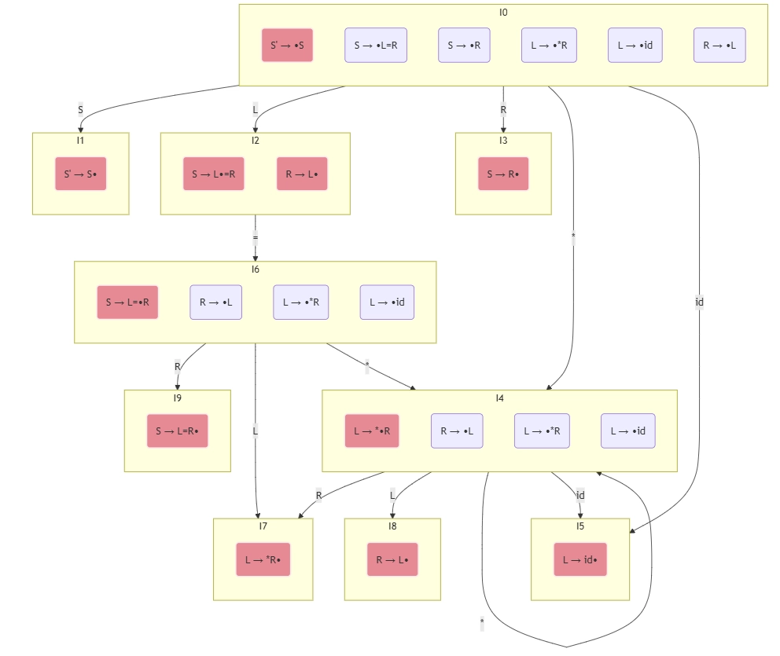
	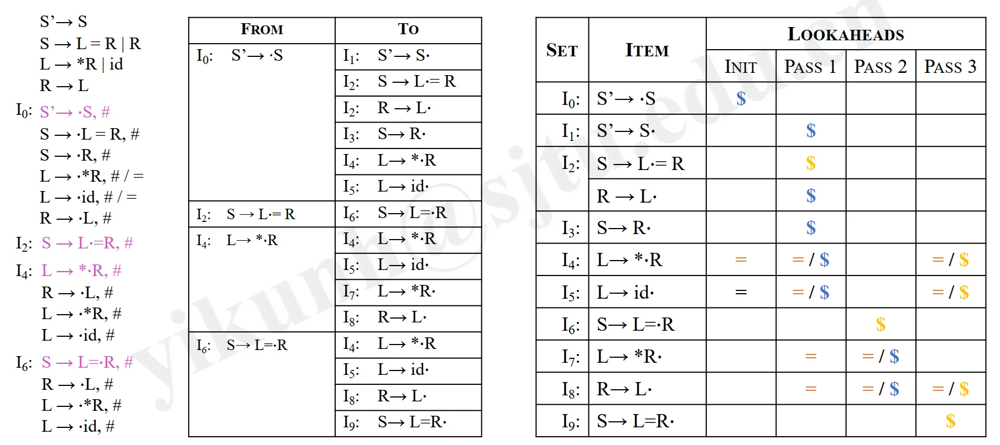
	> 注：上右表中，前瞻符号在传播时，每一行的前瞻符号可以向右填满右侧列，最右一列是最终结果

#### Parsing Table Construction

- the same as **LR(1)** method
- **LALR(1) Parsing Table $\mathbb{T}$**:
	- **Rows**: **states**
	- **Columns**: **grammar symbols**
		- **terminals** for $\mathbf{SHIFT}$ and $\mathbf{REDUCE}$ actions
		- **non-terminals** for $\mathbf{GOTO}$ actions
	- **Construction**: each edge $\mathbf{X}$: $(s_m, s_n)$
		- if $\mathbf{X}$ is a **terminal** $\mathbf{a}$, then $\mathbb{T}[s_m, a] = \mathbf{SHIFT}\ n$
		- if $\mathbf{X}$ is a **non-terminal** $\mathbf{A}$, then $\mathbb{T}[s_m, A] = \mathbf{GOTO}\ n$
		- if $[\mathbf{A} \rightarrow \mathbf{\beta} \cdot, \mathbf{a}]$ (the kernel) is in $s_m$, then $\mathbb{T}[s_m, a] = \mathbf{REDUCE}\ \mathbf{A} \rightarrow \mathbf{\beta}$
		- if $[\mathbf{S'} \rightarrow \mathbf{S} \cdot, \$]$ is in $s_m$, then $\mathbb{T}[s_m, \$] = \mathbf{ACCEPT}$
- **Example**:
	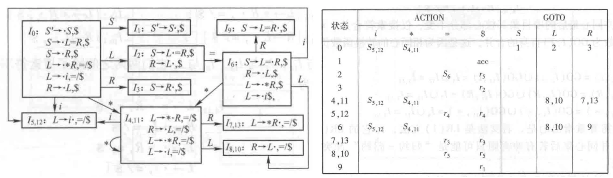

#### Capabilities vs. Conflicts

- LALR never introduces new SHIFT-REDUCE conflicts:
	- **SHIFT does not depend on lookaheads**
- **Example**:
	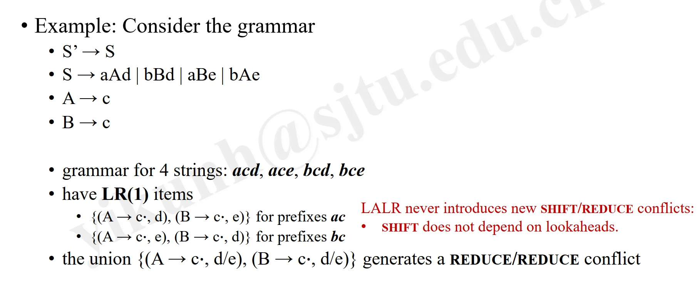

### Summary

- **LR(0)**, **SLR(1)**, **LR(1)**, **LALR(1)**
	- all working in **SHIFT-REDUCE** mode
	- only different in Parsing Tables
- **Parsing Tables - Capabilities**
	- LR(0) < SLR(1) < LALR(1) < LR(1)
	- LR(0): Items
	- SLR(1): Items with FOLLOW
	- LALR(1): Items Combined from SLR(1) and LR(1)
	- LR(1): Items with Subset of FOLLOW

	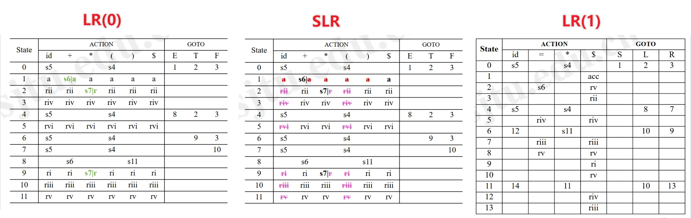

## Using Ambiguous Grammars

- In Theory: grammar for LR parsing tables should be unambiguous （在理论上：LR 解析表的文法应该是无歧义的）
- For ambiguous grammars:
	- there will be conflicts
	- add new information/restrictions to resolve ambiguity （添加新信息/限制以解决歧义）
		- precedence, associativity, etc.
		- get LR tables without conflicts
- Why embracing ambiguous grammars?
	- some are much natural, the unambiguous one can be very complex （有些是非常自然的，无歧义的可能非常复杂）
	- isolate common syntactic constructs for special-case optimizations （隔离常见的语法结构以进行特殊情况优化）
- Example:
	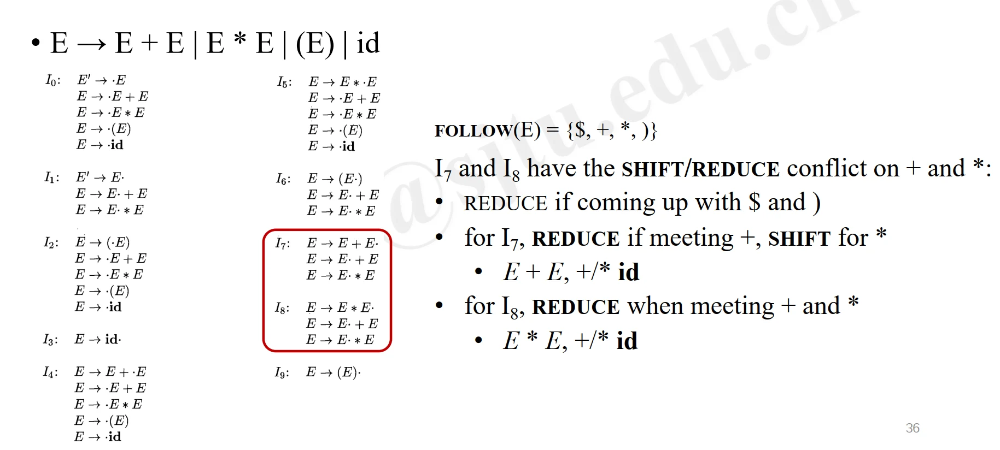

## Summary
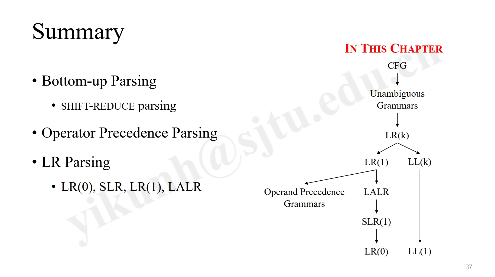
