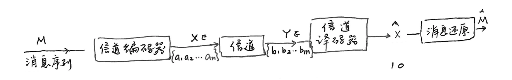
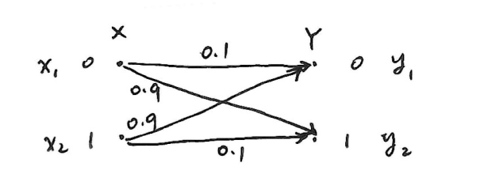
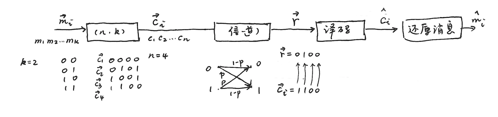
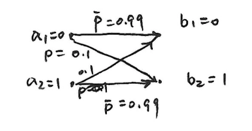
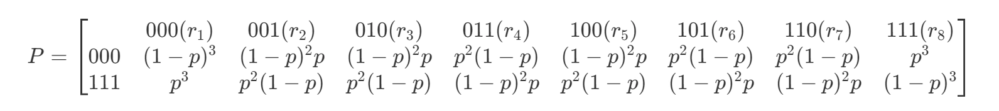

# 第六章补充 信道编码

- [Back to Course Home](index.md)

---

## 译码规则和译码错误概率

- 已知信道转移错误概率 $p = 0.9$，转移情况如下：
	- 若规定：
		- $Y = 0 \to \hat{X} = 0$
		- $Y = 1 \to \hat{X} = 1$
		- 即 $F(y_1) = x_1$，$F(y_2) = x_2$，则译码错误概率 $P_e = 0.9$。
	- 反之若：
		- $Y = 0 \to \hat{X} = 1$
		- $Y = 1 \to \hat{X} = 0$
		- 即 $F(y_1) = x_2$，$F(y_2) = x_1$，则译码错误概率 $P_e = 0.1$。

### 译码规则

- **定义译码规则**：

    $$
    F(y_j) = x_i\quad i = 1, 2, \cdots, n;j = 1, 2, \cdots, m
    $$

- 示例：
	- 设转移概率矩阵 $P=\begin{bmatrix}0.5&0.3&0.2\\0.2&0.3&0.5\\0.3&0.3&0.4\end{bmatrix}_{(n\times m)}$，共有 $n^m$ 种译码规则，如：
		- 译码规则 $A$：$F(y_1) = x_1$；$F(y_2) = x_2$；$F(y_3) = x_3$。
		- 译码规则 $B$：$F(y_1) = x_1$；$F(y_2) = x_3$；$F(y_3) = x_2$。
		- $\cdots$

### 错误概率

- 若 $F(y_j) = x_i^*$，则：
	- **正确概率**：

	    $$
	    p(F(y_j)|y_j)=p(x_i^*|y_j)
	    $$

	- **错误概率**：

	    $$
	    p(e|y_j)=1 - p(x_i^*|y_j)
	    $$

	- **平均错误概率**：

		$$
		\begin{align *} P_e &= E[p(e|y_j)]\\ &=\sum_{j = 1}^{m}p(y_j)p(e|y_j)\\ &=\sum_{j = 1}^{m}p(y_j)(1 - p(x_i^*|y_j))\\ &=\sum_{j = 1}^{m}p(y_j)-\sum_{j = 1}^{m}p(x_i^*,y_j)\\ &=1-\sum_{j = 1}^{m}p(x_i^*,y_j)\\ &=\sum_{Y, X-X^*}p(x,y) \end{align*}
		$$

### 最佳译码规则

- 最佳译码就是使平均错误概率最小

	$$
	P_e=\sum_{j = 1}^{m}p(y_j)p(e|y_j)
	$$

	只需使 $p(e|y_j)$ 最小（$j = 1, 2, \cdots, m$），而 $p(e|y_j)=1 - p(x_i|y_j)=1 - p(F(y_j)|y_j)$。

	因此，**最佳译码** 规则 $F(y_j)=x^*$，满足

	$$
	p(x^*|y_j) \geq p(x_i|y_j),\quad i = 1, 2, \cdots, n
	$$

#### 最大后验概率译码

- 最大后验概率译码满足最佳译码规则：

    $$
    x^*=\arg\max_{1\leq i\leq n}p(x_i|y_j)
    $$

- $$
    F:\left\{ \begin{array}{l} F(b_j)=a_j^*\in A, b_j\in B\\ P(a_j^*|b_j)\geq P(a_i|b_j), a_i\in A \end{array} \right.
    $$

#### 最大联合概率译码

- 根据贝叶斯公式 $p(x_i|y_j)=\frac{p(y_j|x_i)p(x_i)}{p(y_j)}$：

	$$
	\max_{x_i} p(x_i|y_j) = \max_{x_i} \frac{p(y_j|x_i)p(x_i)}{p(y_j)}
	$$

- 则 **最大联合概率译码** 为：

	$$
	x^*=\arg\max_{1\leq i\leq n}p(y_j|x_i)p(x_i)
	$$

- $$
    F:\left\{ \begin{array}{l} F(b_j)=a_j^*\in A, b_j\in B\\ P(a_j^*, b_j)\geq P(a_i, b_j), a_i\in A \end{array} \right.
    $$

#### 最大似然译码

- 当 $p(x_i)=\frac{1}{n}$ 时，即 **信源符号等概率分布时**，有 **最大似然译码**：

	$$
	x^*=\arg\max_{1\leq i\leq n}p(y_j|x_i)
	$$

- $$
    F:\left\{ \begin{array}{l} F(b_j)=a_j^*\in A, b_j\in B\\ P(b_j|a_j^*)\geq P(b_j|a_i), a_i\in A \end{array} \right.
    $$

- **示例**：已知转移概率矩阵$P =
		\begin{bmatrix}
		\frac{1}{2}&\frac{1}{3}&\frac{1}{6}\\
		\frac{1}{6}&\frac{1}{2}&\frac{1}{3}\\
		\frac{1}{3}&\frac{1}{6}&\frac{1}{2}
		\end{bmatrix}$，且$ p(x_1)=p(x_2)=p(x_3)=\frac{1}{3}$，则：

	- $F(y_1)=\arg\max(p(y_1|x_1),p(y_1|x_2),p(y_1|x_3)) = x_1$
	- $F(y_2)=\arg\max(\frac{1}{3},\frac{1}{2},\frac{1}{6}) = x_2$
	- $F(y_3)= x_3$
	- **译码规则 A**：$\begin{cases}F(y_1)=x_1\\F(y_2)=x_2\\F(y_3)=x_3\end{cases}$，为最佳译码规则
		此时 $P_e=\frac{1}{3}(\frac{1}{3}+\frac{1}{6}+\frac{1}{3}+\frac{1}{6}+\frac{1}{3}+\frac{1}{6})=\frac{1}{2}$

	- **译码规则 B**：$\begin{cases}F(y_1)=x_1\\F(y_2)=x_3\\F(y_3)=x_2\end{cases}$ 
		此时 $P_e=\frac{1}{3}(\frac{1}{6}+\frac{1}{3}+\frac{1}{3}+\frac{1}{2}+\frac{1}{6}+\frac{1}{2})=\frac{2}{3}$

	- **结论：最佳译码规则的错误概率最小**

#### 最小汉明距离译码

- $$
    \hat{C}_i=\arg\max_{1\leq i\leq M}p(\vec{r_{}}|\vec{C_{0}})p(\vec{C_{0}}),\quad M = q^k
    $$

- 在二进制对称信道（BSC）中：
	- $p(\vec{r_{}}|\vec{C_{0}})=\prod_{j = 1}^{n}p(r_j|c_{ij})$ ，且 $p(r_j|c_{ij}) =
		\begin{cases}
		p, & c_{ij} \neq r_j \\
		1 - p, & c_{ij} = r_j
		\end{cases}$，其中$ p=P_e<\frac{1}{2}$。

	- 进一步推导可得

	    $$
	    p(\vec{r_{}}|\vec{C_{0}})=\prod_{j = 1}^{n}p(r_j|c_{ij})=p^d(1 - p)^{n - d}=(\frac{p}{1 - p})^d(1 - p)^n
	    $$

	- 其中

	    $$
	    d = dis(\vec{r_{}},\vec{C_{0}})=w(\vec{r_{}}\oplus\vec{C_{0}})=\sum_{j = 1}^{n}r_j\oplus c_{ij}
	    $$

	    即 $\vec{r_{}}$ 与 $\vec{C_{0}}$ 的汉明距离。

	- 由于 $\frac{p}{1 - p} \leq 1$ ，$(1 - p)^n$ 是常数，所以 $d$ 越大，$p(\vec{r_{}}|\vec{C_{0}})$ 越小。求 $\max p(\vec{r_{}}|\vec{C_{0}})$ 的问题就转化成求最小汉明距离问题。

### 译码错误与信道条件的关系

- 译码时发生的错误是由信道中噪声引起的，错误概率 $P_e$ 与信道疑义度 $H(X|Y)$ 满足以下关系（**费诺不等式**）：

	$$
	H(X|Y) \leq H(P_e) + P_e \log (n - 1)
	$$

- **证明**：

	$$
	\begin{align *} 右式=&H(P_e, 1 - P_e) + P_e \log (n - 1)\\ =&P_e \log \frac{1}{P_e} + (1 - P_e) \log \frac{1}{1 - P_e} + P_e \log (n - 1)\\ =&\sum_{Y, X - X^*} p(x, y) \log \frac{n - 1}{P_e} + \sum_{Y} p(x^*, y) \log \frac{1}{1 - P_e} \end{align*}
	$$

	$$
	\begin{align *} 左式=&H(X|Y)\\ =&\sum_{x, y} p(x, y) \log \frac{1}{p(x|y)}\\ =&\sum_{Y, X - X^*} p(x, y) \log \frac{1}{p(x|y)} + \sum_{Y} p(x^*, y) \log \frac{1}{p(x^*|y)} \end{align*}
	$$

	因此：

	$$
	\begin{align *} &H(X|Y) - H(P_e) - P_e \log (n - 1)\\ =&\sum_{Y, X - X^*} p(x, y) \log \frac{P_e}{(n - 1) p(x|y)} + \sum_{Y} p(x^*, y) \log \frac{1 - P_e}{p(x^*|y)}\\ \leq&\sum_{Y, X - X^*} p(x, y) \left[\frac{P_e}{(n - 1) p(x|y)} - 1\right] + \sum_{Y} p(x^*, y) \left[\frac{1 - P_e}{p(x^*|y)} - 1\right]\\ &(利用\log x \leq x - 1 放缩)\\ =&\frac{P_e}{n - 1} \underbrace{\sum_{Y, X - X^*} p(y)}_{= n - 1} - \underbrace{\sum_{Y, X - X^*} p(x, y)}_{= P_e} + (1 - P_e) \sum_{Y} p(y) - (1 - P_e)\\ =&P_e - P_e + (1 - P_e) - (1 - P_e)\\ =&0 \end{align*}
	$$

	由此可得：

	$$
	H(X|Y) \leq H(P_e) + P_e \log (n - 1)
	$$

	$$
	P_e \geq \frac{H(X|Y) - 1}{\log (n - 1)}
	$$

## 信道编码定理

### 错误概率与编码方法

- 转移概率如图：
- 采用 **简单重复编码**，$k = 1$ ，$n = 3$ ，则 $0\rightarrow000$（$\vec{C_{1}}$），$1\rightarrow111$（$\vec{C_{2}}$）
- 已知信道转移概率 $p = 0.01$ ，$\overline{p}=1-p=0.99$ ，转移概率矩阵：
	<!--

	$$
	P =\begin{bmatrix} & 000(r_1) & 001(r_2) & 010(r_3) & 011(r_4) & 100(r_5) & 101(r_6) & 110(r_7) & 111(r_8)\\ 000 & (1-p)^3 & (1-p)^2p & (1-p)^2p & p^2(1-p) & (1-p)^2p & p^2(1-p) & p^2(1-p) & p^3\\ 111 & p^3 & p^2(1-p) & p^2(1-p) & (1-p)^2p & p^2(1-p) & (1-p)^2p & (1-p)^2p & (1-p)^3 \end{bmatrix}
	$$

	-->

- 译码规则为 $F(\vec{r_{1}})=\vec{C_{1}}$ ，$F(\vec{r_{2}})=\vec{C_{1}}$ ，$F(\vec{r_{3}})=\vec{C_{1}}$ ，$F(\vec{r_{4}})=\vec{C_{2}}$ ，$F(\vec{r_{5}})=\vec{C_{1}}$ ，$F(\vec{r_{6}})=\vec{C_{2}}$ ，$F(\vec{r_{7}})=\vec{C_{2}}$ ，$F(\vec{r_{8}})=\vec{C_{2}}$ 。
- 错误概率

    $$
    P_e=\frac{1}{2}[p^3 + p^2(1 - p)+(1 - p)p^2 + p^2(1 - p)+p(1 - p)^2 + p^2(1 - p)+p(1 - p)^2 + p^3]\approx3\times10^{-4}
    $$

- 增大 $n$ ，会继续降低平均错误概率 $P_e$ ：
	- $n = 1$ ，$P_e = 0.01$ ；
	- $n = 3$ ，$P_e\approx3\times10^{-4}$ ；
	- $n = 5$ ，$P_e\approx10^{-5}$ ；
	- $n = 6$ ，$P_e\approx4\times10^{-7}$ ；
	- $n = 9$ ，$P_e\approx10^{-8}$ ；
	- $n = 11$ ，$P_e\approx5\times10^{-10}$ 。
- 信息传输率 $R=\frac{H(X)}{n}=\frac{\log M}{n}=\frac{k}{n}\text{ bit/符号}$ 。随着 $n$ 增大，信息传输率减小。思考是否能找到一种编码方法，使 $P_e$ 充分小，且 $R$ 维持在一定水平？

### 有噪信道编码定理（香农第二定理）
#### 信道编码正定理

- **定理**：设有一离散无记忆平稳信道，其信道容量为 $C$ ，只要待传送的信息率 $R < C$ ，则存在一种编码，当输入长度 $n$ 足够大时，译码错误概率任意小。
- **证明**：
	- 消息序列长度为 $k$ ，个数为 $M = 2^k$ ，码长为 $n$ 。记信息传输率 $R=\frac{\log M}{n}=\frac{\log 2^k}{n}=\frac{k}{n}=C - \varepsilon$ （$\varepsilon>0$），则 $k = n(C - \varepsilon)$ ，$M = 2^{n(C - \varepsilon)}$。**只需证当 $n\to\infty$ 时，可使 $P_e\to0$。**
	- **编码**：从 $2^n$ 个矢量集中找出 $2^{n(C - \varepsilon)}$ 个码字组成一组码。
	- **BSC 信道**：错误概率 $p<\frac{1}{2}$ ，信道容量 $C = 1 - H(p)$ 。
	- 设发送码字 $\vec{C_{0}}$ ，接收到 $\vec{r_{}}$ ，$\vec{C_{0}}$ 与 $\vec{r_{}}$ 之间的平均汉明距离为 $np$ 。
	- **译码方法**：以 $\vec{r_{}}$ 为球心，以 $np$ 为半径的球体内寻找码字 $\vec{C_{0}}$ 。为保证译码可靠，将球体稍微扩大，令半径为 $n(p+\varepsilon)=np_{\varepsilon}$ ，$\varepsilon>0$ 任意小，用 $S(np_{\varepsilon})$ 表示这个球体。如果球体内只有一个唯一的码字，则判定这个码字为发送的码字 $\vec{C_{0}}$ 。
	- **译码错误概率 $P_e$ 表达式**：

		$$
		\begin{align *} P_e &= P\{\vec{C_{0}}\notin S(np_{\varepsilon})\}+P\{\vec{C_{0}}\in S(np_{\varepsilon})\}\cdot P\{\text{找到一个其他码字}\in S(np_{\varepsilon})\}\\ &\leq P\{\vec{C_{0}}\notin S(np_{\varepsilon})\}+P\{\text{找到一个其他码字}\in S(np_{\varepsilon})\} \end{align*}
		$$

	- 根据大数定理，$\vec{C_{0}}$ 与 $\vec{r_{}}$ 之间的汉明距离（即 $\vec{C_{0}}$ 在信道传输中错误比特数）超过平均值 $n(p + \varepsilon)$ 的概率很小。因此当 $n$ 足够大时：

		$$
		P\{\vec{C_{0}}\notin S(np_{\varepsilon})\} < \delta
		$$

		$$
		\begin{align *} P\{\text{至少有一个其他码字} \in S(np_{\varepsilon})\} &\leq \sum_{\vec{C_{i}} \neq \vec{C_{0}}} P\{\vec{C_{i}} \in S(np_{\varepsilon})\} \\ &\leq (M - 1)P\{\vec{C_{*}} \in S(np_{\varepsilon})\} \end{align*}
		$$

		其中 $P\{\vec{C_{i}} \in S(np_{\varepsilon})\} = \max_{\vec{C_{i}} \neq \vec{C_{0}}} P\{\vec{C_{i}} \in S(np_{\varepsilon})\}$ 。

	- 由此可得：

		$$
		P_e \leq \delta + (M - 1)P\{\vec{C_{*}} \in S(np_{\varepsilon})\}
		$$

		其中 $\vec{C_{*}} \neq \vec{C_{0}}$，$\vec{C_{*}}$ 为与 $\vec{C_{0}}$ 距离最近的码字
		右式前一项与编码无关，后一项依赖于码字的选择。

	- **随机编码**：从 $2^n$ 个可能的序列中，随机选取 $M$ 个作为有效码字。每次选一个码字有 $2^n$ 种可能，选 $M$ 个码字，共有 $2^{nM}$ 种不同的编码方式。
		- 对于每一种编码方式都有：

			$$
			P_e \leq \delta + (M - 1)P\{\vec{C_{*}} \in S(np_{\varepsilon})\},\quad \vec{C_{*}} \neq \vec{C_{0}}
			$$

		- 对 $2^{nM}$ 种可能的编码取平均：

			$$
			E[P_e] \leq \delta + (M - 1)E[P\{\vec{C_{*}} \in S(np_{\varepsilon})\}]
			$$

		- 于是，所有可能落在 $S(np_{\varepsilon})$ 内的序列总数为：

			$$
			N(np_{\varepsilon}) = C_{n}^{0} + C_{n}^{1} + C_{n}^{2} + \cdots + C_{n}^{np_{\varepsilon}} = \sum_{k = 0}^{np_{\varepsilon}} C_{n}^{k}
			$$

		- 则

		    $$
		    E[P\{\vec{C_{*}} \in S(np_{\varepsilon})\}] = \frac{N(np_{\varepsilon})}{2^{n}} = \sum_{k = 0}^{np_{\varepsilon}} C_{n}^{k}/2^{n}
		    $$

	- 引用二项式系数不等式 $\sum_{k = 0}^{np_{\varepsilon}} C_{n}^{k} \leq 2^{nH(p_{\varepsilon})}$ （$p_{\varepsilon} < \frac{1}{2}$），可得：

	    $$
	    E[P_e] \leq \delta + M2^{-n[1 - H(p_{\varepsilon})]}\quad (p_{\varepsilon} < \frac{1}{2})
	    $$

		- 式中

			$$
			\begin{align *} 1 - H(p_{\varepsilon}) &= 1 - H(p + \varepsilon)\\ &= 1 - H(p) + H(p) - H(p + \varepsilon)\\ &= C - [H(p + \varepsilon) - H(p)] \end{align*}
			$$

		- 因为 $H(p)$ 是 $p$ 的上凸函数，所以有：

			$$
			\begin{align *} H(p + \varepsilon) &\leq H(p) + \varepsilon\frac{dH(p)}{dp}\\ &\leq H(p) + \varepsilon\log\frac{1 - p}{p} \quad (p < \frac{1}{2}, \log\frac{1 - p}{p} > 0) \end{align*}
			$$

		- 进而可得 $1 - H(p_{\varepsilon}) \geq C - \varepsilon\log\frac{1 - p}{p}$ 。
		- 令 $\varepsilon_1 = \varepsilon\log\frac{1 - p}{p}$ ，$M = 2^{n(C - \varepsilon_2)}$ ，则：

			$$
			E[P_e] \leq \delta + 2^{n(C - \varepsilon_2) - n(C - \varepsilon_1)} = \delta + 2^{-n(\varepsilon_2 - \varepsilon_1)}
			$$

		- 式中 $\varepsilon_2 - \varepsilon_1 = \varepsilon_2 - \varepsilon\log\frac{1 - p}{p}$ ，只要 $\varepsilon$ 足够小，总能满足 $\varepsilon_2 - \varepsilon_1 > 0$ 。当 $n \to \infty$ 时，$E[P_e] \to 0$ 。
	- 因为 $E[P_e]$ 是对所有 $2^{nM}$ 种随机编码求导的平均值，所以必然存在一些码字错误概率 $< E[P_e]$ 。故必存在一种编码，当 $n \to \infty$ 时， $P_e \to 0$ 。

#### 信道编码逆定理

- **逆定理**：设有一离散无记忆平稳信道，其信道容量为 $C$ 。对于任意 $\varepsilon>0$ ，若选用码字总数 $M = 2^{n(C + \varepsilon)}$（信息传输率 $R=\frac{\log M}{n}=C + \varepsilon>C$），则无论 $n$ 取多大，也找不到一种码，使译码错误概率 $P_e$ 任意小。
- **证明**：
	- 已知信息传输率 $R=\frac{\log M}{n}=C + \varepsilon$ ，其中 $M = 2^{n(C + \varepsilon)}$ 为码字总数。
	- 假设 $M$ 个码字等概率分布

	    $$
	    H(X^n)=\log M = n(C + \varepsilon)
	    $$

		- $n$ 次扩展信道的平均互信息为

		    $$
		    I(X^n;Y^n)=H(X^n)-H(X^n|Y^n)\leq nC
		    $$

		- 由此可得

		    $$
		    H(X^n|Y^n)\geq H(X^n)-nC = n\varepsilon
		    $$

		- 根据费诺不等式：

			$$
			\begin{align *} H(X^n|Y^n)&\leq H(P_e,1 - P_e)+P_e\log(M - 1)\\ &\leq 1+P_e\log M\\ &=1+P_e n(C + \varepsilon) \end{align*}
			$$

		- 由于 $n\varepsilon\leq H(X^n|Y^n)\leq 1+P_e n(C + \varepsilon)$ ，所以有：

			$$
			\begin{align *} n\varepsilon&\leq 1+P_e n(C + \varepsilon)\\ P_e&\geq\frac{n\varepsilon - 1}{n(C + \varepsilon)}=\frac{\varepsilon+\frac{1}{n}}{C + \varepsilon} \end{align*}
			$$

		- 当 $n\to\infty$ 时， $P_e$ 不会趋于 $0$ 。

	- 因此，当信息传输率 $R>C$ 时，无法完成消息的无错误传输。香农第二定理和它的逆定理表明：在任何信道中，信道容量等于进行可靠传输的最大信息传输率。