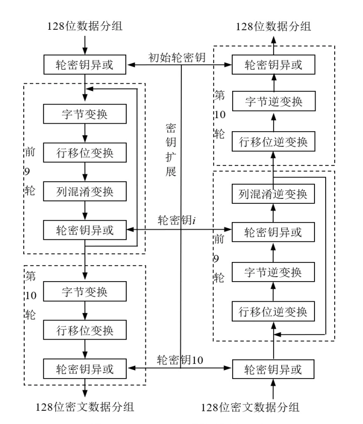

# 密码学基础

- [Back to Course Home](index.md)

## 密码学基本概念

- 发展历程
	1. 早期：密码的系统性应用始于**军事**领域，经历了手写文字通信密码、电报通信密码两个阶段。
	2. 现代转型：20 世纪 50 年代后**与计算机紧密结合**；20 世纪 70 年代随着网络和数字化技术发展，进入**基于数字化信息和网络通信的密码学**阶段。
	3. 关键里程碑：
		- 1977 年，数据加密标准（**DES**）公布，推动商用数据加密发展。
		- 1995 年，NIST 公布高级加密标准（**AES**）。
		- 20 世纪 90 年代，**公钥密码成为发展新方向**，满足网络保密通信、数据交换、电子签名等需求。
	4. 现状：研究与应用渗透到几乎所有社会活动领域，新主题不断涌现。
- 现代密码学内容
	- 传统密码学：保密通信
	- 现代密码学：**保证数据的保密性、完整性、不可否认性和可认证性**。
		- 涵盖**数据加密、密码分析、数字签名、身份认证、秘密分享**等，覆盖数据处理全环节。
	- 新兴方向：量子密码、DNA 密码、抗量子计算密码、混沌密码等。
- 密码体制基本组成
	1. 明文（$M$/Message, $P$/Plain Text）：可直接读懂的原始消息，是待加密的对象。
	2. 密文（$C$/Cypher Text）：明文经加密变换后形成的隐蔽信息，通常无法直接理解。
	3. 加密（$E$/Encryption）：将明文转换为密文的过程。
	4. 解密（$D$/Decryption）：将密文还原为明文的过程。
	5. 密钥（$K$/Key）：加密和解密过程的控制参数，分为加密密钥（$K_e$）和解密密钥（$K_d$），不同密钥值会导致加解密结果不同。
- 密码体制分类
	1. 对称密码体制（单钥/私钥密码体制）
		- 加密密钥与解密密钥相同或实质上等价（$K = K_e = K_d$），由一个可轻易推出另一个。
	2. 非对称密码体制（公钥/双密钥密码体制）
		- 加密密钥与解密密钥不同（$K_e \neq K_d$），且计算上无法由 $K_e$ 推出 $K_d$，公钥可公开而不影响私钥安全。

## 对称密码算法

- 分类及特点
	- **分组密码**（块密码，Block Cipher）
		- 核心原理：将明文分成多个等长数据块（分组），对每个块用相同密钥和处理过程进行加解密，通常通过混淆和扩散功能部件的多次迭代实现。
		- 优势：无需产生长密钥，适应能力强。
		- 适用场景：大数据量加密。
		- 典型示例：DES（64 位分组）、AES（128 位分组）。
	- **序列密码**（流密码，Stream Cipher）
		- 核心原理：将明文的每个字符或位逐个与密钥的对应分量进行加解密计算。
		- 主要任务：快速生成与明文长度相同的“密钥流”。
		- 安全基础：密钥序列的随机性和不可预测性。
		- 优势：实时性好。
		- 适用场景：电话、视频通信等实时性要求高的场景。
		- 典型示例：RC 系列算法。
	- 消息认证码
	- 哈希函数
	- 认证加密算法
- 高级加密标准（AES）
	- 基本概况：2001 年 NIST 采纳 Rijndael 算法作为 AES，集安全性、效率、可实现性及灵活性于一体，是目前最流行的对称加密算法之一。
	- 核心参数：
		- 分组长度：固定为 128 位。
		- 密钥长度：可变，支持 128 位、192 位、256 位，对应算法分别为 AES-128、AES-192、AES-256。
		- 设计思想：多轮替换-置换迭代型算法，替换提供混乱性，置换提供扩散性。
	- 算法流程：
		

	- 算法评价：
		- **安全性好**：整体安全，主要威胁为旁路攻击（不直接攻击加密系统，而是通过搜集和分析密码系统运行设备的计时信息、电能消耗等间接获取线索）。
		- **适用性好**：对内存需求低，适合计算资源或存储资源受限的环境。

## 公钥密码算法

- 公钥密码体制
	- 起源：1976 年 Diffie 和 Hellman 发表《New Direction in Cryptography》，提出 Diffie-Hellman 密钥交换协议，开创公钥密码学，二人于 2016 年获图灵奖。
	- 核心流程：
		- 接收方 B 生成公钥（$PK_B$）和私钥（$SK_B$），公钥公开（如存入密钥分发中心），私钥自行保存
		- 发送方 A 获取 B 的公钥，用其加密明文 $M$ 得到密文 $C=E_{PK_B}(M)$
		- B 接收密文后，用私钥解密 $C=D_{SK_B}(C)$，还原得到明文 $M$。
	- **核心特点**：
		- 密钥对易计算生成。
		- 公钥加密、私钥解密在计算上可行。
		- 由公钥推私钥、由密文和公钥恢复明文在计算上不可行。
- RSA 公钥密码算法
	- 概况：目前应用最广泛的公钥算法之一，首个可同时用于加密和数字签名的算法，易于理解和操作，经多年攻击考验，安全性被广泛认可。
	- 算法步骤：
		- 密钥生成：
			1. 随机生成两个大素数 $p$ 和 $q$（保密），计算 $n=pq$（公开）
			2. 计算欧拉函数 $\varphi(n)=(p-1)(q-1)$（保密）
			3. 生成加密密钥 $e$：满足 $1<e<\varphi(n)$ 且  $\gcd(e,\varphi(n))=1$（公开）
			4. 计算解密密钥 $d$：满足 $de \equiv 1 \bmod \varphi(n)$（保密）。
			5. 销毁 $p$、$q$、$\varphi(n)$，公开公钥 $\{e,n\}$，保管私钥 $\{d,n\}$。
		- 加解密过程：
			1. 明文处理：将明文数字化，取长度小于 $\log_2 n$ 位的数字作为明文块。
			2. 加密：$C=E(M) \equiv M^e \bmod n$。
			3. 解密：$M=D(C) \equiv C^d \bmod n$。
	- 安全性：
		- 安全基础：基于群 $\mathbb{Z}_n$ 中大整数因子分解的困难性，破解 RSA 的核心难度等同于分解 $n$（即由 $n$ 找到 $p$ 和 $q$）。
		- 特性：密文统计独立且分布均匀，无法通过已知明文-密文对破解后续密文。
		- 潜在威胁：量子计算机的研制和应用可能突破其安全性。

## 密钥管理

- 重要性：密码技术依赖密钥，密钥的安全管理是密码应用的关键环节。
- **核心任务**：
	- 在不安全环境中安全、正确、有效地分发密钥。
	- 全生命周期管理：涵盖密钥的产生、分配、使用、存储、备份/恢复、更新、撤销和销毁，遵循安全策略。
- 对称密码体制的密钥传递：通过混合密码系统解决不安全环境下的密钥传递问题。
- 公钥密码体制的公钥管理
	- 核心问题：
		- 如何分发和获取用户公钥。
		- 如何建立和维护用户与公钥的对应关系，鉴别公钥真实性。
		- 通信争议的仲裁。
		- 签名与加密的顺序问题：**先签名后加密易遭重放攻击**，**先加密后签名易遭中间人攻击**。
	- 解决方案：**公钥基础设施**（Public Key Infrastructure，PKI）
		- 定义：基于公钥密码理论技术的综合安全平台，由权威第三方机构集中管理用户公私钥。
		- 功能：为所有网络应用透明地提供加密和数字签名等密码服务所必需的密钥和证书管理。
		- 目的：在不安全的网络中保证通信信息的安全、真实、完整和不可否认

## 密码学最新进展
### 量子密码

- 核心思想：
	- 并非加密消息的算法，而是**利用量子力学原理实现绝对安全的密钥分发**技术。
	- 解决：**如何让通信双方共享一个绝对保密的随机密钥，并确保密钥在分发过程中没有被窃听**。
	- 最著名和应用最广泛的量子密码技术：**量子密钥分发**（quantum key distribution，QKD）
		- 核心价值：解决密钥分发过程中的窃听检测问题，建立数学上无法破解的安全通信链路。
- 基本原理：安全性基于物理定律，而非数学计算复杂度。
	- **测不准原理**：测量行为会干扰被测量系统，窃听量子信号（如单个光子）会引入可检测的异常和错误。
	- **不可克隆定理**：无法创建未知量子态的完全复制品，窃听者无法悄悄复制量子密钥并转发，而不留下任何痕迹。
- 工作流程：
	- Alice（发送方）想和 Bob（接收方）共享一个密钥
	- **量子传输**：
		- Alice 随机生成比特串，随机选择两种不同编码方式（如不同的光子偏振滤镜）通过单个光子发送给 Bob
		- Bob 随机选择一种解码方式测量
	- **基矢比对**：
		- 双方通过公开经典信道确认编码/解码方式，但不透露比特值本身
		- 只保留使用相同方式的比特位，形成原始密钥
	- **窃听检测**：
		- 双方随机抽取部分原始密钥公开比对
		- 错误率为零或非常低则信道安全，错误率异常高则丢弃密钥重新开始（由测不准原理，错误率高则存在 Eve 测量和监听）
	- **隐私增强与认证**：
		- 确认信道安全后，通过纠错、隐私放大处理，生成完全一致、绝对保密的共享密钥，用于后续对称加密。
- 优势：
	- **信息理论安全**：物理定律保证，抗量子计算机破解
	- **可探测性**：可实时检测窃听，独特优势
- 现状与挑战：
	- **已商业化**：多国建立城域量子保密通信网络；
	- **存在距离限制**：光子存在高损耗，地面光纤传输约一二百公里，可通过量子中继器、卫星扩展；
	- **并非万能**：只解决密钥分发问题，需与经典密码算法结合，依赖认证的经典信道防中间人攻击。

### 云计算与同态加密

- 核心问题：云服务中如何**在密文不解密的情况下对数据进行操作**，保障数据安全和隐私。
	- 同态加密提供了一种对加密数据进行处理的功能。
- 技术原理：基于数学难题的计算复杂性理论，同态加密方案下，对明文运算后加密与加密后对密文进行相应运算的结果等价。
- 应用价值：为云计算数据安全和隐私保护提供解决方案，用户可将加密数据上传至云端，云端直接对密文执行运算，用户对解密，即可获得正确结果。

### 区块链

- 定义：
	- 狭义：**按时间顺序将数据区块顺序相连形成的链式数据结构**，通过密码学保证数据不易篡改伪造，分布式存储的共享账本。
	- 广义：利用块链式共享账本验证存储数据、P2P 分布式节点共识算法生成更新数据、密码学保障传输访问安全、智能合约编程操作数据的分布式计算可信网络或计算公正网络。
- 安全特性：
	- 区块链通过分布式数据库系统和参与者共识协议，保护数据完整性。
	- 区块链时间戳功能使所有信息留下痕迹，便于查询。
	- 区块链的**可信任性、安全性和不可篡改性**，正使得更多数据信息被释放出来。
- 发展趋势：“区块链+”已成为现实，在多个领域拓展应用。