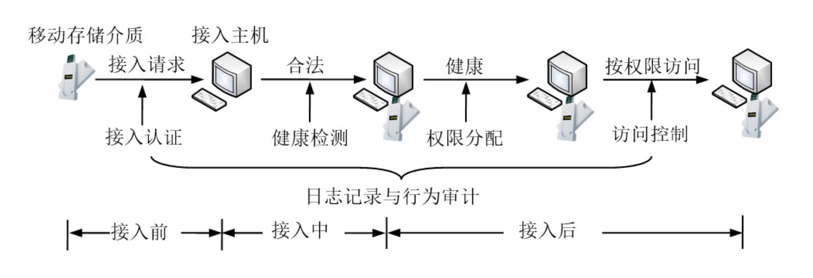

# 硬件安全

- [Back to Course Home](index.md)

## 计算机信息系统物理安全问题
### 环境事故造成的设备故障或损毁

1. **自然灾害**：地震、洪水、火灾、雷击等自然灾害会对计算机设备造成严重损坏，影响信息系统的可用性和完整性。

2. **温度异常**：根据 GB/T 50174-2017《数据中心设计规范》，数据中心主机房温度建议值为 18℃~27℃。

3. **湿度异常**：根据 GB/T 50174-2017《数据中心设计规范》，数据中心主机房相对湿度保持在 40%~60% 较为适宜。

4. **灰尘影响**：空气中的灰尘会附着在磁盘等精密机械装置表面，高速旋转时可能擦伤盘片或磨损读头，造成数据读写错误或丢失。

5. **电磁干扰**：主要包括 **静电干扰** 和 **强电磁场干扰**。会破坏信息完整性，甚至损坏设备。

	- 静电电压过高会破坏 MOS 器件；

	- 无线电发射装置、微波线路、高压线路、大型电机等会产生强电磁场。

6. **停电故障**：电子设备依赖电力运行，停电会导致设备停止工作，破坏信息系统的可用性。

7. **意外损坏**：设备跌落、落水等意外情况是常见的环境事故，会直接造成硬件损坏。

### 设备普遍缺乏硬件级安全防护

1. **硬件设备被盗被毁**：随着半导体集成技术发展，PC 向微型化、移动化发展，这一特性在带来便捷的同时，也增加了设备被盗、被毁的风险。

2. **开机密码保护被绕过**：攻击者可将 PC 硬盘挂载到其他机器，或制作 WinPE U 盘启动盘，绕过系统开机密码读取硬盘内容。

3. **磁盘信息被窃取**：硬盘易被盗，且存储文件缺乏有效保护；文件删除仅在目录中做标记，数据未真正删除，磁介质表面残留的磁信息可能导致信息泄漏。

4. **内存信息被窃取**：内存条无任何防护措施，一旦被攻击者接触或获取，其中存储的信息将失去保护。

### 硬件中的恶意代码
> 芯片是各种系统的核心，遭遇攻击后果灾难性；现代集成电路复杂，发现漏洞和恶意代码难度大，硬件攻击危害远胜于软件恶意代码。
> 人们现在面临的问题不是硬件攻击是否会发生，而是 **攻击将采用何种方式，攻击步骤是什么**。而最重要的问题或许是，**如何检测并阻止这类攻击或者至少降低攻击带来的损失**。

1. **CPU 中的恶意代码**：CPU 可能存在漏洞、后门或恶意代码。

2. **存储设备中的恶意代码**：硬盘、U 盘等存储设备可能遭受恶意代码攻击。如 BadUSB 通过篡改 USB 设备固件，使其连接电脑时被识别为键盘等设备，自动执行恶意操作，绕过传统安全软件检测。

### 旁路攻击
> 旁路攻击指攻击者通过分析硬件设备的非预期泄露信息（如声音、电磁波、温度等）获取敏感数据的攻击方式。

1. **针对键盘的旁路攻击**：通过硬件型键盘记录器、视频监控、按键手姿、声音、振动、温度等方式获取输入内容。

2. **针对显示器的旁路攻击**：通过接收显示器直接发出的光线、墙面反射光或眼球反光，还原屏幕显示信息。

3. **针对打印机的旁路攻击**：根据针式打印机的工作噪声复原打印内容；利用无人机截取无线打印机信号窃取信息。

4. **电磁泄漏**：计算机工作时会产生电磁辐射，可能泄漏保密信息，高端设备可通过电磁泄漏信号还原显示器内容。

### 设备在线面临的威胁
信息物理系统（Cyber Physical System, CPS）是计算、通信、控制系统深度融合的开放系统，广泛应用于工业控制、智能交通、智能电网等领域。由于信息物理系统需要在线互联，安全问题日益凸显。

## 物理安全防护
### 数据中心物理安全防护

1. **遵循国家标准**：涵盖规划设计、施工验收、运行维护等全阶段，主要标准包括：

	- GB 50174-2017《数据中心设计规范》/《规范》

	- GB/T 22239-2019《信息安全技术 信息系统安全等级保护基本要求》/《等保》

	- GB 50462-2015《数据中心基础设施施工及验收规范》

	- GB/T 2887-2011《计算机场地通用规范》

	- GB/T 9361-2011《计算机场地安全要求》

	- GB/T 21052-2007《信息系统物理安全技术要求》

2. **分级安全保护**：

	- 根据各行业对信息系统数据中心的使用性质、数据丢失或网络中断在经济或社会上造成的损失或影响程度的不同，《规范》将数据中心分为 A、B、C 三级，并对数据中心的分级与性能、选址及设备布置、环境、建筑与结构、空气调节、电气、电磁屏蔽、网络与布线系统、智能化系统、给水排水以及消防等做出了分级要求。

		- **A 级**：运行中断会造成重大经济损失，会造成公共场所秩序严重混乱

		- **B 级**：运行中断会造成较大经济损失，会造成公共场所秩序混乱

		- **C 级**：其他情况

	- 《等保》等相关管理文件将等级保护对象的安全保护等级分为 5 级，根据不同级别对物理访问控制、防盗窃和防破坏、防雷击、防火、防水和防潮、温湿度控制以及电力供应做出了具体要求。

3. **电磁安全防护**：

	- 针对电磁泄漏，即无意识的电磁发射信号携带信息的问题（TEMPEST 相关问题）

		- 设备隔离与合理布局

		- 使用低辐射设备

		- 电磁屏蔽

		- 使用干扰器

		- 滤波技术

		- 光纤传输

	- 关注移动通信网络、无线网络等有意识电磁发射带来的安全问题

### PC 物理安全防护

1. **PC 防盗措施**：

	- 机箱锁扣：直接固定机箱，防止非法开启。

	- 防盗线缆：通过 Kensington 锁孔连接设备与固定物体。

	- 机箱电磁锁：安装在机箱内部，通过 BIOS 密码管理开关。

	- 智能网络传感设备：机箱盖被打开时，自动记录事件到 BIOS 或通过网络上报。

	- 其他：安装机箱防护罩、防盗软件等。

2. **PC 访问控制技术**：

	- 对象：**软件与数据资源**

	- 核心：**保护磁盘上的数据不被非法访问**

	- **PC 访问控制系统应当具备的主要功能**：

		- 防止不通过访问控制系统而进入计算机系统

		- 控制用户对存放敏感数据的存储区域的访问

		- 控制用户的所有 I/O 操作

		- 防止用户绕过访问控制系统直接访问可移动介质

		- 防止用户通过程序对文件的直接访问或通过网络的访问

		- 防止用户对审计日志的恶意修改。

	- 常见硬件结合实现的技术：

		- **软件狗**（加密狗/加密锁）：

			- 软件运行前将其插入 PC 端口，运行过程中软件会向端口发送询问信号，如果软件狗给出响应信号，则说明该软件是合法的

		- **安全芯片**：

			- 在计算机中安装的一个封装了密钥的专门的安全芯片

			- 核心：TPM（**可信平台模块**）

				- **可信计算平台的信任根**

				- TCG（可信计算组织）定义：TPM 本质上是一个拥有丰富计算资源和密码资源的以安全功能为主要特色的小型计算机系统。

				- 具备密钥管理、加密解密、数字签名、安全存储等功能，在此基础上完成其作为可信存储根和可信报告根的职能。

				- 核心功能：对 CPU 处理的数据流进行加密，同时监测系统底层的状态。

			- 通过可信计算软件栈（TSS）与 TPM 的结合来构建跨平台与软硬件系统的可信计算体系结构。

			- TPM 是可信计算平台的信任根

				- 中国的可信计算机必须采用中国的信任根芯片，中国的信任根芯片必须采用中国的密码。

				- 使用按照我国密码算法自主研制的、具有完全自主知识产权的 **可信密码模块 TCM**（TrustedCryptography Module）芯片

### 移动存储介质安全防护
| 主要安全威胁 | 常用安全防护措施 |
| ----------- | --------------- |
| 设备质量低劣导致损坏 | 检测设备质量 |
| 感染传播恶意代码 | 安装病毒防护软件 |
| 设备丢失/被盗/滥用引发敏感数据泄露、操作痕迹泄露 | 认证加密、访问控制、强力擦除/文件粉碎等 |

- 综合安全管理
	