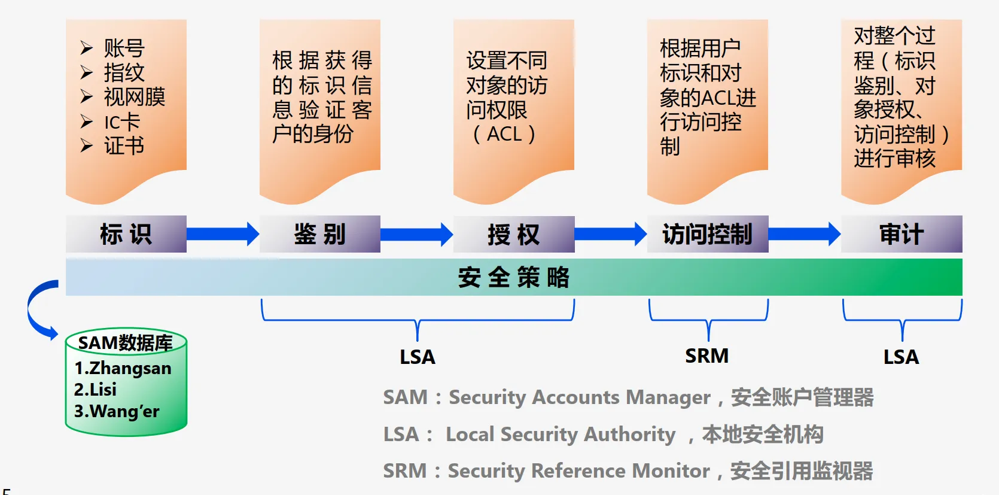
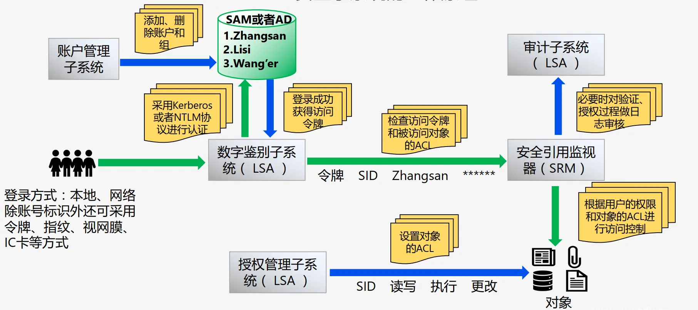

# Windows 操作系统安全

- [Back to Course Home](index.md)

## Windows 系统概述
### 基本介绍

- Microsoft Windows 是美国微软公司以图形用户界面为基础研发的操作系统，是全球应用最广泛的操作系统之一。
- 1983 年启动研发，最初目标是在 MS-DOS 基础上提供多任务图形用户界面，后续逐步发展为面向个人电脑和服务器的操作系统。
- 系统类型：
	- 普通版本：已更新至 Windows 11。
	- 服务器版本：Windows Server，最新为 Windows Server 2022。
	- 手机版本：Windows Phone，已终止研发，最后版本为 Windows 10 Mobile。
	- 嵌入式版本：原 Windows CE，后被 Windows for IoT 取代。
	- 线上 Web 服务：Windows 365。

### Windows NT

- 微软公司第一个真正意义上的网络操作系统
- 特点：
	- 支持多种网络协议：兼容 TCP/IP、IPX/SPX 等，适配不同客户。
	- 内置 Internet 功能：集成 IIS（Internet Information Server），便于配置 WWW 和 FTP 服务。
	- 支持 NTFS 文件系统：同时兼容 FAT 和 NTFS 分区格式，NTFS 提高文件管理的安全性，用户可设置文件和目录权限，提升多用户访问安全性。

### 系统架构

- 运行模式划分：基于 CPU 运行状态分为用户模式（ring 3，非特权模式）和内核模式（ring 0，特权模式）。
	- **用户模式**：运行应用程序的模式，应用程序可以访问部分系统资源，无法直接访问内核模式或底层硬件。
		- 用户进程：用户应用程序相关，无法直接调用原生的 Windows 操作系统服务，通过一个或多个子系统动态链接库（DLL）调用
		- 服务进程：Windows 服务相关，如任务计划（Task Scheduler）和打印后台处理（Print Spooler）服务
		- 系统支持进程：静态或硬编码的进程，如非 Windows 服务的登录进程和会话管理器
		- 环境子系统服务进程：实现操作系统环境支持部分的进程。环境是指呈现给用户和程序员的、操作系统中可进行个性化的部分
	- **内核模式**：可执行所有程序和特权指令，可以访问任何虚地址和控制虚拟内存硬件。
		- 执行体：包含操作系统的基础服务，例如内存管理、进程和线程管理、安全性、I/O、网络以及进程之间通信
		- Windows 内核：包含底层操作系统函数，例如线程调度、中断和异常分发、多处理器同步。还提供了一系列的例程和基本对象，执行体的其他部分会使用它们实现更高层次的功能
		- 设备驱动程序：包括将用户 I/O 函数调用转换为特定硬件设备 I/O 请求的硬件设备驱动程序，以及诸如文件系统和网络驱动程序等非硬件设备驱动程序
		- 硬件抽象层（HAL，hardware abstraction layer）：位于操作系统内核与硬件电路之间的接口层，其目的在于将硬件抽象化
		- 窗口和图形系统：用于实现用户界面（GUI）功能，例如处理窗口、用户界面控件以及进行绘制
		- 虚拟机监控程序层：只包含虚拟机监控程序本身，可以将计算资源（如处理能力、内存和存储）汇集起来，并在虚拟机（VM）之间重新分配这些资源

## Windows 系统安全组件
### 核心安全元素

- Windows 系统内置 6 大安全元素：
	- 安全策略（Security Policy）
	- 用户认证（User Authentication）
	- 访问控制（Access Control）
	- 加密（Encryption）
	- 审计（Audit）
	- 管理（Administration）

### 关键安全组件详情

- 标识
	- **安全账户管理器**（Security Accounts Manager，SAM）：维护 SAM 数据库，管理本机用户名、组、密码及其他属性信息。
	- **SAM 数据库**：存储于注册表 `HKEY_LOCAL_MACHINE\SAM` 键（受 ACL 保护），磁盘路径为 `%systemroot%\system32\config\sam`；系统启动后锁定，仅听从 LSASS 调度，用户无法擅自更改。
- 鉴别
	- **交互式登录管理器**（Interactive Logon Manager，Winlogon）：管理交互式登录会话，用户登录时创建首个进程。
	- **登录用户界面**（Logon User Interface，LogonUI）：提供身份验证用户界面，通过凭据提供程序查询用户凭据。
	- **凭据提供程序**（Credential Provider，CP）：运行于 LogonUI 进程的 COM 对象，用于获取用户名、密码、生物验证数据等。
	- **身份验证包**（Authentication Package，AP）：校验用户名与密码（或其他凭证）的匹配性，完成用户身份验证。
- 授权和审计
	- **本地安全机构子系统服务**（Local Security Authority Subsystem Service，LSASS）：负责本地系统安全策略（登录权限、密码策略等）、用户身份验证、发送安全审核信息至事件日志。
	- **LSASS 策略数据库**：存储本地系统安全策略设置，位于注册表 `HKLM\SECURITY` 键（受 ACL 保护）。
	- **内核安全设备驱动程序**（Kernel Security Device Driver，KSecDD）：运行于内核模式（路径 `%SystemRoot%\System32\Drivers\Ksecdd.sys`），实现高级本地过程调用接口，供加密文件系统 EFS 等组件在用户模式下与 LSASS 通信。
- 访问控制
	- **安全引用监视器**（Security Reference Monitor，SRM）：定义访问令牌数据结构，执行安全访问检查、特权检查，生成安全审核信息。
	- **APPLocker**：管理员控制用户和组可使用的可执行文件、DLL 及脚本，包含驱动程序 `%SystemRoot%\System32\Drivers\AppId.sys` 和服务 `%SystemRoot%\System32\AppIdSvc.dll`。
	- **APPContainer**：提供限制性进程执行环境（容器），应用及其子进程仅能访问授权资源。

## Windows 系统安全模型
### 安全子系统工作原理

1. 账户管理子系统（LSA）添加、删除账户和组，信息存储于 SAM 或 AD。
2. 数字鉴别子系统（LSA）采用 Kerberos 或 NTLM 协议认证用户身份，登录成功后生成访问令牌。
3. 授权管理子系统（LSA）设置对象的 ACL（访问控制列表）。
4. 安全引用监视器（SRM）检查访问令牌与被访问对象的 ACL，执行访问控制。
5. 审计子系统（LSA）对验证、授权过程进行日志审核（必要时）。

### 访问控制核心机制

- **访问令牌**（Access Token）：包含有关已登录用户的信息
	- 生成过程：用户通过凭据认证 $\to$ 系统创建登录会话并返回 SID $\to$ LSA 创建访问令牌 $\to$ 依据令牌创建进程/线程（使用指定令牌或继承父进程令牌），代表此用户执行的每一个进程都将具有此访问令牌的副本
	- 核心内容：包含用户及所属组的安全标识符（SID）、权限列表，用于标识用户身份及访问权限。
- **安全描述符**（Security Descriptor，SD）：**与被访问对象相关联**，包含与该对象关联的安全信息。
	- 创建对象时分配，可通过函数检索和设置
	- 组成：
		- 对象所有者 SID
		- 对象所有者属组 SID
		- **DACL**（Discretionary Access Control List，自主访问控制列表）：描述允许/拒绝特定用户/组的某些访问权限，包含零个/多个访问控制项（ACE，Access Control Entry）
		- **SACL**（System Access Control List，系统访问控制列表）：主要用于系统审计，指定了当特定账户对这个对象执行特定操作时记录系统日志
- **访问控制项**（ACE）：ACL 的基本元素，控制或监视特定受托者对对象的访问，用于指定特定用户/组的访问权限。
	- 一个 ACL 可以包含零个或多个 ACE
	- 组成：
		- **安全标识符**（SID）：标识适用访问者
		- **访问掩码**（Access Mask）：指定了具体的访问权限（Access Rights），即对该对象执行的操作
		- **类型标志**：拒绝/允许
		- **继承标志**：子对象是否继承该 ACE
- **访问控制列表**（ACL）：表示用户（组）权限的列表

	| 类型 | 功能 | 关键规则 |
	| --- | --- | --- |
	| 自主访问控制列表（DACL） | 允许或拒绝访问安全对象 | 权限为所有 ACE 累加；无 DACL 则所有用户获完整访问权；空 DACL 则禁止所有用户访问 |
	| 系统访问控制列表（SACL） | 记录特定访问请求 | 匹配访问请求与 ACE 时，记录访问结果（允许/拒绝） |

- **访问控制流程**：系统依次检查对象 DACL 中的 ACE，优先执行拒绝访问 ACE；找到匹配且满足所有请求权限的 ACE 则允许访问，若出现拒绝 ACE 或遍历完无匹配 ACE 则拒绝访问。

## Windows 系统安全管理

- 加强用户账户认证
	- 路径：本地安全策略 $\to$ 账户策略 $\to$ 密码策略/账户锁定策略。
		- 密码策略：开启“密码必须符合复杂性要求”，设置“密码长度最小值” $\geq 8$ 位。
		- 账户锁定策略：设置“账户锁定阈值”（无效登录次数上限）和“账户锁定时间”（锁定时长），防止暴力破解。
- 系统备份
	- 路径：控制面板 $\to$ 备份和还原。
	- 备份时机：系统功能正常、安装常用软件、无病毒/木马时。
	- 应对病毒、黑客攻击导致的系统故障，避免数据丢失或破坏。
- 设备加密（BitLocker）
	- 路径：控制面板 $\to$ 系统和安全 $\to$ BitLocker 驱动器加密。
	- 支持系统驱动器、固定数据驱动器及 U 盘等可移动存储设备，防止设备丢失导致隐私泄露。
- 开启 Windows Defender 防火墙
	- 位于网络边界，通过规则过滤不符合安全策略的数据，防御外部攻击。
	- 关键设置：配置“入站规则”“出站规则”“连接安全规则”，通过“监视”功能监控网络流量；默认策略为阻止不匹配入站连接、允许不匹配出站连接。