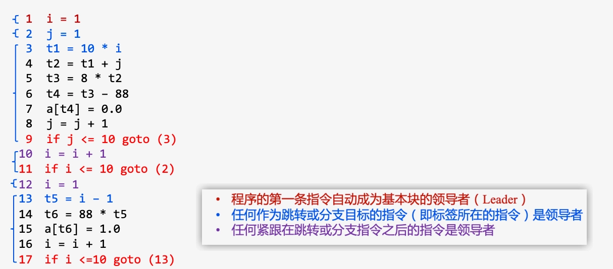
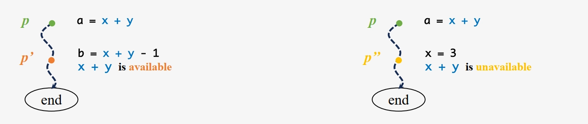
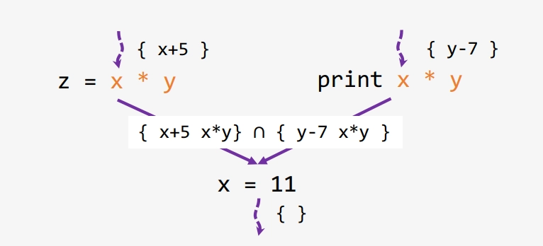

# 数据流分析

- [Back to Course Home](index.md)

## 静态分析背景

- 程序相关核心问题
	- 程序是否在所有输入下终止？
	- 堆内存最大使用量是多少？
	- 敏感信息是否泄露/被篡改？
	- 是否存在缓冲区溢出、SQL 注入、XSS 等漏洞？
	- 是否存在数据竞争？
- 静态分析的价值
	1. 提高效率：优化资源利用率、支持编译器优化
	2. 确保正确性：验证程序行为、及早发现错误
	3. 辅助开发：支持程序理解与重构
- 静态分析与测试的区别
	- 测试（动态分析）成本高（占开发成本 50%），并发/分布式系统中"海森堡缺陷"难以复现
	- 静态分析：对程序进行推理的程序，无需执行即可分析程序属性
- 完美程序分析器的三大特性
	- **可靠性**（SOUNDNESS）：不遗漏任何错误
		- 可靠性 - 真实情况 = 误报（False Positive）
		- 过度近似
	- **完备性**（COMPLETENESS）：不产生误报
		- 真实情况 - 完备性 = 漏报（False Negative）
		- 不足近似
		- 在安全应用中，**漏报**通常不可接受
	- **终止性**（TERMINATION）：始终给出分析结果
		- 工程实现关键要求
- 静态分析漏洞发现示例（指针相关错误）：以下 C 代码经 `gcc -Wall` 和 `lint` 检测无报错，但存在多重安全漏洞：
	```c
	int main() {
		char *p, *q;
		p = NULL;
		printf("%s", p);		  // 1. 空指针解引用：NULL指针传递给'%s'格式符，导致程序崩溃
		q = (char *)malloc(100);
		p = q;
		free(q);
		*p = 'x';				 // 2. 释放后使用：向已释放内存写入数据，未定义行为
		free(p);				  // 3. 双重释放：重复释放同一内存，破坏堆结构
		p = (char *)malloc(100);
		p = (char *)malloc(100);  // 4. 内存泄漏：第一块分配内存地址丢失，无法释放
		q = p;
		strcat(p, q);			 // 5. 错误字符串操作：p和q指向同一块未初始化内存，无'\0'结尾
	}
	```

## 基本概念

- **数据流**（Data Flow）
	- 程序中一个**变量**在**定义（赋值）点**与**使用（引用）点**之间的**传递路径与值变化状态**
	- 描述数据的传递与变化
- **数据流图**（Data-Flow Graph, DFG）
	- 节点：变量
	- 有向边："定义-使用"关系（定义点 D 指向使用点 U）
- **控制流**（Control Flow）
	- 程序在执行时，**控制权（即下一步执行哪条指令）是如何传递的**。包括简单的顺序执行和由**跳转、分支、循环和函数调用**等引起的复杂路径
	- 描述程序中语句执行的部分顺序关系
- **控制流图**（Control-Flow Graph, CFG）
	- 节点：单条语句或基本块
	- 有向边：语句/基本块的执行顺序
- **基本块**（Basic Block, BB）
	- 定义：程序中只有一个入口和一个出口的连续指令序列
	- 领导者（Leader）准则：
		- **首指令为领导者准则**：程序的第一条指令自动成为基本块的领导者
		- **跳转目标准则**：任何作为跳转或分支目标的指令（即标签所在的指令）是领导者
		- **跳转后继准则**：任何紧跟在跳转或分支指令之后的指令是领导者
- 基本块划分示例（10×10 矩阵置为单位矩阵）
	

## 数据流分析基础

- 数据流分析（Data-Flow Analysis, DFA）：**静态分析**技术，通过在**控制流图**上模拟数据流动，推断每个**程序点**上程序状态的**保守近似信息**，用于收集程序各点**可能计算的值的集合**信息。
	- 程序点（Program Point）：程序执行流程中位于某条语句之前或之后的特定位置，用于标记程序执行状态的上下文，是数据流分析的基本单位
- 示例：
- 分析维度分类
	1. 按传播方向
		- 正向/前向分析：信息传播与程序执行方向一致（从入口到出口）
		- 反向/后向分析：信息传播与程序执行方向相反（从出口到入口）
	2. 按分析性质
		- **可能性分析**（May Analysis）：输出"可能为真"，过度近似（over-approximation）
		- **必然性分析**（Must Analysis）：输出"必须为真"，不足近似（under-approximation）

## 数据流分析应用
### 活跃变量分析（LVA）

- 活跃变量：程序点 $p$ 上，若变量 $v$ 可能被从 $p$ 出发的某条路径使用，则 $v$ 在 $p$ 处活跃；否则为死亡（失效）。
- 活跃变量分析（Live Variable Analysis, LVA）：一种编译器优化技术，用于判断程序某点的变量值是否会在后续操作中被使用，支撑编译器寄存器分配优化。
	- 传播方向：反向/后向分析（从程序出口向入口传播）
	- 分析性质：可能性分析（May Analysis）
- 示例：
	

- 核心思想：
	- 如果使用了变量值 $v$，则指令/块会使变量 $v$ 活跃
	- 如果定义了变量值 $v$，则指令/块会使变量 $v$ 失效

	

- 数据流方程：
	- $use(n)$：在基本块 $n$ 中被使用但使用前未定义的变量集合
	- $def(n)$：在基本块 $n$ 中被定义的变量集合
	- $I(n) = (O(n) - def(n)) \cup use(n)$：基本块 $n$ 的入口活跃变量集合
	- $O(n) = \bigcup_{s \in succ(n)} I(s)$：基本块 $n$ 的出口活跃变量集合
		- $succ(n)$：基本块 $n$ 的直接后继块集合
		- Meet 操作：数据流方程中的集合并集（Union）操作，当且仅当变量在**任一后继块的入口点活跃**时，其在当前块出口点活跃
			

- 算法
	- 输入：控制流图 $G$
	- 输出：每个基本块 $B$ 的 $I(B)$ 和 $O(B)$

	```
	Algorithm LVA:
		for (each basic block b in G)
			I(b) = {}  // 初始化入口活跃变量集合为空
		while (any I changes)  // 迭代直至收敛
			for (each basic block b in G\exit) {  // 排除出口块
				O(b) = ∪{I(s) | s is a successor of b}
				I(b) = (O(b) - def(b)) ∪ use(b)
			}
	```

- 示例：
	

### 可用表达式分析（AEA）

- 可用表达式：一个表达式 $e$ 在程序点 $p$ 处可用需要满足以下条件：
	1. 从程序入口到 $p$ 的**所有路径都必须**经过 $e$ 的求值
	2. 在 $e$ 的最后一次求值后，不存在使 $e$ 失效的操作
- 可用表达式分析（Available Expression Analysis, AEA）：判断该表达式的值是否已被计算过，识别可重用的表达式结果，避免冗余计算优化。
	- 传播方向：正向/前向分析（从程序入口向出口传播）
	- 分析性质：必然性分析（Must Analysis）
- 示例：
	

- 核心思想：
	- 节点通过生成（计算）当前值使 $e$ 变为可用状态
	- 节点通过消除（使失效）当前值使 $e$ 变为不可用状态

	

- 数据流方程
	- $gen(n)$：在基本块 $n$ 中计算且之后操作数未被重定义的表达式集合
	- $kill(n)$：因基本块 $n$ 中变量重定义而变得不可用的表达式集合
	- $O(n) = (I(n) \cup gen(n)) - kill(n)$：基本块 $n$ 的出口可用表达式集合
	- $I(n) = \bigcap_{p \in pred(n)} O(p)$：基本块 $n$ 的入口可用表达式集合
		- $pred(n)$：基本块 $n$ 的直接前驱块集合
		- Meet 操作：数据流方程中的集合交集（Intersection）操作，当且仅当表达式在**所有前驱块的出口点可用**时，其在当前块入口点可用
			

- 算法
	- 输入：控制流图 $G$
	- 输出：每个基本块 $B$ 的 $I(B)$ 和 $O(B)$

	```
	Algorithm AEA:
		for (each b in G\entry)
			O(b) = {}  // 初始化出口可用表达式集合为空
		while (any O changes)  // 迭代直至收敛
			for (each b in G\entry) { // 排除入口块
				I(b) = ∩{O(p) | p ∈ pred(n)}
				O(b) = (I(b) ∪ gen(b)) - kill(b)
			}
	```

- 示例：
	