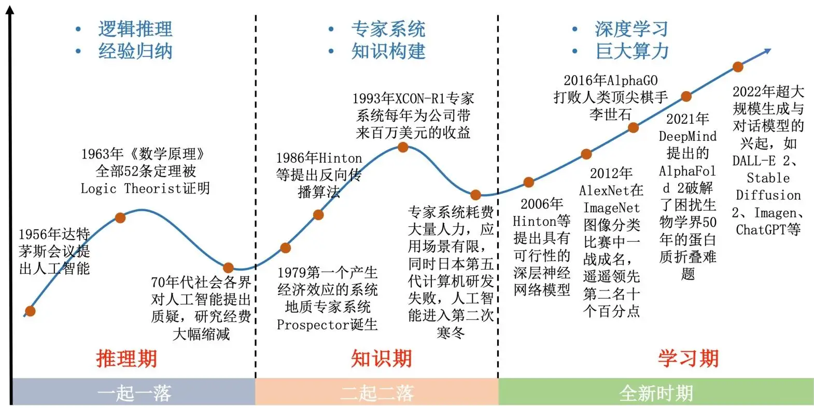
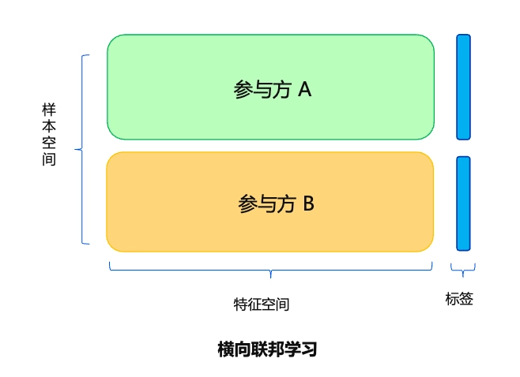
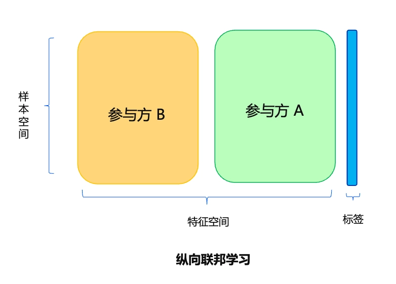
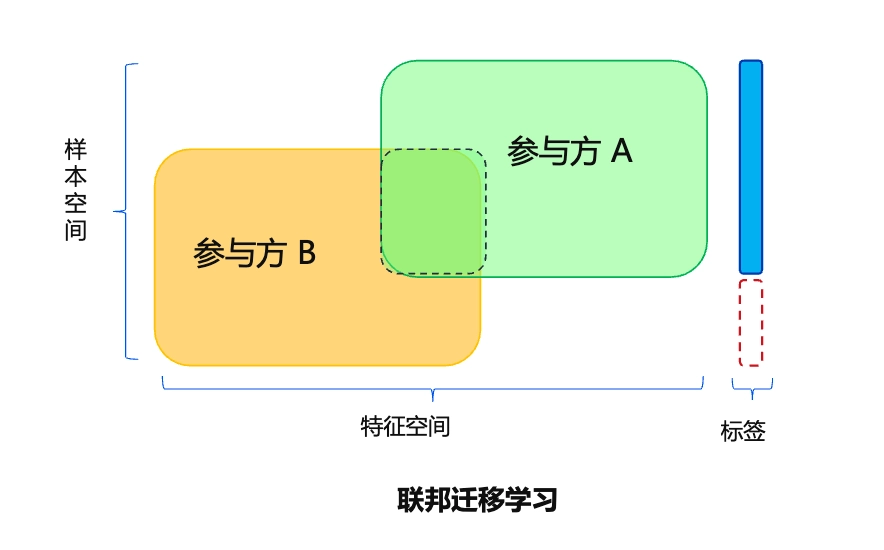
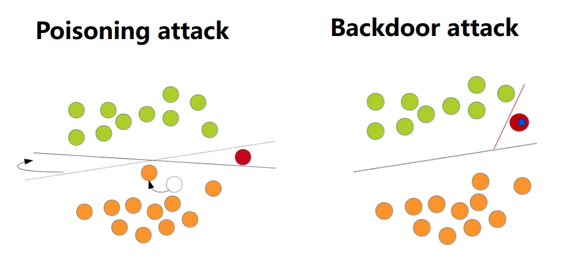
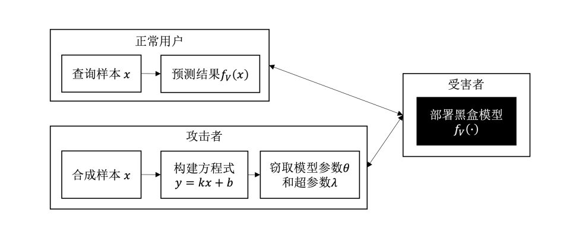
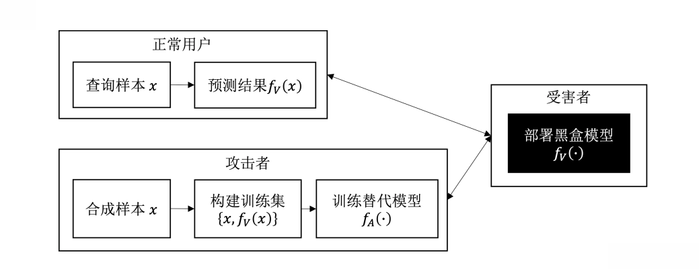

# 人工智能系统安全

- [Back to Course Home](index.md)

## 人工智能与安全概述

- 人工智能定义：利用数字计算机或其控制的机器模拟、延伸和扩展人的智能，感知环境、获取知识并使用知识获得最佳结果的理论、方法、技术和应用系统。
- 人工智能本质：研究如何让机器拥有人类智能的科学技术，模拟人类思考、学习和决策过程。
- 人工智能发展历程
	

- 人工智能安全
	1. **人工智能内生安全**：技术本身脆弱性引发的系统自身安全问题，作用对象为系统本身。
	2. **人工智能衍生安全**：智能模型不安全性给其他领域带来的安全问题，作用对象为智能系统以外的领域。
	3. **人工智能助力安全**：利用人工智能技术提升其他领域安全性（如病毒检测、虚假视频识别），具有正向价值。
- 数据安全：由于训练数据对最终模型的决定性作用，加上数据中所包含的隐私和敏感信息也是攻击者的攻击目标。
	- 数据投毒：通过操纵数据收集或标注过程来污染（毒化）部分训练样本，从而大幅降低最终模型的性能。
	- 数据窃取：从已训练好的模型中逆向工程出训练样本，从而达到窃取原始训练数据的目的。
	- 隐私攻击：利用模型的记忆能力，挖掘模型对特定用户的预测偏好，从而推理出用户的隐私信息。
	- 数据篡改：利用模型的特征学习和数据生成能力，对已有数据进行篡改或者合成全新的虚假数据。
- 模型安全：
	- 对抗攻击：在测试阶段向测试样本中添加对抗噪声，让模型作出错误预测结果，从而破坏模型在实际应用中的性能。
	- 后门攻击：以数据投毒或者修改训练算法的方式，向模型中安插精心设计的后门触发器，从而在测试阶段操纵模型的预测结果。
	- 模型窃取：通过与目标模型交互的方式，训练一个窃取模型来模拟目标模型的结构、功能和性能。

## 机器学习
### 基础概念

- 机器学习通常指模型从有限的训练样本中利用学习算法自动寻找规律和知识，进而在未知数据上进行决策的过程
	- 根据特定的学习任务设计数学模型（主体），确定从输入到输出的具体映射形式
	- 定义目标函数衡量拟合程度
	- 设计优化策略在训练集上对模型进行迭代更新直到达到目标函数最优值
	- 在验证集上检验模型的泛化能力并挑选最优的模型参数
	- 最终在测试集上进行模型评估
- **机器学习的过程是模型参数优化的过程**
	- **损失函数**：定义了模型的预测错误，即模型的输出 $f(x)$ 与真实标签 $y$ 之间的不一致性，损失函数值越小，一致性越高，模型拟合越好
	- **优化策略**：模型参数的优化过程也就是模型训练的过程，模型在拟合训练数据的过程中不断更新参数直到达到最优目标。
		- 基于梯度的一阶优化方法：SGD、AdaGrad、AdaDelta、 Adam、RMSProp 等
		- 零阶（黑盒）优化方法：网格搜索、随机搜索、遗传算法、进化策略等
		- 二阶优化方法：牛顿法、拟牛顿法（如 BFGS、L-BFGS）等
- **机器学习的目标是训练具有泛化能力的模型**
	- **训练集** 是为了某个机器学习任务而收集的数据，代表过去的经验
	- **验证集** 是我们在训练过程中选择最优模型的评判依据，代表我们认为的任务环境
	- **测试集** 是模型在部署后接收到的“未知样本”，代表真实的任务环境

### 学习范式
#### 有监督学习

- 定义：利用带标签的训练数据集训练模型，学习输入与输出之间的映射关系，从而对未知数据进行预测。
- 输入：带标签的训练数据集 $D=\{(x_i,y_i)\}_{i=1}^N$
- 输出：输入空间到输出空间的映射函数 $f: X \rightarrow Y$
- 训练过程：$\min_{\theta} E_{(x,y)\in D} L(f(x),y)$
- 常见任务：
	- **分类问题**：输出为离散类别标签，每个离散值是一个“类别”。
		- 模型：随机森林、支持向量机、深度神经网络等
	- **回归问题**：输出为连续数值，等价于拟合一个从输入变量映射到输出变量的函数。
		- 模型：线性回归模型、逻辑回归模型、深度神经网络等

#### 无监督学习

- 定义：利用无标签的训练数据集训练模型，学习数据的内在结构和分布特征，从而对未知数据进行分析和理解。
- 输入：无标签的训练数据集 $D=\{x_i\}_{i=1}^N$
- 输出：数据的内在结构和分布特征，如聚类结果、降维表示等
- 训练过程：设计算法 $A$，作用于样本集合 $X$ 得到函数（模型）$f$，所得到的模型将最终作用于数据本身 $X^*(X \subseteq X^*)$ 得到某种分析结果
- 常见任务：
	- **聚类分析**（clustering）
		- 目的是将空间中的数据点按照某种方式聚为对应不同概念的簇（cluster）。簇内距离和簇间距离是衡量聚类方法性能好坏的核心标准，这需要由一个距离度量来定义。
		- 经典的聚类算法包括 k-means、DBSCAN 等
	- **特征降维**（dimensionality reduction）
		- 目的是将高维数据映射到低维空间，用更少维度的特征来替代原始高维度特征，同时最大限度的保留高维特征所包含的信息，从而达到降低时间复杂度、提高数据分析效率、防止模型过拟合的目的。
		- 经典的降维方法包括主成分分析（principal components analysis，PCA） 、t-SNE（t-distributed stochastic neighbor embedding）等
	- **自监督对比学习**（self-supervised contrastive learning）
		- 是通过对比的手段学习样本间的相同和不同特征，从而得到高效的特征抽取模型，能够对输入样本提取具有判别性的有用特征。
		- 对比学习的核心思想在于让“相似”的样本在特征空间更近，让“不相似”的样本在特征空间更远。

#### 强化学习

- 定义：通过与环境的交互学习最优策略，从而在动态环境中实现智能决策和控制。
- 目标：在不确定的复杂交互环境下训练智能体学会从环境中最大化累计奖励
- 特点：与有监督和无监督学习不同，强化学习通过 **奖励信号** 来获取环境对智能体动作的反馈，得到的结果可能具有一定的延时性，即奖励信号的反馈可能会滞后于决策时间
- 交互对象：
	- **智能体**（agent）可以感知外界环境的状态并得到环境反馈的奖励，并在此过程中进行决策和学习，智能体根据外界环境的状态产生不同的决策，做出相应的动作，并根据外界环境反馈的奖励来学习调整策略
	- **环境**（environment）是指智能体所处的所有外部事物，其状态受智能体动作的影响而改变，并能根据智能体的动作反馈相应的奖励

## 人工智能与安全基础

- 基础概念
	- **攻击者**：对数据、模型及相关过程（收集、训练、部署）发起恶意监听、窃取、干扰或破坏的个人/组织
	- **攻击方法**：攻击者发起攻击的具体手段（软件、程序、算法等）
	- **受害者**：由于受到数据/模型攻击而受到损害的数据/模型所有者、使用者或其他利益相关者
	- **防御者**：通过防御措施保护数据/模型免受潜在恶意攻击的个人/组织，需全面防御所有潜在攻击
	- **防御方法**：防御者保护系统的具体手段（软件、程序、算法、安全协议等）
	- **威胁模型**：定义系统运行环境、安全需求、所面临的安全风险、潜在攻击者、攻击目标、攻击方法、可能的防御策略、防御者可利用的资源等攻防相关的关键信息
	- **目标数据/模型**：攻击者的攻击对象
	- **替代数据/模型**：攻击者自己拥有的、可以用来替代目标数据/模型的傀儡数据/模型，近似目标数据分布或模型功能
- 威胁模型
	- **白盒威胁模型**：
		- **攻击者拥有目标数据/模型的完全访问权限**，注意是访问权限而不是修改权限
		- 攻击者可获取模型参数、训练数据、训练方法、训练超参数等所有关键信息，用来揭示模型脆弱性，评估模型安全风险，衡量评估模型最坏情况下的表现
	- **黑盒威胁模型**：
		- 攻击者仅能通过 API 查询模型并获取输出，而无法获取训练数据、训练方法、模型参数等其他信息
		- 黑盒攻击只能使用模型，而无法知道模型背后的细节信息，是最接近现实场景的攻防假设
	- **灰盒威胁模型**：
		- 攻击者知晓部分目标信息（任务类型、数据类型、模型结构等），但无法获得具体训练数据或模型参数
		- 介于白盒与黑盒之间的中间场景
- 攻击目的
	- **破坏型攻击**（disruptive attack）：
		- 破坏系统功能，动机包括攻击竞争对手、勒索等，手段如数据投毒、修改模型参数。
		- **针对数据的破坏型攻击**：数据投毒，破坏模型正常训练
		- **针对模型的破坏型攻击**：数据投毒、修改模型参数、生成对抗样本等
	- **操纵型攻击**（manipulative attack）：
		- 目的是 **控制数据/模型以实现特定目的**，要求更精细化的控制，攻击难度高于破坏型。
		- 动机多样化：让模型做出特定的预测从而躲避检测；盗用别人的身份进行刷脸支付；得到指定的医疗诊断结果进行保险欺诈；操纵智能体等。
		- 操纵型攻击还可以完成破坏型攻击的攻击目标，此时只需要将攻击目标设置成破坏攻击的目标即可
	- **窃取型攻击**（stealing attack）：
		- 目的是通过 **窥探数据、模型或者模型的训练过程，以完成对训练数据、训练得到的模型、训练算法等关键信息的窃取**
		- **针对数据的窃取攻击**：窃取整个训练数据集的模型逆向攻击、推断某个样本是否是训练数据集成员的成员推理攻击、以及窃取敏感信息和属性的隐私类攻击等。
		- **对模型的窃取攻击**：可以通过与模型进行交互，即向模型中输入不同的样本并观测其输出的变化，进而采用知识蒸馏的方式训练一个跟目标模型性能相近的模型
- 攻击对象
	- 数据攻击：
		- **数据投毒**：通过污染收集到的训练数据以达到破坏数据、阻碍模型训练的目的
		- **数据窃取**：通过对模型进行逆向工程，从中恢复出原始训练数据
		- **隐私攻击**：通过成员推理攻击等方法泄露原始隐私数据
		- **篡改和伪造**：通过深度学习强大的特征学习和数据生成能力篡改和伪造数据
	- 模型攻击：
		- **对抗攻击**：破坏型攻击目的，思想是让模型在部署使用阶段犯错，其通过向测试样本中添加微小的对抗噪声来让模型做出错误的预测结果
		- **后门攻击**：操纵型攻击目的，通过向目标模型预先注入后门触发器的方式来控制模型在推理阶段的预测结果
		- **模型窃取攻击**：窃取型攻击目的，通过模型部署后的开放接口（比如查询 API）对其推理行为进行模仿和近似，以此达到功能和性能窃取的目的
- 防御策略
	- **检测**：检测潜在攻击并拒绝服务，对模型影响最小，最易落地。
	- **增强**：提升模型自身鲁棒性，最根本，难度最高。
	- **法律**：通过法律法规禁止攻击行为，明确责任与惩罚。

## 数据安全
### 数据投毒攻击

- 数据投毒：**训练阶段攻击**，通过污染训练数据干扰模型训练，降低推理性能，是工业界最担心的 AI 安全问题。
- 攻击类型
	- **标签投毒攻击**
		- 指鹿为马
		- 混淆样本与标签的对应关系（如标签翻转攻击将二分类标签 0/1 随机翻转）
		- 直接破坏数据标注准确性
		- 适用于有监督学习场景
	- **在线投毒攻击**（p-篡改攻击）
		- 暗渡陈仓
		- 在线学习过程中以概率 p 进行投毒
		- 高隐蔽性，使数据分布偏移
		- 适用于在线更新的模型，假设攻击者可以对训练样本进行在线的修改、注入等，但不改动标签
	- **特征空间攻击**
		- 声东击西
		- 修改毒化样本的深度特征，改变样本-类别对应关系
		- 需知晓目标模型，迁移学习场景效果好，对从头训练不强
		- 适用于深度学习模型
	- **生成式攻击**
		- 利用生成对抗网络（GAN）或自动编码器等生成模型学习毒化噪声分布，大规模生成毒化数据
		- 一次训练，无限使用
		- 适用于灰盒/白盒威胁模型

### 隐私攻击

- 隐私攻击：针对深度神经网络的推理攻击，通过模型推理或逆向，获取训练数据相关信息或隐私内容，分为白盒（可获取中间层信息）和黑盒（仅获取模型输出）两种场景。
- 攻击类型
	- **成员推理攻击**（MIA）
		- 主要思想是利用模型在训练/测试数据上的行为差异推理某样本是否属于训练集
		- 通过判定某个样本是否存在于训练数据集中，攻击者可以进一步猜测样本所属的类别以及其他一些隐私信息
		- **影子模型攻击**
			- 首个针对深度学习模型的成员推理攻击方法
			- 思想是把成员推理看作一个“成员/非成员”二分类问题
			- 假设攻击者对训练数据的来源分布是有一些先验知识的，即可以从同一个数据分布总池中采样（但与原训练数据不相交）并构建仿数据集的能力。
			- 攻击步骤：
				1. 攻击者采样多个影子训练集，并在影子训练集上训练多个可以模仿目标模型表现的影子模型；
				2. 根据影子训练集、影子测试集以及影子模型，构建以模型的预测向量输出为样本，以 0 或 1 为标签的攻击训练数据集；
				3. 在攻击训练数据集上训练得到一个二分类器（称为攻击模型）来进行成员推理攻击。
			- 影子训练集与隐私训练集来自于相同分布但不重叠，影子模型和目标模型在同一个机器学习平台上相互独立训练
				

	- **属性推理攻击**（AIA）
		- 来源于模型逆向攻击，是针对个体属性的隐私攻击
		- 基于已发布的目标模型，从给定样本的非敏感属性推断敏感属性
	- **其他推理攻击**
		- 利用智能家居设备的音频、视频数据提取隐私特征
		- 利用语言错误和节奏特征推断用户是否醉酒等等

### 数据窃取攻击

- 数据窃取攻击：从已训练模型中逆向原始训练数据，又称数据抽取攻击或模型逆向攻击。针对的是深度学习模型研究，利用模型对训练数据的记忆特性。
- 与推理攻击的关系
	- 都是重构还原全部或部分训练数据的过程
	- 推理攻击：目的是得到使目标模型以最大概率输出特定类别的数据。其学习训练数据的聚合统计属性，生成合成数据而非真实训练数据。仅泄露单个隐私属性。
	- 数据窃取攻击：目的是最大程度还原训练数据。泄露的是整个数据集，危害更大、影响范围更广，实现难度更高。
- 攻击类型
	- **黑盒数据窃取**
		- 攻击者仅能获取模型输出
		- 主要针对大语言模型——为单词序列分配概率的统计函数
		- 输入特定前缀，诱导模型输出记忆的隐私信息（姓名、手机号等）
	- **白盒数据窃取**
		- 攻击者对目标模型有完全访问权限，可获取模型结构和参数
		- 利用梯度信息逆向（梯度逆向攻击），通过迭代或递归逼近真实数据、
		- 主要针对联邦学习范式

### 数据篡改与伪造

- 数据篡改与伪造：利用 **深度伪造**（deepfake）等技术篡改或合成数据，包括普通篡改和人脸伪造，具有门槛低、传播性强的特点。
- 攻击类型
	- **普通篡改**
		- 移动图像中物体的空间位置、抹除原有内容并修复出新伪造内容等
		- 文本指导图像篡改
		- 结构生成器+图像生成器、语义布局操控
	- **深度伪造**
		- 深度人脸伪造特指 **基于深度学习技术生成的人脸伪造数据**
		- 人脸替换、语音合成、视频伪造
		- 深度学习技术：生成对抗网络（GAN）、扩散模型、自动编解码器
		- 思想源于“零和博弈”
		- 实现步骤
			1. **数据收集**：收集目标人物的人脸图像并截取人脸区域。
			2. **模型训练**：基于自动编解码器训练，编码器提取特征（参数共享），解码器重构图像。
			3. **伪造生成**：互换解码器，生成载有目标人脸与他人身体的伪造内容。

### 数据安全防御

1. 鲁棒训练
	- 核心思想：提高训练算法鲁棒性，训练过程中检测并抛弃毒化样本。
	- 实现方式：基于修剪损失（trimmed loss），选择损失最小的样本子集训练模型，避开噪声标签、后门样本等问题数据，在这个样本子集上训练得到干净的模型。
2. 差分隐私（DP）
	- 定义：相邻数据集（只差一条记录）经随机算法处理后，输出概率分布差异极小，攻击者无法区分。
	- 关键参数：隐私预算 $\epsilon$（越小隐私保护越好）、隐私失效概率 $\delta$。
	- 应用层面：
		- 输入空间：训练生成模型，在差分隐私机制下生成带噪声的合成数据替代原始数据用于训练。
		- 隐藏空间：通过 DP-SGD 算法，对梯度裁剪并添加噪声，保护模型参数。
		- 输出空间：扰动目标函数（如多项式近似），避免直接扰动输出结果。
3. 联邦学习
	- 定义：分布式机器学习算法，在数据不出本地的前提下，进行数据的联合训练，建立共享模型。
	- 流程：全局模型初始化 $\to$ 本地模型训练 $\to$ 参数密态传输 $\to$ 模型聚合 $\to$ 多轮迭代。
	- 数据集：
		- $X$：特征空间（feature space）
		- $Y$：标签空间（label space）
		- $I$：样本 ID 空间（sample ID space）
	- 分类：
		- **横向联邦学习**
			- 基于样本的联邦学习
			- 特征空间相同，样本空间不同
				

			- 各参与方在本地数据集上训练模型，定期上传模型参数进行聚合
			- 目的是扩展样本数量提升精度
			- 适用于同行业跨地区合作（如不同地区银行）
		- **纵向联邦学习**
			- 基于特征的联邦学习
			- 样本空间相同，特征空间不同
				

			- 各参与方通过共享模型梯度或中间特征协作训练联合模型
			- 流程：样本对齐 $\to$ 中间结果计算和上传 $\to$ 梯度计算和下发 $\to$ 模型更新
			- 目的是扩展特征数量提升精度
			- 适用于跨行业合作（如银行与电商）
		- **联邦迁移学习**
			- 结合前两者优势
			- 样本和特征空间重叠少
				

			- 流程：特征和样本对齐 $\to$ 迁移学习模型初始化 $\to$ 联合模型训练 $\to$ 联邦优化与更新
			- 适用于跨行业合作、数据稀缺场景、跨地域模型训练（不同地区的银行和电商）
4. 篡改与深伪检测
	- **通用篡改检测**：图像中普通物体篡改（拼接、复制-移动、消除）
		- **用相机成像过程中引入的像素间的相关性来进行分析**：横向色差（lateral chromatic aberration，LCA）（可被后期算法校正）
		- **利用图像（及其所含噪声）的频域特征或统计特征进行检测**：图像非均匀响应噪声（photo-response nonuniformity noise，PRNU）（相机传感器的指纹）
		- **基于深度学习模型（比如卷积神经网络）**：得到的检测精度和鲁棒性更优，将中值滤波器与卷积神经网络结合，先对图像进行中值滤波处理，再送入卷积神经网络，以此提升图像篡改检测的精度
	- **深度伪造检测**：人脸篡改内容
		- **基于统计特征的检测**：提取人脸进行“真实/伪造”二分类检测，基于色彩空间特征的检测
		- **基于 GAN 指纹的检测**：期望最大化（expectation maximization）算法提取局部特征来对卷积痕迹进行建模
		- **基于局部一致性的检测**：修改/替换区域与周围区域存在不一致性

## 模型安全
### 对抗攻击

- 对抗攻击：**测试阶段攻击**，通过向干净测试样本添加人眼无法察觉的细微噪声构造 **对抗样本**，误导模型做出错误预测。
- 攻击类型
	- **白盒攻击**
		- 攻击者可获取目标模型全部信息，包括训练数据、超参数、激活函数、模型架构与参数等
	- **黑盒攻击**
		- 攻击者仅能获取模型输出（逻辑值或概率）
	- **物理攻击**
		- 针对真实环境输入（摄像头、传感器采集）而非数字输入，需要特殊的物理世界攻击（physical-world attack）方法来增强它们在真实环境中的对抗性
		- 生成可见但不显眼，只作用于目标物体而非环境的扰动，且对不同距离和角度具有较高鲁棒性
		- 对图片的局部区域进行较大幅度的对抗扰动，生成强对抗性补丁，可以打印出来在物理场景中攻击
- 对抗防御
	- **对抗样本检测**（AED）
		- 训练“正常/对抗”二分类检测器
		- 收集一定数量的正常样本和其对应的对抗样本，然后基于要保护的模型抽取不同类型的特征，比如中间层特征、激活分布等
		- 被动防御，模型本身不鲁棒，但可以检测对抗攻击并拒绝服务
	- **对抗训练**
		- 在对抗样本与正常样本混合数据集上训练模型，提升模型鲁棒性
		- 主动防御（最有效），提升模型本身鲁棒性

### 后门攻击

- 后门攻击：**训练阶段攻击**，攻击者在训练开始前或者训练过程中通过某种方式往目标模型中安插后门触发器，从而可以在测试阶段精准的控制模型的预测结果
- 目标：
	- 后门模型在干净测试样本上具有正常的准确率
	- 当且仅当测试样本中包含预先设定的后门触发器时，后门模型才会产生由攻击者预先指定的预测结果
- 操作：
	- **后门植入**：训练阶段，攻击者将预先定义的后门触发器植入目标模型中，从而获得一个后门模型
	- **后门激活**：推理阶段，任何包含后门触发器的测试样本都会激活后门，并控制模型输出攻击者指定的预测结果
- 与数据投毒攻击的关系
	- 后门攻击是一种特殊的数据投毒攻击，但实现方式不局限于数据投毒，也可以直接修改模型参数
	- 数据投毒攻击：目标是降低模型泛化性能，无特定触发条件。
	- 后门攻击：目标是通过触发器控制模型输出，不改变原始决策边界，仅添加新边界。（有目标攻击、操纵型攻击）

	

- 攻击类型
	- **输入空间攻击**
		- 训练任务外包给第三方平台，或使用公开预训练模型进行微调，存在后门风险
		- 第三方训练阶段植入含触发器的中毒样本（输入+触发器+错误标签），或上传含后门的模型
	- **模型空间攻击**
		- 不依赖数据投毒
		- 逆向预训练模型生成后门触发器，通过微调将触发器植入模型
		- 要求攻击者在不能访问原始训练数据的前提下，对给定模型实施后门攻击
- 后门防御
	- **后门模型检测**
		- 目标是判断给定模型是否包含后门触发器
		- 可以根据模型在某种情况下展现出来的后门表现来判断
		- 如：神经净化方法，通过寻找类别间最近距离判断是否含后门
	- **后门样本检测**
		- 目标是识别训练数据集或者测试数据集中的后门样本
			- 对训练样本的检测可以帮助防御者清洗训练数据
			- 对测试样本的检测可以在模型部署阶段发现并拒绝后门攻击行为
		- 如：基于激活值聚类
	- **后门移除**
		- 目标：在保持模型正常性能不下降的前提下，移除模型中的后门
		- **训练中移除**：检测并抛弃后门样本，反学习遗忘后门
			- 后门攻击的两个弱点：
				- 后门样本比干净样本被模型学的更快，而且后门攻击越强，模型在后门样本上的收敛速度就越快
				- 后门触发器与后门标签之间存在强关联
			- 反后门学习：**在毒化数据上训练一个干净无后门的模型**
				1. 局部梯度上升：控制 Loss 不要太高
				2. 后门样本检测：Loss 低的是后门样本
				3. 全局梯度上升：**在后门样本上做反学习**——最大化模型在后门数据上的损失，让模型主动遗忘这些样本
		- **训练后移除**：剪枝后门神经元 + 干净数据微调、蒸馏
			- 精细剪枝方法：剪枝 + 微调
				- 剪枝：模型压缩技术，移除后门神经元（由于后门神经元只能被后门数据激活，干净数据上休眠的神经元大概率是后门神经元）
				- 微调：剪枝后性能下降，利用干净数据微调恢复性能

### 模型窃取攻击

- 模型窃取：**测试阶段攻击**，通过与目标模型交互，训练功能和性能相近的 **窃取模型**，规避昂贵的模型训练成本。
	- 攻击者通过有限次数的黑盒访问受害者模型的 API 接口，向模型输入不同的查询样本并观察受害者模型输出的变化，然后通过不断地调整查询样本来获取受害者模型更多的决策边界信息。
- 攻击类型
	- **基于方程式求解的攻击**
		- 根据目标模型的相关信息构建方程组，通过输入输出求解方程，得到与目标模型相似的模型参数（即窃取模型）
			

		- 攻击算法：
			- 参数个数为 $d$
			- 通过 $d+1$ 个输入，构造 $d+1$ 个下列方程

				$$
				\theta^\top x_i = \sigma^{-1}(f(x_i)) \quad i=1,2,\ldots,d+1
				$$

			- 求解方程得到 $\theta$
		- **特点**：
			- 针对传统机器学习模型：SVM、LR、DT
			- 可精确求解，需模型返回精确置信度
			- 窃取得到的模型还可能泄露训练数据（数据逆向攻击）
	- **基于替代模型的攻击**
		- 在不知道目标模型任何先验知识的情况下，输入查询样本并得到预测输出，据此构建替代训练数据集 $D^\prime=\{(x,f(x))\}_{i=1}^m$，训练替代模型
			

- 模型窃取防御
	- **信息模糊**
		- 在保证模型性能的前提下，对模型输出进行模糊化处理，尽可能扰动输出向量以保护隐私
		- 方法：
			- 截断混淆：取整或截断输出概率
			- 差分隐私：对模型添加随机噪声扰动
	- **查询控制**
		- 保证用户正常使用模型 API 接口的情况下，根据用户查询行为判别正常用户和攻击者，从而在模型输入阶段实现精准控制与防御
		- 识别“拼图式”窃取行为（通过大量查询样本拼凑出模型决策边界）
		- 控制所有用户的查询次数和查询频率
	- **模型溯源**
		- 泄露已经发生后，通过 **溯源技术** 证明模型所有权，即 **两个模型是同源的且窃取模型是受害者模型的衍生品**
		- 方法：
			- **模型水印**：为机器学习模型植入“隐形印记”
				- **侵入式** 保护
				- 白盒水印：直接修改模型的内部参数（如权重、偏置、神经元），验证者需要访问模型的内部参数来检查水印是否存在。
				- 黑盒水印：构造特殊“触发样本”改变模型的决策边界（类似于后门）。验证者只需通过查询模型的输入输出行为来检测水印，无需访问模型内部。
			- **模型指纹**：提取模型指纹作为模型唯一标识
				- **非侵入式** 保护
				- 指纹生成阶段：模型所有者基于模型的独有特性提取得到指纹
				- 指纹验证阶段：模型所有者将指纹样本通过调用可疑模型的 API 接口，计算受害者模型和可疑模型在一个样本子集上的输出匹配率，从而验证模型版权