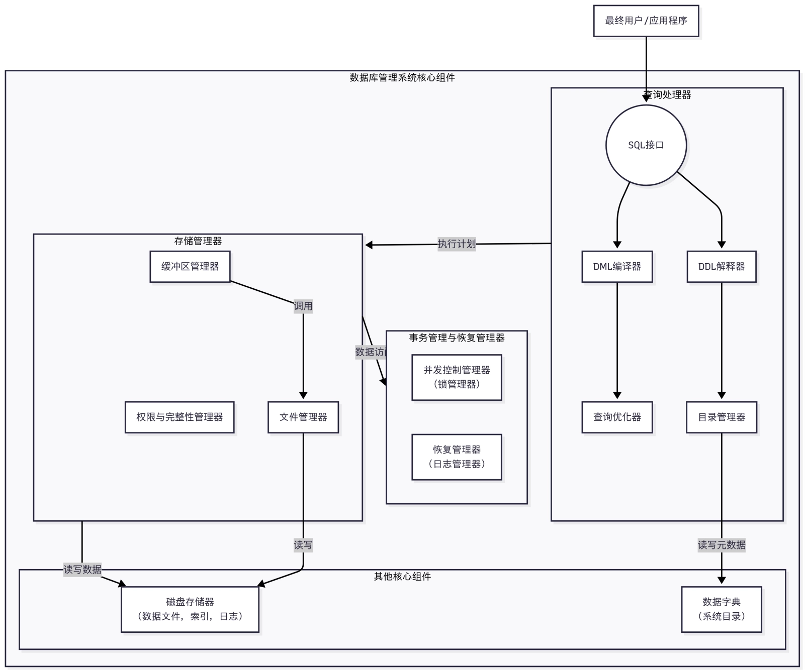

# 数据库安全

- [Back to Course Home](index.md)

## 数据库概述
### 核心概念

- **数据**：描述客观事物的符号记录，是数据库存储的基本对象，形式包括数字、文字、图形、图像、声音等。
	- 基础，处理的原材料
- **数据库（DB）**：长期存储在计算机内、有组织的、可共享的、统一管理的数据集合。
	- 数据的集合
- **数据库管理系统（DBMS）**：位于用户与操作系统之间的系统软件，负责数据库的建立、运行、维护的集中管理与控制。
	- 管理和操作数据库的核心
- **数据库应用系统（DBAS）**：为满足特定应用需求开发的软件系统，通过调用 DBMS 管理和使用数据库。
	- 面向用户的具体软件程序
- **数据库系统（DBS）**：引入数据库后的完整计算机系统集合，包含数据库、DBMS（及应用开发工具）、DBAS、数据库管理员和用户。
	- 含上述所有元素和人员的整体

### 数据库体系结构（ANSI/SPARC 体系结构）
| 特性维度 | 外模式 | 概念模式 | 内模式 |
| --- | --- | --- | --- |
| 别名 | 子模式、用户模式 | 逻辑模式 | 存储模式 |
| 层级 | 最高层（最接近用户） | 中间层（核心与枢纽） | 最底层（最接近硬件） |
| 定义 | 数据库用户能够看见和使用的 **局部数据的逻辑结构和特征** 的描述 | 数据库中 **全部数据的全局逻辑结构和特征** 的描述 | 数据 **物理结构和存储方式** 的描述 |
| 数量 | **多个**（一个数据库可有多个外模式） | **一个**（一个数据库只有一个模式） | **一个**（一个数据库只有一个内模式） |
| 面向对象 | 最终用户或应用程序员 | 数据库管理员和系统设计师 | 系统管理员或 DBMS 本身 |
| 主要内容 | 1. 视图  2. 部分基本表  3. 局部数据的逻辑关系与约束 | 1. 所有基本表、字段、数据类型  2. 数据之间的联系（主键、外键）  3. 完整性约束、安全检查 | 1. 数据文件格式、存储位置  2. 索引组织方式（如 B+ 树）  3. 数据压缩、加密方法  4. 记录存储方式（堆文件、顺序） |
| 关注点 | **用户** 需要什么数据 | 数据 **是什么**，以及数据之间的 **逻辑关系** | 数据 **如何存储** 在计算机中 |
| 数据抽象级别 | 视图级 | 逻辑级 | 物理级 |
| 例子 | 1. 学生视图：可见姓名、课程、成绩  2. 教师视图：可见姓名、课程、工资（不可见学生住址） | 整个学校数据库的完整逻辑设计，包含学生、课程、教师、成绩等所有表及其关系 | 1. 数据文件 `student.dat` 存储在 `/data/` 目录  2. 使用 B+ 树索引学号字段  3. 记录采用行存储格式 |
| 独立性作用 | 通过 **外模式/模式映像** 实现 **逻辑独立性** | 承上启下的 **核心层** | 通过 **模式/内模式映像** 实现 **物理独立性** |

### 数据库管理系统（DBMS）

- **数据库管理系统是数据库系统的核心**，是为数据库的建立、运用和维护而配置的软件
- 核心功能

	| 序号 | 功能名称 | 核心描述 |
	| --- | --- | --- |
	| 1 | **数据存储、检索与更新** | 最基本功能，提供数据 **存入**、**查询**（检索）、**修改/删除**（更新）能力，通常通过 SQL 语言实现 |
	| 2 | **用户可访问的目录** | 提供集中的 **数据字典**（系统目录），存储数据库元数据（表、字段、类型、约束、权限等），供用户和 DBMS 查询 |
	| 3 | **事务管理** | 保证一组数据库操作要么 **全部成功**（提交），要么 **全部失败**（回滚），确保数据库从一个一致性状态转换到另一个一致性状态 |
	| 4 | **并发控制** | 多用户同时访问修改数据时，通过 **锁机制** 或多版本并发控制等技术，协调并发操作，防止数据不一致（如丢失更新、脏读） |
	| 5 | **恢复服务** | 系统故障后，利用 **日志文件和备份** 将数据库恢复到一致状态，防止数据丢失 |
	| 6 | **授权与安全性管理** | 通过用户名、密码、权限设置（如 SELECT、INSERT、UPDATE 权限）控制用户访问，防止未授权操作 |
	| 7 | **数据完整性管理** | 强制执行数据完整性规则，包括 **实体完整性**（主键唯一非空）、**参照完整性**（外键约束）和 **用户定义的完整性**（如年龄 > 0） |
	| 8 | **数据通信接口** | 支持用户应用程序与 DBMS 的通信，如通过 ODBC、JDBC 等标准接口 |
	| 9 | **数据独立性服务** | 通过 **三级模式结构** 和 **二级映像** 功能，实现 **物理独立性** 和 **逻辑独立性**，使应用程序不依赖数据的物理存储和全局逻辑结构 |
	| 10 | **完整性约束与业务规则执行** | 定义和执行复杂 **业务规则**（如触发器、存储过程），确保数据变化符合企业逻辑 |

- 核心组件及功能
	- **查询处理器**：DBMS 的“大脑”，负责接收、解析、优化并执行用户查询
		- 功能：将高级 SQL 转换为底层指令
		- 子组件
			1. DDL 解释器：解释执行 CREATE、ALTER、DROP 等 **数据定义语言** 命令，维护数据字典元数据
			2. DML 编译器：解释执行 SELECT、INSERT、UPDATE、DELETE 等 **数据操纵语言** 命令，转换为底层指令
			3. 查询优化器：DML 编译器的核心，负责选择最高效执行策略（如索引选择、表连接方式），最小化 CPU、I/O 成本
			4. 目录管理器：管理和访问数据字典中的元数据
	- **存储管理器**：DBMS 的“双手”，负责在磁盘上高效地存储、检索和管理实际数据
		- 功能：高效处理数据在磁盘和内存间的移动，并确保数据完整性和安全性
		- 子组件
			1. 缓冲区管理器：管理内存数据缓冲区，决定磁盘数据块的调入调出，影响系统性能的关键组件
			2. 文件管理器：管理磁盘上的文件和数据存储结构
			3. 权限与完整性管理器：检查用户操作权限，验证数据操作是否符合完整性约束
	- **事务管理与恢复管理器**：DBMS 的“安全卫士”，确保数据库操作的可靠性和一致性
		- 功能：协调并发操作，在故障时恢复数据库到一致状态
		- 子组件
			1. 并发控制管理器（锁管理器）：控制多事务并发访问，通过锁机制保证事务隔离性
			2. 恢复管理器（日志管理器）：维护日志文件，记录事务修改操作，故障后通过日志恢复（重做已提交、撤销未提交事务）以恢复到一致状态
	- **其他核心组件**：
		1. 数据字典（系统目录）：特殊“数据库”，存储数据库结构元数据（表、列、索引、用户、权限等），为所有组件提供支持
		2. 磁盘存储器：包含数据文件（存储实际数据）、数据字典、索引文件（加速访问）、日志文件（用于恢复）
- 组件协同工作流程
	

	1. 接收用户的高级查询（查询处理器）
	2. 高效查找和操作数据（存储管理器）
	3. 同时服务多个用户而不产生混乱（事务管理器）
	4. 故障时保护数据（恢复管理器）
	5. 通过数据字典维护数据组织信息（数据字典）

## 数据库安全风险

1. **硬件故障与灾害破坏**：支持数据库系统的硬件环境发生故障。
	- 断电导致信息丢失、硬盘故障致使数据不可读、地震等自然灾害造成硬件损毁。
2. **数据库系统/应用软件漏洞利用**：黑客或内部恶意用户针对数据库系统或应用系统漏洞进行攻击。
	- SQL 注入
3. **人为错误**：操作人员或系统用户错误输入、应用程序不正确使用，导致安全机制失效，引发非法访问或服务中断。
4. **管理漏洞**：数据库管理员专业知识不足，不能很好地利用数据库的保护机制和安全策略。
	- 权限分配不合理、未按时备份恢复、未审核审计日志，无法及时发现和阻止攻击。
5. **核心技术依赖风险**：我国使用的 DBMS 大多来自国外，安全依赖国外公司，存在潜在风险。
6. **隐私数据泄漏**：数据库中限制公开的个人隐私数据被非法泄露或滥用。

## 数据库安全机制

- 安全需求
	1. **保密性**：防止数据泄露和未授权获取。
	2. **完整性**：包括物理完整性、逻辑完整性和数据元素取值的准确性。
	3. **可用性**/可存活性：确保数据库服务不因人为/自然的原因对授权用户不可用，尤其是在遭受攻击或发生错误的情况下能够继续提供核心服务并及时恢复全部服务。
	4. **可控性**：监控数据操作和系统事件，对违规事件具备监控、记录和事后追查能力。
	5. **隐私性**：保护使用主体个人隐私不被泄露和滥用。

### 保密性控制

- 数据库的首要安全问题是保护数据库不被非授权访问造成数据泄露、更改或破坏。**访问控制是实现这一目的重要途径**。
- 数据库的访问控制包括在数据库系统这一级中提供用户认证和访问控制，以及在数据存储这一级采用密码技术加密存储。
	1. **用户认证**
		- 核心：用户标识与鉴别，通过核对 ID、口令等认证信息决定系统使用权。
		- 用户进入数据库需依次经过操作系统和 DBMS 两次认证，提升安全性，阻止未授权用户操作。
	2. 访问控制特性
		- **难度远高于操作系统**：
			- 数据库内库表、记录、字段存在关联关系，控制粒度需细化到记录和字段级；
			- 操作系统中文件无关联关系，且控制粒度为文件；
			- 数据库还存在推理泄露问题。
		- 高安全等级数据库强制要求 MAC 机制
			- 基于标签的 MAC（强制访问控制），用户安全级别与数据安全标签比对后决定是否允许访问。
	3. 加密存储
		- **库内加密**：
			- 在 DBMS 内核层实现加密
			- 加密/解密对用户与应用透明，数据进入 DBMS 前为明文，DBMS 在物理存取前完成加解密
			- 优点
				1. 加密功能强，不影响 DBMS 原有功能
				2. 对应用完全透明
			- 缺点
				1. 系统性能影响大，加重数据库服务器负担
				2. 密钥管理安全风险大，密钥与数据库同存，密钥安全依赖 DBMS 访问控制
		- **库外加密**：
			- 在 DBMS 之外（客户端或专门加密服务器）实现加密
			- DBMS 管理密文，加解密在外部完成
			- 优点
				1. 减少数据库服务器与 DBMS 运行负担
				2. 密钥与数据分开存储，安全性高
				3. 可实现端到端密文传输
			- 缺点
				1. 加密后数据库部分功能受限制

### 完整性控制

- 完整性目标
	- 防止错误信息输入输出，避免数据库存在不符合语义的数据。
	- 防止数据被非授权插入、破坏和删除。
- 完整性：
	- **物理完整性**
		- 要求：从硬件和环境层面保护数据，防止数据被破坏或不可读
		- 依赖计算机系统硬件可靠性、安全性及环境安全保障措施
	- **逻辑完整性**
		- 要求：
			- **保持数据库逻辑结构完整**，限制数据库创建/删除、库表创建/删除/更改操作权限，仅允许数据库拥有者或系统管理员执行
			- **数据库结构和库表结构设计的合理性**，尽量减少字段与字段、库表与库表之间不必要的关联和冗余字段
		- 主要是设计者的责任，由系统管理员与数据库拥有者负责保证数据库结构不被随意修改
	- **数据元素取值的准确性和正确性（元素完整性）**
		- 要求：**保持数据字段内容的正确性与准确性**
		- 由 DBMS、应用软件开发者和用户共同协作
			- 提供完整性约束条件定义机制
			- 提供完整性检查方法
			- 违约处理

### 可用性保护

- **备份与恢复**
	- 定义：将数据库 **从错误状态恢复到某一已知的正确状态** 的功能。
	- 关键技术：
		1. **数据转储**：DBA 定期将整个数据库复制到磁带或其他磁盘，生成后备/后援副本。
		2. **登记日志文件**：记录事务对数据库的更新操作，作为恢复依据。
		3. **数据库镜像**：自动将数据库或关键数据复制到另一个磁盘，主数据库更新时 DBMS 自动同步镜像数据，即 DBMS 自动保证镜像与主数据的一致性，避免磁盘故障影响可用性。
- **入侵容忍**
	- 定义：系统遭受入侵或组件被破坏时，整个系统仍能提供全部或降级服务，同时保持数据机密性和完整性等安全属性。
	- 关键技术：
		1. 冗余组件技术：组件失效时，其他冗余组件替代执行功能。
		2. 多样性：冗余组件采用不同设计实现方法，避免共同安全漏洞。
		3. 复制技术：服务器多备份部署。
		4. 门限密码技术：通过秘密共享技术冗余分割保护敏感数据和系统部件。
		5. 代理技术：通过代理服务器接收所有请求，过滤风险操作。

### 可控性实现

- **审计**
	- 定义：监视和记录用户对数据库的所有操作，生成审计日志。
	- 作用：重现数据库状态变化过程，追查非法存取数据的用户、时间和内容，明确责任。
	- 注意事项：需平衡审计粒度、审计对象与存储空间消耗。
- **可信记录保持**
	- 定义：在记录的生命周期内保证记录无法被删除、隐藏或篡改，且无法恢复或推测已删除记录。
	- 防护重点：防止内部人员恶意篡改和销毁记录（防止内部攻击）。
	- 关键技术：
		1. 建立记录索引，支持海量数据快速查找。
		2. **可信迁移技术**：确保记录在多台存储服务器间迁移时，即使执行者为最高权限攻击者，迁移后记录仍可信。

### 隐私性保护

- 保护原则
	1. **用途定义**（Purpose Specification）：对收集和存储在数据库中的每一条个人信息都应该给出相应的用途描述。
	2. **提供者同意**（Consent）：信息用途需获得提供者同意。
	3. **收集限制**（Limited Collection）：收集范围限制在满足用途的最小需求。
	4. **使用限制**（Limited Use）：仅允许与收集用途一致的查询操作。
	5. **泄露限制**（Limited Disclosure）：不允许与外界进行与信息提供者同意用途不符的数据交流。
	6. **保留限制**（Limited Retention）：仅在完成必要用途期间保留个人信息。
	7. **准确**（Accuracy）：保证个人信息准确且最新。
	8. **安全**（Safety）：采取安全措施防止信息被盗或挪用。
	9. **开放**（Openness）：信息拥有者可访问自身存储在数据库中的所有信息。
	10. **执行**（Compliance）：信息拥有者可验证上述规则执行情况，数据库需重视规则落地。
- 保护技术
	1. **数据失真技术**：通过添加噪音或扰动使敏感数据失真，保留统计属性供研究使用，效率高但存在少量信息丢失。
	2. **数据加密技术**：采用多种加密算法隐藏敏感数据。
	3. **限制发布技术**：选择性发布原始数据，不发布或低精度发布敏感数据。