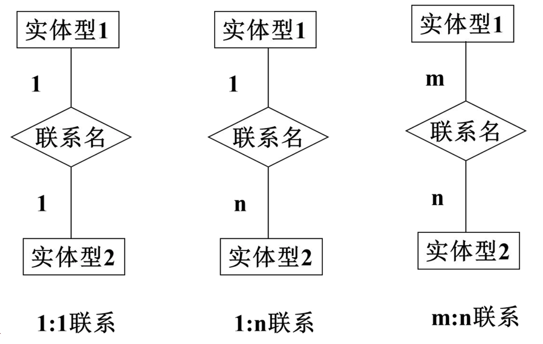
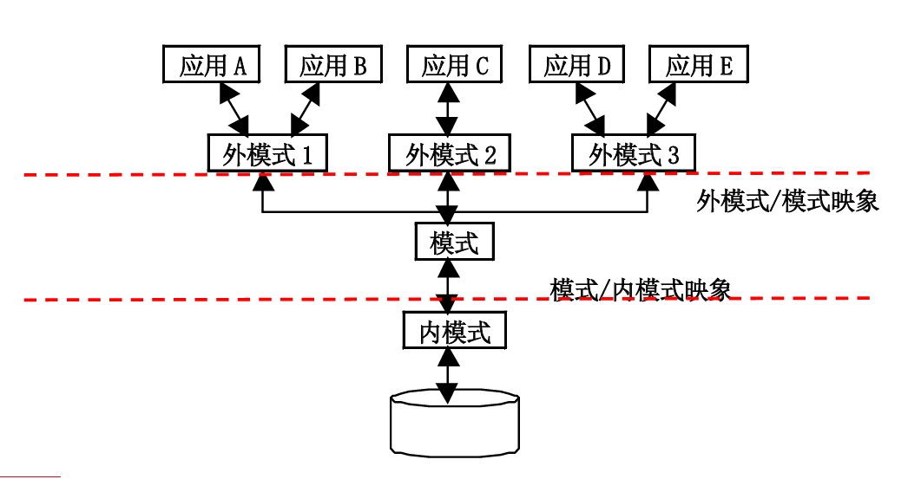

# 第一章 数据库系统概论

- [Back to Course Home](index.md)

## 数据库系统概述

### 四个基本概念
#### 数据（Data）

- 数据是数据库中 **存储的基本对象**。
- 定义：描述事物的符号记录
- 种类：数值、文字、图形、图象、声音、视频等
- 数据与其语义是不可分的

#### 数据库（DataBase, DB）

- 定义：数据库（简称 DB）是 **长期储存** 在计算机内、**有组织、可共享** 的 **大量数据集合**。
- 基本特征：
	- 数据按一定的数据模型组织、描述和储存；
	- 可为各种用户共享；
	- 冗余度较小；
	- 数据独立性较高；
		- 应用程序与数据相互独立；
	- 易扩展。

#### 数据库管理系统（DataBase Management System, DBMS）

- 定义：数据库管理系统（简称 DBMS）是位于 **用户与操作系统之间** 的一层 **数据管理软件**
- 用途：科学地组织和存储数据、高效地获取和维护数据。
- 主要功能：
	- 数据定义功能
		- 提供数据定义语言（DDL），定义数据库中的数据对象的组成与结构；
	- 数据组织、存储、管理功能
		- 文件结构和存取方式
		- 数据如何联系
		- 提高存储空间利用率等
	- 数据操纵功能
		- 提供数据操纵语言（DML）
		- 操纵数据实现查询、插入、删除和修改等基本操作
	- 数据库的事务管理和运行管理
		- 保证数据的安全性、完整性
		- 支持多用户对数据的并发使用
		- 实现发生故障后的系统恢复
	- 数据库的建立和维护功能
		- 数据库数据批量装载和转储
		- 介质故障恢复
		- 数据库的重组织
		- 性能监视与分析等
	- 其他功能
		- 网络中其它软件系统的通信
		- 各系统之间的数据转换
		- 异构数据库之间的互访和互操作等

#### 数据库系统（DataBase System, DBS）

- 定义：数据库系统（简称 DBS）是指在计算机系统中 **引入数据库和 DBMS 后的系统构成**
- 在不引起混淆的情况下常常简称为数据库。
- 构成：
	- 由数据库、数据库管理系统（及其应用开发工具）、应用系统、数据库管理员（DataBase Administrator, DBA）组成，是存储、管理、处理和维护数据的系统。
- 结构：
	```mermaid
	graph TD
	A[用户] --> B[数据库应用系统]
	C[用户] --> B
	D[用户] --> B
	B --> E[数据库应用开发工具]
	E --> F[DBMS]
	F --> G[OS]
	G --> H[DB]
	F <--> I[DBA]
	I --> H
	H --> J[硬件]
	```

### 数据库管理技术的产生与发展

- 数据管理技术：对数据进行分类、组织、编码、存储、检索和维护的技术，是数据处理和数据分析的中心问题
- 发展过程：
	- 人工管理阶段(40 年代--50 年代中)
		- 背景
			- 应用背景：计算机主要用于科学计算；
			- 硬件背景：外存只有磁带、卡片、纸带，没有直接存储设备；
			- 软件背景：没有操作系统、没有管理数据的软件；
			- 处理方式：批处理。
		- 特点
			- 数据不保存，没有文件的概念；
			- 应用程序管理数据，程序员负担很重；
			- 数据面向某个应用程序，无共享，冗余度大；
			- 应用程序与数据一一对应，数据不具有独立性。
	- 文件系统阶段 (50 年代末--60 年代中)
		- 背景
			- 应用需求：科学计算、管理；
			- 硬件水平：有了磁盘、磁鼓等存储设备；
			- 软件水平：出现文件系统；
			- 处理方式：联机实时处理、批处理。
		- 特点
			- 数据的管理者：文件系统，数据可长期保存；
			- 数据面向的对象：某一应用程序；
			- 数据的共享程度：共享性差、冗余度极大；
			- 数据的独立性：独立性差，数据的逻辑结构改变必须修改应用程序；
			- 数据的结构化：记录内有结构，整体无数据结构；
			- 数据控制能力：应用程序自己控制。
	- 数据库系统阶段 (60 年代末--现在)
		- 背景
			- 应用需求：大规模管理；
			- 硬件水平：有了大容量磁盘、磁盘列阵等；
			- 软件水平：有了数据库管理系统；
			- 处理方式：联机实时处理、分布处理、批处理。
		- 特点
			- 数据的管理者：DBMS；
			- 数据面向的对象：现实世界；
			- 数据的共享程度：共享性高，冗余度小；
			- 数据的独立性：高度的物理独立性和一定的逻辑独立性；
			- 数据的结构化：整体结构化，用数据模型来表示；
			- 数据控制能力：由 DBMS 统一管理和控制。

### 数据库系统的特点
#### 数据的结构化

- **整体数据的结构化** 是数据库的主要特征之一。
- 数据库中实现的是数据的真正结构化
	- 数据的结构用数据模型描述，无需程序定义和解释；
	- 数据可以变长，最小存取单位是数据项；
	- 不再仅仅针对某一应用，而是面向整个企业或组织。

#### 数据的独立性

- 物理独立性：指用户的应用程序与存储在物理磁盘上的数据库中数据相互独立，当数据的物理存储改变了，应用程序不用改变；
- 逻辑独立性：指用户的应用程序与数据库的逻辑结构相互独立，数据的逻辑结构改变了，用户程序也可以不变。

#### 数据的高共享性

- 数据面向整个系统，可以被多个用户、多个应用共享使用。
- 数据共享的优点：
	- 能降低数据的冗余度，节省存储空间；
	- 避免数据间的不一致性和不相容性；
	- 数据库系统弹性大，易于扩充。

#### 数据由 DBMS 统一管理和控制

- 数据的 **安全性(Security)** 保护：使每个用户只能按指定方式使用和处理指定数据，防止不合法使用造成的数据泄密和破坏；
- 数据的 **完整性(Integrity)** 检查：保持数据的正确性、有效性、相容性，将数据控制在有效范围内，保证数据之间满足一定关系；
- **并发(Concurrency)** 控制：对多用户的并发操作加以控制和协调，防止相互干扰而得到错误结果；
- **数据库恢复(Recovery)**：将数据库从错误状态恢复到某一已知的正确状态。

## 数据模型
### 数据模型

- 在数据库中用数据模型（data model）这个工具来抽象描述、组织和处理现实世界中的数据和信息。
- 数据模型就是 **现实世界数据特征的抽象**。
- 数据模型应满足三方面要求：
	- 能比较真实地模拟现实世界
	- 容易为人所理解
	- 便于在计算机上实现

### 数据建模

- 数据建模是把现实世界的具体事务抽象、组织为某一数据库管理系统支持的数据模型的过程，
- 通常分为两步：
	- 建立概念模型，将现实世界抽象为信息世界
		- 概念模型按用户观点对数据和信息建模，用于数据库设计；
	- 将概念模型转换为数据模型，将信息世界转换为机器世界
		- 数据模型按计算机系统观点对数据建模，是 DBMS 支持的，用于 DBMS 的实现。

### 概念模型
#### 用途与要求

- 用途：
	- 概念模型用于信息世界的建模
	- 是现实世界到机器世界的中间层次
	- 是数据库设计的有力工具
	- 也是数据库设计人员和用户之间进行交流的语言。
- 基本要求：
	- 较强的语义表达能力
	- 简单清晰易于用户理解
	- 易于更改和扩充
	- 易于向各种数据模型进行转换。

#### 信息世界的基本概念

- **实体**（Entity）
	- 客观存在并可相互区别的事物
	- 可以是具体的人、事、物或抽象的概念
- **属性**（Attribute）
	- 实体所具有的某一特性
	- 一个实体可由若干个属性来刻画
- **码**（Key）
	- 唯一标识实体的 **属性集**
- **域**（Domain）
	- 属性的取值范围
- **实体类型**（Entity Type）
	- 具有相同属性的实体必然具有共同的特征和性质
	- 用 **实体名及其属性名集合** 来抽象和刻画同类实体，称为实体型
- **实体集**（Entity Set）
	- 同一类型实体的集合
- **联系**（Relationship）
	- 现实世界中，事物内部以及事物之间的联系，在信息世界中反映为 **实体内部的联系**（组成实体的各属性之间的联系）和 **实体之间的联系**（不同实体集之间的联系）。
	- 实体之间的联系
		- 可发生在两个实体型、三个实体型或一个实体型之间
		- 联系类型有一对一（1:1）、一对多（1:n）、多对多（m:n）。
- 示例：
	- 实体：学生张三
	- 属性：学号、姓名、性别、出生日期
	- 码：学号
	- 域：
		- 学号的取值范围为 8 位数字；
		- 姓名的取值范围为 20 个汉字以内；
		- 性别的取值范围为“男”、“女”；
		- 出生日期的取值范围为“YYYY-MM-DD”格式的日期
	- 实体型：学生（学号、姓名、性别、出生日期）
	- 实体集：{ 张三、李四、王五、…… }
	- 联系：
		- 实体内部联系：学号能确定学生的姓名、性别、出生日期等属性值；
		- 实体之间的联系：学生与课程之间的选修联系。

#### 概念模型的表示方法：E-R 模型

- 概念模型的表示方法中，最常用的是 P.P.S.Chen 于 1976 年提出的实体-联系模型（Entity-Relationship model，简称 E-R 模型）
	- 用 E-R 图来描述现实世界的概念模型
	- 提供了表示实体型、属性和联系的方法
- 表示方法
	- **实体型**：矩形表示，矩形框内写明实体名；
	- **属性**：用椭圆形表示，并用 **无向边** 将其与相应的实体连接起来；
	- **联系**：
		- 本身用菱形表示，菱形框内写明联系名，并用无向边分别与有关实体连接起来，同时在无向边旁标上联系的类型（1:1、1:n 或 m:n）
		- 若联系具有属性，需用无向边与该联系连接。
- 两个实体型之间的联系
	- 
	- **一对一联系**：如果对于实体集 A 中的每一个实体，实体集 B 中至多有一个实体与之联系，反之亦然，则称实体集 A 与实体集 B 具有一对一联系。记为 $1:1$。
	- **一对多联系**：如果对于实体集 A 中的每一个实体，实体集 B 中有 $n$ 个实体（$n\geq 0$）与之联系，反之，对于实体集 B 中的每一个实体，实体集 A 中至多只有一个实体与之联系，则称实体集 A 与实体集 B 有一对多联系，记为 $1:n$。
	- **多对多联系**：如果对于实体集 A 中的每一个实体，实体集 B 中有 $n$ 个实体（$n\geq 0$）与之联系，反之，对于实体集 B 中的每一个实体，实体集 A 中也有 $m$ 个实体（$m\geq 0$）与之联系，则称实体集 A 与实体 B 具有多对多联系。记为 $m:n$。
- 多个实体型之间的联系
	- 多个实体型间的一对多联系：若实体型 $E_1, E_2, \cdots, E_n$ 存在联系，对于实体型 $E_j~(j=1, 2, \cdots,i-1, i+1, \cdots, n)$ 中的给定实体，最多只和 $E_i$ 中的一个实体相联系，则我们说 $E_i$ 与 $E_1, E_2, \cdots, E_{i-1}, E_{i+1}, \cdots, E_n$ 之间的联系是一对多的
		- 实体型之间存在联系
		- 某个实体型与其它实体型之间是一对多联系
	- 多个实体型间的多对多联系
	- 多个实体型间的一对一联系
- 同一实体集内各实体间的联系
	- 一对多联系
	- 一对一联系
	- 多对多联系

### 数据模型的组成要素
#### 数据结构 - 静态特性

- 定义：
	- 描述数据库的组成对象及对象之间的联系。
	- 经常用数据结构的类型来命名数据模型:
- 描述的内容：
	- 一类是与对象的类型、内容、性质有关；
	- 一类是与数据之间的联系有关的对象；
- 数据结构是对系统静态特性的描述。

#### 数据操作 - 动态特性

- 定义：
	- 对数据库中各种对象（型）的实例（值）允许执行的操作的集合，
	- 包括操作及有关的操作规则；
- 数据操作的类型
	- 查询
	- 更新（包括插入、删除、修改）
- 数据操作是对系统动态特性的描述。

#### 数据的完整性约束条件

- 一组完整性规则的集合；
- 完整性规则：给定的数据模型中数据及其联系所具有的制约和储存规则；
- 完整性规则可以限定符合数据模型的数据库状态以及状态的变化，以保证数据的正确、有效、相容
- 数据模型对约束条件的定义
	- 反映和规定本数据模型必须遵守的基本的通用的完整性约束。例如在关系模型中，任何关系必须满足实体完整性和参照完整性两个条件。
	- 提供定义完整性约束条件的机制，以反映具体应用所涉及的数据必须遵守的特定的语义约束条件。

### 常用的数据模型
#### 格式化模型（第一代数据库）

- 定义：格式化模型是指用 **基本层次联系** 来描述数据及其联系的数据模型。
- 主要包括两种数据模型：
	- 层次模型（Hierarchical Model）
	- 网状模型（Network Model）
- 数据结构：以基本层次联系为基本单位

##### 层次数据模型的数据结构

- **定义**：满足有且只有一个结点没有双亲结点（根结点）、根以外的其它结点有且只有一个双亲结点两个条件的基本层次联系的集合为层次模型。
- 表示方法：
	- **实体型**：用记录类型描述，每个结点表示一个记录类型。
	- **属性**：用字段描述，每个记录类型可包含若干个字段。
	- **联系**：用结点之间的连线（有向边）表示记录（类型）之间的一对多的父子联系。
- 特点：
	- **其结点的双亲是唯一的**
	- 只能直接处理一对多的实体联系
	- 每个记录类型定义一个排序字段（码字段）
	- 任何记录值只有按其路径查看时才能显出全部意义
	- 没有一个子女记录值能够脱离双亲记录值而独立存在。
- 数据操纵：查询、插入、删除、更新
- 完整性约束：
	- 无相应的双亲结点值就不能插入子女结点值
	- 删除双亲结点值则相应的子女结点值也被同时删除
	- 更新操作时应更新所有相应记录以保证数据的一致性
- 优点
	- 层次数据模型简单，对具有一对多的层次关系的部门描述自然、直观，容易理解；
	- 查询效率高，性能优于关系模型，不低于网状模型；
	- 层次数据模型提供了良好的完整性支持；
- 缺点
	- 多对多联系表示不自然；
	- 对插入和删除操作的限制多；
	- 查询子女结点必须通过双亲结点；
	- 查询及更新操作必须给出完整路径

##### 网状数据模型的数据结构

- **定义**：满足允许一个以上的结点无双亲、一个结点可以有多于一个的双亲两个条件的基本层次联系的集合为网状模型。
- 表示方法与层次数据模型相同：
	- 实体型用记录类型描述
	- 属性用字段描述
	- 联系用结点之间的连线表示记录类型之间的一对多的父子联系。
- 与层次模型的区别：
	- **网状模型允许多个结点没有双亲结点、一个结点有多个双亲结点**
	- 网状模型允许两个结点之间有多种联系（复合联系）
	- 网状模型可以更直接地描述现实世界
	- 层次模型实际上是网状模型的一个特例。
- 数据操纵：查询、插入、删除、更新
- 完整性约束：
	- 支持记录码的概念（唯一标识记录的数据项集合）
	- 双亲结点与子女结点之间是一对多联系
	- 可以支持属籍类别：
		- 加入类别：双亲记录在，子女记录才可以加入；
		- 移出类别：双亲记录删除，子女记录删除；
- 优点：
	- 能够更为直接地描述现实世界，如一个结点可以有多个双亲；
	- 具有良好的性能，存取效率较高；
- 缺点：
	- 结构比较复杂，而且随着应用环境的扩大，数据库的结构就变得越来越复杂，不利于最终用户掌握；
	- DDL、DML 语言复杂，用户不容易使用；
	- 用户必须了解系统结构细节，加重编写应用程序的负担

#### 关系模型（第二代数据库）

- 关系模型在用户观点下，数据的逻辑结构是一张二维表，由行和列组成。
- 基本概念：
	- **关系**（Relation）：一个关系对应通常说的一张二维表。
	- **元组**（Tuple）：表中的一行即为一个元组。
	- **属性**（Attribute）：表中的一列即为一个属性，给每一个属性起一个名称即属性名。
	- **主码**（Primary Key）：表中的某个属性组，可唯一确定一个元组。
	- **域**（Domain）：属性的取值范围。
	- **分量**（Component）：元组中的一个属性值。
	- **关系模式**（Relation Schema）：对关系的描述，格式为关系名（属性 1，属性 2，…，属性 n）。
- 数据结构
	- 实体及实体间的联系表示方法：
		- 实体型：直接用关系（表）表示；
		- 属性：用属性名表示；
		- **一对一联系**：隐含在实体对应的关系中；
		- **一对多联系**：隐含在实体对应的关系中；
		- **多对多联系**：直接用关系表示。
	- 关系必须是规范化的，满足一定的规范条件，**最基本的规范条件** 是关系的每一个分量必须是一个不可分的数据项，**不允许表中还有表**。
- 数据操纵
	- 查询、插入、删除、更新
	- 数据操作是集合操作，**操作对象和操作结果都是关系**，即若干元组的集合；
	- 存取路径对用户隐蔽，用户只需指出“干什么”，不必详细说明“怎么干”。
- 完整性约束
	- 实体完整性
	- 参照完整性
	- 用户定义的完整性
- 优点
	- 建立在严格的数学概念的基础上
	- 概念单一，数据结构简单、清晰，用户易懂易用
		- 实体和各类联系都用关系来表示
		- 对数据的检索结果也是关系
	- 关系模型的存取路径对用户透明无感
		- 具有更高的数据独立性，更好的安全保密性
		- 简化了程序员的工作和数据库开发建立的工作
- 缺点
	- 存取路径对用户隐蔽
	- 查询效率往往不如格式化数据模型
	- 为提高性能，必须对用户的查询请求进行优化，增加了开发数据库管理系统的难度。

#### 新一代数据库

- 面向对象模型（Object Oriented Data Model）
- 对象关系模型（Object Relational Model）
- 半结构化的 XML 数据模型
- 新型数据模型
	- NoSQL：键值数据模型、文档数据模型、图数据模型
	- NewSQL、时序数据模型、时空数据模型、多媒体数据模型等

## 数据库系统结构
### 数据库系统的结构

- 从数据库应用开发人员角度：
	- 数据库采用三级模式结构，是数据库系统内部的系统结构。
- 从数据库最终用户角度：
	- 单用户结构
	- 主从式结构
	- 分布式结构
	- 客户—服务器
	- 浏览器—应用服务器/数据库服务器

### 数据库系统模式的概念

- “型”和“值”的概念
	- **型**（Type）：对某一类数据的结构和属性的说明；
	- **值**（Value）：是型的一个具体赋值
- **模式**（Schema）
	- 数据库全体数据的逻辑结构和特征的描述
	- 是型的描述
	- 反映数据的结构及其联系
	- 模式是相对稳定的
- 模式的一个 **实例**（Instance）
	- 模式的一个具体值
	- 反映数据库某一时刻的状态
	- 同一个模式可以有很多实例
	- 实例随数据库中的数据的更新而变动

### 数据库系统的三级模式结构


#### 模式（Schema）

- 模式也称逻辑模式
	- 数据库中 **全体数据的逻辑结构和特征的描述**
	- 所有用户的公共数据视图，综合了所有用户的需求。
- 一个应用数据库只有一个模式，以数据模型为基础
- 模式的地位：是数据库系统模式结构的 **中心**
	- 与数据的物理存储细节和硬件环境无关
	- 与具体的应用程序、开发工具及高级程序设计语言无关
- 模式的定义：模式 DDL（模式描述语言）
	- 定义数据的逻辑结构（数据项的名字、类型、取值范围等）
	- 定义数据之间的联系
	- 定义与数据有关的安全性、完整性要求

#### 外模式（External Schema）

- 外模式也称子模式或用户模式
	- 数据库用户（包括应用程序员和最终用户）使用的 **局部数据的逻辑结构和特征的描述**
	- 数据库用户的数据视图，是与某一应用有关的数据的逻辑表示。
- 外模式的地位：介于模式与应用之间
	- **模式与外模式的关系**：一对多
		- 外模式通常是模式的子集
		- 一个数据库可以有多个外模式，反映不同用户的应用需求、看待数据的方式、对数据保密的要求
		- 对模式中同一数据，在外模式中的结构、类型、长度、保密级别等都可以不同；
	- **外模式与应用的关系**：一对多
		- 同一外模式可为某一用户的多个应用系统所使用
		- 但一个应用程序只能使用一个外模式
- 外模式的用途
	- 是保证数据库安全性的一个有力措施
	- 每个用户只能看见和访问所对应的外模式中的数据，同时简化用户视图

#### 内模式（Internal Schema）

- 内模式也称存储模式
	- 是数据物理结构和存储方式的描述
	- 是数据在数据库内部的表示方式
		- 记录的存储方式（堆存储，聚簇存储，属性升降存储）
		- 索引的组织方式（按照 B+树索引？按 hash 索引？）
		- 数据是否压缩存储
		- 数据是否加密
		- 数据存储记录结构的规定（定长？变长？）等
- **一个数据库只有一个内模式**。

### 数据库的二级映像功能与数据独立性
#### 三级模式与二级映象

- 三级模式是对数据的 **三个抽象级别**
- 二级映象：在 DBMS 内部实现这三个抽象层次的联系和转换
	- 外模式/模式映像
		- 定义外模式（局部逻辑结构）与模式（全局逻辑结构）之间的对应关系
		- **每一个外模式都对应一个外模式/模式映象**
		- 映象定义通常包含在各自外模式的描述中
		- 用途：保证数据的 **逻辑独立性**
			- 当模式改变时，数据库管理员修改有关的外模式/模式映象，使外模式保持不变
			- 由于应用程序是依据数据的外模式编写的，从而应用程序不必修改，保证了数据与程序的逻辑独立性，简称数据的逻辑独立性
	- 模式/内模式映象
		- 定义了数据全局逻辑结构与存储结构之间的对应关系，例如说明某个逻辑记录和字段在内部是如何表示的。
		- **数据库中模式/内模式映象是唯一的**
		- 该映象定义通常包含在模式描述中
		- 用途：保证数据的 **物理独立性**
			- 当数据库的存储结构改变了，数据库管理员修改模式/内模式映象，使模式保持不变
			- 应用程序不受影响，保证了数据与程序的物理独立性，简称数据的物理独立性

## 数据库系统的组成

- 数据库系统的组成：
	- 数据库
	- 数据库管理系统（及其开发工具）
	- 应用系统
	- 数据库管理员
	- （用户）

### 硬件平台及数据库

- 数据库系统对硬件资源的要求：
	- 足够大的内存，以容纳操作系统、DBMS 的核心模块、数据缓冲区、应用程序、内存数据库等；
	- 足够大的外存，如磁盘（存储操作系统、DBMS、应用程序、数据库及其备份）、光盘、磁带、软盘（用于数据备份）等；
	- 较高的通道能力，以提高数据传送率。

### 软件

- DBMS（数据库管理系统）
- 操作系统
- 与数据库接口的高级语言及其编译系统
- 以 DBMS 为核心的应用开发工具
- 为特定应用环境开发的数据库应用系统

### 人员

- 不同人员涉及不同的数据抽象级别，具有不同的数据视图。
- 主要包括：
	- **数据库管理员**（DBA）
		- 确定数据库中的信息内容和结构
		- 决定数据库的存储结构和存取策略
		- 定义数据的安全性要求和完整性约束条件
		- 监控数据库的使用和运行（如周期性转储数据库、系统故障恢复、介质故障恢复、监视审计文件）
		- 数据库的改进和重组（如性能监控和调优、定期对数据库进行重组）
		- 数据库重构（需求增加或改变）
	- 系统分析员
		- 负责应用系统的需求分析和规范说明
		- 与用户及 DBA 协商确定系统的硬软件配置
		- 参与数据库系统的概要设计
	- 数据库设计人员
		- 参加用户需求调查和系统分析
		- 确定数据库中的数据
		- 设计数据库各级模式
	- 应用程序员
		- 设计和编写应用系统的程序模块
		- 进行调试和安装
	- 最终用户
		- 偶然用户：不经常访问数据库，每次访问需要不同数据库信息，如企业或组织机构的高中级管理人员
		- 简单用户：主要工作是查询和更新数据库，如银行的职员、机票预定人员、旅馆总台服务员
		- 复杂用户：如工程师、科学家、经济学家、科技工作者等，直接使用数据库语言访问数据库，甚至能够基于数据库管理系统的 API 编制自己的应用程序。