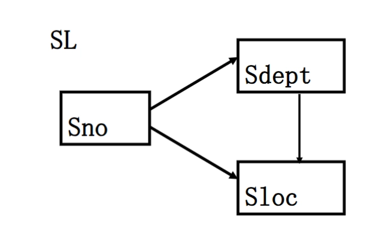

# 第三章 关系规范化基础

- [Back to Course Home](index.md)

## 问题的提出
### 概念回顾

- **关系**：描述实体、属性、实体间的联系。从形式上看，它是一张二维表，是所涉及属性的笛卡尔积的一个子集。

- **关系模式**：用来定义关系。

- **关系数据库**：基于关系模型的数据库，利用关系来描述现实世界。

	- 从形式上看，它由一组关系组成。

- **关系数据库的模式**：定义这组关系的关系模式的全体。

- 关系模式的形式化定义：关系模式由五部分组成，即它是一个五元组：$R(U, D, DOM, F)$，可简化为三元组 $R(U, F)$。

	| 组成部分 | 含义 |
	| ---- | ---- |
	| $R$ | 关系名 |
	| $U$ | 组成该关系的属性名集合 |
	| $D$ | 属性组 $U$ 中属性所来自的域 |
	| $DOM$ | 属性向域的映象集合 |
	| $F$ | 属性间数据的依赖关系集合 |

### 数据依赖

- 完整性约束的表现形式

	- 限定属性取值范围：例如学生成绩必须在 0-100 之间；

	- 定义属性值间的相互关连（主要体现于值的相等与否）

- 数据依赖：数据库模式设计的关键

	- 是通过一个关系中 **属性间值的相等与否** 体现出来的数据间的相互关系；

	- 是现实世界属性间相互联系的抽象，是数据内在的性质，是语义的体现；

	- 常见的数据依赖：

		- 函数依赖

		- 多值依赖

### 关系模式的简化表示

- 关系模式 $R(U, D, DOM, F)$ 简化为一个三元组：

    $$
    R(U, F)
    $$

- 当且仅当 $U$ 上的一个关系 $r$ 满足 $F$ 时，$r$ 称为关系模式 $R(U, F)$ 的一个关系。

### 数据依赖对关系模式的影响

- 示例：描述学校的数据库包含学生的学号（Sno）、所在系（Sdept）、系主任姓名（Mname）、课程号（Cno）、成绩（Grade）。其具备单一的关系模式：$Student(U, F)$，其中 $U = \{Sno, Sdept, Mname, Cno, Grade\}$。

	- 学校数据库的语义

		1.  一个系只有一名主任；

		2.  一个系有若干学生；

		3.  一个学生只属于一个系；

		4.  一个学生可以选修多门课程，每门课程有若干学生选修；

		5.  每个学生所学的每门课程都有一个成绩。

	- 函数依赖集 $F$：

	    $$
	    F = \{Sno \to Sdept, Sdept \to Mname, (Sno, Cno) \to Grade\}
	    $$

		

- 关系模式 $Student(U, F)$ 中存在的问题

	1.  **数据冗余太大**：浪费大量的存储空间。

		- 例如，每一个系主任的姓名重复出现。

	2.  **更新异常（Update Anomalies）**：数据冗余，更新数据时，维护数据完整性代价大。

		- 例如，某系更换系主任后，系统必须修改与该系学生有关的每一个元组。

	3.  **插入异常（Insertion Anomalies）**：该插的数据插不进去。

		- 例如，如果一个系刚成立，尚无学生，我们就无法把这个系及其系主任的信息存入数据库。

	4.  **删除异常（Deletion Anomalies）**：不该删除的数据不得不删。

		- 例如，如果某个系的学生全部毕业了，我们在删除该系学生信息的同时，把这个系及其系主任的信息也丢掉了。

- **结论**：$Student$ 关系模式不是一个好的模式。

	- “好”的模式应不会发生插入异常、删除异常、更新异常，且数据冗余应尽可能少。

- **问题原因**：由存在于模式中的某些 **数据依赖** 引起的。

- **解决方法**：通过 **分解关系模式** 来消除其中不合适的数据依赖。

	- 分解为 3 个关系模式：

		- $S(Sno, Sdept, Sno \to Sdept)$；

		- $SC(Sno, Cno, Grade, (Sno, Cno) \to Grade)$；

		- $DEPT(Sdept, Mname, Sdept \to Mname)$。

## 数据依赖
### 函数依赖

- **定义**：设 $R(U)$ 是一个属性集 $U$ 上的关系模式，$X$ 和 $Y$ 是 $U$ 的子集。

	- 若对于 $R(U)$ 的任意一个可能的关系 $r$，$r$ 中不可能存在两个元组在 $X$ 上的属性值相等，而在 $Y$ 上的属性值不等，则称“$X$ 函数确定 $Y$”或“$Y$ 函数依赖于 $X$”，记作 $X \to Y$。

	- $X$ 称为这个函数依赖的决定属性组，又称 **决定因素**（Determinant）。

	- 若 $Y$ 不函数依赖于 $X$，则记为 $X \nrightarrow Y$。

	- 若 $X \to Y$ 且 $Y \to X$，则称 $X$ 和 $Y$ 互相函数依赖，记作 $X \leftrightarrow Y$。

- 说明

	1.  函数依赖不是指关系模式 $R$ 的某个或某些关系实例满足的约束条件，而是指 $R$ 的所有关系实例均要满足的约束条件。

	2.  函数依赖是语义范畴的概念。只能根据数据的语义来确定函数依赖。例如“姓名 $\to$ 年龄”这个函数依赖只有在不允许有同名人的条件下成立。

	3.  数据库设计者可以对现实世界作强制的规定。例如规定不允许同名人出现，函数依赖“姓名 $\to$ 年龄”成立。所插入的元组必须满足规定的函数依赖，若发现有同名人存在，则拒绝装入该元组。

- 示例

	- $Student(Sno, Sname, Ssex, Sage, Sdept)$，假设不允许重名，则有：

		- $Sno \to Ssex$

		- $Sno \to Sage$

		- $Sno \to Sdept$

		- $Sno \leftrightarrow Sname$

		- $Sname \to Ssex$

		- $Sname \to Sage$

		- $Sname \to Sdept$

		- 但 $Ssex \nrightarrow Sage$

### 平凡函数依赖与非平凡函数依赖

- **定义**：在关系模式 $R(U)$ 中，对于 $U$ 的子集 $X$ 和 $Y$：

	- 如果 $X \to Y$，但 $Y \nsubseteq X$，则称 $X \to Y$ 是非平凡的函数依赖；

	- 若 $X \to Y$，但 $Y \subseteq X$，则称 $X \to Y$ 是平凡的函数依赖。

- 示例：在关系 $SC(Sno, Cno, Grade)$ 中：

	- 非平凡函数依赖：$(Sno, Cno) \to Grade$；

	- 平凡函数依赖：$(Sno, Cno) \to Sno$，$(Sno, Cno) \to Cno$。

- 说明：对于任一关系模式，**平凡函数依赖都是必然成立的**，它不反映新的语义，因此若不特别声明，我们总是讨论非平凡函数依赖。

### 完全函数依赖与部分函数依赖

- **定义**：在关系模式 $R(U)$ 中：（针对非平凡函数依赖进行讨论）

	- 如果 $X \to Y$，并且对于 $X$ 的任何一个真子集 $X'$，都有 $X' \nrightarrow Y$，则称 $Y$ 完全函数依赖于 $X$，记作 $X \stackrel{F}{\to} Y$；（刚刚好）

	- 如果 $X \to Y$，但 $Y$ 不完全函数依赖于 $X$，则称 $Y$ 部分函数依赖于 $X$，记作 $X \stackrel{P}{\to} Y$；（多给了）

- 示例：$Student(Sno, Sdept, Mname, Cno, Grade)$：

	- 由于 $Sno \nrightarrow Grade$，$Cno \nrightarrow Grade$，且 $(Sno, Cno) \to Grade$，因此 $(Sno, Cno) \stackrel{F}{\to} Grade$；

	- 由于 $Sno \to Sdept$，因此 $(Sno, Cno) \stackrel{P}{\to} Sdept$。

### 传递函数依赖

- **定义**：在关系模式 $R(U)$ 中，如果 $X \to Y$（$Y \nsubseteq X$），$Y \nrightarrow X$，$Y \to Z$（$Z \nsubseteq Y$），则称 $Z$ 对 $X$ 传递函数依赖，记为 $X \stackrel{T}{\to} Z$。

	- 注：如果 $Y \to X$，即 $X \leftrightarrow Y$，则 $X \to Z$ 为直接函数依赖。

- 示例：在关系 $Std(Sno, Sdept, Mname)$ 中，有 $Sno \to Sdept$，$Sdept \to Mname$，则 $Sno \stackrel{T}{\to} Mname$。

### 码

- **候选码定义**：设 $K$ 为关系模式 $R(U, F)$ 中的属性或 **属性组合**。若 $K \stackrel{F}{\to} U$，则 $K$ 称为 $R$ 的一个候选码（Candidate Key）。

	- 若关系模式 $R$ 有多个候选码，则选定其中的一个做为 **主码**（Primary Key）。

	- 若 $K \stackrel{P}{\to} U$，则 $K$ 为 $R$ 的 **超码**，即候选码或其与任意属性的组合。候选码是最小的超码。

	- 说明：

		- **完全确定所有的属性**：正确

		- 完全确定每一个属性：错误（可以是传递函数依赖）

- **码的属性**

	- **包含在任何一个候选码** 的诸属性称为主属性。

	- 不包含在任何候选码中的属性称为非主属性。

	- 在最极端的情况下，关系模式的所有属性组是这个关系模式的候选码，称为 **全码**（All-key）。

- **外部码定义**：关系模式 $R$ 中属性或属性组 $X$ 并非 $R$ 的码，但 $X$ 是另一个关系模式 $S$ 的码，则称 $X$ 是 $R$ 的外部码（Foreign Key），也称外码。

	- 示例：$SC(Sno, Cno, Grade)$ 中，$Sno$ 是关系 $S$ 的码，$Cno$ 是关系 $C$ 的码，因此 $Sno$ 和 $Cno$ 都是 $SC$ 的外码。

	- 作用：主码和外部码一起提供了表示关系间联系的手段。

## 关系规范化
### 范式的概念

- **范式定义**：范式是符合 **某一种级别的关系模式** 的集合。

- 关系数据库中的关系必须满足一定的要求，满足不同程度要求的为不同范式。

- 范式种类：按规范化程度从低到高依次为：第一范式（1NF）、第二范式（2NF）、第三范式（3NF）、BC 范式（BCNF）、第四范式（4NF）、第五范式（5NF）。

- 关系模式的规范化：一个低一级范式的关系模式，通过模式分解可以转换为若干个高一级范式的关系模式集合，这种过程就叫关系模式的规范化。

- **范式间关系**：各种范式之间存在联系：$1NF \supset 2NF \supset 3NF \supset BCNF \supset 4NF \supset 5NF$。

- 某一关系模式 $R$ 为第 $n$ 范式，可简记为 $R \in nNF$。

### 第一范式（1NF）

- **第一范式定义**：如果一个关系模式 $R$ 的所有属性都是不可分的基本数据项，则 $R \in 1NF$。

- 说明：

	- 第一范式是对关系模式的最起码的要求，不满足第一范式的数据库模式不能称为关系数据库。

	- 但是满足第一范式的关系模式并不一定是一个好的关系模式。

- “大表套小表”处理方法：

	- 直接在属性上展开

	- 在元组上展开

	- 关系模式分解

- 示例：关系模式 $SLC(Sno, Sdept, Sloc, Cno, Grade)$，$Sloc$ 为学生住处，假设每个系的学生住在同一个地方。

	- 函数依赖：$(Sno, Cno) \stackrel{F}{\to} Grade$，$Sno \to Sdept$，$(Sno, Cno) \stackrel{P}{\to} Sdept$，$Sno \stackrel{T}{\to} Sloc$，$(Sno, Cno) \stackrel{P}{\to} Sloc$，$Sdept \to Sloc$。

	- 

	- 码：$SLC$ 的码为 $(Sno, Cno)$。

	- $SLC$ 满足第一范式，但非主属性 $Sdept$ 和 $Sloc$ 部分函数依赖于码 $(Sno, Cno)$。

	- $SLC$ 存在的问题

		1.  **插入异常**：假设 $Sno = 95102$，$Sdept = IS$，$Sloc = N$ 的学生还未选课，因课程号是主属性，因此该学生的信息无法插入 $SLC$。

		2.  **删除异常**：假定某个学生本来只选修了 3 号课程这一门课。现在因身体不适，他连 3 号课程也不选修了。因课程号是主属性，此操作将导致该学生信息的整个元组都要删除。

		3.  **数据冗余度大**：如果一个学生选修了 10 门课程，那么他的 $Sdept$ 和 $Sloc$ 值就要重复存储了 10 次。

		4.  **修改复杂**：例如学生转系，在修改此学生元组的 $Sdept$ 值的同时，还可能需要修改住处（$Sloc$）。如果这个学生选修了 $K$ 门课，则必须无遗漏地修改 $K$ 个元组中全部 $Sdept$、$Sloc$ 信息。

	- 问题原因：$Sdept$、$Sloc$ 部分函数依赖于码。

	- 解决方法：将 $SLC$ 关系分解为两个关系模式，以消除这些部分函数依赖：

		- $SC(Sno, Cno, Grade)$；

		- $SL(Sno, Sdept, Sloc)$。

	- 函数依赖图：
		

### 第二范式（2NF）

- **第二范式定义**：如果一个关系模式 $R \in 1NF$，并且每一个非主属性都完全函数依赖于 $R$ 的码，则 $R \in 2NF$。

- 示例：

	- $SLC(Sno, Cno, Sdept, Sloc, Grade) \in 1NF$，但 $\notin 2NF$；

	- $SC(Sno, Cno, Grade) \in 2NF$；

	- $SL(Sno, Sdept, Sloc) \in 2NF$。

- 作用：采用投影分解法将一个 1NF 的关系分解为多个 $2NF$ 的关系，可以在一定程度上减轻原 $1NF$ 关系中存在的插入异常、删除异常、数据冗余度大、修改复杂等问题。

- 局限：达到 $2NF$ 的关系仍可能存在问题。

- 示例：$2NF$ 关系模式 $SL(Sno, Sdept, Sloc)$

	- 函数依赖：$Sno \to Sdept$，$Sdept \to Sloc$，$Sno \stackrel{T}{\to} Sloc$。

	- 

	- 问题：$Sloc$ 传递函数依赖于 $Sno$，即 $SL$ 中存在非主属性对码的传递函数依赖，会出现与 $1NF$ 相类似的问题。

	- 解决方法：采用关系分解法，将具有传递函数依赖关系的属性（组）逐层提取出来。例如，把 $SL$ 分解为两个关系模式，以消除传递函数依赖：

		- $SD(Sno, Sdept)$，码为 $Sno$；

		- $DL(Sdept, Sloc)$，码为 $Sdept$。

### 第三范式（3NF）

- **第三范式定义**：关系模式 $R(U, F)\in 1NF$ ，若 $R$ 中不存在这样的码 $X$、属性组 $Y$ 及非主属性 $Z$（$Z \nsubseteq Y$），使得 $X \to Y$，$Y \nrightarrow X$，$Y \to Z$ 成立，则称 $R(U, F) \in 3NF$。

- 示例判断

	- $SL(Sno, Sdept, Sloc) \in 2NF$，但 $\notin 3NF$；

	- $SD(Sno, Sdept) \in 3NF$；

	- $DL(Sdept, Sloc) \in 3NF$。

- **性质**：若 $R \in 3NF$，则 $R$ 的每一个非主属性既不部分函数依赖于候选码也不传递函数依赖于候选码；如果 $R \in 3NF$，则 $R \in 2NF$。

	- 证明：采用反证法，设 $R \in 3NF$，若 $R \notin 2NF$，则存在部分函数依赖，不妨设 $(X, Y)\stackrel{P}{\to} Z, X\to Z$，则 $XY \to X \to Z$，$X \nrightarrow XY$，即 $XY \stackrel{T}{\to} Z$，与 $R \in 3NF$ 矛盾，故 $R \in 2NF$。

- 作用：采用投影分解法将一个 $2NF$ 的关系分解为多个 $3NF$ 的关系，可以在一定程度上解决原 $2NF$ 关系中存在的插入异常、删除异常、数据冗余度大、修改复杂等问题。

- 局限：将一个 $2NF$ 关系分解为多个 $3NF$ 的关系后，并不能完全消除关系模式中的各种异常情况和数据冗余。

### BC 范式（BCNF）

- **BC 范式定义**：设关系模式 $R(U, F) \in 1NF$，如果对于 $R$ 的每个函数依赖 $X \to Y$，若 $Y \nsubseteq X$（非平凡函数依赖），则 $X$ 必含有码，那么 $R \in BCNF$。

- **性质**：

	- **每一个决定属性集（因素）都包含（候选）码**；

	- $R$ 中的 **所有属性**（主、非主属性）都 **完全函数依赖** 于码；

	- 没有任何属性完全函数依赖于非码的任何一组属性；

	- 若 $R \in BCNF$，则 $R \in 3NF$；若 $R \in 3NF$，则 $R$ 不一定 $\in BCNF$。

- $3NF$ 与 $BCNF$ 的关系

	- 如果关系模式 $R \in BCNF$，必定有 $R \in 3NF$；

		- 证明：采用反证法，设 $R \in BCNF$，若 $R \notin 3NF$，则存在码 $X$、属性组 $Y$ 及非主属性 $Z$（$Z \nsubseteq Y$），使得 $X \to Y$，$Y \nrightarrow X$，$Y \to Z$ 成立。由于 $Y \to Z$ 是非平凡函数依赖，而 $R \in BCNF$，则 $Y$ 必含有码（即超码），故 $Y \to X$，与 $Y \nrightarrow X$ 矛盾，故 $R \in 3NF$。

	- 如果 $R \in 3NF$，且 $R$ **只有一个候选码**，则 $R \in BCNF$。

- 示例：

	1. 关系模式 $C(Cno, Cname, Pcno)$，函数依赖 $Cno \to Cname$，$Cno \to Pcno$，$C \in BCNF$。

	2. 关系模式 $S(Sno, Sname, Sdept, Sage)$，假定 $Sname$ 具有唯一性，函数依赖 $Sno \to Sname$，$Sno \to Sdept$，$Sno \to Sage$，$Sname \to Sno$，$Sname \to Sdept$，$Sname \to Sage$，$S \in BCNF$。

	3. 在关系模式 $STJ(S, T, J)$ 中，$S$ 表示学生，$T$ 表示教师，$J$ 表示课程。每一教师只教一门课。每门课由若干教师教，某一学生选定某门课，就确定了一个固定的教师。某个学生选修某个教师的课就确定了所选课的名称。

		- 函数依赖 $T \to J$，$(S, J) \to T$，$(S, T) \to J$，候选码 $(S, T)$ 和 $(S, J)$，全都是主属性，则 $STJ \in 3NF$。

		- 

		- 解决方法：将 $STJ$ 分解为二个关系模式 $SJ(S, J) \in BCNF$，$TJ(T, J) \in BCNF$，分解后没有任何属性对码的部分函数依赖和传递函数依赖。

		- 

### 小结

- **关系模式规范化的基本步骤**

	- $1NF$ 消除非主属性对码的部分函数依赖，得到 $2NF$；

	- $2NF$ 消除非主属性对码的传递函数依赖，得到 $3NF$；

	- $3NF$ 消除主属性对码的部分和传递函数依赖，得到 $BCNF$；

	- $BCNF$ 消除非平凡且非函数依赖的多值依赖，得到 $4NF$。

- **快速判断**：

	- 任意 **二元** 关系模式 $R(U, F)$ 至少属于 $BCNF$。

	- 关系模式 $R$ 中的属性全部是主属性，则 $R$ 至少可以达到 $3NF$。

	- 关系模式 $R$ 的主码是全码，则 $R$ 至少可以达到 $BCNF$。

- 基本思想

	- 消除不合适的数据依赖，各关系模式达到某种程度的“分离”；

	- 采用“一事一地”的模式设计原则：让一个关系描述一个概念、一个实体或者实体间的一种联系，若多于一个概念就把它“分离”出去。

	- 所谓规范化实质上是概念的单一化。

- 注意事项

	- 不能说规范化程度越高的关系模式就越好；

	- 在设计数据库模式结构时，必须对现实世界的实际情况和用户应用需求作进一步分析，确定一个合适的、能够反映现实世界的模式；

	- 上面的规范化步骤可以在其中任何一步终止。

- 模式的分解

	- 把低一级的关系模式分解为若干个高一级的关系模式的方法并不是唯一的；

	- 只有能够保证分解后的关系模式与原关系模式等价，分解方法才有意义。

## 数据依赖的公理系统

- **逻辑蕴含**：对于满足一组函数依赖 $F$ 的关系模式 $R(U, F)$，若对其任何一个关系 $r$ 函数依赖 $X \to Y$ 都成立，则称 $F$ 逻辑蕴含 $X \to Y$。

	- 即 $r$ 中任意两元组 $t$ 和 $s$，若 $t[X] = s[X]$，则必有 $t[Y] = s[Y]$。

	- 记作 $F \models X \to Y$。

### Armstrong 公理系统
#### Armstrong 推理规则
关系模式 $R(U, F) $ 来说有以下的推理规则：

1.  **A1. 自反律（Reflexivity Rule）**：若 $Y \subseteq X \subseteq U$，则 $X \to Y$ 为 $F$ 所蕴含（平凡函数依赖）。

	- **证明**：设 $Y \subseteq X \subseteq U$，对 $R(U, F)$ 的任一关系 $r$ 中的任意两个元组 $t$，$s$，若 $t[X] = s[X]$，由于 $Y \subseteq X$，有 $t[Y] = s[Y]$，所以 $X \to Y$ 成立。自反律得证。

2.  **A2. 增广律（Augmentation Rule）**：若 $X \to Y$ 为 $F$ 所蕴含，且 $Z \subseteq U$，则 $XZ \to YZ$ 为 $F$ 所蕴含。

	- **证明**：设 $X \to Y$ 为 $F$ 所蕴含，且 $Z \subseteq U$。对 $R(U, F)$ 的任一关系 $r$ 中任意的两个元组 $t$，$s$，若 $t[XZ] = s[XZ]$，则有 $t[X] = s[X]$ 和 $t[Z] = s[Z]$；由 $X \to Y$，于是有 $t[Y] = s[Y]$，所以 $t[YZ] = s[YZ]$，$XZ \to YZ$ 为 $F$ 所蕴含。增广律得证。

3.  **A3. 传递律（Transitivity Rule）**：若 $X \to Y$ 及 $Y \to Z$ 为 $F$ 所蕴含，则 $X \to Z$ 为 $F$ 所蕴含。

	- **证明**：设 $X \to Y$ 及 $Y \to Z$ 为 $F$ 所蕴含。对 $R(U, F)$ 的任一关系 $r$ 中的任意两个元组 $t$，$s$，若 $t[X] = s[X]$，由于 $X \to Y$，有 $t[Y] = s[Y]$；再由 $Y \to Z$，有 $t[Z] = s[Z]$，所以 $X \to Z$ 为 $F$ 所蕴含。传递律得证。

#### 导出规则

1.  **合并规则（Union Rule）**：由 $X \to Y$，$X \to Z$，有 $X \to YZ$。

2.  **伪传递规则（Pseudo Transitivity Rule）**：由 $X \to Y$，$WY \to Z$，有 $XW \to Z$。

3.  **分解规则（Decomposition Rule）**：由 $X \to Y$ 及 $Z \subseteq Y$，有 $X \to Z$。

### 函数依赖闭包
#### 定义

- **函数依赖的闭包定义**：在关系模式 $R(U, F)$ 中为 $F$ 所逻辑蕴含的函数依赖的全体，叫作 $F$ 的闭包，记为 $F^+$。

- **属性集关于函数依赖集的闭包定义**：设 $F$ 为属性集 $U$ 上的一组函数依赖，定义属性集 $X$ 关于函数依赖集 $F$ 的闭包 $X \subseteq U$，$X_{F}^+ = \{A \mid X \to A \text{ 能由 } F \text{ 根据 Armstrong 公理导出} \}$。

- **引理**：设 $F$ 为属性组 $U$ 上的一组函数依赖，$X$、$Y \subseteq U$，$X \to Y$ 能由 $F$ 根据 Armstrong 公理导出的充分必要条件是 $Y \subseteq X_{F}^+$。

	- 用途：将判定 $X \to Y$ 是否能由 $F$ 根据 Armstrong 公理导出的问题，转化为求出 $X_{F}^+$，判定 $Y$ 是否为 $X_{F}^+$ 的子集的问题。

#### 求闭包的算法

- **算法**：求属性集 $X(X\subseteq U)$ 关于 $U$ 上的函数依赖集 $F$ 的闭包 $X_{F}^{+}$

	- 输入：属性集 $X$，函数依赖集 $F$。

	- 输出：$X$ 关于 $F$ 的闭包 $X_{F}^{+}$。

	- 步骤：

		1.  置 $X_{F}^{+} := X$；

		2.  对 $F$ 中的每一个函数依赖 $Y \to Z$，若 $Y \subseteq X_{F}^{+}$，则置 $X_{F}^{+} := X_{F}^{+} \cup Z$；

		3.  重复步骤 2，直到 $X_{F}^{+}$ 不再增大为止；

		4.  输出 $X_{F}^{+}$。

### 基于规则的候选码求解优化方法

- 关系模式中属性的分类：

	- $L$ 类属性：只出现在函数依赖集左边的属性（决定因素）

	- $R$ 类属性：只出现在函数依赖集右边的属性

	- $N$ 类属性：没有出现在函数依赖集里的属性

	- $LR$ 类属性：出现在函数依赖集左、右两边的属性

- **求解步骤**：

	1. 列出 $L$、$R$、$N$、$LR$ 属性包含的元素；

	2. 设 $X$ 代表 $L$ 与 $N$ 类属性，$Y$ 代表 $LR$ 类属性；

	3. 求 $X$ 的闭包；

	4. 分两种情况：

		- 若 $X_{F}^{+} = U$，则 $X$ 是该关系的唯一候选码，结束；

		- 若 $X_{F}^{+} \neq U$，则进入第 5 步；

	5. 从 $Y$ 中依次取出一个元素，设该元素为 $A$，求 $(XA)^+$，若取出元素和 $X$ 组合求得的闭包包含关系模式中的所有属性，则为候选码，继续直到试完 $Y$ 中全部的元素。

		- 若 $Y$ 中的元素取出与 $X$ 组合均包含 $U$ 全部属性，此时所有候选码被找出。

		- 若 $Y$ 中还有元素与 $X$ 组合求得的闭包不包含全部属性，则从这些属性中依次取出两个开始继续与 $X$ 组合。

- 示例：设有关系模式 $R(A, B, C)$，其中：$F=\{B \to C,AC \to B \}$，求出 $R$ 的所有候选码。

	1. 列属性:

		- $L = \{A\}$

		- $R = \{\varnothing\}$

		- $N = \{\varnothing\}$

		- $LR = \{BC\}$

	2. $X = (L \cup N) = A$，$Y = LR = BC$

	3. $X^+ = A^+ = \{A\}$，不是唯一候选码

	4. 从 $Y$ 依次取出元素与 $X$ 组合求闭包:

		- 从 $Y$ 中取出 $B$ 与 $X$ 组合，$(AB)^+ = \{ABC\}$，包含 $R$ 中全部属性，$A$ 为 $R$ 的候选键

		- 从 $Y$ 中取出 $C$ 与 $X$ 组合，$(AC)^+ = \{ACB\}$，包含 $R$ 中全部属性，$AC$ 为 $R$ 的候选键

		- 因为 $Y$ 中 $B$、$C$ 均和 $A$ 组合为候选键，所以无需再进行下一步取两个元素 $BC$ 与 $A$ 组合

	5. 所以，$R$ 的候选键有 $AB$、$AC$

### Armstrong 公理系统的有效性与完备性

- 有效性与完备性的含义

	- **有效性**：由 $F$ 出发根据 Armstrong 公理推导出来的每一个函数依赖一定在 $F^+$ 中。

	- **完备性**：$F^+$ 中的每一个函数依赖，必定可以由 $F$ 出发根据 Armstrong 公理推导出来。

### 函数依赖集等价

- 定义：如果 $G^+ = F^+$，就说函数依赖集 $F$ 覆盖 $G$（$F$ 是 $G$ 的覆盖，或 $G$ 是 $F$ 的覆盖），或者 $F$ 与 $G$ 等价。

	- 两个函数依赖集等价是指它们的闭包等价！

- 引理：$F^+ = G^+$ 的充分必要条件是 $F \subseteq G^+$ 和 $G \subseteq F^+$。

	- 证明：

		- 充分性：设 $F \subseteq G^+$ 和 $G \subseteq F^+$。对任一 $X \to Y \in F^+$，由 $F \subseteq G^+$，有 $X \to Y \in G^+$，所以 $F^+ \subseteq G^+$。同理可证 $G^+ \subseteq F^+$，故 $F^+ = G^+$。

		- 必要性：设 $F^+ = G^+$。由于 $F \subseteq F^+$，所以 $F \subseteq G^+$；同理可证 $G \subseteq F^+$。

### 最小依赖集
#### 最小依赖集定义

- **定义**：如果函数依赖集 $F$ 满足下列条件，则称 $F$ 为一个极小函数依赖集，亦称为最小依赖集或最小覆盖。

	1.  $F$ 中任一函数依赖的 **右部仅含有一个属性**。

	2.  $F$ 中不存在这样的函数依赖 $X \to A$，使得 $F$ 与 $F - \{X \to A\}$ 等价。

		- 即 $F$ 中的函数依赖均不能由其他函数依赖推导出来（**不存在冗余依赖**）

	3.  $F$ 中不存在这样的函数依赖 $X \to A$，$X$ 有真子集 $Z$ 使得 $F - \{X \to A\} \cup \{Z \to A\}$ 与 $F$ 等价。

		- 即 $F$ 中各函数依赖左部均为最小属性集（**函数依赖不存在冗余属性**）

- 示例：对于关系模式 $S(U, F)$，其中

	- $U = \{Sno, Sdept, Mn, Cname, G\}$

	- $F = \{Sno \to Sdept, Sdept \to Mn, (Sno, Cname) \to G\}$。

	- $F' = \{Sno \to Sdept, Sno \to Mn, Sdept \to Mn, (Sno, Cname) \to G, (Sno, Sdept) \to Sdept\}$。

	- $F$ 是最小覆盖，而 $F'$ 不是。因为 $F' - \{(Sno, Sdept) \to Sdept\}$ 也与 $F'$ 等价。

#### 极小化过程

- 定理：每一个函数依赖集 $F$ 均等价于一个极小函数依赖集 $F_m$。此 $F_m$ ，称为 $F$ 的最小依赖集。

- **算法**：求函数依赖集 $F$ 的最小依赖集 $F_m$

	1. **去除右边冗余**：逐一检查 $F$ 中各函数依赖 $FD_i:X \to Y$，若 $Y=A_1,A_2\cdots A_k, k \geq 2$，则用 $\{X\to A_j|j=1,2,\cdots k\}$ 来取代 $Y$。

	2. **去除依赖冗余**：逐一检查 $F$ 中各函数依赖 $FD_i: X \to A$，令 $G=F-\{X\to A\}$，若 $A\in X_{G}^{+}$，则从 $F$ 中去掉此函数依赖。

	3. **去除左边冗余**：逐一检查 $F$ 中各函数依赖 $FD_i: X \to A$，设 $X=B_1B_2\cdots B_m$，逐一考查 $B_i$，令 $G=F-\{X\to A\} \cup \{(X-B_i)\to A\}$，若 $A\in (X-B_i)_{G}^{+}$，则以 $X-B_i$ 取代 $X$。

- 示例：

	- $F = \{A \to B, B \to A, B \to C, A \to C, C \to A\}$

	- $F_{m1} = \{A \to B, B \to C, C \to A\}$

	- $F_{m2} = \{A \to B, B \to A, A \to C, C \to A\}$

	- $F_{m1}$、$F_{m2}$ 都是 $F$ 的最小依赖集。

	- $F$ 的最小依赖集 $F_m$ **不一定是唯一的**，它与对各函数依赖 $FD_i$ 及 $X$ 中各属性的处置顺序有关。

### 关系模式分解的标准

- **无损连接性**：进行关系分解后得到的关系按照外码自然连接能够得到原来的关系。

- **函数依赖性**：关系分解后每个关系的最小函数依赖集是原关系的最小函数依赖集的子集，并且所有子集的并等于原关系的最小函数依赖集。

- 三种模式分解的等价定义

	1. 分解具有无损连接性；

	2. 分解要保持函数依赖；

	3. 分解既要保持函数依赖，又要具有无损连接性；