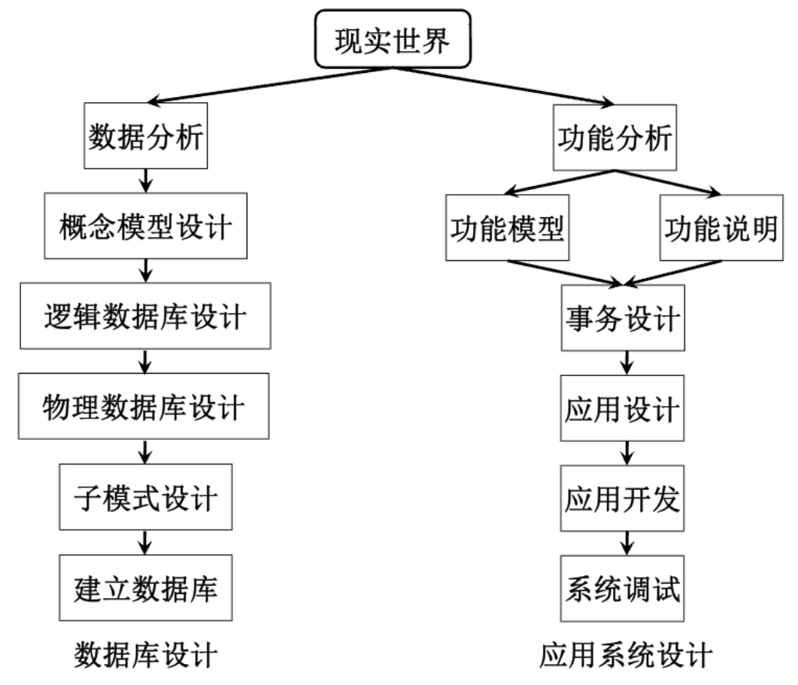
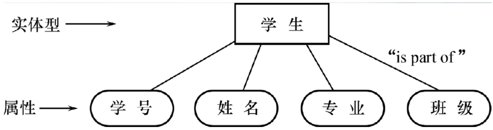
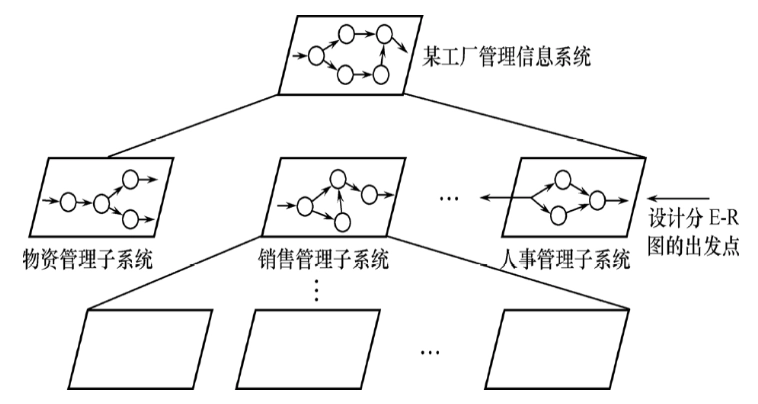
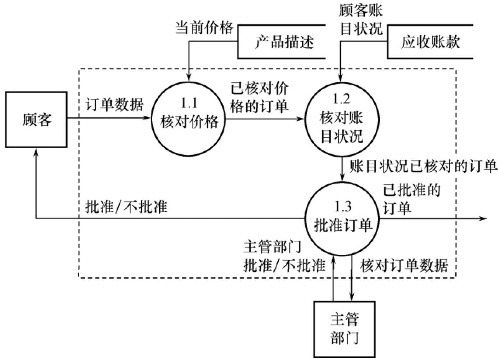
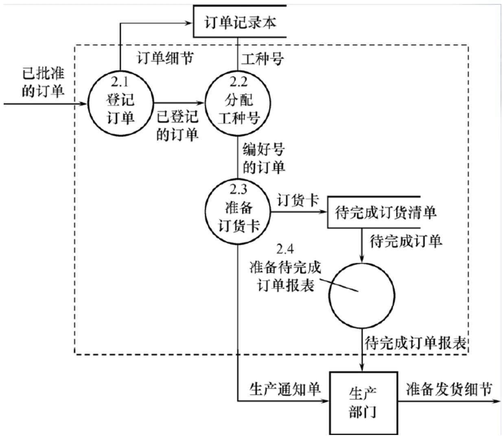
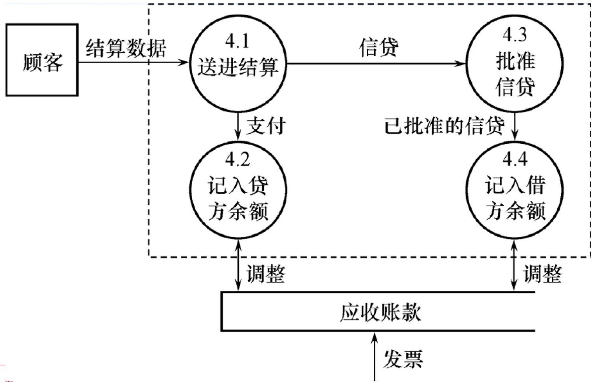
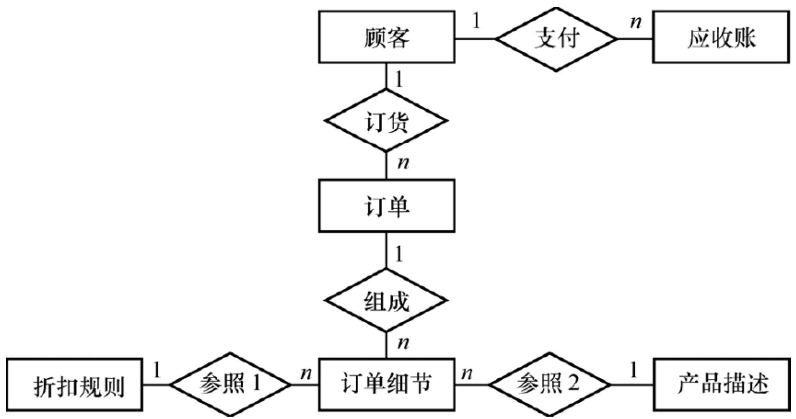
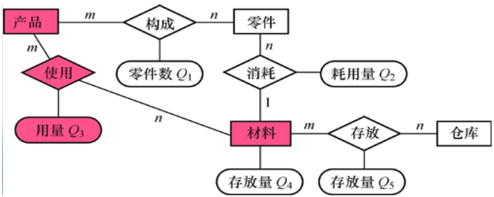
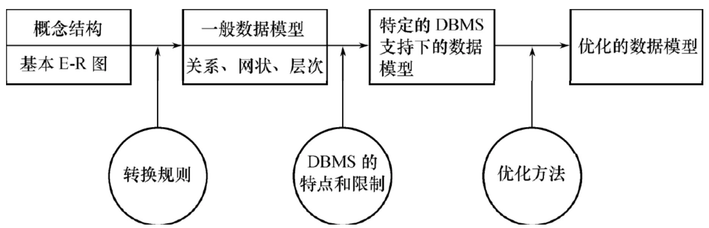
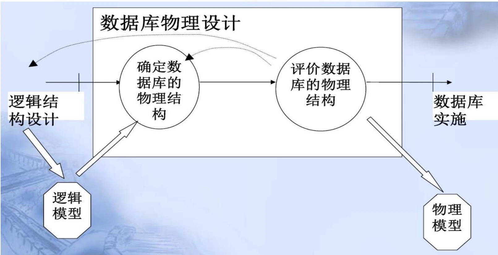

# 第五章 数据库设计

- [Back to Course Home](index.md)

## 数据库设计概述
### 数据库设计简介

- 定义：数据库设计是指对于一个 **给定的应用环境**，构造 (设计) 优化的数据库 **逻辑模式** 和 **物理结构**，并据此建立数据库及其 **应用系统**，使之能够有效地存储和管理数据，满足各种用户的 **应用需求**，包括信息管理要求和数据操作要求。

- 目标：为用户和各种应用系统提供一个信息基础设施和高效率的运行环境。

### 数据库设计的特点

- 数据库建设是硬件、软件和干件的结合

	- 三分技术，七分管理，十二分基础数据

	- 技术与管理的界面称之为“干件”

- 数据库设计应该与应用系统设计相结合

	- 结构（数据）设计：设计数据库框架或数据库结构

	- 行为（处理）设计：设计应用程序、事务处理等

### 数据库设计方法

- 手工与经验相结合方法

	- 设计质量与设计人员的经验和水平有直接关系；

	- 数据库运行一段时间后常常不同程度地发现各种问题，增加了维护代价；

- 规范设计法

	- 基本思想：过程迭代和逐步求精。

	- 数据库设计方法

		- 新奥尔良（New Orleans）方法

			- 将数据库设计分为若干阶段和步骤。

		- 基于 E-R 模型的数据库设计方法

			- 概念设计阶段广泛采用。

		- 3NF（第三范式）的设计方法

			- 逻辑阶段可采用的有效方法。

		- ODL (Object Definition Language) 方法

			- 面向对象的数据库设计方法。

- 计算机辅助设计

	- ORACLE Designer 2000

	- SYBASE PowerDesigner

### 数据库设计的基本步骤

- 数据库设计分 6 个阶段：

	- **阶段**：

		- 需求分析

		- 概念结构设计

		- 逻辑结构设计

		- 物理结构设计

		- 数据库实施

		- 数据库运行和维护

	- 说明

		- 需求分析和概念设计独立于任何数据库管理系统;

		- 逻辑设计和物理设计与选用的 DBMS 密切相关;

- 准备工作：选定参加设计的人

	1. 系统分析人员、数据库设计人员

		- 自始至终参与数据库设计，其水平决定了数据库系统的质量。

	2. 用户和数据库管理员

		- 主要参加需求分析和数据库的运行维护。

	3. 应用开发人员（程序员和操作员）

		- 在系统实施阶段参与进来，负责编制程序和准备软硬件环境。

### 数据库设计特点

- 设计一个完善的数据库应用系统往往是上述六个阶段的不断反复;

- 在设计过程中把数据库的设计和对数据库中数据处理的设计紧密结合起来;

- 将这两个方面的需求分析、抽象、设计、实现在各个阶段同时进行，相互参照，相互补充，以完善两方面的设计；

## 需求分析

- 需求分析就是分析用户的需要与要求

	- 需求分析是设计数据库的起点；

	- 需求分析的结果是否准确地反映了用户的实际要求，将直接影响到后面各个阶段的设计，并影响到设计结果是否合理和实用；

### 需求分析的任务

- 详细调查现实世界要处理的对象（组织、部门、企业等）；

- 充分了解原系统（手工系统或计算机系统）工作概况；

- 明确用户的各种需求；

- 在此基础上确定新系统的功能；

- 充分考虑今后可能的扩充和改变，不能仅仅按当前应用需求来设计数据库；

### 需求分析的重点

- 需求分析的重点是“数据”和“处理”，调查、收集与分析用户在数据管理中：

	- 信息要求（查询内容与性质）

	- 处理要求（功能、响应时间、方式）

	- 安全性与完整性要求

### 需求分析的难点

- 确定用户最终需求的难点

	- 用户缺少计算机知识，无法一下子准确地表达自己的需求，他们所提出的需求往往不断地变化。

	- 设计人员缺少用户的专业知识，不易理解用户的真正需求，甚至误解用户的需求。

	- 新的硬件、软件技术的出现也会使用户需求发生变化。

- 解决方法

	- 设计人员必须采用有效的方法，与用户不断深入地进行交流，才能逐步得以确定用户的实际需求；

### 需求分析的方法

- 调查清楚用户的实际需求并进行初步分析
	

	- 常用调查方法：

		- 跟班作业

		- 开调查会

		- 请专人介绍

		- 询问

		- 设计调查表请用户填写

		- 查阅记录

- 与用户达成共识

- 进一步分析与表达这些需求

	- 常用方法

		- 结构化分析方法（Structured Analysis，简称 SA 方法）

			- 从最上层的系统组织机构入手

			- 自顶向下、逐层分解

			- 用数据流图和数据字典描述系统

		1. 首先把任何一个系统都抽象为：
			

		2. 分解处理功能和数据：

			- 分解处理功能

				- 将处理功能的具体内容分解为若干子功能。

			- 分解数据

				- 处理功能逐步分解同时，逐级分解所用数据，形成若干层次的数据流图。

			- 表达方法

				- 处理逻辑：用判定表或判定树来描述。

				- 数据：用数据字典来描述。

		3. 将分析结果再次提交给用户，征得用户的认可

### 数据字典

- 定义

	- 数据字典是 **关于数据库中数据的描述**，是 **元数据**，而不是数据本身。

	- 数据字典在需求分析阶段建立，在数据库设计过程中不断修改、充实、完善。

- 用途

	- 数据字典是各类数据描述的集合

	- 数据字典是进行详细的数据收集和数据分析所获得的主要结果

	- 数据字典在数据库设计中占有很重要的地位

- 内容

	- **数据字典的内容**：

		- 数据项

		- 数据结构

		- 数据流

		- 数据存储

		- 处理过程

	- 数据项是数据的最小组成单位

	- 若干个数据项可以组成一个数据结构

	- 数据字典通过对数据项和数据结构的定义来描述数据流、数据存储的逻辑内容

#### 数据项

- **数据项是不可再分的数据单位**。

- 对数据项的描述：

	- 数据项描述 = { 数据项名，数据项含义说明，别名，数据类型，长度，取值范围，取值含义，与其他数据项的逻辑关系，数据项之间的联系 }

		- 取值范围、与其他数据项的逻辑关系定义了数据的完整性约束条件

- 举例：学生学籍管理子系统的数据字典。数据项以“学号”为例：

	- 数据项：学号

	- 含义说明：唯一标识每个学生

	- 别名：学生编号

	- 数据类型：字符型

	- 长度：8

	- 取值范围：00000000 至 99999999

	- 取值含义：前两位标别该学生所在年级，后六位按顺序编号

#### 数据结构

- **数据结构反映了数据之间的组合关系**。

- 一个数据结构可以由若干个数据项组成，也可以由若干个数据结构组成，或由若干个数据项和数据结构混合组成。

- 对数据结构的描述：

	- 数据结构描述 = { 数据结构名，含义说明，组成：{ 数据项或数据结构 } }

- 举例：学生学籍管理子系统的数据字典。“学生”是该系统中的一个核心数据结构：

	- 数据结构：学生

	- 含义说明：是学籍管理子系统的主体数据结构，定义了一个学生的有关信息

	- 组成：学号，姓名，性别，年龄，所在系，年级

#### 数据流

- **数据流是数据结构在系统内传输的路径**。

- 对数据流的描述：

	- 数据流描述 = { 数据流名，说明，数据流来源，数据流去向，组成：{ 数据结构 }，平均流量，高峰期流量 }

		- 数据流来源是说明该数据流来自哪个过程

		- 数据流去向是说明该数据流将到哪个过程去

		- 平均流量是指在单位时间（每天、每周、每月等）里的传输次数

		- 高峰期流量则是指在高峰时期的数据流量

- 举例：数据流“体检结果”可如下描述：

	- 数据流：体检结果

	- 说明：学生参加体格检查的最终结果

	- 数据流来源：体检

	- 数据流去向：批准

	- 组成：学生，体检项目，体检结果

	- 平均流量：每年 3000 条

	- 高峰期流量：每月 1000 条

#### 数据存储

- 数据存储是数据结构停留或保存的地方，也是数据流的来源和去向之一。

- 对数据存储的描述：

	- 数据存储描述 = { 数据存储名，说明，编号，输入的数据流，输出的数据流，组成：{ 数据结构 }，数据量，存取频度，存取方式 }

		- 输入的数据流：指出数据来源

		- 输出的数据流：指出数据去向

		- 存取频度：每次存取多少数据，每天（或每小时、每周等）存取几次等信息

		- 存取方法：批处理/联机处理；检索/更新；顺序检索/随机检索；

- 举例：数据存储“体检记录”可如下描述：

	- 数据存储：体检记录

	- 说明：保存学生体格检查的所有记录

	- 编号：DS-01

	- 输入的数据流：体检结果

	- 输出的数据流：体检结果查询

	- 组成：学生，体检项目，体检结果

	- 数据量：每年约 3000 条记录

	- 存取频度：每天存取 50 次

	- 存取方式：联机处理，随机检索，更新

#### 处理过程

- 处理过程的具体处理逻辑一般用判定表或判定树来描述，数据字典中只需要描述处理过程的说明性信息。

- 处理过程说明信息的描述

	- 处理过程描述 = { 处理过程名，说明，输入：{ 数据流 }，输出： { 数据流 }，处理：{ 简要说明 } }

- 举例：处理过程“分配宿舍”可如下描述：

	- 处理过程：分配宿舍

	- 说明：为所有新生分配学生宿舍

	- 输入：学生，宿舍

	- 输出：宿舍安排

	- 处理：在新生报到后，为所有新生分配学生宿舍。要求同一间宿舍只能安排同一性别的学生。同一个学生只能安排在一个宿舍中。每个学生的居住面积不小于 3 平方米。安排新生宿舍其处理时间应不超过 15 分钟。

## 概念结构设计
### 概念结构

- 定义：

	- 需求分析阶段描述的用户应用需求是现实世界的具体需求，将需求分析得到的用户需求抽象为信息结构即概念模型的过程就是概念结构设计；

	- 概念结构是各种数据模型的共同基础，它比数据模型更独立于机器，更抽象，从而更加稳定；

	- **概念结构设计是整个数据库设计的关键**；

	

- 概念结构设计的特点：

	- 能真实、充分地反映现实世界，包括事物和事物之间的联系，能满足用户对数据的处理要求。

	- 易于理解，从而可以用它和不熟悉计算机的用户交换意见。

	- 易于更改，当应用环境和应用要求改变时，容易对概念模型修改和扩充。

	- 易于向关系、网状、层次等各种数据模型转换。

- 描述概念模型的工具

	- E-R 模型

		- 两个实体之间的联系

		

### 概念结构设计的方法

- 概念结构设计的四类方法

	- **自顶向下**

		- 首先定义全局概念结构的框架，然后逐步细化

		

	- **自底向上**

		- 首先定义各局部应用的概念结构，然后将它们集成起来，得到全局概念结构

		

	- **逐步扩张**

		- 首先定义最重要的核心概念结构，然后向外扩充，以滚雪球的方式逐步生成其他概念结构，直至总体概念结构

		

	- 混合策略

		- 将自顶向下和自底向上相结合，用自顶向下策略设计一个全局概念结构的框架，以它为骨架集成由自底向上策略中设计的各局部概念结构。

- 常用策略

	- **自顶向下** 地进行需求分析

	- **自底向上** 地设计概念结构

	

- 自底向上设计概念结构的步骤：

	1. 抽象数据并设计局部视图。

	2. 集成局部视图，得到全局概念结构。

	

### 概念结构设计的步骤

- 抽象数据并设计局部视图。

- 集成局部视图，得到全局概念结构。

- 验证整体概念结构。

#### 抽象数据并设计局部视图
##### 数据抽象

- 概念结构是对现实世界的一种抽象

	- 从实际的人、物、事和概念中抽取所关心的共同特性，忽略非本质的细节；

	- 把这些特性用各种概念精确地加以描述；

	- 这些概念组成了某种模型；

- **三类常用抽象**

	1. **分类**（Classification）

		- 定义某一类概念作为现实世界中一组对象的类型

		- 这些对象具有某些共同的特性和行为

		- 抽象了对象值和型之间的 “is member of” 的语义

		- 在 E-R 模型中，实体型就是这种抽象

		

	2. **聚集**（Aggregation）

		- 定义某一类型的组成成分

		- 抽象了对象内部类型和成分之间“is part of”的语义

		- 在 E-R 模型中若干属性的聚集组成了实体型，就是这种抽象

		

	3. **概括**（Generalization）

		- 定义类型之间的一种子集联系

		- 它抽象了类型之间的 “is subset of” 的语义

		- 概括有一个很重要的性质：继承性。

		

		- 用双竖边的矩形框表示子类

		- 用直线加小圆圈表示超类-子类的联系

- 数据抽象的主要功能：

	- 对需求分析阶段收集到的数据进行分类、组织（聚集），形成

		- 实体

		- 实体的属性，标识实体的码

		- 确定实体之间的联系类型(1:1，1:n，m:n)

##### 局部视图设计

1. 选择局部应用

	- 在多层的数据流图中选择一个适当层次的数据流图，作为设计分 E-R 图的出发点。

	- 通常以中层数据流图作为设计分 E-R 图的依据

	

2. 逐一设计分 E-R 图

	- 任务：

		- 将各局部应用涉及的数据分别从数据字典中抽取出来。

		- 参照数据流图，标定各局部应用中的实体、实体的属性、标识实体的码。

		- 确定实体之间的联系及其类型（1:1，1:n，m:n）。

	- 设计原则：

		- 为了简化 E-R 图的处置，现 **实世界中的事物凡能够作为属性对待的，应尽量作为属性**。

		- 一般原则：

			- 属性不能再具有需要描述的性质。即 **属性必须是不可分的数据项**，不能再由另一些属性组成。

			- 属性不能与其他实体具有联系。**联系只发生在实体之间**。

		- 符合上述两条特性的事物一般作为属性对待。

	- 如何区分实体和属性？

		- 实体与属性是相对而言的。同一事物，在一种应用环境中作为“属性”，在另一种应用环境中就必须作为“实体”。

		

- 案例分析：销售管理子系统分 E-R 图的设计

	- 销售管理子系统的主要功能：

		- 处理顾客和销售员送来的订单。

		- 工厂是根据订货安排生产的。

		- 交出货物同时开出发票。

		- 收到顾客付款后，根据发票存根和信贷情况进行应收款处理。

	- 下图是第一层数据流图，虚线部分划出了系统边界。
		

	- 第二层数据流图：

		- 接收订单
			

		- 处理订单
			

		- 开发票
			

		- 支付过账
			

	- 分 E-R 图的框架：
		

	- 参照第二层数据流图和数据字典，遵循两个准则，进行如下调整：

		- 订单与订单细节（有若干属性）是 1:n 的联系。

		- 原订单和产品的联系实际上是订单细节和产品的联系。

		- “发票主清单”是一个数据存储，不必作为实体。

		- 工厂对大宗订货给予优惠，每种产品有不同订货量的折扣

	- 修改后的分 E-R 图的框架：
		

	- 对每个实体定义的属性如下：

		- 顾客（**顾客号**，顾客名，地址，电话，信贷状况，账目余额）

		- 订单（**订单号**，顾客号，订货项数，订货日期，交货日期，工种号，生产地点）

		- 订单细则（**订单号，细则号**，零件号，订货数，金额）

		- 应收账款（**顾客号，订单号**，发票号，应收金额，支付日期，支付金额，当前余额，货款限额）

		- 产品描述（**产品号**，产品名，单价，重量）

		- 折扣规则（**产品号，订货量**，折扣）

#### 集成视图

- 各个局部视图即分 E-R 图建立好后，还需要对它们进行合并，集成为一个整体的数据概念结构，即总 E-R 图。

- 视图集成的两种方式：

	- **多个分 E-R 图一次集成**

		- 一次集成多个分 E-R 图;

		- 通常用于局部视图比较简单时;

		- 

	- **逐步累积式**

		- 首先集成两个局部视图（通常是比较关键的两个）

		- 以后每次将一个新的局部视图集成进来

		- 

- 集成局部 E-R 图的步骤
	

##### 合并分 E-R 图，生成初步 E-R 图

- 各分 E-R 图存在冲突

	- **属性冲突**

		- **属性域冲突**：属性值的类型、取值范围或取值集合不同。

			- 例：某些部门（即局部应用）以出生日期形式表示学生的年龄，而另一些部门（即局部应用）用整数形式表示学生的年龄。

		- **属性取值单位冲突**。

			- 例：学生的身高，有的以米为单位，有的以厘米为单位，有的以尺为单位。

	- **命名冲突**

		- **同名异义**：不同意义的对象在不同的局部应用中具有相同的名字

			- 例：局部应用 A 中将教室称为房间，局部应用 B 中将学生宿舍称为房间

		- **异名同义**（一义多名）：同一意义的对象在不同的局部应用中具有不同的名字

			- 例：有的部门把教科书称为课本，有的部门则把教科书称为教材

	- **结构冲突**

		- 同一对象在不同应用中具有不同的抽象；

			- 例：某些局部应用中把职位作为实体，而另一些局部应用中把职位作为属性；

		- **同一实体在不同分 E-R 图中所包含的属性个数和属性排列次序不完全相同**；

			- 例：某些局部应用中职工的属性包括职工号、姓名、性别、出生日期，而另一些局部应用中职工的属性还包括职称、工资等；

		- 实体之间的联系在不同局部视图中呈现不同的类型；

			- 例：某些局部应用中把职工和项目之间的联系看作多对多联系，而另一些局部应用中把它看作两个一对多联系的组合。

- 合并分 E-R 图的主要工作与关键

	- 合理消除各分 E-R 图的冲突。

##### 修改与重构，生成基本 E-R 图

- 基本任务：消除不必要的冗余，设计生成基本 E-R 图
	

- 冗余

	- 冗余的数据是指可由基本数据导出的数据，冗余的联系是指可由其他联系导出的联系。

	- 冗余数据和冗余联系容易破坏数据库的完整性，给数据库维护增加困难

	- 并不是所有的冗余数据与冗余联系都必须加以消除，有时为了提高某些应用的效率，不得不以冗余信息作为代价。

		- 效率 VS 冗余信息。

			- 需要根据用户的整体需求来确定。

		- 若人为地保留了一些冗余数据，则应把数据字典中数据关联的说明作为完整性约束条件。

			- 例如：$Q4 = \sum Q5$，一旦 $Q5$ 修改后就应当触发完整性检查，对 $Q4$ 进行修改。

- 消除冗余的方法

	- 分析方法：以数据字典和数据流图为依据，根据数据字典中关于数据项之间逻辑关系的说明来消除冗余。
		

	- 规范化理论：函数依赖的概念提供了消除冗余联系的形式化工具。

		1. 确定分 E-R 图实体之间的数据依赖 $F_{L}$  。

			- 例：部门和职工之间一对多的联系可表示为：职工号  $\rightarrow$  部门号

			- 例：职工和项目之间多对多的联系可表示为：（职工号，项目号）→工作天数
				

		1. 求 $F_{L}$ 的最小覆盖 $G_{L}$ ，差集为：$D = F _ {L} - G _ {L}$，逐一考察  $D$  中的函数依赖，确定是否是冗余的联系，若是，就把它去掉。

			- 冗余的联系一定在 $D$ 中，而 $D$ 中的联系不一定是冗余的；

			- 当实体之间存在多种联系时，要将实体之间的联系在形式上加以区分；

- 案例分析：某工厂管理信息系统的视图集成

	- 工厂物资管理、销售管理子系统、劳动人事管理的分 E-R 图
		

	- 工厂管理信息系统的基本 E-R 图
		

	- 集成过程，解决了以下问题：

		- 异名同义，项目和产品含义相同。

		- 库存管理中职工与仓库的工作关系已包含在劳动人事管理的部门与职工之间的联系之中，所以可以取消。

		- 职工之间领导与被领导关系可由部门与职工（经理）之间的领导关系、部门与职工之间的从属关系两者导出，所以也可以取消。

#### 验证整体概念结构

- 视图集成后形成一个整体的数据库概念结构，对该整体概念结构还必须进行进一步验证，确保它能够满足下列条件：

	- 整体概念结构内部必须具有一致性，不存在互相矛盾的表达。

	- 整体概念结构能准确地反映原来的每个视图结构，包括属性、实体及实体间的联系。

	- 整体概念结构能满足需要分析阶段所确定的所有要求。

## 逻辑结构设计

- 逻辑结构设计的任务：把概念结构设计阶段设计好的基本 E-R 图转换为与选用 DBMS 产品所支持的数据模型相符合的逻辑结构。

- 逻辑结构设计的步骤
	

### E-R 图向关系模型的转换

- 转换内容

	- E-R 图由实体、实体的属性和实体之间的联系三个要素组成

	- 关系模型的逻辑结构是一组关系模式的集合

	- 将 E-R 图转换为关系模型：将实体、实体的属性和实体之间的联系转化为关系模式。

#### 一个实体型转换为一个关系模式

- **关系的属性**：实体型的属性

- **关系的码**：实体型的码

- 示例：学生实体可以转换为如下关系模式：

	- 学生（**学号**，姓名，出生日期，所在系，年级，平均成绩）

	- 注意：性别、宿舍、班级、档案材料、教师、课程、教室、教科书可用别的关系模式表达。

#### 一个 m:n 联系转换为一个关系模式

- **关系的属性**：与该联系相连的各实体的码以及联系本身的属性

- **关系的码**：各实体码的组合

- 示例：“选修”联系是一个 m:n 联系，可以将它转换为如下关系模式，其中学号与课程号为关系的组合码：

	- 选修（**学号，课程号**，成绩）

#### 一个 1:n 联系可以转换为一个独立的关系模式，也可以与 n 端对应的关系模式合并

1. 转换为一个独立的关系模式

	- **关系的属性**：与该联系相连的各实体的码以及联系本身的属性

	- **关系的码**：n 端实体的码

2. **与 n 端对应的关系模式合并**（更常用）

	- **合并后关系的属性**：在 n 端关系中加入 1 端关系的码和联系本身的属性

	- **合并后关系的码**：不变

	- 可以减少系统中的关系个数，一般情况下更倾向于采用这种方法

- 示例：“组成”联系（学生组成班级）为 1:n 联系，可以有两种转换方法：

	1. 转换为一个独立的关系模式：

		- 组成（**学号**，班级号）

	2. “组成”联系与学生关系模式合并，则只需在学生关系中加入班级关系的码，即班级号：

		- 学生（**学号**，姓名，出生日期，所在系，年级，*班级号*，平均成绩）

#### 一个 1:1 联系可以转换为一个独立的关系模式，也可以与任意一端对应的关系模式合并

1. 转换为一个独立的关系模式

	- **关系的属性**：与该联系相连的各实体的码以及联系本身的属性

	- **关系的候选码**：每个实体的码均是该关系的候选码

2. 与某一端对应的关系模式合并

	- **合并后关系的属性**：加入对应关系的码和联系本身的属性

	- **合并后关系的码**：不变

- 示例：“管理”联系（老师管理班级）为 1:1 联系，可以有三种转换方法：

	1. 转换为一个独立的关系模式：

		- 管理（**职工号**，班级号）

		- 管理（职工号，**班级号**）

	2. “管理”联系与班级关系模式合并，则只需在班级关系中加入教师关系的码，即职工号：

		- 班级（**班级号**，学生人数，*管理职工号*）

	3. “管理”联系与教师关系模式合并，则只需在教师关系中加入班级关系的码，即班级号：

		- 教师（**职工号**，姓名，性别，职称，*管理班级号*，是否为优秀班主任）

- **注意**：

	- 从理论上讲，1:1 联系可以与任意一端对应的关系模式合并。

	- 但在一些情况下，与不同的关系模式合并效率会大不一样。因此究竟应该与哪端的关系模式合并需要依应用的具体情况而定。

	- 由于连接操作是最费时的操作，所以一般应以尽量减少连接操作为目标。

		- 例如，如果经常要查询某个班级的班主任姓名，则将管理联系与教师关系合并更好些。

#### 三个或三个以上实体间的一个多元联系转换为一个关系模式

- **关系的属性**：与该多元联系相连的各实体的码以及联系本身的属性

- **关系的码**：各实体码的组合

- 示例：“讲授” 联系是一个三元联系，可以将它转换为如下关系模式，其中课程号、职工号和书号为关系的组合码：

	- 讲授（**课程号，职工号，书号**）

#### 具有相同码的关系模式可合并

- 目的：减少系统中的关系个数。

- 合并方法：将其中一个关系模式的全部属性加入到另一个关系模式中，然后去掉其中的同义属性（可能同名也可能不同名），并适当调整属性的次序。

#### 案例分析

- 工厂管理信息系统的基本 E-R 图，虚线上方的部分转换为关系模式（**加粗/下划线为主码，斜体/波浪线为外码**）：

	- 部门（**部门号**，部门名，*部门经理的职工号*，……）

	- 职工（**职工号**，姓名，*部门号*，……）

	- 产品（**产品号**，产品名，*产品组长的职工号*，……）

	- 供应商（**供应商号**，供应商名，……）

	- 零件（**零件号**，零件名，……）

	- 职工工作（***职工号*，*产品号***，工作天数，……）

	- 供应（***产品号*，*供应商号*，*零件号***，供应量，……）

### 数据模型的优化

- 数据库逻辑设计的结果不是唯一的。

- 得到初步数据模型后，还应该适当地修改、调整数据模型的结构，以进一步提高数据库应用系统的性能，这就是数据模型的优化。

- 关系数据模型的优化通常以规范化理论为指导。

#### 优化数据模型的方法

1. 确定数据依赖

	- 按需求分析阶段所得到的语义，分别写出每个关系模式内部各属性之间的数据依赖以及不同关系模式属性之间数据的依赖。

2. 消除冗余的联系

	- 对于各个关系模式之间的数据依赖进行极小化处理，消除冗余的联系。

3. 确定所属范式

	- 按照数据依赖的理论对关系模式逐一进行分析;

	- 考查是否存在部分函数依赖、传递函数依赖、多值依赖等；

	- 确定各关系模式分别属于第几范式。

4. 按照需求分析阶段得到的各种应用对数据处理的要求，分析对于这样的应用环境这些模式是否合适，确定是否要对它们进行合并或分解。

	- 注意：并不是规范化程度越高的关系就越优，一般说来，第三范式就足够了。

	- 示例：

		- 在关系模式：学生成绩单（学号，英语，数学，语文，平均成绩）中存在下列函数依赖：

			- 学号 $\to$ 英语

			- 学号 $\to$ 数学

			- 学号 $\to$ 语文

			- 学号 $\to$ 平均成绩

			- (英语，数学，语文) $\to$ 平均成绩

		- 显然有：学号 $\to$ (英语，数学，语文) $\to$ 平均成绩，因此该关系模式中存在传递函数依赖，是 2NF 关系。

		- 虽然平均成绩可以由其它属性推算出来，但如果应用中需要经常查询学生的平均成绩，为提高效率，仍然可保留该冗余数据，对关系模式不再做进一步分解。

5. 按照需求分析阶段得到的各种应用对数据处理的要求，对关系模式进行必要的分解，以提高数据操作的效率和存储空间的利用率。

	- 常用分解方法：

		- 水平分解

			- 把（基本）关系的元组分为若干子集合，定义每个子集合为一个子关系，以提高系统的效率。

			- 适用范围

				1. 满足“80/20 原则”的应用

				2. 并发事务经常存取不相交的数据

		- 垂直分解

			- 把关系模式 $R$ 的属性分解为若干子集合，形成若干子关系模式。

			- 原则：取决于分解后 $R$ 上的所有事务的总效率是否得到了提高。

### 设计用户子模式

- 定义数据库全局模式主要是从系统的时间效率、空间效率、易维护等角度出发。

- 定义用户外模式时应注重 **考虑用户的习惯与方便**，包括：

	1. 使用更符合用户习惯的别名。

	2. 针对不同级别的用户定义不同的视图（VIEW），以满足系统对安全性的要求。

	3. 简化用户对系统的使用。

- 示例：教师关系模式中包括职工号、姓名、性别、出生日期、婚姻状况、学历、学位、政治面貌、职称、职务、工资、工龄、教学效果等属性。

	- 定义两个外模式：

		- 教师_学籍管理（职工号，姓名，性别，职称）

		- 教师_课程管理（工号，姓名，性别，学历，学位，职称，教学效果）

	- 则有：

		- 授权学籍管理应用只能访问教师_学籍管理视图

		- 授权课程管理应用只能访问教师_课程管理视图

		- 授权教师管理应用能访问教师表

	- 这样就可以防止用户非法访问本来不允许他们查询的数据，保证了系统的安全性。

## 数据库物理设计
### 数据库的物理设计

- 定义：

	- 数据库在物理设备上的存储结构与存取方法称为数据库的物理结构，它依赖于选定的数据库管理系统。

	- 为一个给定的逻辑数据模型选取一个最适合应用环境的物理结构的过程，就是数据库的物理设计。

- 数据库物理设计的步骤
	

### 数据库物理设计的内容和方法

- 设计物理数据库结构的准备工作

	- 对要运行的事务进行详细分析，获得选择物理数据库设计所需参数。

	- 充分了解所用 RDBMS 的内部特征，特别是系统提供的存取方法和存储结构。

- 选择物理数据库设计所需参数

	- 数据库查询事务

		- 查询的关系

		- 查询条件所涉及的属性

		- 连接条件所涉及的属性

		- 查询的投影属性

	- 数据更新事务

		- 被更新的关系

		- 每个关系上的更新操作条件所涉及的属性

		- 修改操作要改变的属性值

	- **每个事务在各关系上运行的频率和性能要求**

- 关系数据库物理设计的内容

	1. 为关系模式选择存取方法（建立存取路径）

	2. 设计关系、索引等数据库文件的物理存储结构

### 关系模式存取方法选择

- 数据库系统是多用户共享的系统，对同一个关系要建立多条存取路径才能满足多用户的多种应用要求。

- 物理设计的第一个任务就是要确定选择哪些存取方法，即建立哪些存取路径。

- DBMS 常用存取方法

	- 索引（Index）方法

		- B+ 树索引

		- Hash 索引

	- 聚簇（Cluster）方法

#### B+ 树索引存取方法

- 选择索引存取方法的主要内容，根据应用要求确定：

	- 对哪些属性列建立索引

	- 对哪些属性列建立组合索引

	- 对哪些索引要设计为唯一索引

- 选择索引存取方法的一般规则：

	- 如果一个（或一组）属性经常在 **查询条件** 中出现，则考虑在这个（或这组）属性上建立索引（或组合索引）；

	- 如果一个属性经常作为最大值和最小值等 **聚集函数** 的参数，则考虑在这个属性上建立索引；

	- 如果一个（或一组）属性经常在连接操作的 **连接条件** 中出现，则考虑在这个（或这组）属性上建立索引；

- 索引存取方法的选择

	- 关系上定义的索引数过多会带来较多的额外开销

		- 维护索引的开销

		- 查找索引的开销

	- 若一个关系更新频率很高，这个关系上不能定义太多索引

#### Hash 索引存取方法

- 选择 hash 索引存取方法的一般规则：

	- 一个关系的属性主要出现在 **等值连接条件**；

	- 一个关系的属性主要出现在 **等值比较选择条件**；

	- 而且满足下列两个条件之一：

		- 一个关系的大小可预知，而且不变；

		- 关系的大小动态改变，但 DBMS 提供了动态 hash 存取方法。

#### 聚簇存取方法

- 聚簇的定义：

	- 为了提高某个属性（或属性组）的查询速度，把这个或这些属性（称为聚簇码）上具有相同值的元组集中存放在连续的物理块称为聚簇。

	- 许多关系型 DBMS 都提供了聚簇功能

	- 聚簇存放与聚簇索引的区别？

		- 聚簇存放是指把具有相同聚簇码值的元组物理上存放在一起，是一种物理存储结构

		- 聚簇索引是指在某个属性（或属性组）上建立索引，是一种存取方法。

- 聚簇的用途

	1. **大大提高按聚簇属性进行查询的效率**

		- 例：假设学生关系按所在系建有索引，现在要查询信息系的所有学生名单。

			- 信息系的 500 名学生分布在 500 个不同的物理块上时，至少要执行 500 次 I/O 操作。

			- 如果将同一系的学生元组集中存放，则每读一个物理块可得到多个满足查询条件的元组，从而显著地减少了访问磁盘的次数。

	2. **节省存储空间**

		- 聚簇以后，聚簇码相同的元组集中在一起了，因而聚簇码值不必在每个元组中重复存储，只要在一组中存一次就行了

	3. **多表预连接**

		- 例：假设用户经常要按系别查询学生成绩单，这一查询涉及学生关系和选修关系的连接操作，即需要按学号连接这两个关系，为提高连接操作的效率，可以把具有相同学号值的学生元组和选修元组在物理上聚簇在一起。这就相当于把多个关系按“预连接”的形式存放，从而大大提高连接操作的效率。

- 聚簇存取方法的选择

	1. 设计候选聚簇

		- 对经常在一起进行 **连接操作** 的关系可以建立组合聚簇;

		- 如果一个关系的一组属性经常出现在 **相等比较条件** 中，则该单个关系可建立聚簇；

		- 如果一个关系的一个（或一组）属性上的 **值重复率很高**，则此单个关系可建立聚簇。

		- 对应每个聚簇码值的平均元组数不太少，太少了，聚簇的效果不明显。

	2. 检查候选聚簇中的关系，取消其中不必要的关系

		- 从独立聚簇中删除经常进行 **全表扫描** 的关系;

		- 从独立/组合聚簇中删除 **更新操作远多于查询** 操作的关系;

		- 从独立/组合聚簇中删除 **重复出现** 的关系;

			- 当一个关系同时加入多个聚簇时，必须从这多个聚簇方案（包括不建立聚簇）中选择一个较优的，即在这个聚簇上运行各种事务的总代价最小

- 聚簇的局限性

	- 聚簇只能提高某些特定应用的性能

	- 建立与维护聚簇的开销相当大

		- 对已有关系建立聚簇，将导致关系中元组移动其物理存储位置，并使此关系上原有的索引无效，必须重建。

		- 当一个元组的聚簇码改变时，该元组的存储位置也要做相应移动

- 聚簇的适用范围

	- 当通过聚簇码进行访问或连接是该关系的主要应用，与聚簇码无关的其他访问很少或者是次要的时，可以使用聚簇。

	- 尤其当 SQL 语句中包含有与聚簇码有关的 `ORDER BY`，`GROUP BY`，`UNION`，`DISTINCT` 等子句或短语时，使用聚簇特别有利，可以省去对结果集的排序操作

#### 位图索引存取方法

- 位图索引的定义

	- 位图索引是一种特殊的索引结构，它使用位图来表示某个属性（或属性组）上各个值在关系中的存在情况。

- 位图索引的适用范围

	- 适用于 **属性值重复率较高** 的属性

	- 适用于 **读操作远多于写操作** 的关系

### 确定数据库的存储结构

- 确定数据库物理结构的内容

	1. 确定数据的存放位置和存储结构

		- 关系

		- 索引

		- 聚簇

		- 日志

		- 备份

	2. 确定系统配置

#### 确定数据的存放位置

- 影响数据存放位置和存储结构的因素

	- 硬件环境

	- 应用需求

		- 存取时间

		- 存储空间利用率

		- 维护代价

	- 注意：这三个方面常常是相互矛盾的，例如：消除一切冗余数据虽能够节约存储空间和减少维护代价，但往往会导致检索代价的增加必须进行权衡，选择一个折中方案。

- 基本原则：

	- 根据应用情况将数据分开存放，以提高系统性能

		- 易变部分与稳定部分

- 示例：

	- 数据库数据备份、日志文件备份等由于只在故障恢复时才使用，而且数据量很大，可以考虑存放在磁带上。

	- 如果计算机有多个磁盘，可以考虑将表和索引分别放在不同的磁盘上，在查询时，由于两个磁盘驱动器分别在工作，因而可以保证物理读写速度比较快。

	- 可以将比较大的表分别放在两个磁盘上，以加快存取速度，这在多用户环境下特别有效。

	- 可以将日志文件与数据库对象（表、索引等）放在不同的磁盘以改进系统的性能。

#### 确定系统配置

- DBMS 产品一般都提供了一些存储分配参数

	- 同时使用数据库的用户数

	- 同时打开的数据库对象数

	- 使用的缓冲区长度、个数

	- 时间片大小

	- 数据库的大小

	- 装填因子

	- 锁的数目

	- ……

### 评价物理结构

- 评价内容

	- 对数据库物理设计过程中产生的多种方案进行细致的评价，从中选择一个较优的方案作为数据库的物理结构

- 评价方法

	- 定量估算各种方案

		- 存取时间（时间效率）

		- 存储空间（空间效率）

		- 维护代价

		- 用户要求

	- 对估算结果进行权衡、比较，选择出一个较优的合理的物理结构

	- 如果该结构不符合用户需求，则需要修改设计

## 数据库实施与维护
### 数据库的实施

- 数据库实施的工作内容：

	- 用 DDL 定义数据库结构

	- 数据载入，组织数据入库

	- 编制与调试应用程序

	- 数据库试运行

#### 数据装载

- 数据库结构建立好后，就可以向数据库中装载数据。组织数据入库是数据库实施阶段最主要的工作。

- 数据装载方法

	- 人工方法

	- 计算机辅助数据入库

#### 编制与调试应用程序

- 数据库应用程序的设计应该与数据库设计并行进行。

- 在数据库实施阶段，当数据库结构建立好后，就可以开始编制与调试数据库的应用程序。调试应用程序时由于数据入库尚未完成，可先使用模拟数据。

#### 数据库试运行

- 应用程序调试完成，并且已有一小部分数据入库后，就可以开始数据库的试运行。

- 数据库试运行也称为联合调试，其主要工作包括：

	1. 功能测试：实际运行应用程序，执行对数据库的各种操作，测试应用程序的各种功能。

	2. 性能测试：测量系统的性能指标，分析是否符合设计目标。

- 数据的分期入库

	- 重新设计物理结构甚至逻辑结构，会导致数据重新入库。

	- 由于数据入库工作量实在太大，所以可以采用分期输入数据的方法：

		- 先输入小批量数据供先期联合调试使用；

		- 待试运行基本合格后再输入大批量数据；

		- 逐步增加数据量，逐步完成运行评价；

- 数据库的转储和恢复

	- 在数据库试运行阶段，系统还不稳定，硬、软件故障随时都可能发生；

	- 系统的操作人员对新系统还不熟悉，误操作也不可避免；

	- 必须做好数据库的转储和恢复工作，尽量减少对数据库的破坏。

- 数据库试运行结果符合设计目标后，数据库就可以真正投入运行了。

- 数据库投入运行标着开发任务的基本完成和维护工作的开始

- 对数据库设计进行评价、调整、修改等维护工作是一个长期的任务，也是设计工作的继续和提高。

	- 应用环境在不断变化

	- 数据库运行过程中物理存储会不断变化

- 在数据库运行阶段，**对数据库经常性的维护工作主要是由 DBA 完成的**，包括：

	1. 数据库的转储和恢复；

	2. 数据库的安全性、完整性控制；

	3. 数据库性能的监督、分析和改进；

	4. 数据库的重组织和重构造；

#### 数据库的重组织和重构造

- 重组织的形式：

	- 全部重组织。

	- 部分重组织。

		- 只对频繁增、删的表进行重组织。

- 重组织的目标：提高系统性能

- 重组织的工作：

	- 按原设计要求：

		- 重新安排存储位置

		- 回收垃圾

		- 减少指针链重组织的目标

	- 数据库的重组织不会改变原设计的数据逻辑结构和物理结构。

- 数据库重构造：

	- 根据新环境调整数据库的模式和内模式

	- 增加新的数据项

	- 改变数据项的类型

	- 改变数据库的容量

	- 增加或删除索引

	- 修改完整性约束条件