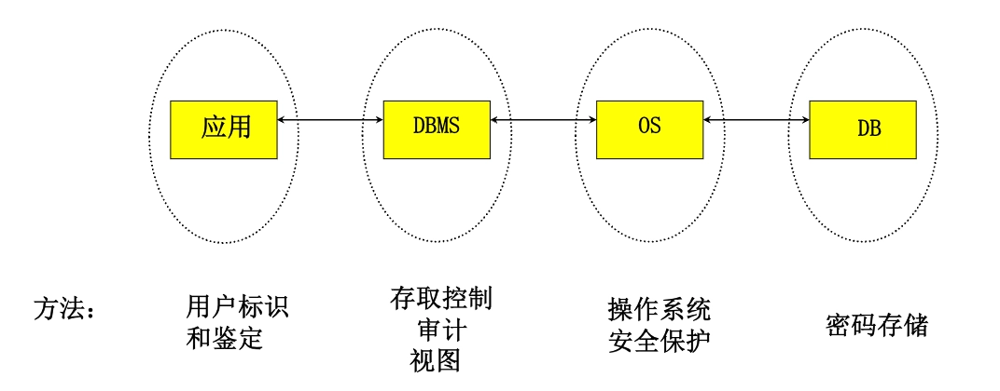
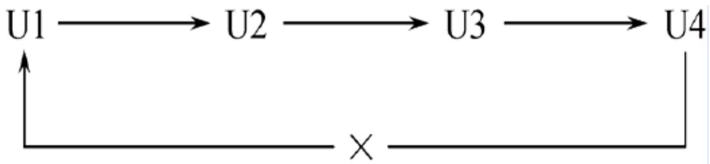
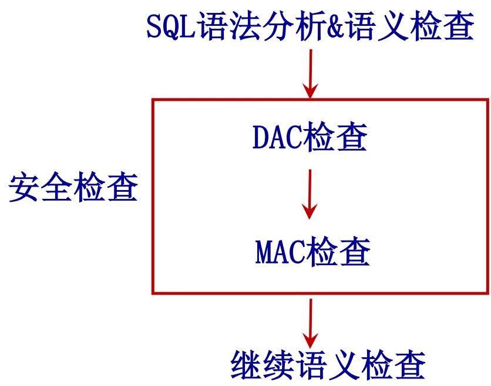
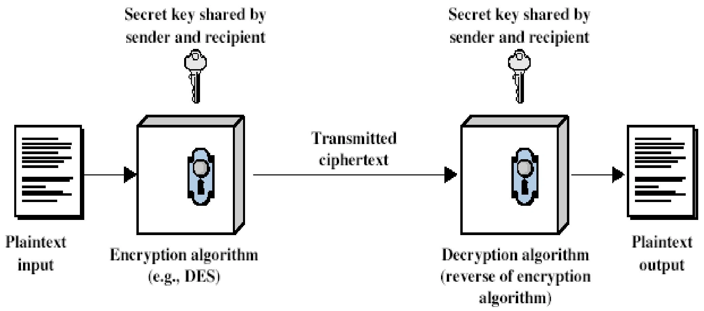
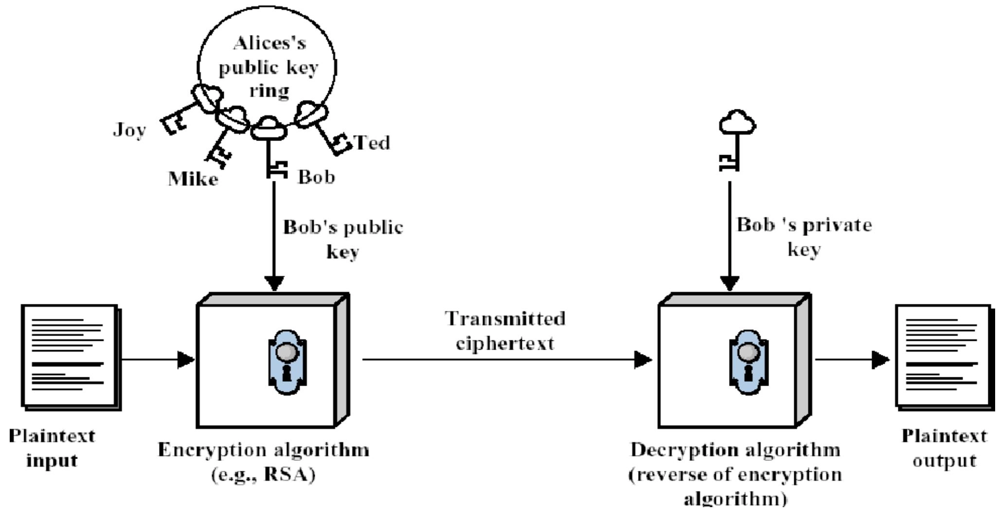
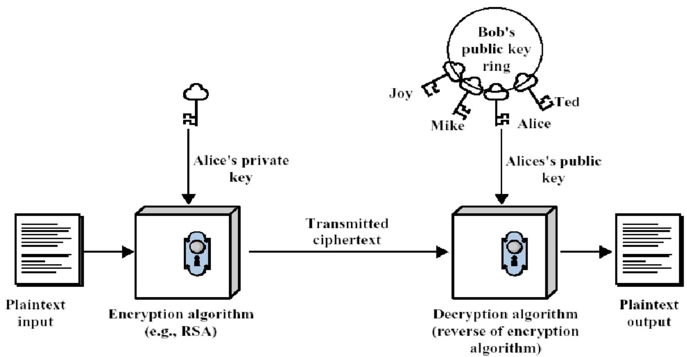

# 第六章 数据库安全

- [Back to Course Home](index.md)

## 计算机安全性概述
### 数据库的不安全因素

- 数据库的安全性，是指保护数据库以防止不合法使用所造成的数据泄漏、更改或破坏。
- 产生威胁的因素：
	- 非授权用户对数据库的恶意存取和破坏；
	- 数据库中重要或敏感的数据被泄露；
	- 安全环境的脆弱性；

### 可信计算机系统评测标准

- 为降低进而消除对系统的安全攻击，各国引用或制定了一系列安全标准：
	

- 1985 年美国国防部（DoD）正式颁布《DoD 可信计算机系统评估标准》（简称 TCSEC 或 DoD85）
	- TCSEC 又称**桔皮书**
	- TCSEC 标准的目的:
		- 提供一种标准，使用户可以对其计算机系统内敏感信息安全操作的可信程度做评估。
		- 给计算机行业的制造商提供一种可循的指导规则，使其产品能够更好地满足敏感应用的安全需求。
- 1991 年 4 月美国 NCSC（国家计算机安全中心）颁布了《可信计算机系统评估标准关于可信数据库系统的解释》（TCSEC/ Trusted Database Interpretation 简称 TCSEC/TDI）
	- TDI 又称**紫皮书**，它将 TCSEC 扩展到数据库管理系统。
	- TDI 中定义了数据库管理系统的设计与实现中需满足和用以进行安全性级别评估的标准。

- TCSEC/TDI 安全级别划分
	<table>
	<thead>
	<td><strong>类别</strong></td>
	<td><strong>级别</strong></td>
	<td><strong>名称</strong></td>
	<td><strong>主要特征</strong></td>
	</thead>
	<tr>
	<td>D</td>
	<td>D</td>
	<td>最小保护</td>
	<td>没有安全保护，如 ms-dos</td>
	</tr>
	<tr>
	<td rowspan="2">C</td>
	<td>C1</td>
	<td>自主安全保护</td>
	<td>实现自主存取控制 DAC，具有识别与授权的责任，如早期 UNIX 系统</td>
	</tr>
	<tr>
	<td>C2</td>
	<td>受控存储控制</td>
	<td>安全产品的最低档，提供受控的存取保护，实施审计和资源隔离，Windows 2000 和 Oracle 7</td>
	</tr>
	<tr>
	<td rowspan="3">B</td>
	<td>B1</td>
	<td>标识安全保护</td>
	<td>对系统数据加以标记，实施强制存取控制 MAC 和审计，如 Oracle 公司的 Trusted Oracle 7，Sybase 公司的 Secure SQL Server version 11.0.6</td>
	</tr>
	<tr>
	<td>B2</td>
	<td>结构化保护</td>
	<td>除满足 B1 要求外，要实行强制性的控制并进行严格的保护，如 Trusted Xenix 系统。</td>
	</tr>
	<tr>
	<td>B3</td>
	<td>安全域</td>
	<td>提供可信设备的管理和恢复，即使计算机崩溃也不会泄露系统信息。如 Honeywell Federal Systems XTS-200</td>
	</tr>
	<tr>
	<td>A</td>
	<td>A</td>
	<td>验证设计</td>
	<td>形式化的最高级描述和验证</td>
	</tr>
	</table>

- CC 标准
	- 提出国际公认的表述信息技术安全性的结构。
	- 把信息产品的安全要求分为：
		- 安全功能要求：规范产品和系统的安全行为；
		- 安全保证要求：解决如何正确有效地实施这些功能。
- CC 评估保证级划分

	| 评估保证级 | 定义 | TCSEC 安全级别（近似） |
	| --- | --- | --- |
	| EAL 1 | 功能测试 (functionally tested) |  |
	| EAL 2 | 结构测试 (structurally tested) | C1 |
	| EAL 3 | 系统地测试和检查 (methodically tested and checked) | C2 |
	| EAL 4 | 系统地设计、测试和复查 (methodically designed, tested and reviewed) | B1 |
	| EAL 5 | 半形式化设计和测试(semifomally designed and tested) | B2 |
	| EAL 6 | 半形式化验证的设计和测试(semifomally verified design and tested) | B3 |
	| EAL 7 | 形式化验证的设计和测试(formally verified design and tested) | A1 |

## 数据库安全性控制
### 数据库安全性控制概述

- 非法使用数据库的情况
	- 用户编写一段合法的程序绕过 DBMS 及其授权机制，通过操作系统直接存取、修改或备份数据库中的数据；
	- 直接或编写应用程序执行非授权操作；
	- 通过多次合法查询数据库从中推导出一些保密数据；
	- 破坏安全性的行为可能是无意的、故意的、恶意的。
- 安全性控制层次
	

- 数据库安全性控制的常用方法
	- 用户标识和鉴定
	- 存取控制
	- 视图
	- 审计
	- 数据加密

### 用户标识与鉴别

- 用户标识与鉴别（Identification & Authentication）
	- 系统提供的最外层安全保护措施
	- 主要方法：
		- 静态口令鉴别
		- 动态口令鉴别
		- 生物特征鉴别
		- 智能卡鉴别

### 存取控制

- 存取控制机制的组成:
	- 定义用户存取权限
	- 合法存取权限检查
- 用户权限定义和合法权检查机制一起组成了 DBMS 的存取控制子系统。
- 常用存取控制方法:
	- **自主存取控制**（Discretionary Access Control，简称 DAC）
		- 用户对不同的数据对象有不同的存取权限，不同的用户对同一对象也有不同的权限，用户还可将其拥有的存取权限转授给其他用户。
		- C2 级
		- 灵活
	- **强制存取控制**（Mandatory Access Control，简称 MAC）
		- 每一个数据对象被标以一定的密级，每一个用户也被授予某一个级别的许可证。对任意一个对象，只有具有合法许可证的用户才可以存取。
		- B1 级
		- 严格

#### 自主存取控制 DAC

- **定义**：
	- 自主存取控制（DAC）是指用户对自己所创建的数据库对象具有完全的控制权，可以决定其他用户对这些对象的存取权限。
- 特点：
	- 通过 SQL 的 `GRANT` 语句和 `REVOKE` 语句实现。
	- 用户权限组成:
		- 数据对象
		- 操作类型
	- 定义用户存取权限：定义用户可以在哪些数据库对象上进行哪些类型的操作。
	- 定义存取权限称为授权。
- 关系数据库系统中的存取控制对象和存取权限
	<table>
	<thead>
	<td><strong>对象类型</strong></td>
	<td><strong>对象</strong></td>
	<td><strong>操作类型</strong></td>
	</thead>
	<tr>
	<td rowspan="4">数据库模式</td>
	<td>模式</td>
	<td><code>CREATE SCHEMA</code></td>
	</tr>
	<tr>
	<td>基本表</td>
	<td><code>CREATE TABLE</code>, <code>ALTER TABLE</code></td>
	</tr>
	<tr>
	<td>视图</td>
	<td><code>CREATE VIEW</code></td>
	</tr>
	<tr>
	<td>索引</td>
	<td><code>CREATE INDEX</code></td>
	</tr>
	<tr>
	<td rowspan="2">数据</td>
	<td>基本表和视图</td>
	<td><code>SELECT</code>, <code>INSERT</code>, <code>UPDATE</code>, <code>DELETE</code>, <code>REFERENCES</code>, <code>ALL PRIVILEGES</code></td>
	</tr>
	<tr>
	<td>属性列</td>
	<td><code>SELECT</code>, <code>INSERT</code>, <code>UPDATE</code>, <code>REFERENCES</code>, <code>ALL PRIVILEGES</code></td>
	</tr>
	</table>

##### 授权与回收

- GRANT
	- `GRANT` 语句的一般格式:
		```sql
		GRANT <权限> [ ,<权限> ]...
		[ ON <对象类型> <对象名> ]
		TO <用户> [ ,<用户> ]...
		[ WITH GRANT OPTION ];
		```

	- 语义：将对指定操作对象的指定操作权限授予指定的用户。
	- 发出 `GRANT`：
		- DBA
		- 数据库对象创建者（即属 Owner）
		- 拥有该权限的用户
	- 接受权限的用户:
		- 一个或多个具体用户；
		- PUBLIC（全体用户）。
	- `WITH GRANT OPTION` 子句
		- 指定：可以再授予。
		- 没有指定：不能传播。
	- 不允许循环授权:
		

	- 示例:
		1. 把查询 Student 表的权限授给用户 U1。
			```sql
			GRANT SELECT
			ON TABLE Student
			TO U1;
			```

		2. 把对 Student 表和 Course 表的全部操作权限授予用户 U2 和 U3
			```sql
			GRANT ALL PRIVILEGES
			ON TABLE Student, Course
			TO U2, U3;
			```

		3. 把对表 SC 的查询权限授予所有用户。
			```sql
			GRANT SELECT
			ON TABLE SC
			TO PUBLIC;
			```

		4. 把查询 Student 表和修改学生学号的权限授给用户 U4。
			```sql
			GRANT UPDATE(Sno), SELECT
			ON TABLE Student
			TO U4;
			```

			- **对属性列的授权时必须明确指出相应属性列名**
		5. 把对表 SC 的 INSERT 权限授予 U5 用户，并允许他再将此权限授予其他用户。
			```sql
			GRANT INSERT
			ON TABLE SC
			TO U5
			WITH GRANT OPTION;
			```

			- 执行例 5 后，U5 不仅拥有了对表 SC 的 INSERT 权限，还可传播此权限
		6. 但 U6 不能再传播此权限。
			```sql
			GRANT INSERT
			ON TABLE SC
			TO U6;
			```

- REVOKE
	- 授予的权限可以由 DBA 或其他授权者用 `REVOKE` 语句收回。
	- `REVOKE` 语句的一般格式为:
		```sql
		REVOKE <权限> [,<权限>]...
		ON <对象类型> <对象名>
		FROM <用户> [, <用户>]...;
		```

	- 示例：
		1. 把用户 U4 修改学生学号的权限收回。
			```sql
			REVOKE UPDATE (Sno)
			ON TABLE Student
			FROM U4;
			```

		2. 收回所有用户对表 SC 的查询权限。
			```sql
			REVOKE SELECT
			ON TABLE SC
			FROM PUBLIC;
			```

		3. 把用户 U5 对 SC 表的 INSERT 权限收回:
			```sql
			REVOKE INSERT
			ON TABLE SC
			FROM U5 CASCADE;
			```

			- 将用户 U5 的 INSERT 权限收回的时候必须级联（`CASCADE`）收回，不然系统将拒绝执行该命令。
			- 系统只收回直接或间接从 U5 处获得的权限。
- 小结：SQL 灵活的授权机制
	- DBA：拥有所有对象的所有权限
		- 不同的权限授予不同的用户。
	- 用户：拥有自己建立的对象的全部的操作权限
		- `GRANT`：授予其他用户。
	- 被授权的用户
		- “继续授权”许可：再授予。
	- 所有授予出去的权力在必要时又都可用 `REVOKE` 语句收回

##### 创建数据库模式的权限

- DBA 在创建用户时实现
- `CREATE USER` 语句格式
	```sql
	CREATE USER <username>
	[ WITH ] [ DBA | RESOURCE | CONNECT ]
	```

- 权限与可执行的操作对照表:
	<table>
	<tr>
	<td rowspan="2"><strong>拥有的权限</strong></td>
	<td colspan="4"><strong>可否执行的操作</strong></td>
	</tr>
	<tr>
	<td>CREATE USER</td>
	<td>CREATE SCHEMA</td>
	<td>CREATE TABLE</td>
	<td>登陆数据库，执行数据查询和操纵</td>
	</tr>
	<tr>
	<td>DBA</td>
	<td>可以</td>
	<td>可以</td>
	<td>可以</td>
	<td>可以</td>
	</tr>
	<tr>
	<td>RESOURCE</td>
	<td>不可以</td>
	<td>不可以</td>
	<td>可以</td>
	<td>可以</td>
	</tr>
	<tr>
	<td>CONNECT</td>
	<td>不可以</td>
	<td>不可以</td>
	<td>不可以</td>
	<td>可以，须有相应权限</td>
	</tr>
	</table>

##### 数据库角色

- 数据库角色：被命名的一组与数据库操作相关的权限
	- **角色是权限的集合**。
	- 可以为一组具有相同权限的用户创建一个角色。
	- 简化授权的过程。

1. 角色的创建
	```sql
	CREATE ROLE <角色名>;
	```

2. 给角色授权
	```sql
	GRANT <权限> [，<权限>] …
	ON <对象类型> 对象名
	TO <角色> [，<角色>] …
	```

3. 将一个角色授予其他的角色或用户
	```sql
	GRANT <角色1> [，<角色2>] …
	TO <角色3> [，<用户1>] …
	[ WITH ADMIN OPTION ]
	```

4. 角色权限的收回
	```sql
	REVOKE <权限> [, <权限>] …
	ON <对象类型> <对象名>
	FROM <角色> [, <角色>] …
	```

- 示例：
	1. 通过角色来实现将一组权限授予一个用户。步骤如下:
		1. 首先创建一个角色 R1。
			```sql
			CREATE ROLE R1;
			```

		2. 然后使用 GRANT 语句，使角色 R1 拥有 Student 表的 SELECT、UPDATE、INSERT 权限。
			```sql
			GRANT SELECT, UPDATE, INSERT
			ON TABLE Student
			TO R1;
			```

		3. 将这个角色授予王平，张明，赵玲。使他们具有角色 R1 所包含的全部权限。
			```sql
			GRANT R1
			TO 王平，张明，赵玲；
			```

		4. 可以一次性通过 R1 来回收王平的这 3 个权限。
			```sql
			REVOKE R1
			FROM 王平；
			```

	2. 角色的权限修改：授权 DELETE 权限给角色 R1。
		```sql
			GRANT DELETE
			ON TABLE Student
			TO R1;
		```

	3. 角色的权限修改：收回角色 R1 的 SELECT 权限。
		```sql
			REVOKE SELECT
			ON TABLE Student
			FROM R1;
		```

##### 自主存取控制方法

- 检查存取权限
	- 对于获得上机权后又进一步发出存取数据库操作的用户
		- DBMS 查找数据字典，根据其存取权限对操作的合法性进行检查
		- 若用户的操作请求超出了定义的权限，系统将拒绝执行此操作
- 授权粒度
	- 授权粒度是指可以定义的数据对象的范围
		- 它是衡量授权机制是否灵活的一个重要指标。
		- 能否提供与数据值有关的授权反映了授权子系统精巧程度
		- 授权定义中数据对象的粒度越细，即可以定义的数据对象的范围越小，授权子系统就越灵活。
	- 关系数据库中授权的数据对象粒度：
		- 数据库
		- 表
		- 属性列
		- 行
	- 缺点:
		- 可能存在数据的“无意泄露”：将数据授权给某用户后，该用户又将数据透露给其他无权存取该数据的用户。
		- 原因：这种机制仅仅通过对数据的存取权限来进行安全控制，而数据本身并无安全性标记。
		- 解决：对系统控制下的所有主客体实施强制存取控制策略。

#### 强制存取控制 MAC

- 定义：
	- 强制存取控制（MAC）是指系统为保证更高程度的安全性，按照 TDI/TCSEC 标准中安全策略的要求，所采取的强制存取检查手段。
	- MAC 不是用户能直接感知或进行控制的。
	- MAC 适用于对数据有严格而固定密级分类的部门
		- 军事部门
		- 政府部门
- 主体与客体
	- 在 MAC 中，DBMS 所管理的全部实体被分为主体和客体两大类
	- **主体是系统中的活动实体**
		- DBMS 所管理的实际用户
		- 代表用户的各进程
	- **客体是系统中的被动实体，是受主体操纵的**
		- 文件
		- 基表
		- 索引
		- 视图
- 敏感度标记
	- 对于主体和客体，DBMS 为它们每个实例（值）指派一个敏感度标记（Label）
	- 敏感度标记分成若干级别:
		1. 公开（Public）
		2. 可信（Confidential）
		3. 机密（Secret）
		4. 绝密（Top Secret）
	- 主体的敏感度标记称为**许可证级别**（Clearance Level）；
	- 客体的敏感度标记称为**密级**（Classification Level）；
	- MAC 机制就是通过对比主体的 Label 和客体的 Label，最终确定主体是否能够存取客体；
- 强制存取控制规则
	- 当某一用户（或某一主体）以标记 label 注册入系统时，系统要求他对任何客体的存取必须遵循下面两条规则：
		1. 仅当主体的许可证级别**大于等于**客体的密级时, 该主体才能读取相应的客体;
		2. 仅当主体的许可证级别**小于等于**客体的密级时, 该主体才能写相应的客体。
	- 修正规则:
		- 主体的许可证级别 $\leq$ 客体的密级，主体能写客体；
		- 用户可为写入的数据对象赋予高于自己的许可证级别的密级
		- 一旦数据被写入，该用户自己也不能再读该数据对象了。
	- 规则的共同点:
		- 禁止拥有高许可证级别的主体更新低密级的数据对象
- 强制存取控制的特点:
	- MAC 是**对数据本身进行密级标记**
	- 无论数据如何复制，标记与数据是一个不可分的整体
	- 只有符合密级标记要求的用户才可以操纵数据
	- 从而提供了更高级别的安全性

#### MAC 与 DAC 的关系

- DAC 与 MAC 共同构成 DBMS 的安全机制
- 实现 MAC 时要首先实现 DAC
	- 原因：较高安全性级别提供的安全保护要包含较低级别的所有保护。
- DAC + MAC 安全检查示意图:
	

	- 先进行 DAC 检查，通过 DAC 检查的数据对象再由系统进行 MAC 检查，只有通过 MAC 检查的数据对象方可存取。

### 视图机制

- 视图机制把要保密的数据对无权存取这些数据的用户隐藏起来，对数据提供一定程度的安全保护
	- 视图机制更主要的功能在于提供**数据独立性**，其安全保护功能太不精细，往往远不能达到应用系统的要求；
	- 间接实现了支持存取谓词的用户权限定义;
- **视图机制与授权机制配合使用**：先用视图机制屏蔽掉一部分保密数据，再在视图上进一步定义存取权限。
- 示例：建立计算机系学生的视图，把对该视图的 SELECT 权限授于王平，把该视图上的所有操作权限授于张明。
	- 先建立计算机系学生的视图 CS_Student。
		```sql
		CREATE VIEW CS_Student
		AS
		SELECT * FROM Student WHERE Sdept='CS';
		```

	- 在视图上进一步定义存取权限:
		```sql
		GRANT SELECT ON CS_Student TO 王平;
		GRANT ALL PRIVILEGES ON CS_Student TO 张明;
		```

### 审计

- 定义：
	- 启用一个专用的审计日志（Audit Log）
		- 将用户对数据库的所有操作记录在上面;
	- DBA 可以利用审计日志中的追踪信息
		- 找出非法存取数据的人;
	- C2 以上安全级别的 DBMS 必须具有审计功能;
- 审计分为：
	- **用户级审计**
		- 针对自己创建的数据库表或视图进行审计。
		- 记录所有用户对这些表或视图的一切成功和（或）不成功的访问要求，以及各种类型的 SQL 操作。
	- **系统级审计**
		- DBA 设置。
		- 监测成功或失败的登录要求。
		- 监测 `GRANT` 和 `REVOKE` 操作以及其他数据库级权限下的操作。
- 审计功能的实现
	- `AUDIT` 语句：设置审计功能
		- 语句格式:
			```sql
			AUDIT <操作类型> [, <操作类型>] ...
			ON <对象类型> <对象名>;
			```

		- 示例：对修改 SC 表结构或修改 SC 表数据的操作进行审计。
			```sql
			AUDIT ALTER, UPDATE
			ON SC;
			```

	- `NOAUDIT` 语句：取消审计功能
		- 语句格式:
			```sql
			NOAUDIT <操作类型> [, <操作类型>] ...
			ON <对象类型> <对象名>;
			```

		- 示例: 取消对 SC 表的一切审计。
			```sql
			NOAUDIT ALL
			ON SC;
			```

- 审计功能的可选性:
	- 由于审计很费时间和空间，DBA 可以根据应用对安全性的要求，灵活地打开或关闭审计功能。

### 数据加密
#### 经典加密技术

- **替代**: 明文的字母由其它字母或数字或符号代替
	- 单一字母替代法：反映原来字母表频率，易被攻破；
	- 多字母加密密码：对明文多个字母加密，或使用多个密文字母表；
- **置换**: 通过执行对明文字母的置换, 取得一种类型完全不同的映射
- **转子机**：通过多个加密阶段的组合，能使密码分析变得极为困难，对置换和替代都适合

- 凯撒密码替换
	- 加密算法:  $C_i = E(P_i) = P_i + K, K$  在  $1 \sim 25$  取值
	- 字母表：(密码本)
		- 明文： $\mathtt{ABCDEFGHIJKLMNOPQRSTUVWXYZ}$
		- 密文： $\mathtt{defghijklmnopqrstuvwxyzabc}$
	- 示例：破译以下密文:
		- $\mathtt{wuhdwb\ lpsrvvleoh}$
		- $\mathtt{TREATY\ IMPOSSIBLE}$
- 密码置换
	- 纯置换易于识别，因为它具有与原明文相同的字母频率；多次置换，可较大改观置换密码的安全性能。
- 对称密码体制基本原理
	

	- 基于公开密钥的加密过程
		

	- 基于公开密钥的鉴别过程
		

#### 数据加密

- 数据加密功能通常也作为可选特征，允许用户自由选择
	- 数据加密与解密是比较费时的操作
	- 数据加密与解密程序会占用大量系统资源
	- 应该只对高度机密的数据加密

## 统计数据库安全性

- 统计数据库的特点：
	- 允许用户查询聚集类型的信息（例如合计、平均值等）
	- 不允许查询单个记录信息
- 统计数据库中特殊的安全性问题
	- 隐蔽的信息通道
	- 从合法的查询中推导出不合法的信息
- 统计数据库安全性的规则：
	1. 任何查询至少要涉及 $N$（$N$ 足够大）个以上的记录
	2. 任意两个查询的相交数据项不能超过 $M$ 个
	3. 任一用户的查询次数不能超过  $1 + (N - 2) / M$
		- 注：如果两个用户合作查询就可以使这一规定失效
- 示例
	1. 例 1：
		- 下面两个查询都是合法的:
			1. 本公司共有多少女高级程序员？
			2. 本公司女高级程序员的工资总额是多少？
		- 如果第一个查询的结果是“1”，那么第二个查询的结果显然就是这个程序员的工资数。
	2. 例 2：
		- 用户 A 发出下面两个合法查询:
			1. 用户 A 和其他 N-1 个程序员的工资总额是多少？
			2. 用户 B 和其他 N-1 个程序员的工资总额是多少？
		- 若第一个查询的结果是 X，第二个查询的结果是 Y，由于用户 A 知道自己的工资是 Z，那么他可以计算出用户 B 的工资 $= \mathrm{Y} - (\mathrm{X} - \mathrm{Z})$。
		- 原因：两个查询之间有很多重复的数据项
		- 可以证明，在上述两条规定下，如果想获知用户 B 的工资额，A 至少需要进行 $1 + (N - 2) / M$ 次查询
- 数据库安全机制的设计目标:
	- 使得试图破坏安全的人所花费的代价 >> 得到的利益